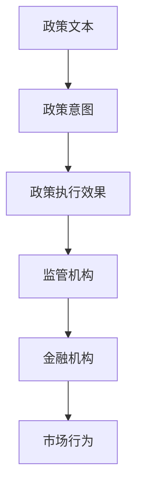
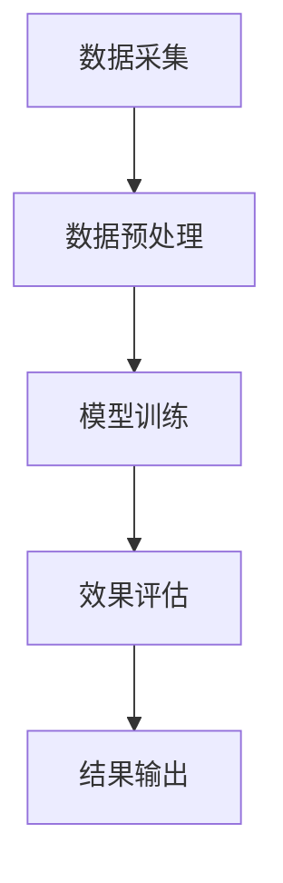
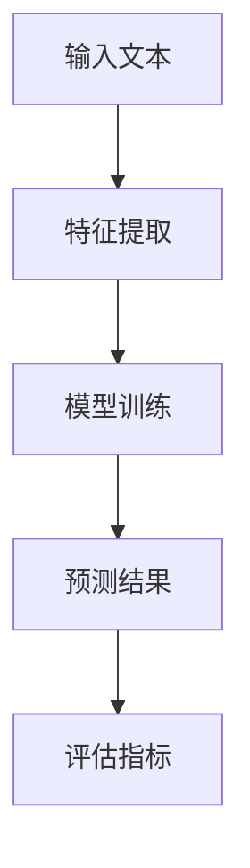
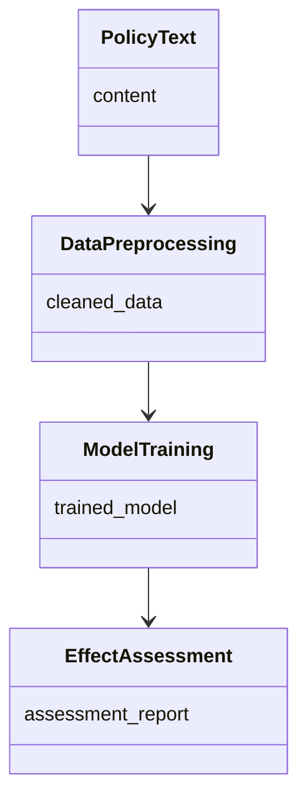
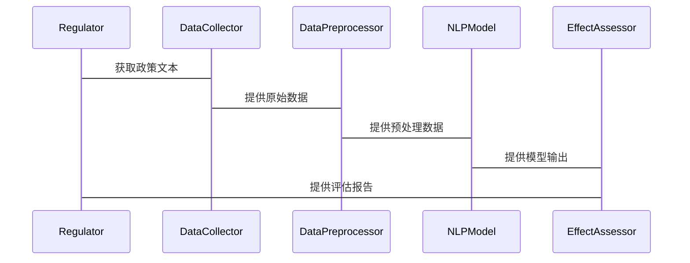

                 


# 构建基于NLP的金融监管政策执行效果动态评估系统

> 关键词：NLP、金融监管、政策执行效果、动态评估、深度学习

> 摘要：本文详细讲解了如何利用自然语言处理（NLP）技术构建一个动态评估金融监管政策执行效果的系统。文章从背景和核心概念入手，分析了NLP在金融监管中的应用潜力，探讨了基于预训练语言模型的文本相似度计算和时间序列分析的动态评估方法。通过系统架构设计和项目实战案例，展示了如何将理论转化为实际应用，并总结了系统的最佳实践和优化建议。

---

# 第一部分: 背景与基础

## 第1章: 问题背景与核心概念

### 1.1 问题背景介绍

#### 1.1.1 金融监管的重要性
金融监管是维护金融市场稳定、保护投资者利益的重要手段。然而，政策执行效果的评估往往依赖于人工分析，存在效率低、主观性强的问题。

#### 1.1.2 政策执行效果评估的挑战
- 数据来源多样，包括政策文本、市场数据和新闻报道等。
- 政策效果需要动态跟踪，涉及时间序列分析。
- 数据量大，人工分析成本高且效率低。

#### 1.1.3 NLP技术在金融监管中的潜力
自然语言处理技术可以自动解析政策文本、市场报告和新闻，提取关键信息，为政策效果评估提供支持。

### 1.2 核心概念与问题描述

#### 1.2.1 基于NLP的金融监管系统
通过NLP技术，自动分析政策文本和市场数据，评估政策执行效果。

#### 1.2.2 政策执行效果的动态评估
对政策执行效果进行实时或定期评估，分析其在不同时间段的变化趋势。

#### 1.2.3 系统边界与外延
系统主要关注政策文本和市场数据的分析，不直接处理交易数据或市场预测。

### 1.3 核心概念与联系

#### 1.3.1 NLP与金融监管的结合
- **NLP**：用于文本分析，提取政策意图和市场情绪。
- **金融监管**：依赖于文本分析结果，评估政策执行效果。

#### 1.3.2 实体关系图（ER图）分析


#### 1.3.3 系统核心要素
- 数据来源：政策文本、市场数据、新闻报道。
- 核心算法：NLP模型、文本相似度计算、时间序列分析。
- 输出结果：政策执行效果评估报告。

### 1.4 系统架构图


---

# 第二部分: 算法原理与数学模型

## 第2章: NLP算法原理

### 2.1 预训练语言模型

#### 2.1.1 BERT模型原理
BERT通过双向Transformer结构，实现了对文本的深度理解。

#### 2.1.2 GPT模型原理
GPT通过自回归方式生成文本，适合用于文本生成任务。

#### 2.1.3 模型选择与优化
根据任务需求选择模型，优化目标函数，例如交叉熵损失函数。

### 2.2 文本相似度计算

#### 2.2.1 余弦相似度
计算两个向量的夹角，衡量文本相似性：
$$\text{similarity} = \frac{\vec{a} \cdot \vec{b}}{|\vec{a}| |\vec{b}|}$$

#### 2.2.2 Word2Vec与句向量
通过Word2Vec生成词向量，再通过句向量计算文本相似度。

#### 2.2.3 使用预训练模型计算相似度
基于BERT或GPT模型，提取文本向量并计算相似度。

### 2.3 动态评估模型

#### 2.3.1 时间序列分析
使用ARIMA模型或LSTM网络进行时间序列预测。

#### 2.3.2 深度学习模型
构建LSTM网络，输入政策文本和市场数据，输出政策执行效果评估。

#### 2.3.3 模型训练流程


### 2.4 数学模型与公式

#### 2.4.1 余弦相似度公式
$$\text{similarity} = \frac{\vec{a} \cdot \vec{b}}{|\vec{a}| |\vec{b}|}$$

#### 2.4.2 损失函数
$$\text{loss} = -\frac{1}{N}\sum_{i=1}^{N} \log P(y_i|x_i)$$

#### 2.4.3 优化目标
$$\text{优化目标} = \min \text{loss}$$

---

# 第三部分: 系统分析与架构设计

## 第3章: 系统分析与架构设计

### 3.1 系统分析

#### 3.1.1 问题场景介绍
系统需要实时分析政策文本和市场数据，动态评估政策执行效果。

#### 3.1.2 项目介绍
构建一个基于NLP的金融监管政策执行效果动态评估系统，实现政策效果的自动化评估。

### 3.2 系统功能设计

#### 3.2.1 功能模块
- 数据采集模块：采集政策文本和市场数据。
- 数据预处理模块：清洗和标注数据。
- 模型训练模块：训练NLP模型。
- 效果评估模块：动态评估政策执行效果。

#### 3.2.2 领域模型


### 3.3 系统架构设计

#### 3.3.1 系统架构图


#### 3.3.2 接口设计
- 数据接口：与监管机构的数据库对接。
- 模型接口：与NLP模型服务对接。

### 3.4 系统交互设计

#### 3.4.1 交互流程


---

# 第四部分: 项目实战

## 第4章: 项目实战

### 4.1 环境安装

#### 4.1.1 安装Python环境
```bash
python --version
pip install --upgrade pip
pip install numpy
pip install tensorflow
pip install transformers
```

### 4.2 系统核心实现

#### 4.2.1 数据预处理
```python
import pandas as pd

def preprocess_data(data):
    # 数据清洗
    data = data.dropna()
    # 数据标注
    data['label'] = 0
    return data
```

#### 4.2.2 模型训练
```python
from transformers import BertTokenizer, BertModel
import torch

tokenizer = BertTokenizer.from_pretrained('bert-base-uncased')
model = BertModel.from_pretrained('bert-base-uncased')
```

#### 4.2.3 效果评估
```python
from sklearn.metrics import accuracy_score

y_pred = model.predict(X_test)
print(accuracy_score(y_test, y_pred))
```

### 4.3 实际案例分析

#### 4.3.1 案例背景
分析某金融监管政策的执行效果，数据包括政策文本和市场数据。

#### 4.3.2 数据分析
```python
import matplotlib.pyplot as plt

plt.plot(time_series_data)
plt.title('政策执行效果变化趋势')
plt.xlabel('时间')
plt.ylabel('效果评分')
plt.show()
```

### 4.4 项目小结

---

# 第五部分: 最佳实践

## 第5章: 最佳实践

### 5.1 小结
系统实现了基于NLP的政策执行效果动态评估，可实时跟踪政策效果。

### 5.2 注意事项
- 数据质量和完整性影响评估结果。
- 模型调优和参数选择需谨慎。
- 系统需定期更新模型和数据。

### 5.3 拓展阅读
- 《深度学习》—— Ian Goodfellow
- 《自然语言处理实战》—— 清风

---

# 作者：AI天才研究院 & 禅与计算机程序设计艺术

