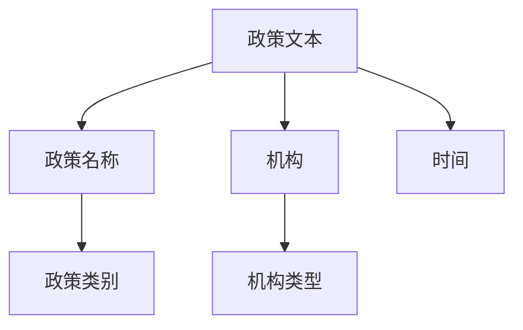
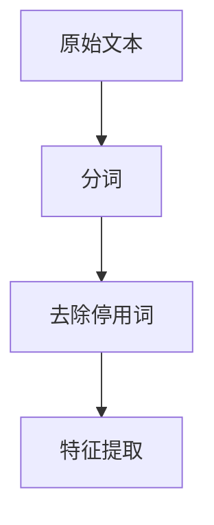
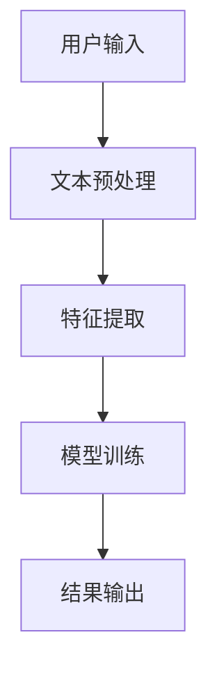
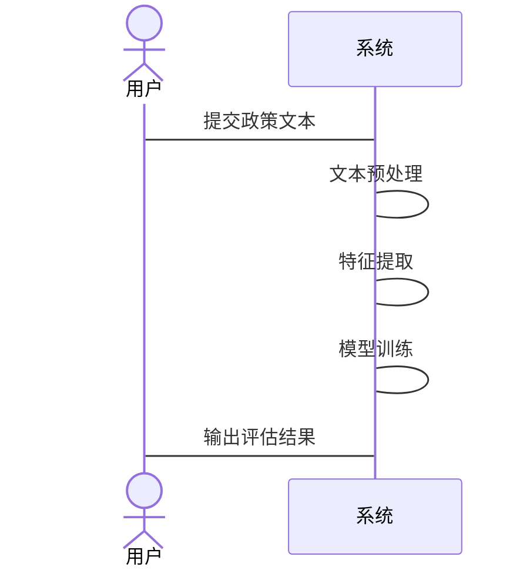

                 


# 《构建基于NLP的金融监管政策执行效果评估系统》

## 关键词：  
金融监管, 自然语言处理, 政策执行效果, 文本挖掘, 机器学习, 金融分析  

## 摘要：  
本文旨在探讨如何利用自然语言处理（NLP）技术构建一个金融监管政策执行效果评估系统。通过分析政策文本、识别关键实体、提取特征并结合机器学习模型，系统能够量化政策执行的效果，为金融监管机构提供数据支持。文章详细介绍了系统的设计思路、实现方法和应用场景，并通过实际案例展示了系统的有效性。

---

## 目录大纲

### 第一部分: 背景与概述

#### 第1章: 金融监管与政策执行效果评估

##### 1.1 问题背景与目标  
- 金融监管的核心目标  
- 政策执行效果评估的挑战与重要性  
- NLP在金融监管中的潜在价值  

##### 1.2 基于NLP的解决方案  
- NLP技术如何解决政策执行效果评估问题  
- 系统架构与功能概述  

##### 1.3 本章小结  

---

### 第二部分: 核心概念与技术原理

#### 第2章: NLP与金融监管的结合  

##### 2.1 NLP在金融监管中的应用领域  
- 文本分类、信息抽取、情感分析等NLP技术在金融监管中的具体应用  

##### 2.2 金融监管政策文本的特征分析  
- 政策文本的结构化特征  
- 关键实体识别（如机构、政策名称、时间等）  

##### 2.3 ER实体关系图  


##### 2.4 本章小结  

---

### 第三部分: 算法原理与数学模型  

#### 第3章: 基于NLP的文本预处理与特征提取  

##### 3.1 文本预处理流程  
- 分词、去除停用词、词干提取等  


##### 3.2 特征提取的数学模型  
- TF-IDF计算公式：  
$$ TF-IDF(t, d) = TF(t, d) \times IDF(t) $$  
- 其中，TF(t, d) 表示词 t 在文档 d 中的词频，IDF(t) 表示词 t 的逆向文件频率  

##### 3.3 本章小结  

---

### 第四部分: 系统分析与架构设计  

#### 第4章: 问题场景与系统功能设计  

##### 4.1 问题场景介绍  
- 政策文本的复杂性与多样性  
- 系统需要解决的核心问题  

##### 4.2 系统功能设计  
- 文本分析模块：分词、实体识别、情感分析  
- 数据处理模块：特征提取、数据清洗  
- 模型训练模块：分类、回归、聚类  

##### 4.3 系统架构设计  


##### 4.4 接口设计与交互流程图  


---

### 第五部分: 项目实战  

#### 第5章: 项目实现与案例分析  

##### 5.1 环境安装与配置  
- 安装Python、NLP库（如spaCy、NLTK）、机器学习库（如Scikit-learn）  

##### 5.2 核心代码实现  
```python
import numpy as np
from sklearn.feature_extraction.text import TfidfVectorizer

# 示例代码：基于TF-IDF的特征提取
corpus = [
    "政策A旨在提高金融监管效率",
    "政策B加强了对金融机构的监管力度",
    "政策C优化了金融市场的运行机制"
]

vectorizer = TfidfVectorizer()
X = vectorizer.fit_transform(corpus)
print(X.toarray())
```

##### 5.3 代码解读与分析  
- TF-IDF向量化过程的详细解释  
- 模型训练与结果输出的分析  

##### 5.4 案例分析  
- 具体案例的输入与输出结果展示  
- 案例分析的总结与启示  

##### 5.5 本章小结  

---

### 第六部分: 总结与展望  

#### 第6章: 总结与展望  

##### 6.1 最佳实践  
- NLP在金融监管中的应用建议  
- 系统优化的方向与未来研究领域  

##### 6.2 小结  
- 本文的核心内容回顾  
- 对未来工作的展望  

##### 6.3 注意事项  
- 数据隐私与合规性问题  
- 模型的可解释性与鲁棒性  

##### 6.4 拓展阅读  
- 推荐的相关书籍与论文  

---

## 作者：  
AI天才研究院/AI Genius Institute & 禅与计算机程序设计艺术 /Zen And The Art of Computer Programming

