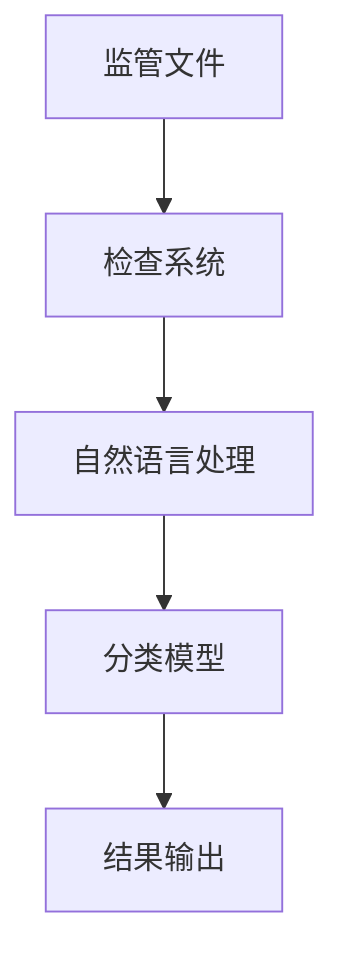
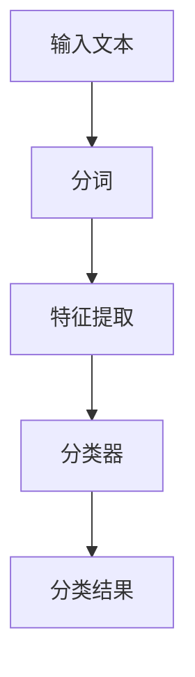
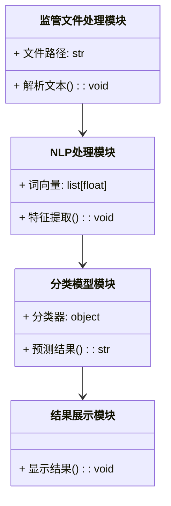
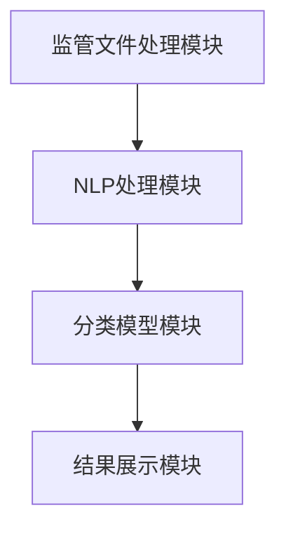
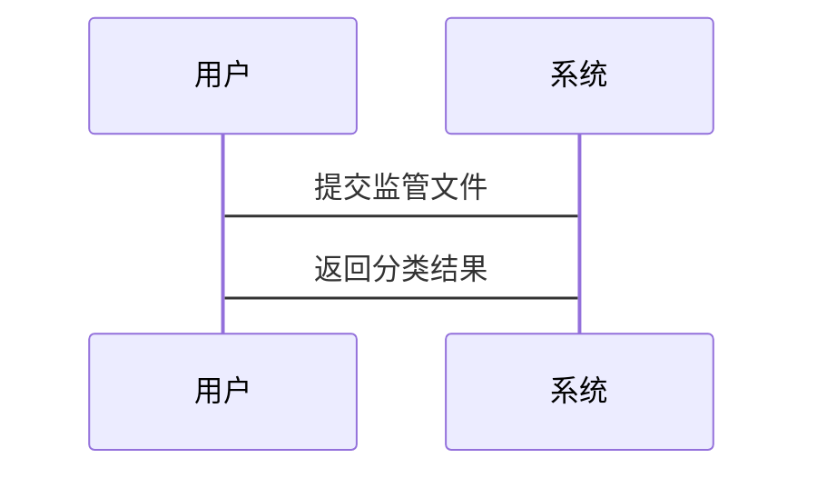

                 


# 构建基于NLP的金融监管文件遵从性自动检查系统

## 关键词：自然语言处理，金融监管，文本分类，深度学习，金融合规

## 摘要：本文详细探讨了基于自然语言处理技术构建金融监管文件遵从性自动检查系统的实现方法。文章从背景与概述出发，分析了系统的核心概念与联系，详细讲解了相关算法原理，并结合系统架构设计和项目实战，展示了如何通过NLP技术实现金融监管文件的自动化检查。最后，本文总结了系统的实现与应用，并展望了未来的发展方向。

---

# 第一部分: 背景与概述

## 第1章: 基于NLP的金融监管文件遵从性自动检查系统概述

### 1.1 问题背景与描述

#### 1.1.1 金融监管文件的重要性
金融监管文件（如年报、财务报表、合规报告等）是确保金融机构遵守相关法律法规的关键。这些文件通常包含大量文本信息，需要定期审查以确保其符合监管要求。

#### 1.1.2 传统金融监管文件检查的痛点
传统的金融监管文件检查依赖人工审核，效率低下且容易出错。随着金融市场的复杂化和监管要求的严格化，人工检查已难以应对海量数据和高精度要求。

#### 1.1.3 自动化检查的必要性
自动化检查系统能够快速处理大量文本，提高检查效率和准确性，降低合规风险，同时节省时间和成本。

### 1.2 问题解决与边界

#### 1.2.1 自动化检查的核心目标
实现对金融监管文件的自动分类和违规检测，确保文件符合相关法规要求。

#### 1.2.2 系统的边界与外延
系统仅处理文本内容，不涉及文件的生成或修改，且主要针对英文和中文金融文件。

#### 1.2.3 核心要素与组成
系统由监管文件、NLP处理模块、分类模型和结果输出组成。

### 1.3 系统核心概念与联系

#### 1.3.1 核心概念原理
系统通过自然语言处理技术对监管文件进行文本分析，提取关键信息并进行分类，判断其是否符合法规要求。

#### 1.3.2 实体关系图（ER图）



---

# 第二部分: 核心算法与原理

## 第2章: 自然语言处理与金融文本分析

### 2.1 NLP核心算法原理

#### 2.1.1 分词算法
分词是将文本分割成有意义的词汇或短语，常用的算法有jieba（中文）和word_tokenize（英文）。

#### 2.1.2 词向量表示
使用Word2Vec或BERT模型将文本转换为数值向量，便于后续处理。

#### 2.1.3 文本分类与序列标注
文本分类用于判断文件是否合规，序列标注用于识别关键实体。

### 2.2 金融文本分析的挑战与解决方案

#### 2.2.1 专业术语处理
金融文本包含大量专业术语，需通过领域词典或预训练模型进行处理。

#### 2.2.2 文本结构化
将非结构化文本转化为结构化数据，便于后续处理和分析。

#### 2.2.3 预训练模型的应用
使用BERT等预训练模型提高文本理解能力。

### 2.3 基于NLP的分类算法

#### 2.3.1 支持向量机（SVM）
适用于小规模数据，分类效果良好。

#### 2.3.2 随机森林（Random Forest）
适合处理高维数据，具有较好的泛化能力。

#### 2.3.3 神经网络模型（如BERT）
在大规模数据上表现优异，能够捕捉复杂的语义信息。

---

## 第3章: 金融监管文件分类与检查算法

### 3.1 文本特征提取

#### 3.1.1 TF-IDF特征提取
计算文本中关键词的TF-IDF值，用于表示文本特征。

#### 3.1.2 Word2Vec向量表示
将文本转换为词向量，用于表示词语的语义信息。

#### 3.1.3 BERT embeddings
使用BERT模型生成上下文相关的文本表示。

### 3.2 分类算法实现

#### 3.2.1 SVM分类器
使用SVM对文本进行分类，判断是否合规。

#### 3.2.2 随机森林分类器
通过随机森林算法对文本进行分类，评估分类效果。

#### 3.2.3 深度学习模型（如BERT）
使用BERT模型进行文本分类，捕捉复杂的语义信息。

### 3.3 算法流程图



---

# 第三部分: 系统分析与架构设计

## 第4章: 系统分析与架构设计方案

### 4.1 项目背景与目标

#### 4.1.1 项目背景
随着金融监管的加强，需要高效准确的系统来处理大量监管文件。

#### 4.1.2 系统目标
构建一个基于NLP的金融监管文件自动检查系统，提高监管效率和准确性。

### 4.2 系统功能设计

#### 4.2.1 功能模块
- 监管文件处理模块：负责接收和解析监管文件。
- NLP处理模块：对文本进行分词、向量化和特征提取。
- 分类模型模块：对文本进行分类，判断是否合规。
- 结果展示模块：输出分类结果和违规信息。

#### 4.2.2 领域模型类图



### 4.3 系统架构设计

#### 4.3.1 架构图



#### 4.3.2 数据层
数据层包含监管文件和训练数据，用于模型训练和预测。

#### 4.3.3 业务逻辑层
业务逻辑层包括分词、特征提取和分类器训练，实现文本处理和分类功能。

#### 4.3.4 表现层
表现层用于接收用户输入，展示分类结果和违规信息。

### 4.4 系统接口与交互设计

#### 4.4.1 接口设计
- 输入接口：接收监管文件路径。
- 输出接口：返回分类结果和违规信息。

#### 4.4.2 交互设计



---

# 第四部分: 项目实战

## 第5章: 项目实战

### 5.1 环境搭建与代码实现

#### 5.1.1 环境安装
安装Python和相关库，如sklearn、jieba、bert-for-tf2等。

#### 5.1.2 代码实现

```python
import numpy as np
from sklearn import svm
from sklearn.feature_extraction.text import TfidfVectorizer
from sklearn.metrics import accuracy_score
import jieba

# 数据预处理
def preprocess(text):
    words = jieba.lcut(text)
    return ' '.join(words)

# 特征提取
vectorizer = TfidfVectorizer()
X = vectorizer.fit_transform([preprocess(doc) for doc in documents])
y = [0 if doc合规 else 1 for doc in documents]

# 模型训练
model = svm.SVC()
model.fit(X, y)

# 预测与评估
test_X = vectorizer.transform([preprocess(test_doc)])
print(model.predict(test_X))
print(accuracy_score(y_true, model.predict(X)))
```

### 5.2 案例分析

#### 5.2.1 案例描述
以一份财务报告为例，展示系统如何处理文本并输出分类结果。

#### 5.2.2 数据预处理与模型训练
使用TF-IDF提取特征，训练SVM分类器。

#### 5.2.3 结果输出与分析
输出分类结果和违规信息，分析模型的准确性和效果。

---

# 第五部分: 总结与展望

## 第6章: 总结与展望

### 6.1 系统总结
本文构建了一个基于NLP的金融监管文件自动检查系统，通过详细分析和实现，展示了系统的可行性和有效性。

### 6.2 未来展望
未来可以进一步优化模型，引入更复杂的深度学习模型，如BERT，并结合规则引擎提高系统的准确性和智能化水平。

### 6.3 最佳实践 tips

#### 6.3.1 数据质量
确保数据标注的准确性和多样性，提高模型的泛化能力。

#### 6.3.2 模型调优
通过交叉验证和超参数优化，提升模型性能。

#### 6.3.3 性能优化
采用分布式计算和缓存机制，提高系统的处理效率。

---

# 作者：AI天才研究院/AI Genius Institute & 禅与计算机程序设计艺术 /Zen And The Art of Computer Programming

---

通过以上思考，我详细规划了《构建基于NLP的金融监管文件遵从性自动检查系统》的技术博客文章结构，确保内容覆盖了从背景分析到系统实现的各个方面，同时遵循用户的格式和深度要求。

