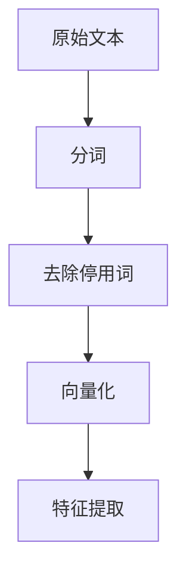
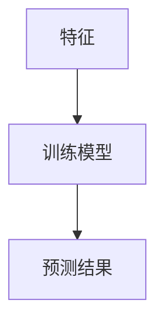
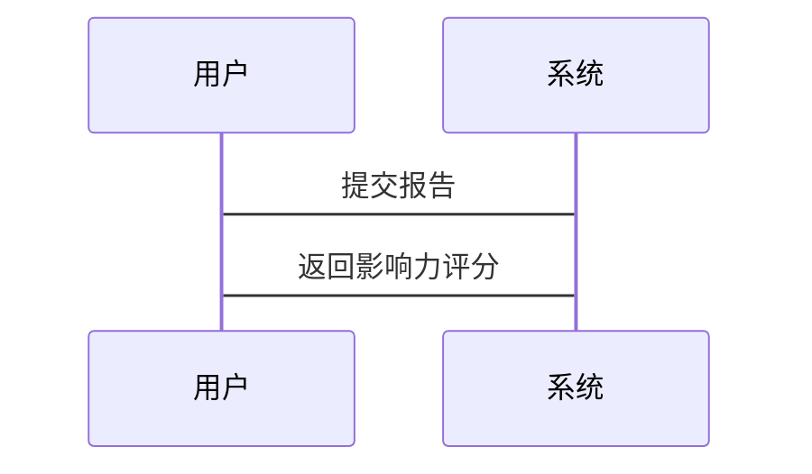

                 


# 构建基于NLP的金融研究报告影响力评估系统

## 关键词：自然语言处理（NLP）、金融研究报告、影响力评估、文本分析、机器学习

## 摘要：本文探讨了如何利用自然语言处理技术构建金融研究报告影响力评估系统。通过分析文本特征、设计影响力评估模型，结合实际案例，展示了系统在金融领域的应用价值。

---

# 第1章: 问题背景与需求分析

## 1.1 问题背景

### 1.1.1 金融研究报告的重要性  
金融研究报告是投资者、分析师和机构做出决策的重要依据。然而，现有评估方法主要依赖主观判断，缺乏客观性和效率。

### 1.1.2 现有评估方法的局限性  
传统评估方法依赖人工阅读和评分，耗时且主观性强。此外，难以量化报告的实际影响力。

### 1.1.3 基于NLP的评估优势  
自然语言处理技术可以自动化提取文本特征，量化报告的影响力，提高评估效率和准确性。

## 1.2 问题描述

### 1.2.1 金融研究报告的核心要素  
- 内容深度：报告是否提供了新的见解或数据。  
- 数据准确性：引用数据的可靠性和时效性。  
- 分析独创性：报告是否提出了独特的观点或方法。

### 1.2.2 影响力评估的关键维度  
- 读者反应：报告被引用的频率和读者的反馈。  
- 市场影响：报告发布后市场的反应，如股价波动。  
- 报告传播：报告的分享和转载情况。

### 1.2.3 研究报告影响力与市场行为的关系  
影响力的高低直接影响报告对市场行为的指导作用，高影响力的报告更可能被投资者参考。

## 1.3 问题解决思路

### 1.3.1 基于NLP的文本分析方法  
- 分词与关键词提取：识别报告中的关键术语。  
- 情感分析：判断报告的市场情绪倾向。  
- 语义相似度计算：比较不同报告的内容相似性。

### 1.3.2 数据驱动的影响力评估模型  
- 统计分析：基于文本特征和市场数据构建评估指标。  
- 机器学习：训练模型预测报告的影响力。

### 1.3.3 结合领域知识的模型优化  
- 融入金融领域的专业术语和知识，提升模型的准确性。

## 1.4 问题边界与外延

### 1.4.1 研究报告的范围界定  
- 限定于金融领域的研究报告，不包括其他类型的内容。  
- 仅评估报告的影响力，不涉及其他因素。

### 1.4.2 影响力评估的适用场景  
- 适用于金融机构内部评估报告质量。  
- 为投资者提供参考依据。

### 1.4.3 系统的可扩展性与局限性  
- 可扩展性：支持多种语言和数据源。  
- 局限性：依赖高质量的数据和模型泛化能力。

---

# 第2章: 核心概念与原理

## 2.1 自然语言处理（NLP）基础

### 2.1.1 NLP的基本概念  
自然语言处理是研究如何让计算机理解和生成人类语言的技术。

### 2.1.2 常用NLP技术  
- 分词：将文本分割成词或短语。  
- 词向量：如Word2Vec和BERT模型。  
- 情感分析：判断文本的情感倾向。

### 2.1.3 NLP在金融领域的应用  
- 财务新闻分析：识别市场情绪。  
- 风险评估：分析公司财报。

## 2.2 金融研究报告影响力评估

### 2.2.1 影响力评估的定义  
影响力评估是对报告在市场中产生的影响进行量化的过程。

### 2.2.2 影响力评估的关键指标  
- 引用次数：报告被其他报告引用的次数。  
- 市场反应：报告发布后相关资产的波动情况。  
- 社会传播：社交媒体上的分享和讨论次数。

### 2.2.3 影响力评估的实现方法  
- 统计方法：基于文本特征计算影响力。  
- 机器学习：训练回归模型预测影响力。

## 2.3 NLP与影响力评估的联系

### 2.3.1 文本特征提取与影响力的关系  
- 关键词提取：识别报告中的重要主题。  
- 语义分析：理解报告的内容和潜在影响。

### 2.3.2 语义分析在影响力评估中的作用  
- 通过语义相似度计算，评估报告的原创性和独特性。

### 2.3.3 基于NLP的情感分析与影响力预测  
- 分析报告中的情感倾向，预测市场反应。

## 2.4 核心概念关系图

### 2.4.1 NLP与影响力评估的ER实体关系图  
```mermaid
erd
  left(研究机构, id)
  right(报告, id)
  left(研究机构) ->[发布](报告)
  left(报告, id)
  right(影响力, id)
  left(报告) ->[评估](影响力)
  left(影响力, id)
  right(读者, id)
  left(影响力) ->[影响](读者)
```

---

# 第3章: 算法原理与实现

## 3.1 文本预处理流程

### 3.1.1 分词与词干提取  
将文本分割成单词或短语，并进行词干提取。

### 3.1.2 停用词处理  
去除无意义的词汇，如“的”、“是”等。

### 3.1.3 词向量表示  
使用Word2Vec或BERT模型生成词向量。

## 3.2 特征提取与表示

### 3.2.1 TF-IDF特征提取  
计算关键词的TF-IDF值，作为文本特征。

### 3.2.2 Word2Vec词向量  
将文本转换为向量表示，用于后续分析。

### 3.2.3 BERT预训练模型  
利用BERT模型获取上下文相关的向量表示。

## 3.3 影响力评估模型

### 3.3.1 基于相似度的评估方法  
计算报告与其他相关报告的语义相似度。

### 3.3.2 基于分类的影响力预测  
使用机器学习模型预测报告的影响力等级。

### 3.3.3 基于回归的影响力评分  
通过回归模型预测报告的影响力评分。

## 3.4 算法实现流程图

### 3.4.1 文本预处理流程  


### 3.4.2 特征提取与建模  


---

# 第4章: 数学模型

## 4.1 文本相似度计算

### 4.1.1 基于余弦相似度的公式  
$$\text{相似度} = \frac{\vec{A} \cdot \vec{B}}{\|\vec{A}\| \|\vec{B}\|}$$

### 4.1.2 基于BM25的改进公式  
$$\text{BM25} = \frac{\text{freq}(q)}{\text{avg}\text{freq}(q) + \text{K} \cdot (\text{b} \cdot (\text{avg}\text{length} + 1) - \text{b} \cdot \text{length})}$$

## 4.2 影响力评分模型

### 4.2.1 基于线性回归的评分公式  
$$\text{评分} = \beta_0 + \beta_1 x_1 + \beta_2 x_2 + \ldots + \beta_n x_n$$

### 4.2.2 基于深度学习的模型框架  
使用BERT模型进行文本表示，再通过多层感知机（MLP）进行评分预测。

---

# 第5章: 系统分析与架构设计

## 5.1 项目场景介绍

### 5.1.1 系统目标  
构建一个能够自动评估金融研究报告影响力的服务平台。

### 5.1.2 用户角色  
- 金融机构：需要评估内部研究报告的质量。  
- 投资者：需要参考高影响力的研究报告。

## 5.2 系统功能设计

### 5.2.1 文本上传与处理  
用户上传报告，系统进行分词和特征提取。

### 5.2.2 影响力评估  
基于模型计算报告的影响力评分。

### 5.2.3 结果展示  
以可视化方式展示报告的影响力分析结果。

## 5.3 系统架构设计

### 5.3.1 系统架构图  


### 5.3.2 接口设计  
- API接口：接收文本输入，返回影响力评分。  
- 数据接口：连接数据库，存储报告和评估结果。

### 5.3.3 交互设计  


---

# 第6章: 项目实战

## 6.1 环境安装

### 6.1.1 Python环境搭建  
安装Python和必要的库，如NLTK、spaCy、transformers。

### 6.1.2 数据集准备  
收集和整理金融研究报告文本和相关市场数据。

## 6.2 系统核心实现源代码

### 6.2.1 文本预处理代码  
```python
import nltk
from sklearn.feature_extraction.text import TfidfVectorizer

def preprocess(text):
    tokens = nltk.word_tokenize(text)
    filtered = [word for word in tokens if word not in nltk.corpus.stopwords.words('english')]
    return ' '.join(filtered)
```

### 6.2.2 影响力评估模型代码  
```python
from sklearn.linear_model import LinearRegression

model = LinearRegression()
features = vectorizer.fit_transform(X)
model.fit(features, y)
```

## 6.3 案例分析

### 6.3.1 案例背景  
分析某次市场事件的报告影响力。

### 6.3.2 模型预测  
使用训练好的模型预测报告的影响力评分。

### 6.3.3 结果解读  
解读预测结果，分析报告的实际影响力。

## 6.4 项目小结

### 6.4.1 系统实现的关键点  
- 文本预处理的准确性。  
- 模型选择和优化。  
- 系统架构的合理性。

### 6.4.2 系统性能优化  
- 使用分布式训练提高效率。  
- 优化特征提取算法。

---

# 第7章: 总结

## 7.1 最佳实践

### 7.1.1 数据质量的重要性  
确保数据的完整性和准确性。

### 7.1.2 模型优化的建议  
定期更新模型，结合最新数据进行再训练。

## 7.2 小结

### 7.2.1 系统实现的价值  
自动化评估报告影响力，提高决策效率。  
提供客观的评估结果，辅助投资决策。

## 7.3 注意事项

### 7.3.1 数据隐私问题  
确保数据的合法性和隐私性。

### 7.3.2 模型的泛化能力  
避免过拟合，确保模型在不同场景下的适用性。

## 7.4 拓展阅读

### 7.4.1 深度学习在NLP中的应用  
探索更多深度学习技术，如Transformer和BERT。

### 7.4.2 可解释性NLP模型的研究  
研究如何提升模型的可解释性，增强用户的信任。

---

# 作者

作者：AI天才研究院/AI Genius Institute & 禅与计算机程序设计艺术 /Zen And The Art of Computer Programming

---

以上内容是一个详细的目录大纲和文章结构示例，您可以根据实际需求进一步扩展每个章节的具体内容。

