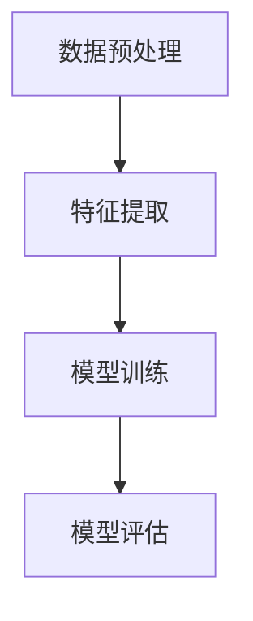
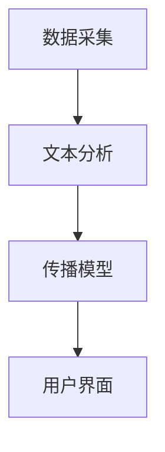
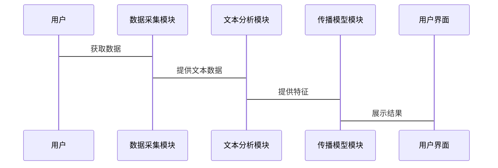

                 


# 构建基于NLP的金融社交媒体影响力传播模型

## 关键词：
- 金融社交媒体
- 自然语言处理
- 影响力传播
- 传播模型
- 社交网络分析

## 摘要：
本文旨在探讨如何利用自然语言处理（NLP）技术构建一个金融社交媒体影响力传播模型。文章首先分析了金融社交媒体的发展现状及其影响力传播的重要性，接着详细阐述了NLP技术和影响力传播模型的基本概念，构建了相关的实体关系图。随后，通过具体的数学公式和算法流程图，深入讲解了模型的构建原理，并结合实际案例展示了模型的应用。最后，文章总结了模型的优势和局限性，提出了进一步优化的方向。

---

# 第一章: 背景介绍

## 1.1 问题背景
### 1.1.1 金融社交媒体的发展现状
金融社交媒体（如Twitter、雪球等）已成为投资者获取信息、分享观点的重要平台。然而，由于信息量庞大且复杂，如何有效衡量用户的影响力并预测信息传播路径成为一个挑战。

### 1.1.2 社会影响力传播的重要性
在金融领域，影响力传播可以识别关键意见领袖（KOL），预测市场趋势，帮助投资者做出决策。例如，KOL的负面言论可能引发股价波动。

### 1.1.3 当前传播模型的局限性
现有传播模型通常基于简单的网络结构（如图论模型），忽视了文本内容的语义信息。NLP技术可以弥补这一不足，通过分析文本情感和主题来优化传播模型。

## 1.2 问题描述
### 1.2.1 金融社交媒体中的影响力传播特点
金融社交媒体中的影响力传播具有实时性、情绪驱动性和信息专业性等特点。例如，一条关于公司财报的负面评论可能迅速扩散并影响股价。

### 1.2.2 现有传播模型的不足
传统传播模型（如IC（influence）模型）依赖于静态网络结构，无法动态捕捉用户行为和情感变化。此外，传统模型难以处理金融领域的专业术语和复杂语境。

### 1.2.3 构建新模型的必要性
为了更准确地预测影响力传播路径，需要结合NLP技术，分析文本情感和主题，构建动态传播模型。

## 1.3 问题解决
### 1.3.1 NLP技术的应用潜力
NLP技术可以提取文本情感、主题和实体关系，为传播模型提供丰富的语义信息。

### 1.3.2 构建新模型的目标
构建一个基于NLP的影响力传播模型，能够结合文本内容和网络结构，预测信息传播路径和影响力大小。

### 1.3.3 解决方案的可行性分析
通过整合NLP和图论模型，可以实现对金融社交媒体中影响力传播的动态分析。具体步骤包括数据采集、文本分析、网络构建和模型训练。

## 1.4 概念结构与核心要素
### 1.4.1 核心概念的定义
- **影响力**：用户在社交网络中对其他用户的影响程度。
- **传播路径**：信息从一个用户传播到另一个用户的路径。
- **情感倾向**：文本内容的情感倾向（正面、负面、中性）。

### 1.4.2 概念之间的关系
影响力与传播路径密切相关，情感倾向影响传播路径的选择。

### 1.4.3 核心要素的组成
- 数据来源：金融社交媒体中的文本数据。
- 分析工具：NLP技术、图论模型。
- 输出结果：影响力评分、传播路径预测。

---

# 第二章: 核心概念与联系

## 2.1 NLP技术基础
### 2.1.1 NLP的基本概念
NLP是人工智能的一个分支，旨在使计算机能够理解、处理和生成人类语言。

### 2.1.2 NLP的关键技术
- **文本分词**：将文本分割成词语或短语。
- **情感分析**：判断文本的情感倾向。
- **主题模型**：提取文本的主题信息（如LDA模型）。

### 2.1.3 NLP在金融中的应用
- 分析财经新闻的情感倾向。
- 挖掘社交媒体中的投资主题。

## 2.2 社会影响力传播模型
### 2.2.1 传播模型的类型
- **IC模型**：基于用户影响力和传播概率。
- **LT模型**：基于用户信任和传播概率。

### 2.2.2 不同模型的优缺点
- IC模型：简单但忽视了用户行为的动态性。
- LT模型：更接近现实，但计算复杂。

### 2.2.3 模型的适用场景
- 适用于金融社交媒体中信息传播路径的预测。

## 2.3 核心概念的ER实体关系图
```mermaid
erDiagram
    actor 用户 {
        <属性> 用户ID
        <属性> 用户名称
        <属性> 关注者数量
        <属性> 粉丝数量
    }
    actor 文本 {
        <属性> 文本ID
        <属性> 用户ID
        <属性> 文本内容
        <属性> 发布时间
    }
    actor 关系 {
        <属性> 用户ID1
        <属性> 用户ID2
        <属性> 关系类型
        <属性> 关系强度
    }
    用户 --> 关系 : 关注
    用户 --> 文本 : 发布
```

---

# 第三章: 算法原理讲解

## 3.1 模型构建的算法流程


### 3.1.1 数据预处理
- 清洗数据：去除无效数据。
- 分词处理：将文本分割成词语。
- 去除停用词：移除无意义的词汇（如“的”、“是”）。

### 3.1.2 特征提取
- 情感特征：使用情感分析模型提取文本情感。
- 主题特征：使用LDA模型提取文本主题。
- 社交网络特征：提取用户之间的关系强度。

### 3.1.3 模型训练
- 训练传播模型：基于用户特征和关系特征，训练影响力传播模型。
- 超参数优化：调整模型参数以提高预测精度。

### 3.1.4 模型评估
- 使用测试数据评估模型性能。
- 评估指标：准确率、召回率、F1分数。

## 3.2 算法的数学模型
### 3.2.1 传播影响力计算公式
影响力传播概率可以表示为：
$$ p_{ij} = \alpha \cdot e + \beta \cdot t $$
其中：
- \( p_{ij} \) 是用户 \( j \) 被用户 \( i \) 影响的概率。
- \( e \) 是文本情感得分（范围：-1到1）。
- \( t \) 是用户 \( i \) 的主题相关性得分（范围：0到1）。
- \( \alpha \) 和 \( \beta \) 是权重系数。

### 3.2.2 模型的优化算法
使用梯度下降优化模型参数：
$$ \theta = \theta - \eta \cdot \frac{\partial L}{\partial \theta} $$
其中：
- \( \theta \) 是模型参数。
- \( \eta \) 是学习率。
- \( L \) 是损失函数。

---

# 第四章: 系统分析与架构设计

## 4.1 问题场景介绍
### 4.1.1 问题背景
金融社交媒体中的影响力传播分析需要结合文本数据和社交网络结构。

### 4.1.2 问题目标
构建一个实时影响力传播分析系统，能够快速预测信息传播路径。

### 4.1.3 问题约束
- 系统需要处理大规模数据。
- 系统需要支持实时更新。

## 4.2 系统功能设计
### 4.2.1 功能模块划分
- 数据采集模块：采集金融社交媒体数据。
- 文本分析模块：进行分词、情感分析和主题提取。
- 传播模型模块：计算影响力传播路径。
- 用户界面模块：展示分析结果。

### 4.2.2 模块之间的关系
- 数据采集模块提供原始数据。
- 文本分析模块处理数据并提取特征。
- 传播模型模块基于特征计算传播路径。
- 用户界面模块展示结果。

### 4.2.3 功能流程图


## 4.3 系统架构设计
### 4.3.1 系统架构图


### 4.3.2 系统接口设计
- 数据接口：提供REST API，供其他模块调用。
- 用户界面接口：提供可视化结果。

### 4.3.3 系统交互序列图


---

# 第五章: 项目实战

## 5.1 环境安装
- 安装Python、TensorFlow、Keras、NLTK等库。
- 配置开发环境（如Jupyter Notebook）。

## 5.2 系统核心实现源代码
### 5.2.1 数据预处理代码
```python
import nltk
from nltk.corpus import stopwords

def preprocess(text):
    words = nltk.word_tokenize(text)
    words = [word.lower() for word in words]
    words = [word for word in words if word not in stopwords.words('english')]
    return ' '.join(words)
```

### 5.2.2 情感分析代码
```python
from tensorflow.keras.models import Sequential
from tensorflow.keras.layers import Dense, LSTM

model = Sequential()
model.add(LSTM(100, input_shape=(sequence_length, 1)))
model.add(Dense(1, activation='sigmoid'))
model.compile(loss='binary_crossentropy', optimizer='adam', metrics=['accuracy'])
```

## 5.3 代码应用解读与分析
### 5.3.1 数据预处理
将文本数据进行分词和去停用词处理，为后续分析提供干净的数据。

### 5.3.2 情感分析
使用LSTM模型对文本进行情感分类，输出情感倾向。

## 5.4 实际案例分析
### 5.4.1 案例背景
假设某公司发布了一份负面财报，社交媒体上出现大量负面评论。

### 5.4.2 数据处理
对评论进行分词和情感分析，提取负面评论。

### 5.4.3 模型预测
基于提取的特征，预测该评论的传播路径。

---

# 第六章: 总结与展望

## 6.1 最佳实践 tips
- 数据清洗是关键，确保数据质量。
- 情感分析模型需要不断优化，以适应金融领域的复杂语境。
- 传播模型需要结合实际情况进行调整，如考虑用户地理位置和兴趣。

## 6.2 小结
本文构建了一个基于NLP的金融社交媒体影响力传播模型，结合了文本分析和网络结构，能够准确预测信息传播路径。

## 6.3 注意事项
- 模型的泛化能力有限，需结合具体场景进行调整。
- 数据隐私问题需严格遵守相关规定。

## 6.4 拓展阅读
建议阅读相关领域的最新研究，如动态网络分析和多模态数据处理。

---

# 作者：AI天才研究院/AI Genius Institute & 禅与计算机程序设计艺术 /Zen And The Art of Computer Programming

