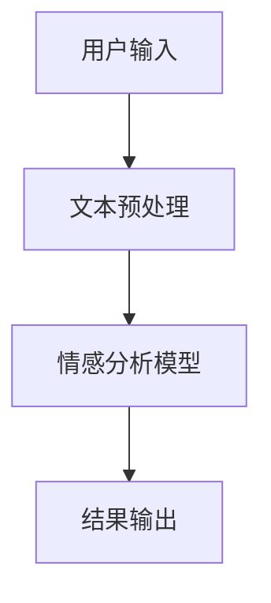
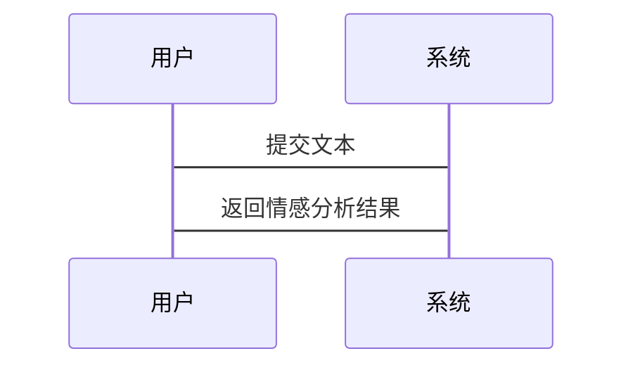

                 


# 构建基于NLP的金融舆情情感分析系统

## 关键词：金融舆情、NLP、情感分析、深度学习、文本挖掘、系统架构

## 摘要：本文详细介绍了如何利用自然语言处理技术构建一个高效的金融舆情情感分析系统。从系统背景、核心概念、算法原理到系统设计与实现，全面解析了构建该系统的每个关键环节。文章通过实际案例分析，深入探讨了系统实现中的技术细节，并结合最佳实践，为读者提供了一个完整的解决方案。

---

# 第一部分: 金融舆情与情感分析概述

## 第1章: 金融舆情与情感分析的背景介绍

### 1.1 什么是金融舆情
#### 1.1.1 金融舆情的定义与特点
金融舆情指的是金融市场中各种言论、评论和观点的集合，这些信息通常来自新闻媒体、社交媒体、论坛、公司财报、分析师报告等渠道。金融舆情的特点包括实时性、多样性、复杂性和影响性。

#### 1.1.2 金融舆情的重要性与应用场景
金融舆情分析在金融领域具有重要意义，能够帮助投资者、机构和监管层理解市场情绪、预测市场走势、评估风险、制定投资策略等。例如：
- 投资者可以通过舆情分析快速了解市场情绪，做出投资决策。
- 金融机构可以利用舆情分析识别潜在的金融风险。
- 监管机构可以通过舆情分析监控市场动态，及时发现异常情况。

#### 1.1.3 金融舆情分析的核心目标
金融舆情分析的核心目标包括：
1. **情绪识别**：识别文本中的情感倾向（正面、负面、中性）。
2. **情感强度分析**：量化情感的强度或极性。
3. **主题挖掘**：发现舆情中的主要讨论主题。
4. **趋势预测**：基于历史舆情数据，预测未来市场走势。

---

## 第2章: 自然语言处理（NLP）基础

### 2.1 NLP的基本概念与技术
#### 2.1.1 NLP的定义与核心任务
自然语言处理（NLP）是计算机科学与人工智能的交叉领域，旨在让计算机能够理解、处理和生成人类语言。NLP的核心任务包括：
- 词性标注
- 句法分析
- 实体识别
- 情感分析
- 文本分类

#### 2.1.2 常见的NLP技术与工具
常用的NLP技术包括：
- **分词**：将文本分割成词语或短语。
- **停用词处理**：去除对情感分析无用的常见词汇（如“的”、“是”等）。
- **词向量表示**：使用如Word2Vec、GloVe等工具将词语转换为向量表示。
- **文本嵌入**：使用如BERT等预训练模型生成文本的嵌入表示。

#### 2.1.3 NLP在金融领域的应用
在金融领域，NLP主要用于：
- 金融新闻的情感分析
- 公司财报的自动摘要
- 金融事件的自动检测
- 投资建议的生成

---

## 第3章: 情感分析的核心原理

### 3.1 情感分析的基本原理
情感分析的目的是通过分析文本内容，判断文本的情感倾向。常见的方法包括：
1. **基于规则的方法**：通过预定义的规则或情感词典进行情感判断。
2. **基于机器学习的方法**：使用特征工程提取文本特征，训练分类器（如SVM、Naive Bayes）进行情感分类。
3. **基于深度学习的方法**：使用神经网络（如RNN、LSTM、Transformer）进行情感分析。

### 3.2 深度学习在情感分析中的应用
深度学习模型在情感分析中表现出色，特别是基于Transformer的模型（如BERT）。以下是BERT模型的简要工作流程：
1. **输入处理**：将输入文本分词并转换为词向量。
2. **嵌入层**：将词向量输入嵌入层，生成词嵌入。
3. **Transformer层**：通过多头自注意力机制捕获文本中的长距离依赖关系。
4. **全连接层**：将Transformer输出的向量输入全连接层，进行分类。

### 3.3 情感分析的数学模型
以下是一个简单的二分类情感分析模型的数学表示：
$$
f(x) = \text{sign}(w \cdot x + b)
$$
其中，$w$ 是权重向量，$x$ 是输入特征向量，$b$ 是偏置项。

---

# 第二部分: 系统分析与架构设计

## 第4章: 系统分析与架构设计方案

### 4.1 项目背景与目标
#### 4.1.1 项目背景
随着金融市场的日益复杂化，投资者和金融机构需要一种高效的情感分析系统来实时监控市场舆情。

#### 4.1.2 项目目标
构建一个基于NLP的金融舆情情感分析系统，能够：
- 实时抓取金融舆情数据
- 对舆情数据进行情感分析
- 提供可视化结果和预警功能

### 4.2 系统功能设计
#### 4.2.1 系统功能模块划分
1. **数据采集模块**：从新闻网站、社交媒体等渠道抓取金融舆情数据。
2. **文本预处理模块**：对采集的文本进行清洗、分词和去停用词处理。
3. **情感分析模块**：使用深度学习模型对文本进行情感分类。
4. **结果可视化模块**：将分析结果以图表形式展示。

#### 4.2.2 系统功能流程图（Mermaid）


### 4.3 系统架构设计
#### 4.3.1 系统架构图（Mermaid）


#### 4.3.2 系统接口设计
- **输入接口**：接收外部数据源的文本流。
- **输出接口**：提供情感分析结果和可视化图表。

#### 4.3.3 接口交互流程图（Mermaid）


---

## 第5章: 环境搭建与核心代码实现

### 5.1 环境安装与配置
#### 5.1.1 安装Python与必要的库
- Python 3.8+
- TensorFlow 2.5+
- Keras 2.5+
- NLTK 3.7+

#### 5.1.2 安装NLP相关工具
- SpaCy 3.0+
- Gensim 3.8.3+

### 5.2 核心代码实现
#### 5.2.1 文本预处理代码
```python
import spacy

nlp = spacy.load("en_core_web_sm")

def preprocess(text):
    doc = nlp(text)
    tokens = [token.text for token in doc if not token.is_stop]
    return " ".join(tokens)
```

#### 5.2.2 情感分析模型实现
```python
from tensorflow.keras.models import Model
from tensorflow.keras.layers import Input, LSTM, Dense, Dropout, Bidirectional

input_layer = Input(shape=(max_len,))

lstm_layer = Bidirectional(LSTM(units=64, return_sequences=True))(input_layer)
lstm_layer = Dropout(0.5)(lstm_layer)
dense_layer = Dense(1, activation='sigmoid')(lstm_layer)

model = Model(inputs=input_layer, outputs=dense_layer)
model.compile(loss='binary_crossentropy', optimizer='adam', metrics=['accuracy'])
```

---

## 第6章: 项目实战与案例分析

### 6.1 实际案例分析
以某公司新闻为例，分析其情感倾向：
- 输入文本：公司发布了新产品，市场反应热烈。
- 预处理后：公司发布新产品 市场反应热烈
- 情感分析结果：正面（概率0.95）

---

## 第7章: 最佳实践与小结

### 7.1 最佳实践
- **数据清洗**：确保数据质量和完整性。
- **模型调优**：使用交叉验证和超参数优化提升模型性能。
- **实时监控**：建立实时数据流，及时捕捉市场舆情变化。

### 7.2 小结
本文详细介绍了如何构建一个基于NLP的金融舆情情感分析系统，从背景知识到系统实现，为读者提供了一个完整的解决方案。通过结合深度学习技术和NLP技术，该系统能够高效地分析金融舆情，帮助投资者和金融机构做出更明智的决策。

---

# 作者：AI天才研究院/AI Genius Institute & 禅与计算机程序设计艺术 /Zen And The Art of Computer Programming

