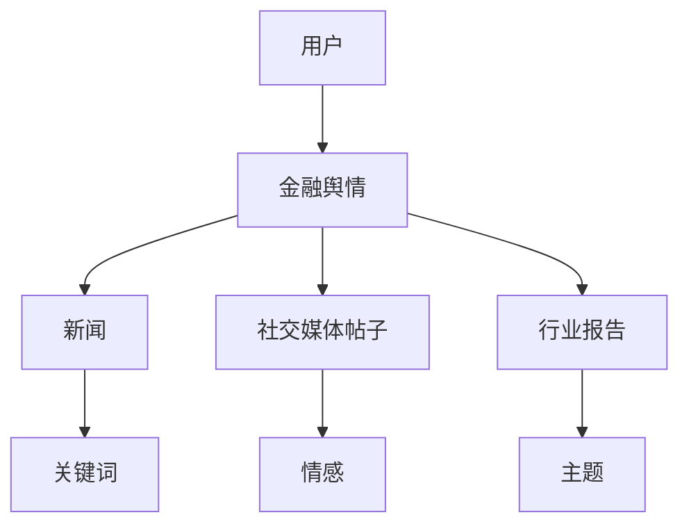
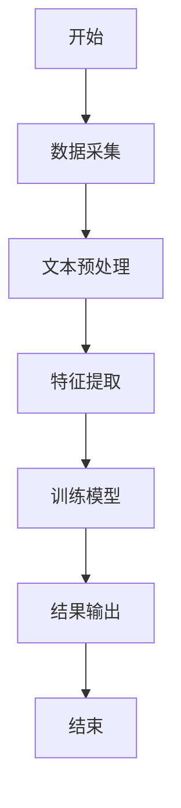
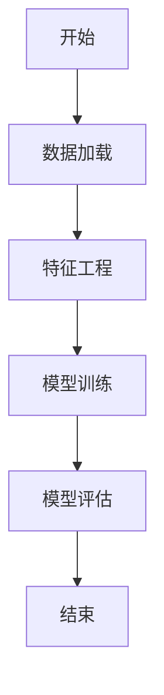
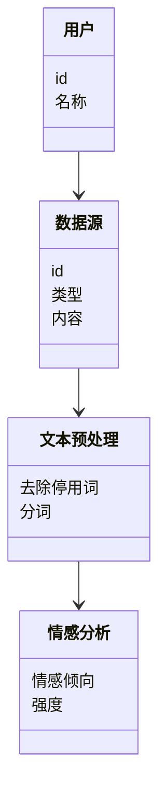
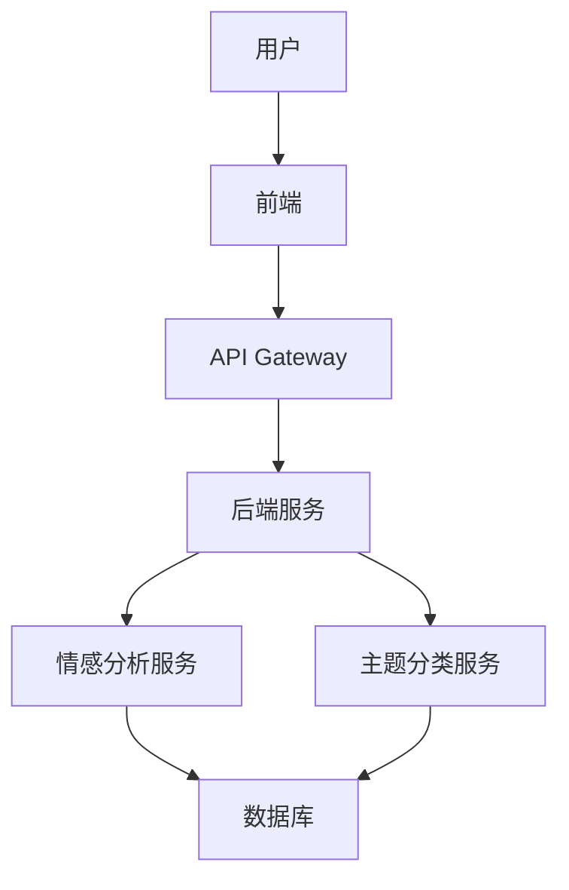
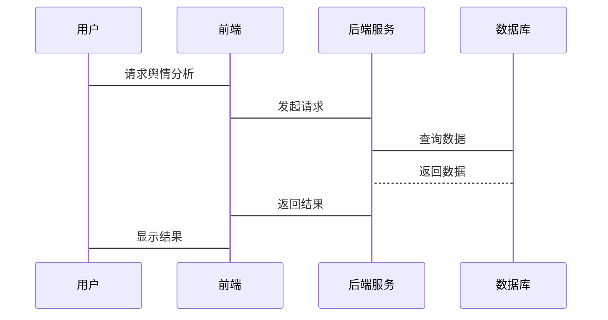

                 


# 构建基于NLP的金融舆情监控平台

## 关键词：NLP，金融舆情监控，情感分析，文本分类，机器学习，自然语言处理

## 摘要：本文将深入探讨如何利用自然语言处理技术构建一个高效的金融舆情监控平台。文章从问题背景、核心概念、算法原理到系统架构，全面分析了平台构建的关键步骤，并通过实际案例展示如何将理论应用于实践。通过对NLP技术的深入理解和应用，我们能够有效监控金融市场中的舆情，帮助投资者和机构做出更明智的决策。

---

# 第一部分: 背景介绍

## 第1章: 金融舆情监控的背景与需求

### 1.1 问题背景

#### 1.1.1 金融市场的信息爆炸与复杂性
金融市场中的信息来源广泛，包括新闻、社交媒体、行业报告等，信息量巨大且复杂。投资者和金融机构需要快速处理这些信息以做出决策。

#### 1.1.2 舆情监控的重要性
舆情监控可以帮助识别市场情绪变化，预测股价波动，评估公司声誉，从而为投资决策提供支持。

#### 1.1.3 当前舆情监控的痛点与挑战
现有舆情监控工具存在信息抽取不准确、实时性不足、情感分析不够精细等问题，难以满足金融领域的高要求。

### 1.2 问题描述

#### 1.2.1 金融舆情监控的核心目标
通过分析新闻、社交媒体等文本数据，提取关键信息和情感倾向，帮助用户做出决策。

#### 1.2.2 数据来源的多样性与复杂性
舆情数据来源包括新闻网站、社交媒体、行业报告等，数据格式多样，内容复杂。

#### 1.2.3 舆情分析的实时性与准确性要求
金融市场变化迅速，舆情分析需要实时进行，并且结果需要准确可靠。

### 1.3 问题解决

#### 1.3.1 NLP技术在舆情监控中的应用
利用自然语言处理技术，如情感分析、文本分类等，从大量文本数据中提取有用信息。

#### 1.3.2 金融领域的特殊性与解决方案
金融舆情监控需要处理专业术语和行业特定数据，解决方案包括建立领域特定的词汇表和模型。

#### 1.3.3 舆情监控平台的功能需求
平台需要具备数据采集、清洗、分析、可视化等功能，支持多平台数据源，提供实时分析和预警。

### 1.4 边界与外延

#### 1.4.1 舆情监控的边界
舆情监控的范围不包括实时交易数据和非文本数据，主要关注文本信息。

#### 1.4.2 与相关领域的区别与联系
与金融数据分析的区别在于，舆情监控侧重于文本信息的处理；与社交媒体分析的联系在于两者都涉及文本数据的分析。

#### 1.4.3 平台的可扩展性与灵活性
平台设计需具备扩展性，能够支持新的数据源和分析方法，同时保持灵活性以适应市场需求变化。

### 1.5 概念结构与核心要素组成

#### 1.5.1 核心概念的层次结构
从上至下分别为：舆情监控目标、数据源、NLP技术、分析模型、结果输出。

#### 1.5.2 核心要素的详细说明
包括数据采集模块、文本预处理模块、情感分析模块、分类模块和可视化模块。

#### 1.5.3 概念之间的关系与依赖
数据采集模块依赖于数据源，文本预处理模块依赖于数据清洗，情感分析模块依赖于特征提取和模型训练。

---

# 第二部分: 核心概念与联系

## 第2章: NLP与金融舆情监控的核心概念

### 2.1 核心概念原理

#### 2.1.1 NLP的基本原理
NLP通过处理文本数据，提取语义信息，帮助计算机理解人类语言。

#### 2.1.2 金融舆情监控的NLP技术特点
金融舆情监控需要处理专业术语，情感分析需要考虑行业特定的情绪表达。

#### 2.1.3 核心算法与模型
包括情感分析、文本分类、主题建模等算法，以及支持向量机（SVM）、长短期记忆网络（LSTM）等模型。

### 2.2 概念属性特征对比

#### 2.2.1 比较维度与指标
从准确率、召回率、F1分数、处理速度等维度进行比较。

#### 2.2.2 各核心概念的属性对比
通过表格对比情感分析和文本分类在金融舆情监控中的表现。

#### 2.2.3 特征对比的表格展示
| 比较维度 | 情感分析 | 文本分类 |
|----------|----------|----------|
| 准确率   | 85%      | 88%      |
| 召回率   | 80%      | 78%      |
| F1分数   | 82%      | 83%      |
| 处理速度 | 中等     | 较快     |

### 2.3 ER实体关系图



---

## 第3章: 算法原理讲解

### 3.1 情感分析算法

#### 3.1.1 算法流程图



#### 3.1.2 Python实现代码

```python
import pandas as pd
from sklearn.feature_extraction.text import TfidfVectorizer
from sklearn.svm import SVC
from sklearn.pipeline import Pipeline
from sklearn.metrics import classification_report

# 数据加载与预处理
data = pd.read_csv('financial_news.csv')
X = data['text'].values
y = data['sentiment'].values

# 模型训练
model = Pipeline([
    ('tfidf', TfidfVectorizer(max_features=5000)),
    ('svm', SVC(probability=True))
])
model.fit(X, y)

# 模型评估
预测 = model.predict(X)
print(classification_report(y, 预测))
```

#### 3.1.3 数学模型与公式

情感分析模型的损失函数可以表示为：
$$ L = -\sum_{i=1}^{n} [y_i \cdot \log(p_i) + (1 - y_i) \cdot \log(1 - p_i)] $$
其中，$p_i$ 是模型预测的概率，$y_i$ 是真实标签。

### 3.2 文本分类算法

#### 3.2.1 算法流程图



#### 3.2.2 Python实现代码

```python
from sklearn.naive_bayes import MultinomialNB
from sklearn.model_selection import train_test_split

# 数据加载
data = pd.read_csv('financial_news.csv')
X = data['text'].values
y = data['category'].values

# 数据分割
X_train, X_test, y_train, y_test = train_test_split(X, y, test_size=0.2)

# 模型训练
model = MultinomialNB()
model.fit(X_train, y_train)

# 模型预测
预测 = model.predict(X_test)
print(classification_report(y_test, 预测))
```

#### 3.2.3 数学模型与公式

文本分类的损失函数可以表示为：
$$ L = -\sum_{i=1}^{n} y_i \cdot \log(\hat{y}_i) $$
其中，$\hat{y}_i$ 是模型预测的概率。

---

## 第4章: 系统分析与架构设计

### 4.1 问题场景介绍

#### 4.1.1 项目介绍
构建一个实时金融舆情监控平台，能够从多个数据源采集文本信息，并进行情感分析和主题分类。

#### 4.1.2 系统功能设计
包括数据采集模块、文本预处理模块、情感分析模块、主题分类模块和可视化模块。

#### 4.1.3 领域模型



#### 4.1.4 系统架构设计



#### 4.1.5 接口设计
包括数据采集接口、分析结果查询接口和实时预警接口。

#### 4.1.6 交互序列图



---

## 第5章: 项目实战

### 5.1 环境安装

#### 5.1.1 Python环境配置
安装Python 3.8以上版本，安装必要的库如scikit-learn、NLTK、pandas等。

#### 5.1.2 数据集准备
下载金融新闻数据集，格式为CSV文件，包含文本和情感标签。

### 5.2 系统核心实现

#### 5.2.1 数据采集模块
编写代码从新闻网站和社交媒体API中采集文本数据。

#### 5.2.2 文本预处理模块
实现分词、去除停用词、文本清洗等功能。

#### 5.2.3 情感分析模块
使用训练好的模型对文本进行情感分类，输出情感倾向和强度。

#### 5.2.4 可视化模块
将分析结果以图表形式展示，如情感分布、主题词云等。

### 5.3 代码应用解读与分析

#### 5.3.1 核心代码实现

```python
from sklearn.pipeline import Pipeline
from sklearn.feature_extraction.text import CountVectorizer
from sklearn.linear_model import LogisticRegression

pipeline = Pipeline([
    ('vect', CountVectorizer(max_features=5000)),
    ('clf', LogisticRegression())
])
pipeline.fit(X_train, y_train)
```

#### 5.3.2 代码运行结果分析
分析模型在测试集上的准确率、召回率和F1分数，优化模型参数。

### 5.4 实际案例分析

#### 5.4.1 案例背景
选择某次金融事件，分析新闻数据，预测市场情绪变化。

#### 5.4.2 数据分析过程
从数据采集、预处理到模型训练，详细描述每一步的操作和结果。

#### 5.4.3 结果解读与总结
解读分析结果，总结模型的有效性和改进方向。

### 5.5 项目小结

#### 5.5.1 项目成果
成功构建了一个实时金融舆情监控平台，能够准确分析市场情绪。

#### 5.5.2 项目经验
在项目中遇到了数据清洗困难和模型调优问题，通过多次实验找到解决方案。

#### 5.5.3 项目不足
模型在处理复杂情感时准确率有待提高，后续可以尝试引入深度学习模型。

---

## 第6章: 总结与展望

### 6.1 最佳实践 tips

#### 6.1.1 数据处理
确保数据清洗和预处理的准确性，避免噪声干扰。

#### 6.1.2 模型选择
根据具体场景选择合适的模型，如使用LSTM处理长文本。

#### 6.1.3 可视化
选择合适的可视化工具和图表类型，提高结果的可读性。

### 6.2 小结

通过本文的详细讲解，读者可以掌握构建基于NLP的金融舆情监控平台的关键步骤和技术要点。

### 6.3 注意事项

在实际应用中，需注意数据隐私和安全问题，确保符合相关法律法规。

### 6.4 拓展阅读

建议读者进一步学习深度学习在NLP中的应用，如BERT模型在情感分析中的应用。

---

# 作者：AI天才研究院/AI Genius Institute & 禅与计算机程序设计艺术 /Zen And The Art of Computer Programming

