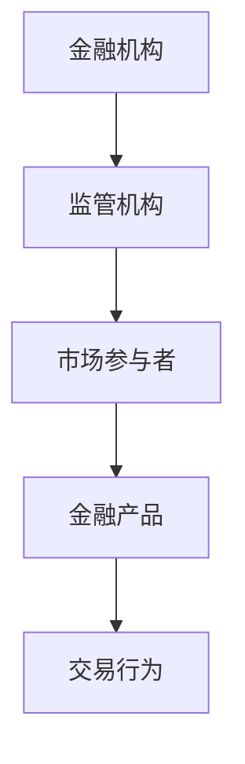
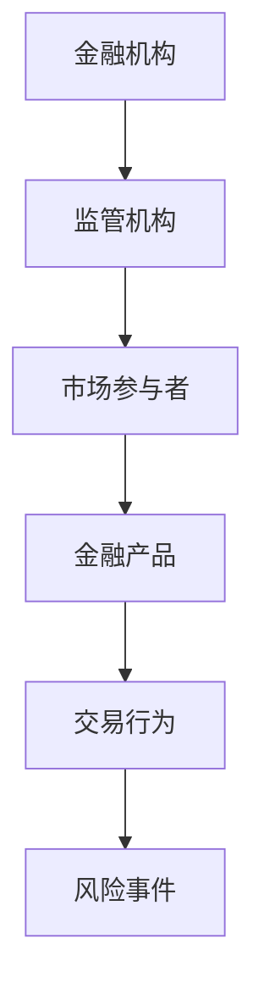
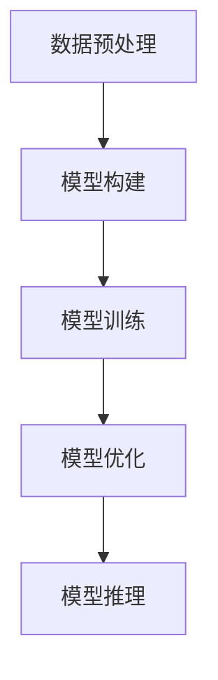
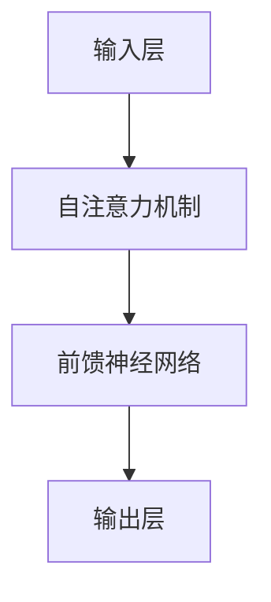
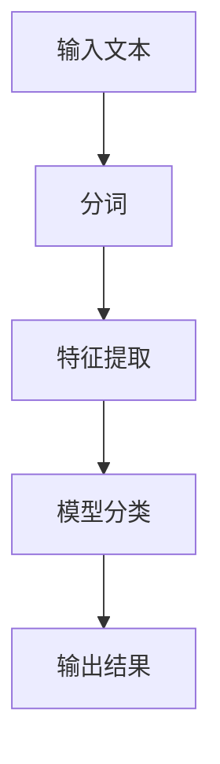
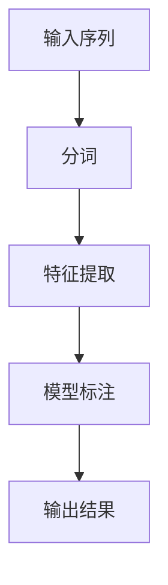
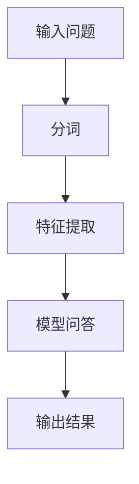
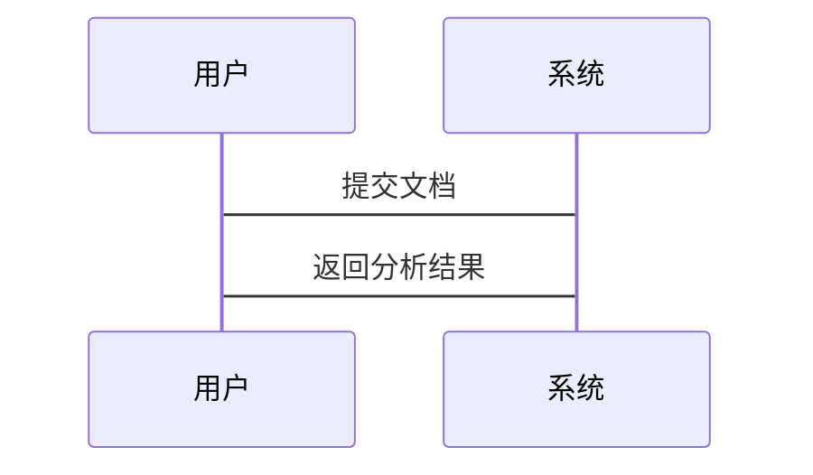

                 


# 构建基于大模型的金融监管合规自动化平台

> 关键词：金融监管，大模型，自然语言处理，合规自动化，风险评估

> 摘要：本文将探讨如何利用大模型技术构建金融监管合规自动化平台。通过结合自然语言处理、知识图谱和规则引擎等技术，我们能够实现对金融文档的智能分析、风险评估和合规审查的自动化。本文将详细分析大模型在金融监管中的核心原理、系统设计和实际应用，并通过案例分析展示其在金融合规自动化中的潜力和优势。

---

# 引言

## 1.1 问题背景与目标

### 1.1.1 问题背景
随着金融市场的快速发展，金融机构面临的监管合规压力越来越大。传统的金融监管主要依赖人工审查，这种方式效率低下、成本高昂，且容易受到主观因素的影响。近年来，随着大模型技术的兴起，特别是自然语言处理（NLP）和机器学习的进步，为金融监管的自动化提供了新的可能性。

### 1.1.2 问题目标
本文的目标是探讨如何利用大模型技术构建一个高效的金融监管合规自动化平台。通过分析大模型在金融监管中的应用场景，我们希望实现以下目标：
- 提供智能化的金融文档分析能力。
- 实现自动化风险评估和预警。
- 支持高效的合规审查流程。

### 1.1.3 问题结构
本文将从以下几个方面展开：
1. **大模型与金融监管概述**：介绍大模型的基本概念及其在金融监管中的应用潜力。
2. **大模型在金融监管中的核心原理**：分析大模型在金融监管中的技术实现和关键算法。
3. **系统设计与实现**：详细阐述金融监管合规自动化平台的系统架构和功能模块。
4. **项目实战与案例分析**：通过具体案例展示大模型在金融监管中的实际应用。

---

# 第二部分: 大模型与金融监管概述

## 2.1 大模型的基本概念与技术特点

### 2.1.1 大模型的定义与核心原理
大模型（Large Language Model, LLM）是一种基于深度学习的自然语言处理模型，具有以下特点：
- **大规模训练数据**：大模型通常使用海量的文本数据进行训练，能够捕捉语言的复杂模式。
- **多任务学习能力**：大模型可以在多种任务上进行训练，具备通用性。
- **强大的上下文理解能力**：通过自注意力机制，大模型能够理解文本的上下文关系。

### 2.1.2 大模型在自然语言处理中的优势
- **语义理解**：大模型能够准确理解文本的语义，尤其是在复杂句子和专业术语方面表现优异。
- **生成能力**：大模型可以生成高质量的文本，如回答问题、撰写报告等。
- **可定制性**：大模型可以根据具体需求进行微调，适应特定领域的应用场景。

### 2.1.3 大模型的训练与推理机制
大模型的训练过程通常包括以下几个步骤：
1. **数据预处理**：对训练数据进行清洗、分词和格式化。
2. **模型构建**：搭建基于Transformer的深度学习模型。
3. **模型训练**：使用大规模数据对模型进行训练，优化损失函数。
4. **模型推理**：将输入文本通过模型进行处理，输出所需的结果。

## 2.2 金融监管的核心领域与挑战

### 2.2.1 金融监管的主要领域
- **市场行为监管**：监控市场参与者的交易行为，防止操纵和欺诈。
- **信息披露监管**：确保金融机构按规定披露相关信息。
- **风险监管**：评估和管理金融机构的信用风险、市场风险等。

### 2.2.2 金融合规的复杂性与难点
- **数据多样性**：金融文档包含多种类型的数据，如文本、表格和图表。
- **法规复杂性**：金融法规繁多且更新频繁，合规要求不断变化。
- **人工审查成本高**：传统合规审查依赖人工操作，效率低且易出错。

### 2.2.3 传统金融监管的痛点与改进方向
- **效率低下**：人工审查效率低，难以应对海量数据。
- **成本高昂**：合规审查需要大量人力资源，成本高昂。
- **主观性问题**：人工审查容易受到主观因素的影响，结果可能存在偏差。

## 2.3 大模型在金融监管中的应用潜力

### 2.3.1 自然语言处理在合规文档分析中的应用
大模型可以通过自然语言处理技术对金融文档进行自动分析，提取关键信息并生成合规报告。

### 2.3.2 大模型在风险评估与预警中的作用
大模型可以通过分析市场数据和新闻舆情，预测潜在的金融风险并发出预警。

### 2.3.3 大模型在智能合规审查中的创新
大模型可以辅助合规审查人员快速识别文档中的潜在问题，提高审查效率和准确性。

---

# 第三部分: 大模型在金融监管中的核心概念与联系

## 3.1 大模型在金融监管中的核心原理

### 3.1.1 大模型的训练数据与金融监管的关系
大模型的训练数据对金融监管的应用效果至关重要。高质量的金融数据可以帮助模型更好地理解行业术语和合规要求。

### 3.1.2 大模型的推理机制与金融监管的结合
大模型的推理机制可以应用于金融监管的多个环节，如风险评估、合规审查和市场监控。

### 3.1.3 大模型的可解释性与监管需求的匹配
大模型的可解释性是金融监管的重要要求。模型需要能够清晰地解释其决策过程，以满足监管机构的合规需求。

## 3.2 金融监管中的关键概念与实体关系

### 3.2.1 金融监管领域的实体关系图
以下是一个金融监管领域的实体关系图，展示了主要实体及其关系：



### 3.2.2 大模型在实体关系建模中的应用
大模型可以通过知识图谱技术对金融监管中的实体关系进行建模，帮助模型更好地理解行业结构和关系。

### 3.2.3 实体关系图的Mermaid流程图展示
以下是一个更详细的实体关系图：



---

# 第四部分: 大模型在金融监管中的算法原理

## 4.1 大模型的训练与优化算法

### 4.1.1 大模型的训练流程
以下是一个大模型的训练流程图：



### 4.1.2 基于Transformer的模型结构
以下是一个Transformer模型的结构图：



### 4.1.3 大模型的优化策略
大模型的优化策略包括：
1. **学习率调整**：使用学习率衰减策略优化模型训练。
2. **模型并行训练**：利用分布式计算加速模型训练。
3. **数据增强**：通过数据增强技术提高模型的泛化能力。

## 4.2 金融监管中的具体算法实现

### 4.2.1 基于大模型的文本分类算法
以下是一个文本分类算法的流程图：



### 4.2.2 基于大模型的序列标注算法
以下是一个序列标注算法的流程图：



### 4.2.3 基于大模型的问答系统算法
以下是一个问答系统算法的流程图：



## 4.3 算法的数学模型与公式

### 4.3.1 Transformer模型的数学公式
Transformer模型的自注意力机制可以通过以下公式表示：

$$
\text{Attention}(Q, K, V) = \text{softmax}\left(\frac{QK^T}{\sqrt{d_k}}\right)V
$$

其中，\(Q\) 是查询向量，\(K\) 是键向量，\(V\) 是值向量，\(d_k\) 是向量的维度。

### 4.3.2 注意力机制的数学推导
注意力机制的核心在于计算查询和键之间的相似性，并根据相似性对值向量进行加权求和：

$$
\alpha_i = \text{softmax}(QK^T)
$$

$$
\text{Output} = \sum_{i=1}^{n} \alpha_i V_i
$$

### 4.3.3 损失函数与优化算法的详细解释
常用的损失函数包括交叉熵损失和均方误差损失：

$$
\text{Cross-Entropy Loss} = -\sum_{i=1}^{m} y_i \log(p_i) + (1-y_i) \log(1-p_i)
$$

$$
\text{Mean Squared Error} = \frac{1}{m}\sum_{i=1}^{m}(y_i - p_i)^2
$$

优化算法通常使用随机梯度下降（SGD）或Adam优化器：

$$
\theta = \theta - \eta \nabla_\theta \text{Loss}
$$

其中，\(\eta\) 是学习率，\(\nabla_\theta\) 是损失函数对参数的梯度。

---

# 第五部分: 金融监管合规自动化平台的系统设计

## 5.1 系统整体架构设计

### 5.1.1 系统的功能模块划分
金融监管合规自动化平台的主要功能模块包括：
1. **文档分析模块**：对金融文档进行自动分析和分类。
2. **风险评估模块**：评估金融产品的风险等级。
3. **合规审查模块**：自动检查文档是否符合监管要求。

### 5.1.2 系统的分层架构设计
系统的分层架构包括：
1. **数据层**：存储金融文档和相关数据。
2. **业务逻辑层**：实现系统的业务逻辑。
3. **用户界面层**：提供用户交互界面。

### 5.1.3 系统的可扩展性设计
系统需要具备良好的可扩展性，能够支持新功能的快速开发和部署。

## 5.2 系统功能设计与实现

### 5.2.1 文档分析模块的设计
文档分析模块通过自然语言处理技术对金融文档进行分析，提取关键信息并生成分析报告。

### 5.2.2 风险评估模块的设计
风险评估模块基于大模型的预测能力，评估金融产品的风险等级并发出预警。

### 5.2.3 合规审查模块的设计
合规审查模块通过规则引擎和自然语言处理技术，自动检查文档是否符合监管要求。

## 5.3 系统接口与交互设计

### 5.3.1 系统接口的设计规范
系统接口需要遵循RESTful API设计规范，确保与其他系统的良好集成。

### 5.3.2 系统交互流程的Mermaid序列图
以下是一个系统交互流程的Mermaid序列图：



### 5.3.3 系统接口的实现细节
系统接口的具体实现细节需要根据具体需求进行设计，通常包括数据格式、请求方式和返回结果等内容。

---

# 第六部分: 项目实战与案例分析

## 6.1 项目环境的安装与配置

### 6.1.1 安装Python环境
需要安装Python 3.8及以上版本。

### 6.1.2 安装相关依赖
安装以下依赖：

```bash
pip install transformers
pip install torch
pip install numpy
```

## 6.2 系统核心实现源代码

### 6.2.1 文档分析模块的实现
以下是文档分析模块的实现代码：

```python
from transformers import AutoTokenizer, AutoModelForMaskedLM
import torch

class DocumentAnalyzer:
    def __init__(self, model_name):
        self.tokenizer = AutoTokenizer.from_pretrained(model_name)
        self.model = AutoModelForMaskedLM.from_pretrained(model_name)
    
    def analyze_document(self, text):
        inputs = self.tokenizer(text, return_tensors="pt")
        outputs = self.model(**inputs)
        return outputs.last_hidden_state.mean(dim=1).squeeze()
```

### 6.2.2 风险评估模块的实现
以下是风险评估模块的实现代码：

```python
import torch
import numpy as np

class RiskAssessor:
    def __init__(self, model_name):
        self.tokenizer = AutoTokenizer.from_pretrained(model_name)
        self.model = AutoModelForMaskedLM.from_pretrained(model_name)
    
    def assess_risk(self, text):
        inputs = self.tokenizer(text, return_tensors="pt")
        outputs = self.model(**inputs)
        hidden_states = outputs.last_hidden_state.mean(dim=1).squeeze()
        risk_score = torch.dot(hidden_states, self.model.classifier.weight)
        return risk_score.item()
```

### 6.2.3 合规审查模块的实现
以下是合规审查模块的实现代码：

```python
from transformers import AutoTokenizer, AutoModelForTokenClassification
import torch

class ComplianceReviewer:
    def __init__(self, model_name):
        self.tokenizer = AutoTokenizer.from_pretrained(model_name)
        self.model = AutoModelForTokenClassification.from_pretrained(model_name)
    
    def review_compliance(self, text):
        inputs = self.tokenizer(text, return_tensors="pt")
        outputs = self.model(**inputs)
        predictions = torch.argmax(outputs logits, dim=2)
        return predictions
```

## 6.3 代码应用解读与分析

### 6.3.1 文档分析模块的解读
文档分析模块通过大模型对金融文档进行分析，提取关键信息并生成分析报告。

### 6.3.2 风险评估模块的解读
风险评估模块通过大模型对金融产品的风险进行评估，并发出预警。

### 6.3.3 合规审查模块的解读
合规审查模块通过大模型对金融文档进行自动审查，确保其符合监管要求。

## 6.4 实际案例分析和详细讲解剖析

### 6.4.1 案例背景
某金融机构需要对一份年度报告进行合规审查。

### 6.4.2 系统实现步骤
1. **文档分析**：系统对报告进行自动分析，提取关键信息。
2. **风险评估**：系统对报告中的风险进行评估，并发出预警。
3. **合规审查**：系统对报告进行自动审查，确保其符合监管要求。

## 6.5 项目小结

### 6.5.1 项目总结
通过大模型技术，我们成功构建了一个金融监管合规自动化平台，实现了文档分析、风险评估和合规审查的自动化。

### 6.5.2 项目意义
本项目的成功实施为金融机构提供了高效、准确的金融监管工具，显著提高了合规审查的效率和准确性。

---

# 第七部分: 总结与展望

## 7.1 核心内容回顾

### 7.1.1 金融监管的核心概念
金融监管的核心概念包括市场行为监管、信息披露监管和风险监管。

### 7.1.2 大模型在金融监管中的应用
大模型在金融监管中的应用包括文档分析、风险评估和合规审查。

## 7.2 未来展望

### 7.2.1 技术发展
未来，随着大模型技术的不断发展，金融监管的自动化水平将进一步提高。

### 7.2.2 应用场景拓展
大模型技术将在更多金融监管领域得到应用，如智能风控和实时监控。

## 7.3 最佳实践 tips

### 7.3.1 技术实现 tips
在实际应用中，需要注意模型的可解释性和数据隐私问题。

### 7.3.2 项目管理 tips
在项目管理中，需要注重团队协作和项目进度控制。

### 7.3.3 持续优化 tips
在系统运行中，需要定期进行模型优化和功能迭代。

---

# 作者：AI天才研究院/AI Genius Institute & 禅与计算机程序设计艺术 /Zen And The Art of Computer Programming

---

以上是《构建基于大模型的金融监管合规自动化平台》的完整目录和内容概述。如果需要进一步展开具体内容或补充细节，可以继续进行。

