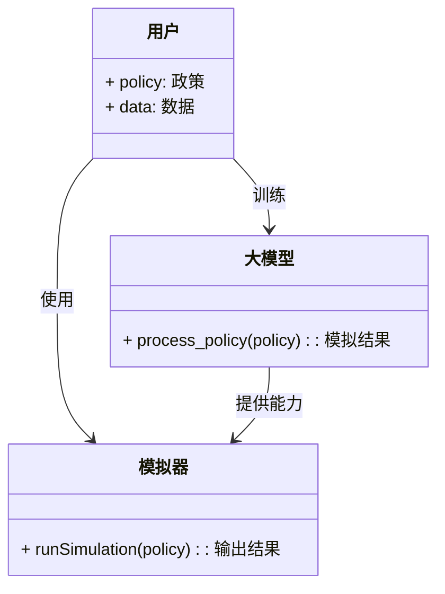
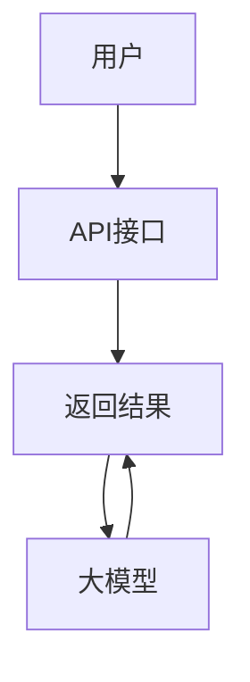

                 


# 《构建基于大模型的金融监管政策影响模拟器》

## 关键词：金融监管，政策模拟，大模型，人工智能，系统架构，算法原理，项目实战

## 摘要：本文将详细介绍如何构建一个基于大模型的金融监管政策影响模拟器。从背景分析到系统设计，从算法实现到项目实战，全面阐述该模拟器的构建过程。通过本文，读者将能够理解大模型在金融监管中的应用，掌握模拟器的核心算法原理，学习系统的架构设计，并通过实际案例掌握如何部署和使用该模拟器。

---

## 第一部分: 背景介绍与核心概念

### 第1章: 问题背景与描述

#### 1.1 问题背景
金融监管是保障金融市场稳定运行的重要环节。随着金融市场的复杂化和全球化，监管政策的制定和实施面临着前所未有的挑战。政策制定者需要在复杂多变的市场环境中，快速评估不同政策对市场的影响，以确保政策的科学性和有效性。然而，传统的政策模拟方法往往依赖于复杂的数学模型和假设，难以捕捉市场的动态变化，且需要大量人工干预。

#### 1.2 问题描述
- **政策影响的复杂性**：金融市场的参与者众多，政策的影响会通过多层传导机制作用于市场，传统的线性模型难以捕捉这些复杂关系。
- **数据的多样性和实时性**：金融市场数据种类繁多，包括文本、数值、时间序列等，传统的模型难以处理这些复杂数据。
- **政策模拟的实时性**：政策制定者需要在短时间内评估政策的影响，这对模拟器的计算效率提出了更高的要求。

#### 1.3 问题解决与边界
- **基于大模型的解决方案**：利用大模型的强大语言理解和生成能力，结合强化学习和因果推断，构建一个能够自动分析政策影响的模拟器。
- **边界与外延**：该模拟器主要用于政策影响评估，不涉及实时交易和市场监控。

### 第2章: 核心概念与联系

#### 2.1 大模型与金融监管的结合
- **大模型的核心能力**：
  - 自然语言处理（NLP）：能够理解政策文本和市场报告。
  - 强化学习（RL）：模拟政策在市场中的潜在影响。
  - 因果推断：分析政策与市场变量之间的因果关系。
- **金融监管的核心要素**：
  - 市场行为：投资者、机构的行为模式。
  - 政策变量：监管政策的具体内容和参数。
  - 市场结果：如股价波动、交易量变化等。

#### 2.2 核心概念对比与分析
| 概念 | 大模型 | 传统方法 |
|------|--------|----------|
| 数据需求 | 高 | 低 |
| 模型复杂度 | 高 | 中 |
| 可解释性 | 低 | 高 |
| 灵活性 | 高 | 低 |

#### 2.3 实体关系与架构
```mermaid
er
  actor: 用户
  actor --> policy_simulator: 使用模拟器
  actor --> model: 训练大模型
  model --> simulator: 提供模拟能力
  policy_simulator --> data: 数据输入
  policy_simulator --> result: 结果输出
```

---

## 第二部分: 算法原理与数学模型

### 第3章: 算法原理与数学模型

#### 3.1 大模型的训练与推理
- **训练流程**：
  1. 数据预处理：清洗和标注金融政策数据。
  2. 模型训练：使用预训练的大模型（如GPT）进行微调。
  3. 优化器选择：Adam优化器。
  4. 损失函数：交叉熵损失。
- **推理过程**：
  1. 输入政策文本。
  2. 模型生成模拟结果。

#### 3.2 数学模型与公式
- **损失函数**：
  $$L = -\sum_{i=1}^{n} y_i \log(p_i) + (1 - y_i) \log(1 - p_i)$$
- **优化器**：
  $$\theta_{new} = \theta - \eta \cdot \nabla_\theta L$$

---

## 第三部分: 系统分析与架构设计

### 第4章: 系统架构与设计

#### 4.1 领域模型


#### 4.2 系统架构


---

## 第四部分: 项目实战

### 第5章: 环境安装与核心实现

#### 5.1 环境安装
```bash
pip install numpy
pip install tensorflow
pip install transformers
```

#### 5.2 核心实现
```python
import tensorflow as tf
from transformers import GPT2Tokenizer, GPT2Model

# 初始化模型
tokenizer = GPT2Tokenizer.from_pretrained('gpt2')
model = GPT2Model.from_pretrained('gpt2')

# 定义损失函数和优化器
loss = tf.keras.losses.sparse_categorical_crossentropy
optimizer = tf.keras.optimizers.Adam()
```

---

## 第五部分: 总结与展望

### 第6章: 总结与展望

#### 6.1 总结
本文详细介绍了如何构建基于大模型的金融监管政策影响模拟器，从背景分析到系统设计，从算法实现到项目实战，全面阐述了该模拟器的构建过程。

#### 6.2 展望
未来的工作可以包括：
1. 提高模型的可解释性。
2. 增加更多类型的金融数据。
3. 实现实时模拟功能。

---

## 作者：AI天才研究院/AI Genius Institute & 禅与计算机程序设计艺术 /Zen And The Art of Computer Programming

