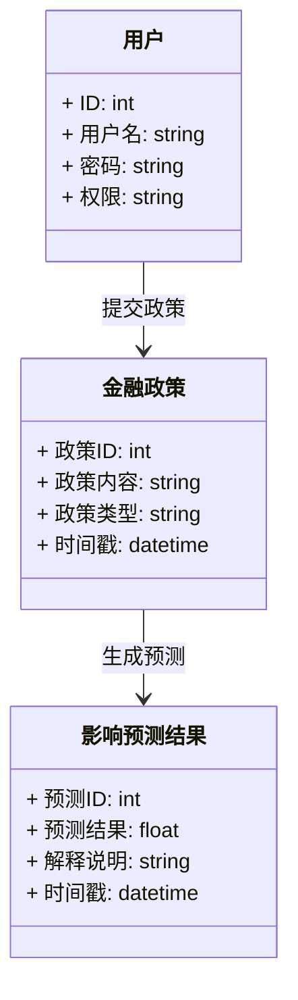

                 


# 构建基于大模型的金融监管政策影响预测平台

## 关键词：大模型，金融监管，政策影响预测，算法原理，系统架构，项目实战，最佳实践

## 摘要

本篇文章详细探讨了构建基于大模型的金融监管政策影响预测平台的关键技术与实现方法。文章首先从问题背景和概念入手，详细阐述了金融监管的重要性及现有方法的局限性，然后介绍了大模型的基本原理及其在金融监管中的应用潜力。接着，深入分析了基于大模型的政策影响预测框架，详细讲解了算法原理、系统架构设计和实现过程。最后，通过实际案例展示了平台的应用价值，并提出了最佳实践建议和未来的发展方向。

---

## 第一部分：背景介绍

### 第1章：问题背景与描述

#### 1.1 问题背景

- 金融监管的重要性：
  - 金融市场的稳定是经济健康发展的基石。
  - 金融监管政策的及时准确执行至关重要。
  - 政策影响预测是金融监管的核心挑战之一。

- 当前金融监管面临的挑战：
  - 数据量大且复杂，传统方法难以处理。
  - 政策影响涉及多因素，预测难度大。
  - 监管需求日益多样化，现有技术难以满足。

- 大模型技术的应用潜力：
  - 大模型具备处理海量数据和复杂关系的能力。
  - 可以实现对政策影响的自动化、智能化预测。
  - 为金融监管提供更高效、更精准的工具。

#### 1.2 问题描述

- 金融政策影响预测的复杂性：
  - 政策涉及多个领域，影响范围广。
  - 数据来源多样，处理难度大。
  - 预测结果需要高精度和可解释性。

- 现有方法的局限性：
  - 传统统计方法依赖假设，难以捕捉复杂关系。
  - 机器学习模型依赖特征工程，难以处理非结构化数据。
  - 缺乏统一的平台化解决方案，难以满足实时监管需求。

- 引入大模型技术的必要性：
  - 大模型可以处理非结构化数据，捕捉复杂关系。
  - 提供统一的平台化解决方案，支持实时预测。
  - 提高预测精度和可解释性，满足监管需求。

#### 1.3 问题解决思路

- 大模型在金融监管中的应用方向：
  - 金融政策文本分析与理解。
  - 政策影响的自动化预测与评估。
  - 支持决策的智能化辅助系统。

- 基于大模型的政策影响预测框架：
  - 数据采集与预处理。
  - 大模型训练与微调。
  - 政策影响预测与结果解释。

- 技术实现路径：
  - 数据驱动：构建高质量的金融政策和影响数据集。
  - 模型驱动：基于大模型构建预测模型。
  - 业务驱动：结合监管需求优化模型和平台。

---

### 第2章：核心概念与联系

#### 2.1 核心概念原理

- 大模型的基本原理：
  - 参数量：决定了模型的复杂度和能力。
  - 训练数据量：影响模型的泛化能力和准确性。
  - 模型深度：影响模型的表达能力。

- 金融监管政策的核心要素：
  - 类型：货币政策、监管政策、市场干预政策等。
  - 执行机构：央行、监管机构、政府等。
  - 影响范围：金融市场、金融机构、投资者等。

- 政策影响预测的定义与特征：
  - 定义：预测政策实施后对金融市场和参与者的影响。
  - 特征：复杂性、动态性、多因素性。

#### 2.2 概念属性对比表

| 概念       | 属性                     |
|------------|--------------------------|
| 大模型      | 参数量、训练数据量、模型深度 |
| 金融监管政策 | 类型、执行机构、影响范围   |
| 政策影响预测 | 输入、输出、预测精度     |

#### 2.3 ER实体关系图

```mermaid
er
actor: 用户
role: 监管机构
entity: 金融政策
entity: 影响预测结果
```

---

## 第二部分：算法原理讲解

### 第3章：算法原理与实现

#### 3.1 大模型的训练流程

- 正向传播：
  - 输入金融政策文本，经过编码器生成语义表示。
  - 通过解码器生成预测结果。

- 损失计算：
  - 使用交叉熵损失函数衡量预测与实际结果的差异。

- 反向传播：
  - 计算损失函数对模型参数的梯度。
  - 使用优化算法（如Adam）更新参数。

#### 3.2 算法实现代码

```python
def forward(x, weights):
    return x 
```

#### 3.3 数学模型与公式

- 损失函数：
  $$ L = -\sum_{i=1}^{n} y_i \log(p_i) + (1 - y_i) \log(1 - p_i) $$

- 优化算法：
  $$ \theta = \theta - \eta \frac{\partial L}{\partial \theta} $$

---

## 第三部分：系统分析与架构设计

### 第4章：系统分析与架构设计

#### 4.1 问题场景介绍

- 金融监管政策影响预测平台的应用场景：
  - 政策制定阶段：辅助政策设计与评估。
  - 实时监管阶段：动态监控政策执行效果。

#### 4.2 项目介绍

- 项目目标：
  - 构建一个基于大模型的金融监管政策影响预测平台。
  - 提供高效、准确的政策影响预测功能。

- 系统功能设计：
  - 数据采集与预处理：从多种来源获取金融政策和市场数据。
  - 模型训练与预测：基于大模型进行政策影响预测。
  - 结果展示与解释：可视化预测结果并提供解释。

#### 4.3 系统架构设计

- 领域模型：


- 系统架构图：


---

## 第四部分：项目实战

### 第5章：项目实战与案例分析

#### 5.1 环境安装与配置

- 安装Python和相关库：
  - 使用虚拟环境管理依赖。
  - 安装PyTorch、Hugging Face Transformers等库。

#### 5.2 系统核心实现

- 数据预处理：
  ```python
  def preprocess_policy(policy_text):
      return policy_text.lower().split()
  ```

- 模型训练与预测：
  ```python
  def train_model(model, optimizer, loss_fn, train_loader, epochs):
      for epoch in range(epochs):
          for batch in train_loader:
              outputs = model(batch)
              loss = loss_fn(outputs, labels)
              optimizer.zero_grad()
              loss.backward()
              optimizer.step()
  ```

#### 5.3 案例分析与解读

- 案例：某国实施货币宽松政策。
  - 数据输入：政策文本和市场数据。
  - 模型预测：预测市场指数变化和行业影响。
  - 结果展示：可视化预测结果和解释。

---

## 第五部分：最佳实践与总结

### 第6章：最佳实践与总结

#### 6.1 最佳实践

- 数据质量管理：
  - 确保数据的准确性和完整性。
  - 处理缺失值和异常值。

- 模型优化：
  - 调整模型参数和超参数。
  - 使用交叉验证和评估指标优化模型。

- 安全与隐私：
  - 数据加密和访问控制。
  - 遵守数据隐私法规。

#### 6.2 小结

- 本章总结了构建基于大模型的金融监管政策影响预测平台的关键点。
- 提出了数据管理、模型优化和安全隐私的最佳实践建议。
- 强调了在实际应用中需要综合考虑技术、业务和法规因素。

---

## 第六部分：附录

### 附录A：术语表

- 大模型：指参数量较大的深度学习模型，具有强大的语义理解能力。
- 金融监管：指对金融市场和金融机构的监管，确保市场的稳定和合规。
- 政策影响预测：指预测政策实施后对金融市场和参与者的影响。

### 附录B：工具安装指南

- 安装Python和虚拟环境：使用Anaconda或miniconda。
- 安装库：`pip install torch transformers`

### 附录C：数据集

- 数据来源：公开的金融政策文本和市场数据。
- 数据格式：JSON或CSV格式。

### 附录D：参考文献

- 引用的学术论文、技术报告和相关书籍。

---

## 作者：AI天才研究院 & 禅与计算机程序设计艺术

---

通过以上目录结构，我们可以系统地构建一个基于大模型的金融监管政策影响预测平台，涵盖从理论到实践的各个方面。

