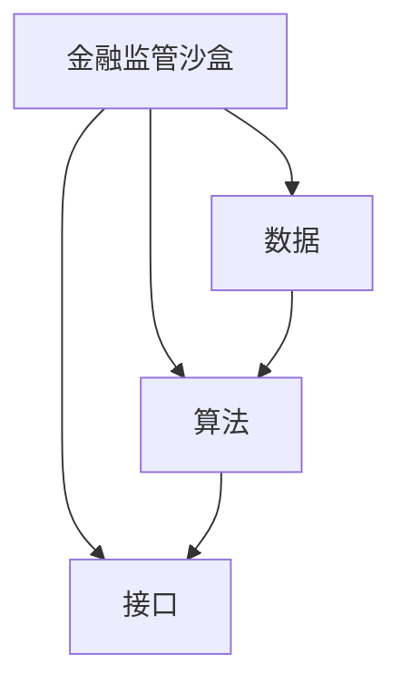
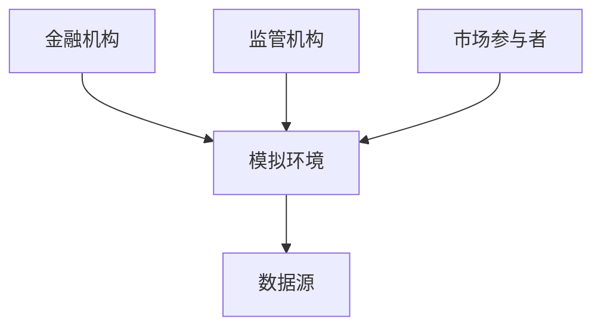
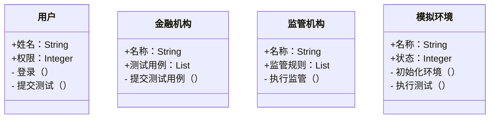
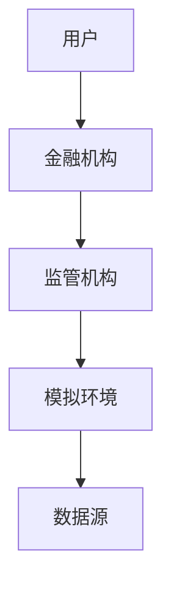
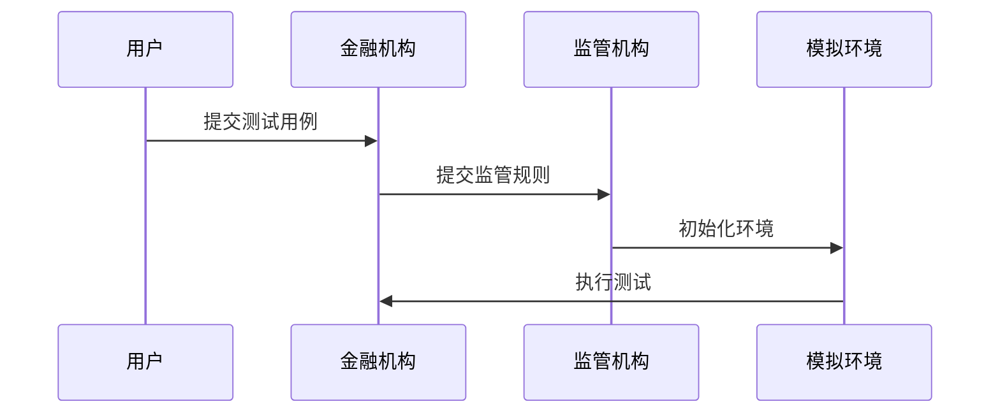

                 


---

# 构建基于大模型的金融监管沙盒模拟平台

> 关键词：大模型，金融监管，沙盒模拟，系统架构，算法原理

> 摘要：随着人工智能技术的快速发展，金融监管领域的智能化需求日益迫切。本文详细探讨了如何基于大模型技术构建金融监管沙盒模拟平台，从问题背景、核心概念、算法原理到系统架构、项目实战，层层深入，结合实际案例和代码实现，为读者提供全面的技术解读与实践指南。

---

# 第一部分：背景介绍与问题背景

## 第1章：大模型与金融监管沙盒概述

### 1.1 问题背景

#### 1.1.1 金融监管的现状与挑战
金融监管是维护金融市场稳定的核心环节，传统监管手段依赖人工审查和规则匹配，存在效率低、覆盖面有限的问题。随着金融业务的复杂化和数字化，监管需求呈现多样化和动态化趋势。

#### 1.1.2 传统金融监管的局限性
- 人工监管效率低下，难以覆盖海量数据。
- 规则固定化，难以应对金融市场中的非确定性风险。
- 数据孤岛现象严重，难以实现跨机构协同监管。

#### 1.1.3 大模型技术的引入与潜力
大模型技术在自然语言处理、数据分析和模式识别方面具有显著优势，能够有效提升金融监管的智能化水平。

### 1.2 问题描述

#### 1.2.1 金融监管沙盒的概念
金融监管沙盒是一种模拟环境，允许金融机构在受控条件下测试创新产品和服务，同时确保风险可控。

#### 1.2.2 模拟平台的需求与目标
- 提供虚拟的金融市场环境。
- 支持多种金融场景的模拟与测试。
- 实现监管规则的自动化执行与评估。

#### 1.2.3 平台构建的核心问题
- 如何构建高效的金融模拟引擎。
- 如何实现大模型与金融监管规则的深度结合。
- 如何确保平台的可扩展性和灵活性。

### 1.3 问题解决

#### 1.3.1 大模型在金融监管中的应用
- 风险预测：利用大模型分析市场数据，预测潜在风险。
- 智能合规：自动化识别交易行为是否符合监管规则。
- 实时监控：实时分析市场动态，快速响应异常事件。

#### 1.3.2 模拟平台的技术实现路径
- 数据采集与处理：整合多源异构数据。
- 模型训练：基于历史数据训练大模型。
- 平台搭建：构建虚拟金融市场环境。

#### 1.3.3 平台构建的可行性分析
- 技术可行性：大模型技术的快速发展为平台构建提供了技术支撑。
- 数据可行性：金融市场数据的丰富性为模型训练提供了充足的数据来源。
- 应用可行性：金融监管沙盒的广泛需求为平台的应用提供了市场空间。

### 1.4 边界与外延

#### 1.4.1 平台的功能边界
- 仅限于模拟环境，不涉及真实交易。
- 不处理敏感数据，确保数据安全。

#### 1.4.2 相关领域的外延
- 与金融科技（FinTech）领域的其他技术（如区块链、人工智能）结合。
- 扩展至其他监管领域（如医疗、教育）。

#### 1.4.3 与其他系统的接口关系
- 与金融机构系统对接，获取实时数据。
- 与监管机构系统对接，共享监管结果。

### 1.5 概念结构与核心要素

#### 1.5.1 核心概念的层次结构
1. 顶层概念：金融监管沙盒。
2. 中间概念：大模型、模拟环境、监管规则。
3. 底层概念：数据、算法、接口。

#### 1.5.2 核心要素的定义与关系
- 数据：输入大模型进行训练和推理的基础。
- 算法：大模型的核心技术，决定平台的智能水平。
- 接口：平台与其他系统的连接点，确保数据流通与功能协同。

#### 1.5.3 概念结构的可视化图


---

# 第二部分：核心概念与联系

## 第2章：大模型与金融监管沙盒的核心概念

### 2.1 大模型的核心原理

#### 2.1.1 大模型的基本原理
大模型通过多层神经网络结构，利用海量数据进行训练，从而具备强大的特征提取和模式识别能力。

#### 2.1.2 大模型的训练与推理过程
- **训练阶段**：模型通过反向传播算法不断优化参数，以最小化预测误差。
- **推理阶段**：模型基于训练好的参数，对新的输入数据进行预测和分类。

#### 2.1.3 大模型的特征与优势
- 高精度：模型通过深度学习训练，能够捕捉数据中的细微特征。
- 多任务处理能力：模型可以同时处理多种类型的任务（如分类、回归、生成）。
- 自适应性：模型能够根据新的数据动态调整参数，适应变化的环境。

### 2.2 金融监管沙盒的实体关系

#### 2.2.1 实体关系图的定义
金融监管沙盒涉及的主要实体包括：金融机构、监管机构、市场参与者、模拟环境和数据源。

#### 2.2.2 实体关系图的构建


#### 2.2.3 实体关系图的分析
- 金融机构和监管机构通过模拟环境进行交互。
- 市场参与者的行为数据通过数据源输入到模拟环境。
- 监管机构通过模拟环境监控市场动态，评估金融机构的合规性。

### 2.3 大模型与金融监管沙盒的联系

#### 2.3.1 大模型在金融监管中的作用
- 数据分析：对市场数据进行深度分析，识别潜在风险。
- 智能决策：基于分析结果，辅助监管机构做出决策。
- 实时监控：对金融市场动态进行实时监测，及时发现异常情况。

#### 2.3.2 金融监管沙盒对大模型的需求
- 高性能计算能力：处理海量数据和复杂任务。
- 高度可定制化：支持不同金融场景的模拟需求。
- 高度可扩展性：能够适应未来业务的增长。

#### 2.3.3 两者的相互关系与协同
- 大模型为金融监管沙盒提供技术支持。
- 金融监管沙盒为大模型提供丰富的应用场景。
- 两者协同工作，共同提升金融监管的效率和准确性。

---

## 第3章：大模型的训练算法

### 3.1 大模型训练的流程

#### 3.1.1 数据预处理
- 数据清洗：去除噪声数据，确保数据质量。
- 数据归一化：将数据标准化，便于模型训练。

#### 3.1.2 模型初始化
- 初始化模型参数，通常采用随机初始化方法。

#### 3.1.3 梯度计算
- 使用反向传播算法计算损失函数对模型参数的梯度。

#### 3.1.4 参数更新
- 根据梯度下降算法更新模型参数，以最小化损失函数。

### 3.2 大模型训练的数学模型

#### 3.2.1 损失函数
$$ L = \frac{1}{N} \sum_{i=1}^{N} (y_i - \hat{y}_i)^2 $$

其中：
- $N$ 是样本数量。
- $y_i$ 是真实标签。
- $\hat{y}_i$ 是模型预测值。

#### 3.2.2 优化算法
$$ \theta_{new} = \theta - \eta \cdot \nabla L $$
其中：
- $\theta$ 是当前参数。
- $\eta$ 是学习率。
- $\nabla L$ 是损失函数的梯度。

#### 3.2.3 示例代码
```python
import torch

# 初始化模型参数
theta = torch.randn(1, requires_grad=True)

# 定义损失函数
def loss_fn(y_true, y_pred):
    return torch.mean((y_true - y_pred) ** 2)

# 训练过程
optimizer = torch.optim.SGD([theta], lr=0.1)

for _ in range(100):
    y_pred = theta.item()
    loss = loss_fn(y_true, y_pred)
    loss.backward()
    optimizer.step()
    optimizer.zero_grad()
```

---

## 第4章：大模型的推理算法

### 4.1 大模型推理的流程

#### 4.1.1 接收输入
- 获取新的输入数据，通常为向量形式。

#### 4.1.2 前向传播
- 将输入数据通过模型的各层，计算最终的输出结果。

#### 4.1.3 输出结果
- 根据模型的输出，生成最终的预测结果或决策建议。

### 4.2 推理过程的数学模型

#### 4.2.1 模型输出
$$ \hat{y} = f(x; \theta) $$

其中：
- $x$ 是输入数据。
- $f$ 是模型函数。
- $\theta$ 是训练好的模型参数。

#### 4.2.2 示例代码
```python
# 加载训练好的模型参数
theta = torch.tensor([0.5], requires_grad=False)

# 定义推理函数
def predict(x):
    return theta * x

# 推理过程
x = 10
y_pred = predict(x)
print(f"输入：{x}, 预测输出：{y_pred}")
```

---

# 第三部分：系统分析与架构设计方案

## 第5章：问题场景介绍

### 5.1 问题场景
- 模拟金融市场环境，支持多种金融场景的测试与评估。
- 实现监管规则的自动化执行与评估。

## 第6章：系统功能设计

### 6.1 领域模型

#### 6.1.1 类图设计


### 6.2 系统架构设计

#### 6.2.1 架构图


### 6.3 接口设计

#### 6.3.1 接口描述
- 用户接口：提供用户登录和提交测试的功能。
- 金融机构接口：提供测试用例的提交和查询功能。
- 监管机构接口：提供监管规则的配置和执行功能。
- 模拟环境接口：提供环境初始化和测试执行的功能。

### 6.4 交互设计

#### 6.4.1 交互流程图


---

## 第7章：项目实战

### 7.1 环境安装

#### 7.1.1 安装Python
```bash
python --version
```

#### 7.1.2 安装必要的库
```bash
pip install numpy torch matplotlib
```

### 7.2 核心代码实现

#### 7.2.1 模型训练代码
```python
import torch
import torch.nn as nn
import torch.optim as optim

# 定义模型
class SimpleModel(nn.Module):
    def __init__(self):
        super().__init__()
        self.theta = nn.Parameter(torch.randn(1))

    def forward(self, x):
        return self.theta * x

# 初始化模型
model = SimpleModel()
criterion = nn.MSELoss()
optimizer = optim.SGD(model.parameters(), lr=0.1)

# 训练过程
for epoch in range(100):
    inputs = torch.tensor([1, 2, 3, 4, 5])
    labels = torch.tensor([2, 4, 6, 8, 10])
    outputs = model(inputs)
    loss = criterion(outputs, labels)
    loss.backward()
    optimizer.step()
    optimizer.zero_grad()
```

#### 7.2.2 推理代码
```python
# 加载训练好的模型
model.eval()
x = torch.tensor([10])
with torch.no_grad():
    y_pred = model(x)
print(f"预测结果：{y_pred.item()}")
```

---

## 第8章：总结与展望

### 8.1 最佳实践 Tips
- 数据预处理是关键，确保数据质量和多样性。
- 模型调优需要结合实际场景，不断迭代优化。
- 系统架构设计要注重扩展性和灵活性。

### 8.2 小结
本文详细探讨了基于大模型的金融监管沙盒模拟平台的构建过程，从背景介绍到系统架构设计，再到项目实战，为读者提供了全面的技术指导。

### 8.3 注意事项
- 数据安全是构建平台时需要重点关注的问题。
- 模型的泛化能力需要通过不断测试和优化来提升。
- 系统的可扩展性设计需要充分考虑未来业务的发展需求。

### 8.4 拓展阅读
- 《深度学习》—— Ian Goodfellow
- 《大模型与金融应用》—— 金融科技创新联盟

---

作者：AI天才研究院/AI Genius Institute & 禅与计算机程序设计艺术 /Zen And The Art of Computer Programming

