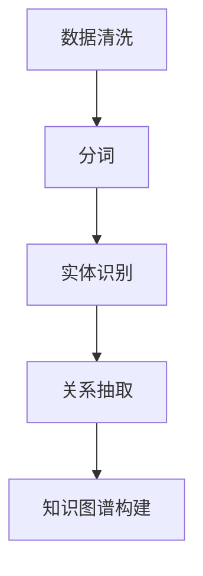
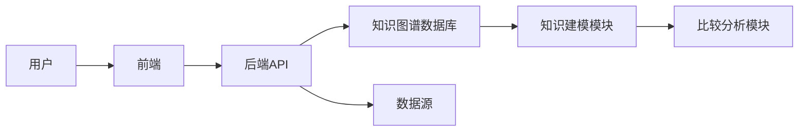
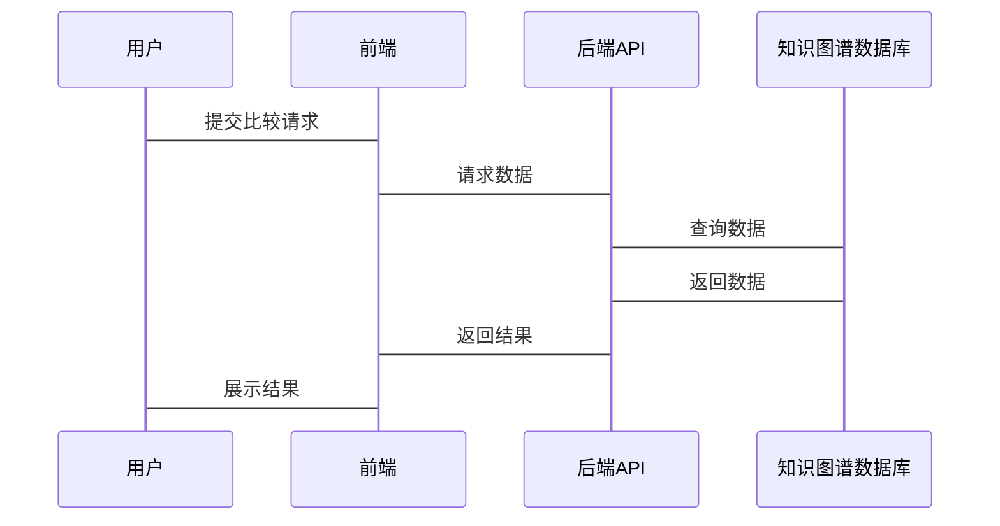

                 


# 构建基于知识图谱的金融产品比较平台

> **关键词**：知识图谱、金融产品比较、自然语言处理、图数据库、金融数据分析  
>
> **摘要**：本文将详细探讨如何基于知识图谱构建一个高效的金融产品比较平台。通过分析金融产品的核心要素、构建知识图谱的算法原理、设计系统的架构以及实现项目实战，本文旨在为读者提供一个清晰的技术实现路径。从数据采集到知识建模，再到比较分析和可视化，本文将逐步解析如何利用知识图谱技术提升金融产品比较的效率和准确性。

---

## 第一部分: 背景介绍与核心概念

### 第1章: 金融产品比较平台的背景与需求

#### 1.1 问题背景
金融市场的复杂性使得投资者在选择金融产品时面临诸多挑战。传统的产品比较方法依赖于简单的数据列表和基本指标，难以满足用户的个性化需求。投资者需要更智能的工具来帮助他们做出决策。

#### 1.2 问题描述
- **金融产品的多样性**：市场上的金融产品种类繁多，包括基金、股票、债券、保险等，每类产品的特性和风险指标各不相同。
- **用户需求的多样性**：投资者的财务目标、风险承受能力、投资期限等差异，使得他们对金融产品的关注点不同。
- **传统比较方法的局限性**：基于表格的比较方法难以处理多维度的数据，也无法捕捉产品之间的隐含关系。

#### 1.3 问题解决
知识图谱作为一种强大的知识表示和推理工具，能够将金融产品的复杂关系和属性以图的形式表示，从而为用户提供更智能的比较方法。

#### 1.4 边界与外延
- **边界**：本平台专注于金融产品的比较，不涉及具体的交易功能。
- **外延**：知识图谱的应用可以扩展到金融市场的其他领域，如风险评估和投资建议。

#### 1.5 核心要素组成
- **数据来源**：包括金融产品的基本信息、历史数据、市场分析报告等。
- **知识抽取**：从文本中提取实体、关系和属性。
- **知识建模**：构建金融产品的知识图谱。
- **比较分析**：基于知识图谱进行多维度的比较和推理。

---

### 第2章: 知识图谱的核心概念与联系

#### 2.1 核心概念原理
- **实体**：金融产品中的具体对象，如“基金”、“股票”。
- **关系**：实体之间的联系，如“基金属于股票”。
- **属性**：实体的特性，如“基金的风险等级”。

#### 2.2 概念属性特征对比表格
| 概念 | 属性 | 特征 |
|------|------|------|
| 实体 | 类型 | 基金、股票、保险 |
| 关系 | 类型 | 投资、收益、风险 |
| 属性 | 类型 | 风险等级、收益率、期限 |

#### 2.3 ER实体关系图架构
```mermaid
erDiagram
    actor 投资者 {
        <属性> 风险偏好
        <属性> 投资目标
    }
    actor 金融产品 {
        <属性> 产品类型
        <属性> 风险等级
        <属性> 收益率
    }
    actor 比较平台 {
        <属性> 用户ID
        <属性> 比较记录
    }
    投资者 --> 金融产品 : "投资"
    金融产品 --> 比较平台 : "比较"
```

---

## 第二部分: 算法原理与数学模型

### 第3章: 知识图谱构建算法原理

#### 3.1 知识抽取算法
- **分词**：将文本分割成词语或短语。
- **实体识别**：识别文本中的实体。
- **关系抽取**：识别实体之间的关系。
- **属性抽取**：提取实体的属性。

#### 3.2 知识图谱构建流程
1. 数据清洗与预处理：去除噪声数据，提取有用信息。
2. 实体识别与链接：识别文本中的实体，并建立实体之间的关联。
3. 关系抽取与建模：抽取实体之间的关系，并构建图结构。

#### 3.3 算法流程图


#### 3.4 数学模型与公式
- **实体识别概率公式**：
  $$ P(entity) = \frac{count(entity)}{total\_entities} $$
  
- **关系抽取概率公式**：
  $$ P(relation) = \frac{count(relation)}{total\_relations} $$

---

## 第三部分: 系统分析与架构设计

### 第4章: 系统功能设计与架构

#### 4.1 系统功能设计
- **数据采集模块**：从多个数据源采集金融产品数据。
- **知识建模模块**：构建金融产品的知识图谱。
- **比较分析模块**：基于知识图谱进行多维度比较。
- **可视化模块**：将比较结果可视化展示。

#### 4.2 系统架构设计


#### 4.3 系统交互设计


---

## 第四部分: 项目实战

### 第5章: 项目实现与案例分析

#### 5.1 环境安装
```bash
pip install neo4j==4.0.0
pip install spacy==3.0.0
```

#### 5.2 核心实现代码
```python
import spacy
from neo4j import GraphDatabase

# 初始化spaCy模型
nlp = spacy.load("en_core_web_sm")

# 连接Neo4j数据库
driver = GraphDatabase.driver("bolt://localhost:7687", auth=("neo4j", "password"))

def extract_entities(text):
    doc = nlp(text)
    entities = [(ent.text, ent.label_) for ent in doc.ents]
    return entities

def build_kg(entities):
    with driver.session() as session:
        for entity, label in entities:
            session.run("MATCH (n) WHERE n.name = $name AND n.label = $label CREATE (n)", {"name": entity, "label": label})
```

#### 5.3 案例分析
以基金产品为例，从数据清洗、知识建模到比较分析，详细展示如何构建和使用知识图谱进行产品比较。

---

## 第五部分: 总结与扩展阅读

### 第6章: 总结与展望

#### 6.1 总结
知识图谱为金融产品比较提供了一种高效、智能的解决方案。通过构建知识图谱，可以更好地理解金融产品的复杂关系和属性，从而为用户提供更精准的比较结果。

#### 6.2 展望
未来，知识图谱可以与其他技术（如机器学习）结合，进一步提升金融产品比较的智能化水平。

---

## 参考文献

1. Bizer, F., et al. "RDF Data Model." W3C Recommendation, 2004.
2. neo4j. "Neo4j Graph Database Documentation." Neo4j, 2023.
3. spaCy. "spaCy Documentation." spaCy, 2023.

---

## 作者

**作者：AI天才研究院/AI Genius Institute & 禅与计算机程序设计艺术 /Zen And The Art of Computer Programming**

