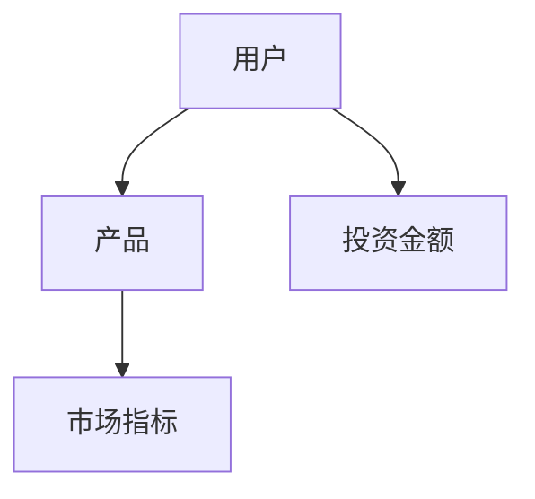
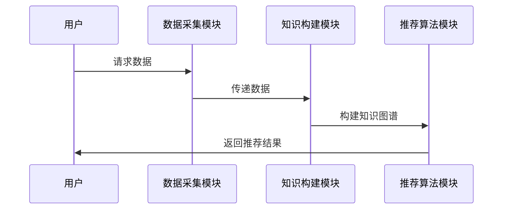

                 

# 《构建基于知识图谱的金融产品组合推荐引擎》

---

## 关键词：
知识图谱、金融推荐系统、产品组合推荐、深度学习、推荐算法

---

## 摘要：
本文详细探讨了基于知识图谱构建金融产品组合推荐引擎的核心原理与实现方法。通过分析金融推荐系统的现状与挑战，提出了结合知识图谱的解决方案，涵盖知识图谱构建、推荐算法设计、系统架构实现等多个方面。文章从理论到实践，结合具体案例，展示了如何利用知识图谱提升金融产品推荐的准确性和个性化，为读者提供了一套完整的构建方法与最佳实践。

---

## 正文：

---

## 第一部分：背景与概述

### 第1章：知识图谱与金融推荐系统概述

#### 1.1 知识图谱的基本概念
知识图谱是一种以图结构形式表示知识的工具，由实体（节点）和关系（边）组成。通过将金融领域的数据建模为知识图谱，可以更好地理解和关联各种金融产品、用户行为、市场动态等信息。

#### 1.2 金融推荐系统的基本原理
金融推荐系统旨在为用户推荐个性化的产品组合。传统的推荐系统通常基于协同过滤或基于内容的推荐，而知识图谱的引入增强了推荐系统的语义理解和关联推理能力。

#### 1.3 产品组合推荐的挑战与价值
- **挑战**：金融产品种类繁多，用户需求多样化，传统推荐方法难以满足复杂的产品组合推荐需求。
- **价值**：通过知识图谱，可以捕捉产品之间的隐含关联，提供更精准和个性化的推荐，提升用户体验和投资效率。

---

### 第2章：知识图谱在金融推荐中的应用

#### 2.1 知识图谱的构建流程
1. **数据收集**：从多种数据源（如数据库、API、文本文件）收集金融相关数据。
2. **数据清洗与抽取**：去除噪声数据，提取有用的实体和关系。
3. **知识建模**：定义实体类型（如用户、产品、市场）和关系类型（如“投资”、“关联”）。
4. **知识存储**：使用图数据库（如Neo4j）存储构建的知识图谱。

#### 2.2 知识图谱的优势
- **语义理解**：能够捕捉数据之间的语义关系，提升推荐的准确性。
- **关联推理**：通过图结构，可以发现潜在的产品关联，支持复杂的产品组合推荐。

---

## 第二部分：核心概念与原理

### 第3章：知识图谱的核心概念

#### 3.1 实体与关系
- **实体**：金融领域的实体包括用户、产品、市场指标等。
- **关系**：描述实体之间的关联，如“用户投资于产品”、“产品受市场影响”。

#### 3.2 知识图谱的表示
- 使用属性图模型（Property Graph Model）表示知识图谱，节点表示实体，边表示关系，属性表示节点和边的额外信息。

#### 3.3 实体关系对比表
| 实体类型 | 示例关系 | 示例属性 |
|----------|----------|----------|
| 用户     | 投资于     | 投资金额 |
| 产品     | 受影响于   | 风险等级 |
| 市场指标 | 影响到     | 时间戳   |

#### 3.4 知识图谱的可视化
使用Mermaid绘制知识图谱示意图：

---

### 第4章：推荐系统的核心原理

#### 4.1 协同过滤推荐
- **基于用户的协同过滤**：通过寻找与用户相似的其他用户，推荐他们喜欢的产品。
- **基于物品的协同过滤**：通过分析产品之间的相似性，推荐相关产品。

#### 4.2 基于深度学习的推荐
- **神经网络协同过滤（Neural Collaborative Filtering）**：利用深度学习模型捕捉用户和产品的非线性关系。
- **图嵌入（Graph Embedding）**：将知识图谱中的实体和关系映射为低维向量，用于推荐任务。

#### 4.3 产品组合推荐的数学模型
推荐模型可以表示为：

$$
p_{u,i} = \text{score}(u, i) = w_u \cdot w_i
$$

其中，\( u \) 是用户，\( i \) 是产品，\( w_u \) 和 \( w_i \) 分别是用户的嵌入向量和产品的嵌入向量。

---

## 第三部分：系统架构与实现

### 第5章：系统架构设计

#### 5.1 系统功能模块
- **数据采集模块**：从多种数据源采集金融数据。
- **知识构建模块**：构建和存储知识图谱。
- **推荐算法模块**：实现推荐算法，生成推荐结果。
- **用户交互模块**：与用户交互，展示推荐结果。

#### 5.2 系统架构图
使用Mermaid绘制系统架构图：

---

### 第6章：接口设计与交互流程

#### 6.1 接口设计
- **API接口**：提供RESTful API，供前端调用推荐结果。
- **数据接口**：与数据源（如数据库、第三方API）交互，获取数据。

#### 6.2 交互流程
使用Mermaid绘制交互流程图：

---

## 第四部分：项目实战

### 第7章：环境安装与数据准备

#### 7.1 环境安装
- **安装Python**：`python --version`
- **安装依赖库**：`pip install neo4j numpy pandas scikit-learn`

#### 7.2 数据准备
- 数据集：用户信息、产品信息、市场指标。
- 数据清洗：去除缺失值，处理异常值。

---

### 第8章：模型训练与推荐生成

#### 8.1 模型训练
- 使用神经网络协同过滤模型进行训练。
- 训练数据：用户-产品交互数据。
- 模型参数：嵌入维度、学习率等。

#### 8.2 推荐生成
- 对新用户或产品生成推荐列表。
- 输出结果：Top-N推荐产品。

---

## 第五部分：优化与扩展

### 第9章：性能优化

#### 9.1 算法优化
- 使用分布式训练加速模型训练。
- 采用批量处理减少计算开销。

#### 9.2 系统优化
- 使用缓存技术减少数据访问时间。
- 优化数据库查询效率。

---

### 第10章：功能扩展

#### 10.1 实时推荐
- 实现实时推荐功能，基于最新的市场动态调整推荐结果。

#### 10.2 多模态数据
- 结合文本、图像等多种数据源，提升推荐系统的多样性。

---

## 第六部分：总结与展望

### 第11章：总结

#### 11.1 核心总结
- 知识图谱为金融推荐系统提供了强大的语义理解和关联推理能力。
- 基于知识图谱的推荐引擎能够提升推荐的准确性和个性化。

#### 11.2 学习要点
- 知识图谱的构建与应用。
- 深度学习在推荐系统中的应用。
- 系统架构设计与实现。

---

### 第12章：未来展望

#### 12.1 技术发展
- 结合知识图谱和生成式AI，进一步提升推荐系统的智能化水平。
- 研究实时推荐和动态调整的技术，应对快速变化的市场环境。

#### 12.2 应用场景扩展
- 将知识图谱推荐引擎应用于更多金融场景，如风险管理、投资组合优化等。

---

## 作者：

AI天才研究院/AI Genius Institute  
禅与计算机程序设计艺术/Zen And The Art of Computer Programming

---

# 结束语：

通过本文的详细讲解，读者可以全面理解基于知识图谱的金融产品组合推荐引擎的构建过程，掌握从理论到实践的完整方法。希望本文能为金融领域的技术实践者提供有价值的参考和启示。

