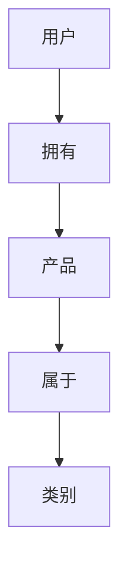

                 


# 构建基于知识图谱的金融产品适当性匹配引擎

---

## 关键词  
知识图谱，金融产品，适当性匹配，推荐引擎，机器学习，数据挖掘

---

## 摘要  
本文详细探讨了如何利用知识图谱技术构建金融产品适当性匹配引擎。通过分析金融产品推荐的痛点，提出了一种基于知识图谱的解决方案，涵盖了从数据准备到系统实现的完整流程。文章首先介绍了知识图谱的基本概念和构建方法，然后详细讲解了推荐算法的设计与实现，最后通过实际案例展示了系统的应用效果。本文旨在为金融领域的技术人员提供一套高效、智能的金融产品推荐方案。

---

# 第一部分：知识图谱与金融产品适当性匹配引擎概述

## 第1章：知识图谱与金融产品匹配的背景介绍

### 1.1 问题背景与描述  
#### 1.1.1 传统金融产品推荐的局限性  
传统推荐系统主要依赖协同过滤和基于内容的推荐算法，存在以下问题：  
1. 数据稀疏性问题：用户数据量不足时，推荐结果不够准确。  
2. 缺乏语义理解：无法深入理解金融产品的复杂关系和用户需求。  
3. 实时性不足：难以快速响应市场变化和用户需求波动。  

#### 1.1.2 知识图谱在金融领域的应用潜力  
知识图谱通过构建实体之间的语义关系，能够有效解决金融领域的复杂问题，例如：  
- 金融产品之间的关联分析。  
- 用户需求与产品特征的精准匹配。  
- 市场动态的实时更新与分析。  

#### 1.1.3 金融产品适当性匹配的核心问题  
金融产品适当性匹配的核心问题在于：如何根据用户的财务状况、风险偏好和投资目标，推荐最适合的金融产品。知识图谱通过整合产品属性、市场动态和用户特征，能够提供更精准的推荐结果。

---

## 第2章：知识图谱的核心概念与联系

### 2.1 知识图谱的基本原理  
#### 2.1.1 实体与关系的定义  
知识图谱中的核心概念包括：  
- **实体**：金融产品、用户、市场数据等。  
- **关系**：实体之间的关联，例如“产品X属于类别Y”。  

#### 2.1.2 知识图谱的构建过程  
构建知识图谱的步骤包括：  
1. 数据抽取：从结构化数据和非结构化数据中提取实体和关系。  
2. 数据融合：消除数据中的冗余和冲突。  
3. 数据推理：通过推理算法补充缺失的知识。  

#### 2.1.3 知识图谱的存储与表示  
知识图谱通常以图的形式存储，常用的数据结构包括：  
- **三元组**：(头实体, 关系, 尾实体)。  
- **属性图模型**：通过标签和属性描述实体和关系。  

### 2.2 核心概念对比分析  
#### 2.2.1 实体与属性的对比表格  
| **实体** | **属性** |  
|----------|----------|  
| 用户     | 年龄、职业、收入 |  
| 产品     | 风险等级、收益率 |  

#### 2.2.2 关系与节点的对比分析  
- **节点**：代表实体，例如用户、产品。  
- **关系**：代表实体之间的连接，例如“用户购买产品”。  

#### 2.2.3 ER实体关系图的Mermaid流程图  



---

## 第3章：算法原理与数学模型

### 3.1 知识图谱推荐算法概述  
#### 3.1.1 基于知识图谱的推荐算法  
- **基于图的最短路径算法**：通过计算用户与产品的最短路径，确定推荐顺序。  
- **基于嵌入的推荐方法**：通过深度学习模型（如TransE、GraphSAGE）生成实体嵌入，用于推荐。  

#### 3.1.2 基于图的最短路径算法  
$$ sim(i,j) = \frac{\sum_{k} r_{ik} r_{jk}}{\sqrt{\sum_{k} r_{ik}^2} \sqrt{\sum_{k} r_{jk}^2}} $$  

#### 3.1.3 混合推荐模型  
$$ final\_score = \alpha \cdot score\_cf + (1-\alpha) \cdot score\_content $$  

### 3.2 算法实现与代码示例  
#### 3.2.1 使用Python实现协同过滤算法  

```python
def compute_similarity(matrix):
    n = len(matrix)
    similarity = [[0.0]*n for _ in range(n)]
    for i in range(n):
        for j in range(n):
            if i != j:
                numerator = 0.0
                denominator_i = 0.0
                denominator_j = 0.0
                for k in range(len(matrix[i])):
                    if matrix[i][k] != 0 and matrix[j][k] != 0:
                        numerator += matrix[i][k] * matrix[j][k]
                        denominator_i += matrix[i][k] ** 2
                        denominator_j += matrix[j][k] ** 2
                if denominator_i != 0 and denominator_j != 0:
                    similarity[i][j] = numerator / (denominator_i ** 0.5 * denominator_j ** 0.5)
                else:
                    similarity[i][j] = 0.0
    return similarity
```

---

## 第4章：系统架构设计

### 4.1 系统功能模块设计  
- **数据采集模块**：从多种数据源获取金融产品和用户数据。  
- **知识构建模块**：构建知识图谱，建立实体之间的关系。  
- **推荐引擎模块**：基于知识图谱进行推荐计算。  
- **用户界面模块**：展示推荐结果并收集用户反馈。  

### 4.2 系统架构图  


---

## 第5章：项目实战

### 5.1 环境安装与数据准备  
- **环境安装**：安装必要的Python库，例如：networkx、numpy、pandas。  
- **数据准备**：收集金融产品的基础数据和用户信息。  

### 5.2 知识图谱构建与实现  
- 使用Python代码构建知识图谱：  
```python
import networkx as nx
G = nx.DiGraph()
G.add_nodes_from(["User", "Product", "Category"])
G.add_edges_from([("User", "Product"), ("Product", "Category")])
```

### 5.3 系统集成与测试  
- **系统集成**：将各个模块整合到一个完整的系统中。  
- **测试与优化**：通过测试用例验证推荐效果，并进行参数调优。  

---

## 第6章：最佳实践与总结

### 6.1 项目经验总结  
- 数据质量对推荐效果的影响至关重要。  
- 知识图谱的构建需要结合领域知识和数据特征。  

### 6.2 实际案例分析  
- 通过一个具体案例展示系统的实际应用效果。  

### 6.3 最佳实践 tips  
- 定期更新知识图谱，保持推荐的实时性。  
- 结合用户反馈，不断优化推荐算法。  

---

## 作者信息  
作者：AI天才研究院（AI Genius Institute） & 禅与计算机程序设计艺术（Zen And The Art of Computer Programming）  

--- 

**注**：以上内容仅为目录大纲，实际文章将包含完整的章节内容和详细的代码实现。

