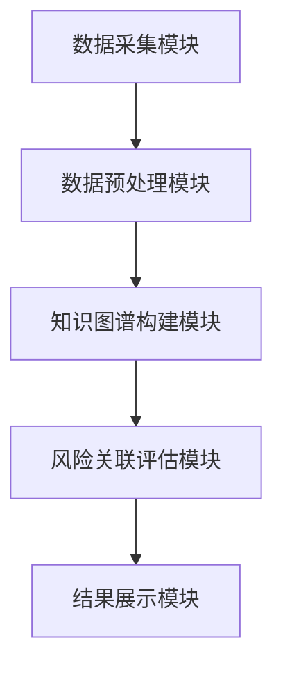

                 


# 构建基于知识图谱的金融产品风险关联评估系统

**关键词**：知识图谱、金融产品、风险关联评估、图嵌入算法、系统架构设计

**摘要**：本文系统地探讨了如何利用知识图谱构建金融产品风险关联评估系统。通过分析现有风险评估方法的局限性，本文提出了基于知识图谱的解决方案，详细阐述了知识图谱构建、风险关联规则挖掘、系统架构设计及项目实现的关键步骤。文章内容涵盖背景介绍、核心概念、算法原理、系统分析、项目实战及总结与展望，旨在为金融行业的风险管理和决策提供新的思路。

---

## 第一部分：背景介绍与核心概念

### 第1章：知识图谱与金融产品风险关联评估概述

#### 1.1 知识图谱的基本概念
知识图谱是一种以图结构形式表示知识的语义网络，由节点（实体）和边（关系）组成。它能够将分散的数据通过语义关联起来，形成一个可计算的知识网络。在金融领域，知识图谱可以帮助我们发现金融产品之间的隐含关联，从而更好地评估和管理风险。

#### 1.2 金融产品风险关联评估的背景与意义
金融产品的风险通常具有复杂性和关联性的特点。传统的基于单个金融产品的孤立分析方法难以捕捉产品之间的相互影响。通过构建知识图谱，我们可以将金融产品、市场环境、历史事件等多维度的信息整合起来，从而更全面地评估风险关联。

#### 1.3 知识图谱在金融领域的应用前景
知识图谱在金融领域的应用前景广阔。它可以用于金融产品推荐、风险预警、投资组合优化等领域。特别是在风险关联评估方面，知识图谱能够帮助我们发现隐藏的风险因素和关联路径，从而提高风险评估的准确性和全面性。

### 第2章：核心概念与联系

#### 2.1 核心概念原理
知识图谱的构建过程包括数据预处理、实体识别、关系抽取和知识表示等步骤。在金融产品风险关联评估中，我们需要将金融产品、市场数据、历史事件等信息转化为知识图谱中的实体和关系。

#### 2.2 概念属性特征对比
下表对比了知识图谱与传统数据库在金融产品风险评估中的应用特点：

| 特性                | 知识图谱               | 传统数据库           |
|---------------------|-----------------------|----------------------|
| 数据结构           | 图结构，支持复杂关联  | 行列结构，关系有限    |
| 关联性分析能力     | 强，支持语义关联       | 弱，仅支持简单关联    |
| 数据处理能力       | 高，支持异构数据       | 低，数据结构固定      |

#### 2.3 ER实体关系图
下图展示了金融产品风险关联评估系统中的实体关系：

```mermaid
er
actor: 金融机构
actor
  has: 金融产品
  has: 风险事件
  has: 关联关系
```

---

## 第二部分：算法原理与数学模型

### 第3章：知识图谱构建算法

#### 3.1 图嵌入算法
图嵌入算法是将图结构数据转换为低维向量表示的方法。常用算法包括TransE、TransH等。

##### 3.1.1 TransE算法原理
TransE是一种基于翻译的嵌入模型，其核心思想是将边关系看作是从头节点到尾节点的“翻译”。其损失函数定义如下：

$$ L = \sum_{(h,r,t) \in \mathcal{T}} \left( \|e_h + e_r - e_t\|_p\right)$$

其中，$\mathcal{T}$是训练数据集，$e_h$、$e_r$、$e_t$分别是头节点、关系和尾节点的嵌入向量。

##### 3.1.2 TransH算法原理
TransH是TransE的改进版本，它引入了关系嵌入，并将头节点和尾节点的嵌入分开。其损失函数为：

$$ L = \sum_{(h,r,t) \in \mathcal{T}} \left( \|e_h + e_r - e_t\|_p\right)$$

TransH能够更好地捕捉关系的语义信息。

##### 3.1.3 算法对比与适用场景
TransE适用于简单的父子关系，而TransH更适合复杂的多关系场景。在金融领域，TransH更适合用于风险关联评估，因为它能够捕捉不同关系的语义信息。

#### 3.2 知识图谱构建流程
知识图谱的构建流程包括以下几个步骤：
1. 数据预处理：清洗和整合多源数据。
2. 实体识别与关系抽取：从文本中提取实体及其关系。
3. 知识图谱存储与优化：使用图数据库存储并优化查询性能。

#### 3.3 算法实现代码
以下是TransE算法的Python实现示例：

```python
class TransE:
    def __init__(self, entities, relations):
        self.entities = entities
        self.relations = relations
        # 初始化模型参数
        self嵌入向量 = ...  # 初始化嵌入向量
```

---

## 第三部分：系统分析与架构设计

### 第4章：系统分析与架构设计

#### 4.1 问题场景介绍
在金融产品风险关联评估中，我们需要处理海量的金融数据，包括金融产品信息、市场数据、历史事件等。传统的基于单个金融产品的风险评估方法难以捕捉产品之间的相互影响。

#### 4.2 项目介绍
本项目旨在构建一个基于知识图谱的金融产品风险关联评估系统，通过整合多源数据，构建知识图谱，并利用图嵌入算法进行风险关联评估。

#### 4.3 系统功能设计
系统功能设计包括数据采集、知识图谱构建、风险关联评估和结果展示。

#### 4.4 系统架构设计
下图展示了系统的架构设计：



#### 4.5 系统接口设计
系统接口设计包括数据接口、模型接口和用户接口。

#### 4.6 系统交互设计
下图展示了系统的交互流程：

```mermaid
sequenceDiagram
    actor 用户
    节点 数据采集模块
    节点 数据预处理模块
    节点 知识图谱构建模块
    节点 风险关联评估模块
    节点 结果展示模块
    用户 -> 数据采集模块: 提交数据采集请求
    数据采集模块 -> 数据预处理模块: 提交数据
    数据预处理模块 -> 知识图谱构建模块: 提交处理后的数据
    知识图谱构建模块 -> 风险关联评估模块: 提交知识图谱
    风险关联评估模块 -> 结果展示模块: 提交评估结果
    结果展示模块 -> 用户: 显示评估结果
```

---

## 第四部分：项目实战

### 第5章：项目实战

#### 5.1 环境安装
需要安装的知识图谱构建工具和深度学习框架，例如：
- 图数据库：Neo4j
- 深度学习框架：TensorFlow、PyTorch

#### 5.2 核心代码实现
以下是风险关联评估模块的核心代码：

```python
class RiskAssociationEvaluator:
    def __init__(self, knowledge_graph):
        self.knowledge_graph = knowledge_graph
        # 初始化评估模型
        self.评估模型 = ...  # 初始化评估模型
```

#### 5.3 代码解读与分析
代码通过知识图谱中的实体和关系，利用图嵌入算法计算金融产品之间的关联性，并评估风险。

#### 5.4 实际案例分析
通过具体案例分析，展示系统在实际应用中的效果和优势。

#### 5.5 项目小结
总结项目实施过程中的经验和教训，提出改进建议。

---

## 第五部分：总结与展望

### 第6章：总结与展望

#### 6.1 系统总结
总结系统的主要功能、优势和局限性。

#### 6.2 优缺点分析
分析系统在实际应用中的优缺点。

#### 6.3 改进建议
提出改进建议，例如优化算法、增加数据源等。

#### 6.4 未来展望
展望未来的发展方向，例如知识图谱的动态更新、多模态数据的融合等。

---

**作者：AI天才研究院/AI Genius Institute & 禅与计算机程序设计艺术 /Zen And The Art of Computer Programming**

