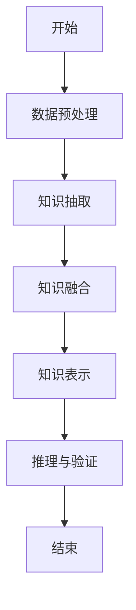
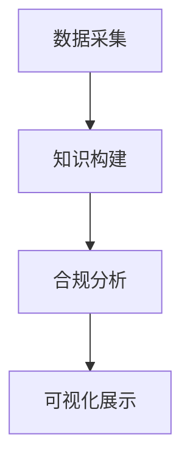
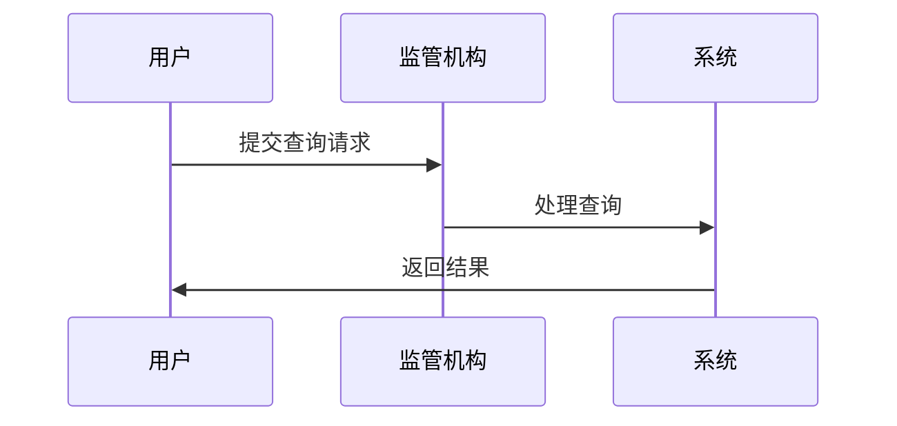

                 


# 构建基于知识图谱的金融监管合规追踪系统

## 关键词：知识图谱、金融监管、合规追踪、系统架构、算法原理、项目实战

## 摘要：本文详细探讨了如何构建基于知识图谱的金融监管合规追踪系统。首先，从背景和问题背景出发，分析了知识图谱在金融监管中的应用价值和必要性。接着，介绍了知识图谱的核心概念和构建原理，包括知识抽取、表示和推理等关键步骤。随后，详细阐述了系统架构设计，包括功能设计、系统架构和接口设计。最后，通过项目实战部分，展示了系统的核心代码实现和实际应用案例。本文还总结了系统构建的最佳实践和未来展望。

---

# 第1章: 知识图谱与金融监管合规追踪系统背景

## 1.1 知识图谱的定义与特点

### 1.1.1 知识图谱的定义

知识图谱是一种以图结构形式表示知识的语义网络，其中节点表示实体或概念，边表示实体之间的关系。

### 1.1.2 知识图谱的核心特点

知识图谱具有语义性、连通性和可扩展性等特点，能够帮助机器理解和推理知识。

### 1.1.3 知识图谱与传统数据库的对比

| 特征 | 知识图谱 | 传统数据库 |
|------|----------|-------------|
| 数据结构 | 图结构 | 行列结构 |
| 表达能力 | 强语义关联 | 基础查询 |
| 查询效率 | 较低 | 较高 |

## 1.2 金融监管与合规追踪的背景

### 1.2.1 金融监管的核心目标

确保金融市场的公平、透明和合规，保护投资者利益，维护金融稳定。

### 1.2.2 合规追踪的必要性

金融交易中的合规性是监管机构关注的重点，合规追踪能够及时发现和处理违规行为。

### 1.2.3 金融监管中的痛点与挑战

数据分散、关联性弱、监管效率低、人工成本高等问题亟待解决。

## 1.3 问题背景与解决方案

### 1.3.1 问题背景分析

金融监管中的信息孤岛和数据碎片化问题严重，难以实现高效的合规追踪。

### 1.3.2 知识图谱在金融监管中的应用价值

知识图谱能够通过语义关联和实体识别，帮助构建完整的监管知识网络。

### 1.3.3 系统建设的目标与意义

目标是构建一个智能化的合规追踪系统，意义在于提升监管效率和准确性。

## 1.4 知识图谱与金融监管的结合

### 1.4.1 知识图谱在金融监管中的应用场景

包括风险预警、关联交易分析、合规审计等。

### 1.4.2 知识图谱的核心要素与系统架构

核心要素包括实体、关系、属性和语义规则。

### 1.4.3 系统的边界与外延

系统边界包括数据采集、知识构建和应用层，外延涉及数据源和用户交互。

## 1.5 本章小结

本章介绍了知识图谱的基本概念和特点，分析了金融监管中的痛点，并提出了基于知识图谱的解决方案。

---

# 第2章: 知识图谱构建的核心概念与联系

## 2.1 知识图谱构建的原理

### 2.1.1 知识抽取与表示

通过自然语言处理技术从文本中提取实体、关系和属性。

### 2.1.2 知识融合与推理

将多个数据源中的知识进行整合，并通过推理技术完善知识图谱。

### 2.1.3 知识图谱的存储与管理

使用图数据库或知识库管理系统进行存储和管理。

## 2.2 核心概念的属性特征对比

### 2.2.1 知识图谱与传统数据库的特征对比

如前所述，知识图谱具有语义性和图结构特点。

### 2.2.2 实体与关系的属性特征

实体具有唯一标识符和属性，关系具有类型和方向。

### 2.2.3 知识图谱的语义网络特征

知识图谱通过语义关联构建网络，支持复杂关系推理。

## 2.3 ER实体关系图架构

```mermaid
erDiagram
    actor 用户 {
        +string 用户ID
        +string 用户名
        +string 密码
    }
    actor 监管机构 {
        +string 机构ID
        +string 机构名称
    }
    entity 实体 {
        +string 实体ID
        +string 实体类型
        +string 实体名称
    }
    entity 关系 {
        +string 关系ID
        +string 关系类型
        +string 关系描述
    }
    用户 --> 实体 : 操作
    监管机构 --> 实体 : 监管
    实体 --> 关系 : 关联
```

## 2.4 本章小结

本章详细介绍了知识图谱的构建原理和核心概念，并通过ER图展示了实体关系架构。

---

# 第3章: 知识图谱构建的算法原理

## 3.1 知识抽取算法

### 3.1.1 基于规则的抽取

使用正则表达式或模板匹配特定模式。

### 3.1.2 基于统计的抽取

利用统计学习模型进行模式识别。

### 3.1.3 基于深度学习的抽取

使用神经网络模型如LSTM进行实体识别。

## 3.2 知识表示与推理

### 3.2.1 知识表示模型

包括向量表示和符号表示。

### 3.2.2 知识推理算法

如基于规则的推理和基于学习的推理。

## 3.3 算法流程图



## 3.4 数学模型与公式

### 3.4.1 表示学习模型

$$ E(e_i) = \text{sum}(e_i \cdot w) $$

### 3.4.2 推理模型

$$ P(h, r, t) = f(h, r, t) $$

## 3.5 本章小结

本章介绍了知识图谱构建中的关键算法和数学模型，并通过流程图展示了构建过程。

---

# 第4章: 系统分析与架构设计方案

## 4.1 问题场景介绍

金融监管中的合规追踪需求和现有系统的不足。

## 4.2 项目介绍

### 4.2.1 项目目标

构建一个基于知识图谱的合规追踪系统。

### 4.2.2 项目范围

覆盖金融交易数据、实体关系和合规规则。

## 4.3 系统功能设计

### 4.3.1 功能模块

包括数据采集、知识构建、合规分析和可视化展示。

### 4.3.2 功能流程图



## 4.4 系统架构设计

### 4.4.1 架构类型

采用分层架构，包括数据层、知识层和应用层。

### 4.4.2 架构图


## 4.5 系统接口设计

### 4.5.1 API设计

包括数据接口和查询接口。

### 4.5.2 接口交互图



## 4.6 本章小结

本章分析了系统的需求，设计了功能模块和系统架构，并展示了接口交互流程。

---

# 第5章: 项目实战

## 5.1 环境安装

### 5.1.1 系统需求

安装Python、图数据库和相关库。

## 5.2 系统核心实现

### 5.2.1 数据采集代码

```python
import requests
from bs4 import BeautifulSoup

url = 'http://example.com/data'
response = requests.get(url)
data = response.text
```

### 5.2.2 知识构建代码

```python
from py2neo import Graph, Node, Relationship

graph = Graph('http://localhost:7474', auth=('user', 'password'))
node1 = Node('Entity', name='监管机构')
node2 = Node('Entity', name='交易主体')
graph.create(Relationship(node1, 'REGULATES', node2))
```

## 5.3 案例分析与应用

### 5.3.1 案例分析

分析一笔关联交易，发现潜在合规风险。

### 5.3.2 实际应用效果

提升监管效率和准确性，降低人工成本。

## 5.4 系统优化

### 5.4.1 性能优化

优化数据存储和查询效率。

### 5.4.2 功能扩展

增加更多监管场景和分析功能。

## 5.5 本章小结

本章通过实际案例展示了系统的核心实现和应用效果。

---

# 第6章: 总结与展望

## 6.1 总结

### 6.1.1 核心内容回顾

构建基于知识图谱的合规追踪系统的全过程。

### 6.1.2 实践中的经验和教训

系统构建中的挑战和解决方法。

## 6.2 最佳实践 tips

### 6.2.1 系统设计

模块化设计和分层架构。

### 6.2.2 开发建议

使用成熟的工具和库，注重数据质量和接口设计。

## 6.3 未来展望

### 6.3.1 技术发展

人工智能和大数据技术的进一步融合。

### 6.3.2 应用场景扩展

更多金融监管领域的应用。

## 6.4 本章小结

本章总结了系统的构建过程，提出了改进建议，并展望了未来的发展方向。

---

# 作者：AI天才研究院/AI Genius Institute & 禅与计算机程序设计艺术 /Zen And The Art of Computer Programming

---

**注意**：以上目录大纲内容仅为示例，实际文章需要根据具体需求进行详细撰写和调整，以确保内容的完整性和专业性。

