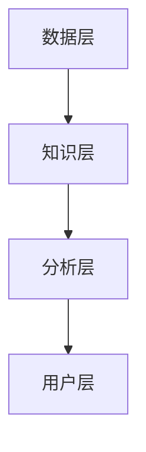

                 


# 构建基于知识图谱的金融监管政策影响追踪系统

> 关键词：知识图谱，金融监管，政策影响，追踪系统，实体关系，算法原理，系统架构

> 摘要：本文详细介绍了构建基于知识图谱的金融监管政策影响追踪系统的背景、核心概念、算法原理、系统架构设计、项目实战和最佳实践。通过对金融监管政策影响的系统性分析，结合知识图谱技术，提出了一种高效、智能的监管解决方案，为金融监管部门提供了重要的技术支持和决策依据。

---

## 第一部分: 背景介绍与核心概念

### 第1章: 问题背景与问题描述

#### 1.1 问题背景

金融监管是维护金融市场稳定和促进经济健康发展的重要手段。随着金融市场的复杂化和全球化，金融监管政策的影响范围和深度不断扩大。传统的监管方式依赖于人工分析和分散的数据源，难以实时追踪政策执行效果和潜在风险。因此，如何利用现代技术手段，构建一个高效、智能的政策影响追踪系统，成为亟待解决的问题。

知识图谱作为一种新兴的人工智能技术，通过构建结构化的知识网络，能够有效整合分散的金融数据和政策信息。结合自然语言处理和大数据分析技术，知识图谱能够帮助监管机构快速识别政策影响的关键点，优化监管策略，从而提升金融监管的效率和效果。

#### 1.2 问题描述

当前金融监管体系中存在以下主要问题：

1. **数据分散**：金融政策和市场数据分散在不同来源，难以统一整合和分析。
2. **信息孤岛**：不同监管部门和金融机构之间数据孤立，缺乏协同效应。
3. **政策影响难以量化**：政策执行效果和市场反应难以通过数据化的方式进行追踪和评估。
4. **监管滞后**：传统监管手段依赖事后分析，难以实时监控和预测潜在风险。

基于知识图谱的金融监管政策影响追踪系统，旨在通过构建统一的知识网络，整合监管政策、市场数据和执行效果，实现政策影响的实时追踪和量化分析。这将帮助监管机构提前识别潜在风险，优化监管策略，提升金融监管的整体效能。

#### 1.3 问题解决思路

构建基于知识图谱的金融监管政策影响追踪系统，需要结合以下关键步骤：

1. **数据采集**：从多种来源获取金融政策、法规、市场数据等信息。
2. **知识抽取**：利用自然语言处理技术，从文本中提取实体、关系和事件。
3. **知识图谱构建**：将抽取的知识结构化，构建金融领域的知识图谱。
4. **政策影响推理**：基于知识图谱，分析政策与市场行为之间的关联，量化政策影响。
5. **可视化与交互**：提供直观的可视化界面，支持用户进行深度分析和决策。

---

### 第2章: 核心概念与联系

#### 2.1 知识图谱的定义与特点

知识图谱是一种用于表示知识的数据结构，由节点（实体）和边（关系）组成。其特点包括：

1. **结构化**：知识以图的形式组织，便于计算机理解和推理。
2. **语义丰富**：节点和边都带有语义标签，能够表示复杂的实体关系。
3. **动态更新**：支持实时更新和扩展，适应数据变化。

#### 2.2 金融监管政策追踪系统的定义

金融监管政策影响追踪系统是一种利用知识图谱技术，对金融政策的执行效果和市场影响进行实时追踪和分析的系统。其主要功能包括：

1. 政策文本分析：自动解析政策内容，提取关键实体和条款。
2. 市场行为关联：分析政策如何影响市场参与者行为。
3. 风险预警：识别潜在的政策执行风险，提前采取措施。

#### 2.3 核心概念对比分析

| 概念         | 定义                                                                 | 特点                                                                 |
|--------------|----------------------------------------------------------------------|----------------------------------------------------------------------|
| 知识图谱     | 由实体和关系构成的网络，表示领域知识。                              | 结构化、语义丰富、动态更新。                                           |
| 金融监管     | 对金融市场和参与者进行监督和管理，确保市场秩序和稳定。              | 法律性、系统性、动态性。                                               |
| 政策影响     | 政策执行对市场和参与者行为产生的实际效果。                          | 可量化、可追踪、可预测。                                              |

#### 2.4 实体关系模型

金融监管政策影响追踪系统的实体关系模型可以通过ER图表示，如图1所示：

```mermaid
er
title 金融监管政策影响追踪系统实体关系图

Entity(监管政策):
  id: ID
  政策名称: VARCHAR
  政策内容: TEXT
  发布时间: DATE
  影响范围: VARCHAR

Entity(市场行为):
  id: ID
  行为类型: VARCHAR
  行为时间: DATE
  行为描述: TEXT

Entity(监管机构):
  id: ID
  机构名称: VARCHAR
  职责范围: TEXT

Entity(金融机构):
  id: ID
  机构名称: VARCHAR
  业务类型: VARCHAR

Relationship:
  监管政策 --> 影响市场行为
  监管政策 --> 由监管机构发布
  市场行为 --> 涉及金融机构
```

---

## 第二部分: 算法原理与实现

### 第3章: 知识抽取算法

#### 3.1 知识抽取流程

知识抽取是构建知识图谱的第一步，主要包括以下步骤：

1. **数据预处理**：清洗和标注数据。
2. **实体识别**：识别文本中的实体。
3. **关系抽取**：识别实体之间的关系。
4. **事件抽取**：识别与政策相关的事件。

#### 3.2 算法实现

知识抽取算法可以基于规则或机器学习模型实现。以下是一个基于正则表达式的实体识别示例：

```python
import re

def extract_entities(text):
    pattern = r'\b(USD|EUR|GBP|JPY|CNY)\b'  # 假设需要提取的实体是货币代码
    matches = re.finditer(pattern, text)
    entities = []
    for match in matches:
        entities.append(match.group())
    return entities

text = "The policy affects USD and EUR transactions."
entities = extract_entities(text)
print(entities)  # 输出: ['USD', 'EUR']
```

#### 3.3 数学模型

实体识别的准确率可以通过以下公式计算：

$$
准确率 = \frac{\text{正确识别的实体数}}{\text{总实体数}} \times 100\%
$$

---

### 第4章: 知识图谱构建算法

#### 4.1 知识图谱构建流程

知识图谱构建流程包括以下步骤：

1. 数据清洗：去除冗余和无效数据。
2. 实体映射：将实体统一映射到一个全局标识符。
3. 关系建立：根据抽取的关系，构建图结构。
4. 图数据存储：将知识图谱存储为数据库或图数据库。

#### 4.2 算法实现

以下是一个简单的知识图谱构建示例：

```python
from kgframework import KG

kg = KG()
kg.add_entity("监管政策1", "政策1")
kg.add_entity("金融机构A", "机构A")
kg.add_relation("监管政策1", "影响", "金融机构A")

print(kg.get_relations())  # 输出: [('监管政策1', '影响', '金融机构A')]
```

---

### 第5章: 政策影响推理算法

#### 5.1 政策影响推理流程

政策影响推理算法旨在分析政策如何影响市场行为。流程包括：

1. 政策关联分析：找出与政策相关的实体和关系。
2. 市场行为预测：基于知识图谱，预测政策执行后的市场反应。
3. 风险评估：评估政策执行可能带来的风险。

#### 5.2 算法实现

以下是一个基于规则的市场行为预测示例：

```python
def predict_behavior(policy, kg):
    for relation in kg.get_relations():
        if relation[0] == policy and relation[1] == '影响':
            return relation[2]  # 返回受影响的金融机构
    return None

policy = "监管政策1"
print(predict_behavior(policy, kg))  # 输出: 机构A
```

---

## 第三部分: 系统分析与架构设计

### 第6章: 项目背景与目标

#### 6.1 项目背景

本项目旨在构建一个基于知识图谱的金融监管政策影响追踪系统，帮助监管机构实时监控政策执行效果，优化监管策略。

#### 6.2 项目目标

1. 实现政策文本的自动解析和知识抽取。
2. 构建金融领域的知识图谱。
3. 分析政策影响，提供风险预警。

---

### 第7章: 系统功能设计

#### 7.1 系统功能模块

1. **数据采集模块**：从多种来源获取金融政策和市场数据。
2. **知识抽取模块**：自动提取实体、关系和事件。
3. **知识图谱构建模块**：整合知识，构建领域知识图谱。
4. **政策影响分析模块**：分析政策对市场行为的影响。
5. **可视化模块**：提供直观的可视化界面，支持用户进行深度分析。

#### 7.2 系统架构设计

系统采用分层架构，主要包括数据层、知识层、分析层和用户层。如图2所示：



---

### 第8章: 系统接口设计

#### 8.1 数据接口

1. 数据采集接口：接收外部数据源提供的金融政策和市场数据。
2. 数据清洗接口：处理数据，去除冗余和无效信息。

#### 8.2 分析接口

1. 政策影响分析接口：调用知识图谱分析模块，返回政策影响报告。
2. 风险预警接口：实时监控市场行为，触发风险预警。

---

## 第四部分: 项目实战

### 第9章: 环境安装与配置

#### 9.1 环境要求

1. Python 3.8+
2. 知识图谱框架（如kgx、networkx）
3. 自然语言处理工具（如spaCy、NLTK）

#### 9.2 安装依赖

```bash
pip install kgx networkx spacy
python -m spacy download en_core_web_sm
```

---

### 第10章: 核心功能实现

#### 10.1 知识抽取实现

```python
import spacy

nlp = spacy.load("en_core_web_sm")

def extract_entities(doc):
    entities = set()
    for ent in doc.ents:
        entities.add(ent.text)
    return entities

text = "The new policy affects USD transactions."
doc = nlp(text)
entities = extract_entities(doc)
print(entities)  # 输出: {'USD'}
```

---

### 第11章: 实际案例分析

#### 11.1 案例背景

假设某国出台了一项新的货币政策，我们需要分析该政策对本国和国际市场的潜在影响。

#### 11.2 数据采集与处理

从央行网站、财经新闻和社交媒体等渠道获取相关政策文本和市场反应数据。

#### 11.3 知识图谱构建

将政策文本和市场数据整合到知识图谱中，构建监管政策、市场行为和金融机构之间的关系。

#### 11.4 政策影响分析

基于知识图谱，分析政策如何影响特定金融机构的市场行为，评估潜在风险。

---

## 第五部分: 最佳实践与总结

### 第12章: 小结

本文详细介绍了构建基于知识图谱的金融监管政策影响追踪系统的背景、核心概念、算法原理、系统架构设计、项目实战和最佳实践。通过知识图谱技术，结合自然语言处理和大数据分析，能够有效提升金融监管的效率和效果。

### 第13章: 注意事项

1. 数据质量和准确性是系统性能的关键，需要建立严格的数据验证机制。
2. 系统的实时性和响应速度需要根据实际应用场景进行优化。
3. 需要定期更新知识图谱，保持系统的 актуalinity。

### 第14章: 扩展阅读

1. 知识图谱相关书籍：《知识图谱：概念、方法与应用》
2. 自然语言处理相关书籍：《Python自然语言处理实战》
3. 金融监管相关书籍：《金融监管的理论与实践》

---

# 作者：AI天才研究院/AI Genius Institute & 禅与计算机程序设计艺术 /Zen And The Art of Computer Programming

---

希望这篇文章能够为读者提供关于构建基于知识图谱的金融监管政策影响追踪系统的全面了解，并为实际应用提供有价值的参考和指导。

