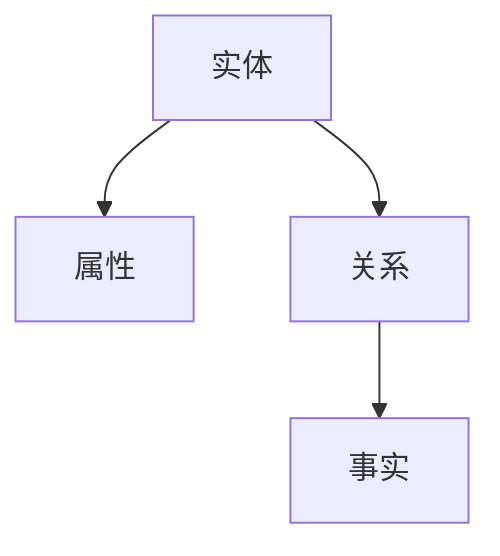
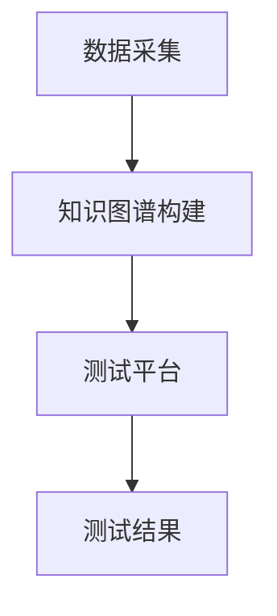

                 

# 构建基于知识图谱的金融监管沙盒测试平台

## 关键词：知识图谱，金融监管，沙盒测试，人工智能，金融创新

## 摘要：本文详细介绍了如何构建基于知识图谱的金融监管沙盒测试平台，从知识图谱和金融监管沙盒的基本概念出发，分析了两者的关联与区别，探讨了构建该平台的核心算法、系统架构设计以及实际项目实现。通过对比分析和具体案例，展示了如何利用知识图谱技术提升金融监管效率和创新性。

---

## 第一部分：知识图谱与金融监管沙盒概述

### 第1章：知识图谱与金融监管沙盒的背景与概念

#### 1.1 知识图谱的定义与特点

知识图谱是一种以图结构形式表示知识的语义网络，节点表示实体或概念，边表示实体之间的关系。其特点包括：

- **语义丰富性**：通过实体间的关系，构建复杂的语义网络。
- **可扩展性**：支持多源数据的融合，便于扩展。
- **动态更新**：能够实时更新，保持知识的时效性。

#### 1.2 金融监管沙盒的定义与特点

金融监管沙盒是一种虚拟环境，允许金融机构在受控环境中测试新产品或服务，特点包括：

- **隔离性**：确保测试环境与真实环境隔离，降低风险。
- **可监控性**：实时监控测试过程，确保合规性。
- **可定制性**：支持多种金融业务场景的测试。

#### 1.3 知识图谱在金融监管中的作用

知识图谱通过关联分析，帮助识别潜在风险，辅助监管决策，提升监管效率。

---

### 第2章：知识图谱与金融监管沙盒的核心概念

#### 2.1 知识图谱的核心概念

- **实体与属性**：如“公司”这一实体，属性包括公司名称、注册资本等。
- **关系与事实**：如“公司A收购公司B”，表示两个实体之间的关系。

#### 2.2 金融监管沙盒的核心概念

- **沙盒环境**：模拟真实环境，用于测试新业务。
- **测试用例**：定义测试场景，评估产品合规性。

#### 2.3 知识图谱与金融监管沙盒的关联

通过知识图谱构建监管规则的知识网络，辅助沙盒环境中的风险评估。

---

## 第二部分：知识图谱与金融监管沙盒的核心概念对比与联系

### 第3章：知识图谱与金融监管沙盒的核心概念对比与联系

#### 3.1 知识图谱与金融监管沙盒的对比

| 概念 | 知识图谱 | 金融监管沙盒 |
|------|----------|--------------|
| 核心目标 | 表示知识关联 | 支持金融创新测试 |
| 数据来源 | 多源异构数据 | 金融机构业务数据 |

#### 3.2 知识图谱与金融监管沙盒的实体关系图

#### 3.3 知识图谱与金融监管沙盒的概念属性对比表

| 概念 | 知识图谱 | 金融监管沙盒 |
|------|----------|--------------|
| 核心目标 | 表示知识关联 | 支持金融创新测试 |
| 数据来源 | 多源异构数据 | 金融机构业务数据 |
| 应用场景 | 智能搜索、推荐 | 金融产品测试、风险评估 |

---

## 第三部分：知识图谱与金融监管沙盒的算法原理

### 第4章：知识图谱与金融监管沙盒的算法原理

#### 4.1 知识图谱构建算法

- **实体识别**：使用自然语言处理技术，从文本中提取实体。
- **关系抽取**：识别实体之间的关系，如“收购”、“投资”等。

#### 4.2 知识图谱推理

通过图结构推理，发现隐含的知识，辅助监管决策。

---

## 第四部分：知识图谱与金融监管沙盒的系统架构设计

### 第5章：系统架构设计

#### 5.1 问题场景介绍

金融监管沙盒测试平台需要支持金融机构在受控环境中测试新产品，同时利用知识图谱进行风险评估。

#### 5.2 系统功能设计

- **数据采集模块**：收集金融机构业务数据。
- **知识图谱构建模块**：构建监管知识图谱。
- **测试平台模块**：提供测试环境和用例管理。

#### 5.3 系统架构图

---

## 第五部分：知识图谱与金融监管沙盒的项目实战

### 第6章：项目实战

#### 6.1 环境安装

- 安装Python和相关库，如jieba、networkx。

#### 6.2 核心实现

- 数据预处理：清洗和结构化数据。
- 知识图谱构建：提取实体和关系，构建图结构。

#### 6.3 实际案例分析

通过案例分析，展示如何利用知识图谱进行金融产品合规性测试。

---

## 第六部分：总结与展望

### 第7章：总结与展望

#### 7.1 总结

知识图谱与金融监管沙盒的结合，能够提升金融监管效率和创新能力。

#### 7.2 小结

通过构建知识图谱，金融监管沙盒测试平台能够更好地支持金融机构的创新和风险控制。

#### 7.3 注意事项

- 数据隐私保护
- 知识图谱的动态更新

#### 7.4 拓展阅读

推荐相关书籍和论文，深入学习知识图谱和金融监管技术。

---

## 作者：AI天才研究院 & 禅与计算机程序设计艺术

感谢您的阅读！希望本文能为构建基于知识图谱的金融监管沙盒测试平台提供有价值的参考。

