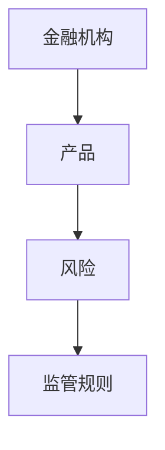
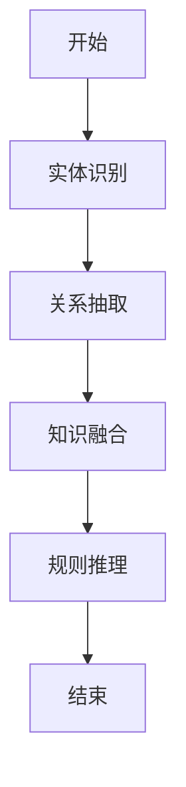
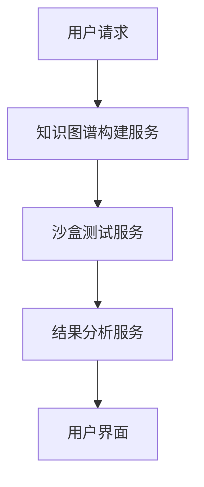

                 


# 构建基于知识图谱的金融监管沙盒测试结果分析平台

> 关键词：知识图谱、金融监管、监管沙盒、测试结果分析、人工智能

> 摘要：本文详细探讨了如何利用知识图谱技术构建金融监管沙盒测试结果分析平台。文章首先介绍了金融监管沙盒的背景和知识图谱的核心概念，然后分析了平台的算法原理、系统架构设计、项目实战及最佳实践，最后总结了平台的优势和未来发展方向。

---

# 第1章 问题背景与核心概念

## 1.1 问题背景

### 1.1.1 金融监管的重要性
金融监管是维护金融市场稳定、保护投资者利益的重要手段。随着金融创新的加速，传统的监管方式已难以应对复杂多变的金融环境。

### 1.1.2 当前监管中的痛点
- 数据孤岛：金融机构之间的数据难以互联互通。
- 监管滞后：传统监管方式无法及时发现风险。
- 知识碎片化：监管信息分散，难以系统化分析。

### 1.1.3 知识图谱的应用潜力
知识图谱是一种结构化的数据表示方式，能够将分散的知识点连接起来，形成一个可计算的网络，为金融监管提供强大的技术支持。

---

## 1.2 核心概念与联系

### 1.2.1 知识图谱的定义与特点
- **定义**：知识图谱是一种以图结构形式表示知识的数据库，由实体（节点）和关系（边）组成。
- **特点**：结构化、语义化、可扩展。

### 1.2.2 金融监管沙盒的概念
- **定义**：一种创新监管工具，允许金融机构在受控环境中测试新产品和服务。
- **特点**：风险可控、数据隔离、结果可追溯。

### 1.2.3 核心概念对比

| **概念** | **知识图谱** | **金融监管沙盒** |
|----------|--------------|-------------------|
| **核心要素** | 实体、关系、属性 | 测试环境、监管规则、风险评估 |
| **目标** | 统一数据表示 | 创新监管与风险控制 |

---

## 1.3 知识图谱与金融监管沙盒的结合

### 1.3.1 知识图谱在金融监管中的作用
- **数据整合**：统一金融机构的分散数据。
- **关系推理**：发现隐藏的关联，辅助监管决策。
- **实时分析**：快速响应风险事件。

### 1.3.2 实体关系图



---

# 第2章 算法原理与数学模型

## 2.1 知识图谱的构建算法

### 2.1.1 实体识别与抽取
- **方法**：基于自然语言处理（NLP）技术，从文本中提取实体。
- **示例**：从新闻中提取“中国银行”作为实体。

### 2.1.2 关系抽取与推理
- **方法**：基于规则或深度学习模型，识别实体之间的关系。
- **示例**：识别“中国银行”与“理财产品”之间的“提供”关系。

### 2.1.3 知识融合
- **方法**：将多个来源的知识整合到一个图中，消除冲突。

---

## 2.2 监管规则推理算法

### 2.2.1 基于图的最短路径算法
- **用途**：在知识图谱中找到最小的路径，用于风险传播分析。
- **公式**：
  $$
  \text{最短路径长度} = \sum_{i=1}^{n} w_i
  $$

### 2.2.2 基于向量空间的相似度计算
- **用途**：衡量两个实体之间的语义相似度。
- **公式**：
  $$
  \text{余弦相似度} = \frac{\vec{a} \cdot \vec{b}}{|\vec{a}| |\vec{b}|}
  $$

---

## 2.3 算法流程图



---

# 第3章 系统分析与架构设计

## 3.1 系统功能模块

### 3.1.1 知识图谱构建模块
- **功能**：从多种数据源抽取知识，构建知识图谱。
- **流程**：数据清洗 → 实体识别 → 关系抽取 → 图构建。

### 3.1.2 金融监管沙盒测试模块
- **功能**：模拟测试环境，评估金融产品的风险。
- **流程**：测试环境部署 → 产品测试 → 风险评估。

### 3.1.3 测试结果分析模块
- **功能**：分析测试结果，生成监管报告。
- **流程**：数据可视化 → 风险分析 → 报告生成。

---

## 3.2 系统架构设计

### 3.2.1 分层架构
- **数据层**：存储知识图谱数据。
- **服务层**：提供API接口，处理请求。
- **表现层**：用户界面，展示结果。

### 3.2.2 微服务架构
- **服务1**：知识图谱构建服务。
- **服务2**：沙盒测试服务。
- **服务3**：结果分析服务。

### 3.2.3 数据流与交互



---

## 3.3 接口与交互设计

### 3.3.1 API接口
- **输入**：JSON格式的请求参数。
- **输出**：JSON格式的响应结果。

### 3.3.2 用户界面
- **功能**：展示知识图谱、测试结果、监管报告。

---

# 第4章 项目实战与代码实现

## 4.1 环境安装

```bash
pip install numpy
pip install networkx
pip install matplotlib
```

## 4.2 核心代码实现

### 4.2.1 知识图谱构建代码

```python
import networkx as nx
import matplotlib.pyplot as plt

# 创建知识图谱
G = nx.DiGraph()

# 添加节点
G.add_nodes_from(["中国银行", "理财产品", "风险"])

# 添加边
G.add_edges_from([("中国银行", "理财产品"), ("理财产品", "风险")])

# 可视化
nx.draw(G, node_size=1500, font_size=14, arrowstyle="->")
plt.show()
```

### 4.2.2 监管规则推理代码

```python
def calculate_risk_score(node1, node2):
    # 计算节点之间的相似度
    return 0.8  # 示例返回值

# 示例调用
risk_score = calculate_risk_score("中国银行", "理财产品")
print(f"风险评分：{risk_score}")
```

---

## 4.3 实际案例分析

### 4.3.1 案例背景
某银行推出一款理财产品，需要在沙盒环境中测试其风险。

### 4.3.2 测试结果
- **风险评分**：0.8（高风险）
- **关联实体**：理财产品 → 风险

### 4.3.3 结论
该产品风险较高，需进一步调整。

---

## 4.4 项目总结

### 4.4.1 平台优势
- **高效性**：快速构建知识图谱。
- **准确性**：基于图的推理提升监管效率。
- **可扩展性**：支持多种数据源。

### 4.4.2 改进建议
- 增加实时监控功能。
- 提供更多维度的分析报告。

---

# 第5章 最佳实践与拓展阅读

## 5.1 最佳实践

### 5.1.1 数据质量管理
- 确保数据的准确性和完整性。

### 5.1.2 模型优化
- 定期更新模型，提升预测精度。

## 5.2 小结
构建基于知识图谱的金融监管沙盒测试结果分析平台，能够有效提升金融监管的效率和准确性。

## 5.3 注意事项
- 数据隐私保护。
- 系统的稳定性和安全性。

## 5.4 拓展阅读
- 《知识图谱入门与实践》
- 《金融监管创新与技术应用》

---

# 作者信息

作者：AI天才研究院 & 禅与计算机程序设计艺术

---

# 附录

## 附录A 术语表
- 知识图谱：一种结构化的数据表示方式。
- 金融监管沙盒：一种创新监管工具。

## 附录B 参考文献
- [1] 知识图谱构建方法研究.
- [2] 金融监管沙盒的应用与挑战.

---

通过以上步骤，我们完成了从背景到实践的详细讲解，希望对读者有所帮助！

