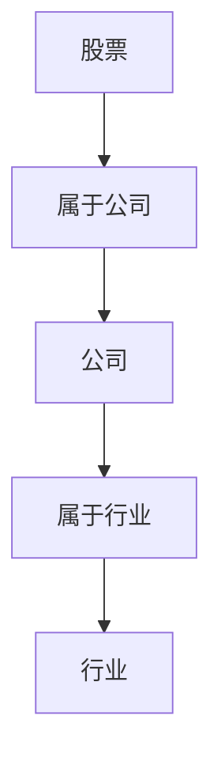
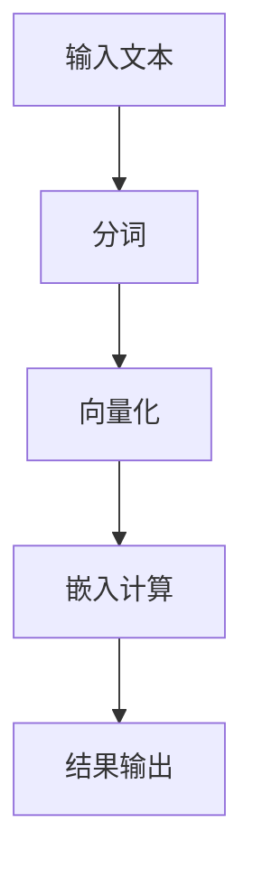
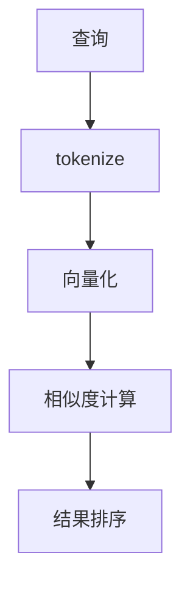
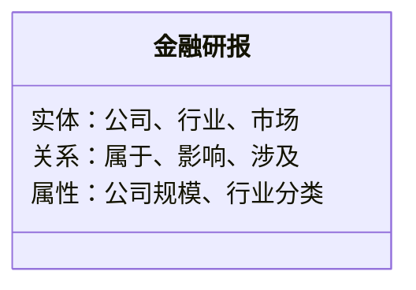
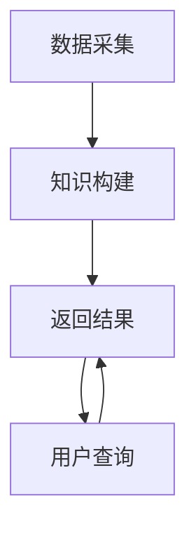

                 


# 构建基于知识图谱的金融研报智能检索系统

> 关键词：知识图谱、金融研报、智能检索系统、自然语言处理、图嵌入、机器学习

> 摘要：本文详细探讨了如何利用知识图谱构建金融研报的智能检索系统。通过分析金融研报的特点，设计了一套基于知识图谱的智能检索框架，结合自然语言处理和图嵌入技术，提出了一种高效的金融研报检索方法。

---

# 第一部分：背景介绍

## 第1章：问题背景

### 1.1 金融研报的重要性
- 金融研报是投资者获取市场信息的重要来源，但海量数据导致检索效率低下。
- 传统检索方法基于关键词匹配，无法理解语义和上下文关系。

### 1.2 知识图谱的定义与特点
- 知识图谱是一种结构化的数据表示方式，能够捕捉实体之间的语义关系。
- 具有语义丰富、结构化、可扩展性强等特点。

### 1.3 问题的提出与解决思路
- 传统检索方法的局限性：关键词匹配无法处理复杂语义。
- 解决思路：构建金融领域的知识图谱，利用图嵌入和自然语言处理技术实现智能检索。

---

## 第2章：问题描述

### 2.1 金融研报的特点
- 内容专业性强，涉及大量金融术语和实体。
- 数据量大，信息分散，检索效率低。

### 2.2 知识图谱在金融领域的应用
- 帮助理解金融实体之间的关系，如公司、行业、市场等。
- 提供语义检索能力，提升检索效率和准确性。

---

## 第3章：问题解决

### 3.1 知识图谱构建的目标
- 建立金融领域的知识库，涵盖公司、行业、市场等实体及其关系。
- 支持语义检索，提高检索系统的智能性。

### 3.2 智能检索系统的设计思路
- 基于知识图谱构建向量表示，利用相似度计算实现智能检索。
- 结合自然语言处理技术，提升系统对文本的理解能力。

---

## 第4章：边界与外延

### 4.1 系统的适用范围
- 主要适用于金融领域的文本检索，如股票分析、行业报告等。
- 适用于需要语义理解的场景，如投资决策支持。

### 4.2 系统的限制与不足
- 知识图谱构建需要大量人工标注，成本较高。
- 图嵌入模型的训练需要大量计算资源。

---

## 第5章：概念结构与核心要素

### 5.1 知识图谱的基本组成
- 实体：公司、行业、市场等。
- 关系：属于、影响、涉及等。
- 属性：公司规模、行业分类等。

### 5.2 金融研报的结构分析
- 标题：公司名称、行业名称等。
- 正文：包含实体、关系和属性的详细描述。

---

# 第二部分：核心概念与联系

## 第6章：知识图谱的原理

### 6.1 实体与关系的定义
- 实体：具体的研究对象，如“某公司”。
- 关系：实体之间的联系，如“属于行业”。

### 6.2 知识表示的多样性
- 使用多种表示方式，如关系型、语义网络等。

---

## 第7章：核心概念属性特征对比

| 概念 | 属性 | 特征 |
|------|------|------|
| 实体 | 类型 | 具体实例 |
| 关系 | 类型 | 关联方式 |

---

## 第8章：ER实体关系图



---

# 第三部分：算法原理

## 第9章：图嵌入算法

### 9.1 Word2Vec应用于知识图谱
- 将实体和关系映射为向量，利用Word2Vec进行训练。

### 9.2 BERT模型的引入
- 利用BERT模型进行语义理解，提升检索准确性。

### 9.3 算法流程图


---

## 第10章：检索算法

### 10.1 基于向量的相似度计算
- 使用余弦相似度计算文本相似度。

### 10.2 基于图结构的最短路径搜索
- 在知识图谱中找到最短路径，确定相关性。

### 10.3 检索流程图


---

## 第11章：数学模型与公式

### 11.1 向量空间模型
$$\text{相似度} = \frac{\vec{v} \cdot \vec{u}}{|\vec{v}| |\vec{u}|}$$

### 11.2 图嵌入模型
$$\text{损失函数} = \sum_{(i,j)} \log p(i,j) + \log p(j,i)$$

### 11.3 检索模型
$$\text{检索结果} = \text{argmax}_k \text{score}(q, d_k)$$

---

# 第四部分：系统分析与架构设计

## 第12章：问题场景

### 12.1 问题场景介绍
- 金融研报数据分散，检索效率低。
- 需要语义理解能力，提高检索准确性。

---

## 第13章：系统功能设计

### 13.1 领域模型


### 13.2 系统架构


---

## 第14章：系统接口设计

### 14.1 接口设计
- 数据接口：采集金融研报数据。
- 检索接口：接收查询请求，返回结果。

---

## 第15章：系统交互流程图

```mermaid
sequenceDiagram
    participant 用户
    participant 系统
    用户 -> 系统：发送查询请求
    系统 -> 数据采集模块：获取数据
    数据采集模块 -> 知识构建模块：构建知识图谱
    知识构建模块 -> 检索服务：生成检索结果
    检索服务 -> 用户：返回结果
```

---

# 第五部分：项目实战

## 第16章：环境安装

### 16.1 环境要求
- Python 3.8+
- 知识图谱构建工具：networkx
- 自然语言处理库：spaCy、NLTK
- 深度学习框架：TensorFlow、PyTorch

---

## 第17章：核心实现

### 17.1 核心代码实现
```python
import networkx as nx
from sklearn.metrics.pairwise import cosine_similarity

# 数据预处理
def preprocess(text):
    # 分词和向量化
    pass

# 知识图谱构建
def build_knowledge_graph(texts):
    G = nx.Graph()
    for text in texts:
        entities = extract_entities(text)
        relations = extract_relations(text)
        for e1, e2 in relations:
            G.add_edge(e1, e2)
    return G

# 图嵌入计算
def compute_embeddings(G):
    # 使用Word2Vec进行嵌入计算
    pass

# 检索函数
def semantic_search(query, G, embeddings):
    query_vec = get_embedding(query)
    max_score = -1
    best_match = None
    for node in G.nodes():
        node_vec = embeddings[node]
        score = cosine_similarity(query_vec, node_vec)
        if score > max_score:
            max_score = score
            best_match = node
    return best_match
```

---

## 第18章：案例分析

### 18.1 案例背景
- 数据集：某行业的金融研报数据。

### 18.2 实施步骤
1. 数据预处理：清洗和标注。
2. 知识图谱构建：提取实体和关系。
3. 嵌入计算：生成向量表示。
4. 智能检索：用户查询，返回结果。

---

## 第19章：项目小结

### 19.1 最佳实践 tips
- 数据质量直接影响检索效果，需注重数据清洗。
- 模型调优：选择合适的嵌入维度和优化算法。

### 19.2 小结
- 本文提出了一种基于知识图谱的金融研报智能检索系统。
- 通过案例分析展示了系统的实际应用价值。

### 19.3 注意事项
- 数据隐私和安全问题需注意。
- 系统性能优化需结合实际应用场景。

### 19.4 拓展阅读
- 深度学习在金融领域的应用。
- 更先进的图嵌入算法，如GraphSAGE、GAT。

---

# 作者：AI天才研究院/AI Genius Institute & 禅与计算机程序设计艺术 /Zen And The Art of Computer Programming

