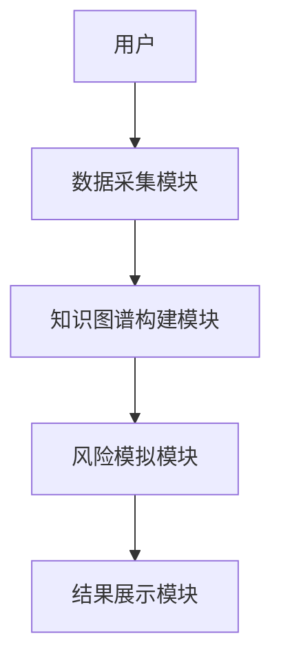
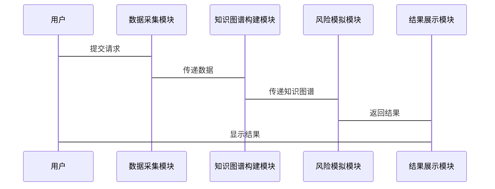

                 


# 构建基于知识图谱的金融风险传导模拟器

## 关键词：
知识图谱、金融风险、风险传导、模拟器、系统架构、算法、案例分析

## 摘要：
本文详细探讨了如何利用知识图谱技术构建金融风险传导模拟器。首先介绍了知识图谱和金融风险传导的基本概念，接着分析了知识图谱的构建过程，包括数据采集、实体识别和关系抽取。然后，讨论了适用于金融风险模拟的核心算法，如基于规则和深度学习的方法。在系统架构部分，设计了模块化的系统结构，并通过Mermaid图展示了类图和交互流程。最后，通过项目实战，指导读者如何搭建环境、实现核心功能，并进行案例分析，总结了最佳实践和未来发展方向。

---

# 第1章: 知识图谱与金融风险传导概述

## 1.1 知识图谱的基本概念

### 1.1.1 知识图谱的定义与特点
知识图谱是一种以图结构表示知识的语义网络，由节点（实体）和边（关系）组成。其特点包括：
- **可扩展性**：支持大规模数据的存储与查询。
- **语义关联**：通过关系描述实体之间的联系。
- **动态更新**：支持实时更新以反映最新信息。

### 1.1.2 知识图谱与传统数据库的区别
| 特性         | 知识图谱           | 传统数据库       |
|--------------|-------------------|-----------------|
| 数据结构     | 图结构             | 行列式           |
| 数据关联性   | 高                 | 低               |
| 查询效率     | 较低               | 高               |
| 应用场景     | 分析与推理         | 基础数据存储     |

### 1.1.3 知识图谱在金融领域的应用潜力
- **风险评估**：识别关联企业间的风险传导。
- **欺诈检测**：发现异常交易模式。
- **投资决策**：提供数据支持。

## 1.2 金融风险传导的定义与特点

### 1.2.1 金融风险的基本概念
金融风险指资产价值因市场波动而遭受损失的可能性，包括市场风险、信用风险等。

### 1.2.2 风险传导的机制与路径
风险通过关联主体（如企业、银行）在金融体系中扩散，路径包括直接和间接传导。

### 1.2.3 金融风险传导的复杂性与挑战
- **非线性关系**：风险传导路径复杂。
- **实时性要求**：需要快速响应。

## 1.3 知识图谱与金融风险传导的结合

### 1.3.1 知识图谱在风险传导中的优势
- **关联性**：捕捉机构间复杂关系。
- **动态性**：实时更新风险信息。

### 1.3.2 知识图谱技术如何支持风险模拟
通过构建知识图谱，模拟风险传导路径，评估影响范围。

### 1.3.3 金融风险传导模拟器的目标与意义
目标是量化风险传导路径，意义在于提升风险管理能力。

---

# 第2章: 知识图谱构建的核心概念

## 2.1 知识图谱的构建流程

### 2.1.1 数据采集与预处理
- **数据源**：爬取企业关系数据。
- **清洗步骤**：去重、标准化。

### 2.1.2 实体识别与关系抽取
- **实体识别**：使用NLP技术识别公司名称。
- **关系抽取**：识别控股关系。

### 2.1.3 知识图谱的存储与管理
- **存储技术**：使用Neo4j存储图数据。

## 2.2 知识图谱的核心要素

### 2.2.1 实体与属性的定义
- **实体**：如公司、银行。
- **属性**：如注册资本。

### 2.2.2 关系与边的属性
- **关系**：控股、投资。
- **权重**：反映关系强度。

### 2.2.3 知识图谱的可扩展性
支持动态添加新实体和关系。

## 2.3 知识图谱的可视化与分析

### 2.3.1 知识图谱的可视化方法
使用Graphviz进行可视化。

### 2.3.2 知识图谱的分析工具
如Neo4j的Cypher语言。

### 2.3.3 知识图谱在金融领域的应用场景
- **风险评估**：识别关联企业风险。
- **投资决策**：分析企业关联性。

---

# 第3章: 金融风险传导模拟器的核心算法

## 3.1 知识图谱构建算法

### 3.1.1 基于规则的实体识别算法
```python
def extract_entities(text):
    # 示例规则：识别公司名
    entities = []
    return entities
```

### 3.1.2 基于统计的关系抽取算法
使用条件随机场（CRF）模型进行关系抽取。

### 3.1.3 基于深度学习的知识图谱构建方法
使用BERT进行实体识别和关系抽取。

## 3.2 风险传导模拟算法

### 3.2.1 风险传播模型的数学公式
$$ R_i = \sum_{j} w_{ij} R_j $$

### 3.2.2 基于知识图谱的风险传导算法
- **步骤1**：构建知识图谱。
- **步骤2**：计算风险权重。

### 3.2.3 算法的优化与改进
- **权重计算**：考虑实体的影响力。

---

# 第4章: 系统架构与设计

## 4.1 系统功能模块设计

### 4.1.1 数据采集模块
- **功能**：爬取数据。
- **工具**：使用Scrapy框架。

### 4.1.2 知识图谱构建模块
- **功能**：处理数据，构建知识图谱。
- **工具**：Neo4j数据库。

### 4.1.3 风险传导模拟模块
- **功能**：模拟风险传导。
- **工具**：Python脚本。

### 4.1.4 结果可视化模块
- **功能**：展示结果。
- **工具**：D3.js。

## 4.2 系统架构设计

### 4.2.1 系统架构图


### 4.2.2 系统交互流程


---

# 第5章: 项目实战

## 5.1 环境安装与配置

### 5.1.1 安装依赖
- **Python**：3.8+
- **Neo4j**：社区版
- **Jupyter Notebook**：用于开发和测试

## 5.2 系统核心实现

### 5.2.1 数据采集模块实现
```python
import requests
from bs4 import BeautifulSoup

def scrape_data(url):
    response = requests.get(url)
    soup = BeautifulSoup(response.text, 'html.parser')
    entities = []
    return entities
```

### 5.2.2 知识图谱构建模块实现
```python
from neo4j import GraphDatabase

def create_graph(neo4j_uri, entities, relations):
    driver = GraphDatabase.driver(neo4j_uri)
    with driver.session() as session:
        # 创建实体
        for entity in entities:
            session.run("CREATE (n:{label} {{name: '{name}'}})", label=entity['label'], name=entity['name'])
        # 创建关系
        for relation in relations:
            session.run("MATCH (a), (b) WHERE a.name = '{a_name}' AND b.name = '{b_name}' CREATE (a)-[r:{relation}]->(b)", 
                        a_name=relation['a'], relation=relation['relation'], b_name=relation['b'])
    driver.close()
```

### 5.2.3 风险模拟模块实现
```python
def simulate_risk(neo4j_uri, source_node):
    driver = GraphDatabase.driver(neo4j_uri)
    with driver.session() as session:
        result = session.run("MATCH (a)-[r]->(b) WHERE a.name = $source RETURN b.name, r.weight", source=source_node)
        for record in result:
            print(f"Affected node: {record['b.name']}, Weight: {record['r.weight']}")
    driver.close()
```

## 5.3 案例分析与详细解读

### 5.3.1 案例背景
假设某企业A出现财务危机，分析其对关联企业的影响。

### 5.3.2 数据采集与处理
从新闻网站爬取企业关系数据，清洗后构建知识图谱。

### 5.3.3 系统实现与结果展示
使用上述代码实现数据采集、知识图谱构建和风险模拟，结果显示受影响的企业及其权重。

---

# 第6章: 总结与展望

## 6.1 最佳实践 tips
- **数据质量**：确保数据准确。
- **算法优化**：提升模拟效率。

## 6.2 小结
本文详细介绍了知识图谱在金融风险模拟中的应用，从理论到实践，提供了完整的解决方案。

## 6.3 注意事项
- 定期更新知识图谱以反映最新情况。
- 注意数据隐私和合规性。

## 6.4 拓展阅读
推荐阅读相关论文和书籍，深入理解知识图谱和风险模拟的前沿技术。

---

# 作者
作者：AI天才研究院 & 禅与计算机程序设计艺术

