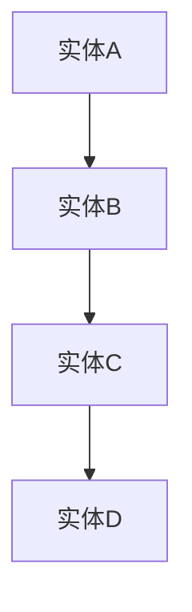
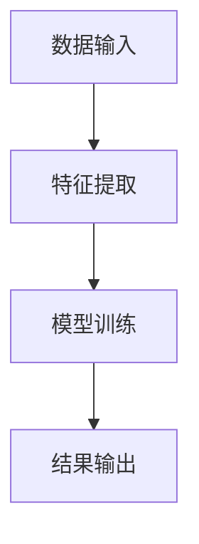
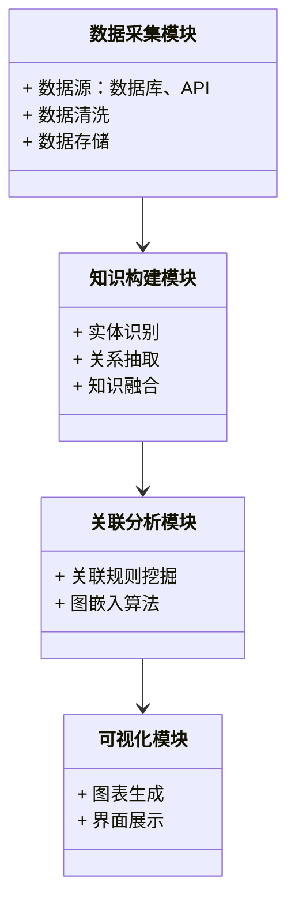
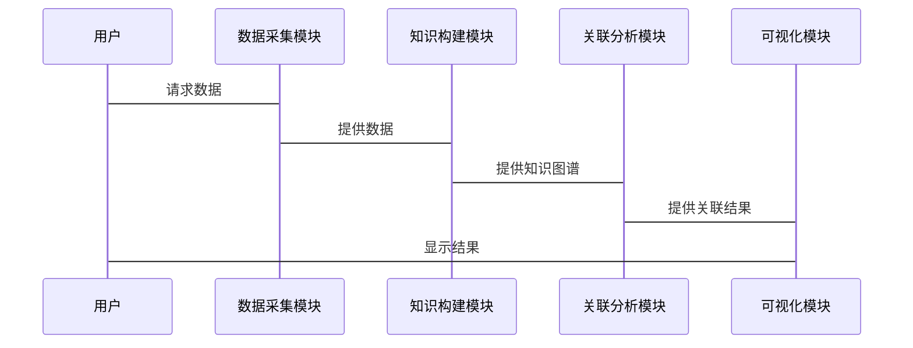

                 


# 构建基于知识图谱的金融风险关联分析系统

> 关键词：知识图谱、金融风险、关联分析、系统设计、算法实现

> 摘要：本文将详细介绍如何基于知识图谱构建金融风险关联分析系统。首先，我们将介绍金融风险分析的挑战和知识图谱在其中的应用潜力，分析其核心概念与联系。接着，我们将深入探讨关联规则挖掘和图嵌入算法的原理与实现。然后，我们将从系统架构设计、功能模块设计、接口设计等多方面进行详细阐述。最后，我们将通过一个实际案例展示系统的构建过程与应用效果。

---

## 第1章 问题背景与核心概念

### 1.1 问题背景与描述

#### 1.1.1 金融风险分析的挑战
- 金融市场的复杂性：金融市场涉及多方主体，如企业、个人、金融机构等，这些主体之间的关系错综复杂。
- 数据的多维性：金融数据包括财务数据、市场数据、新闻数据等，数据来源多样且格式不一。
- 风险的关联性：单个风险事件可能引发连锁反应，形成系统性风险。

#### 1.1.2 知识图谱在金融领域的应用潜力
- 知识图谱可以将分散的金融数据结构化，帮助发现隐藏的关系。
- 知识图谱可以支持实时监控和预警，帮助金融机构及时应对风险。

#### 1.1.3 金融风险关联分析的核心问题
- 如何从海量金融数据中提取有价值的关系。
- 如何构建高效的关联分析模型，以支持决策。

### 1.2 知识图谱的核心概念

#### 1.2.1 知识图谱的定义与特点
- **定义**：知识图谱是一种以图结构表示知识的语义网络，节点表示实体，边表示实体之间的关系。
- **特点**：可扩展性、语义丰富性、结构化。

#### 1.2.2 金融风险关联分析的定义与目标
- **定义**：通过分析金融数据中的关联关系，识别潜在风险点。
- **目标**：发现隐藏的关联，预测风险，辅助决策。

#### 1.2.3 知识图谱与金融风险关联分析的结合
- 将金融数据结构化，构建知识图谱，利用图分析技术发现关联。

### 1.3 问题解决与边界

#### 1.3.1 知识图谱如何解决金融风险问题
- 提供全局视角，发现潜在关联。
- 支持实时监控和预警。

#### 1.3.2 系统的边界与外延
- 系统仅关注金融风险的关联分析，不涉及具体的风险评估和决策。

#### 1.3.3 核心要素与组成结构
- 数据源：财务数据、市场数据、新闻数据等。
- 知识图谱构建：实体识别、关系抽取、知识融合。
- 关联分析：基于图的算法，如关联规则挖掘、图嵌入。

---

## 第2章 知识图谱与金融风险关联的核心概念与联系

### 2.1 核心概念原理

#### 2.1.1 知识图谱的构建原理
- **实体识别**：从文本中提取实体，如公司、人名、机构等。
- **关系抽取**：识别实体之间的关系，如“公司A收购公司B”。
- **知识融合**：将多个来源的知识整合到一个图中。

#### 2.1.2 金融风险关联分析的原理
- **关联规则挖掘**：发现频繁出现的关联项。
- **图嵌入**：将图结构转换为低维向量，用于机器学习任务。

#### 2.1.3 两者的结合机制
- 知识图谱提供数据结构，金融风险关联分析利用图分析技术提取关联。

### 2.2 概念属性对比

| 概念       | 知识图谱                          | 金融风险关联分析                   |
|------------|-----------------------------------|--------------------------------------|
| 核心目标   | 表示知识的语义网络                | 发现风险关联                       |
| 数据来源   | 文本、结构化数据                 | 金融数据                           |
| 输出形式   | 图结构                           | 关联规则或图嵌入向量               |

### 2.3 ER实体关系图



---

## 第3章 算法原理与实现

### 3.1 关联规则挖掘算法

#### 3.1.1 算法原理
- 关联规则挖掘用于发现数据中的频繁项集，生成关联规则。

#### 3.1.2 算法实现

```python
def apriori(data, min_support):
    # Step 1: 生成所有单个项的频繁项集
    items = list(set([item for sublist in data for item in sublist]))
    L = {}
    for item in items:
        count = 0
        for transaction in data:
            if item in transaction:
                count += 1
        if count >= min_support:
            L[item] = count
    # Step 2: 递归生成更长的项集
    k = 1
    while True:
        candidates = list(itertools.combinations(L.keys(), k))
        new_L = {}
        for candidate in candidates:
            count = 0
            for transaction in data:
                if all(item in transaction for item in candidate):
                    count += 1
            if count >= min_support:
                new_L[candidate] = count
        if not new_L:
            break
        L = new_L
        k += 1
    # 生成关联规则
    rules = []
    for item_set, support in L.items():
        for subset in item_set[:-1]:
            confidence = support / L[tuple(subset + item_set[-1])]
            rules.append((subset, item_set[-1], confidence))
    return rules
```

#### 3.1.3 优缺点分析
- 优点：简单易懂，适用于小规模数据。
- 缺点：对于大规模数据，效率较低。

### 3.2 图嵌入算法

#### 3.2.1 算法原理
- 图嵌入算法将图中的节点表示为低维向量，保留图的结构信息。

#### 3.2.2 算法实现

```python
def node2vec(edge_list, num_walks, walk_length):
    # Step 1: 随机游走生成
    walks = []
    for node in range(len(edge_list)):
        for _ in range(num_walks):
            walk = [node]
            current_node = node
            for _ in range(walk_length):
                neighbors = [neighbor for neighbor, _ in edge_list[current_node]]
                if not neighbors:
                    break
                next_node = random.choice(neighbors)
                walk.append(next_node)
                current_node = next_node
            walks.append(walk)
    # Step 2: 使用Word2Vec进行训练
    model = Word2Vec(vector_size=100, window=5, min_count=1, workers=4)
    model.build_vocab(walks)
    model.train(walks, total_examples=model.corpus_count, epochs=10)
    return model
```

#### 3.2.3 优缺点分析
- 优点：适用于大规模数据，捕捉图的结构信息。
- 缺点：需要大量计算资源。

### 3.3 算法流程图



---

## 第4章 系统分析与架构设计

### 4.1 项目背景与目标

#### 4.1.1 项目背景
- 随着金融市场的复杂化，传统的单点分析已无法满足需求。
- 知识图谱技术为金融风险分析提供了新的思路。

#### 4.1.2 项目目标
- 构建一个基于知识图谱的金融风险关联分析系统。
- 提供实时监控和风险预警功能。

### 4.2 系统功能设计

#### 4.2.1 数据采集模块
- 从多种数据源（如数据库、API）采集金融数据。

#### 4.2.2 知识构建模块
- 实体识别、关系抽取、知识融合。

#### 4.2.3 关联分析模块
- 应用关联规则挖掘和图嵌入算法，发现风险关联。

#### 4.2.4 可视化模块
- 提供直观的可视化界面，展示分析结果。

### 4.3 系统架构设计



### 4.4 系统接口设计

#### 4.4.1 数据接口
- 数据输入接口：接收多种格式的数据。
- 数据输出接口：提供结构化数据供其他模块使用。

#### 4.4.2 API接口
- 提供RESTful API，供外部系统调用。

#### 4.4.3 接口安全设计
- 使用认证和加密技术，确保数据安全。

### 4.5 系统交互流程图



---

## 第5章 项目实战与案例分析

### 5.1 环境安装与配置

#### 5.1.1 安装Python
- 安装Python 3.8+

#### 5.1.2 安装依赖
- `pip install numpy, pandas, networkx, word2vec`

### 5.2 核心代码实现

#### 5.2.1 数据采集
```python
import pandas as pd

def load_data(file_path):
    data = pd.read_csv(file_path)
    return data
```

#### 5.2.2 知识构建
```python
def extract_entities(text):
    # 使用NLP工具提取实体
    pass
```

#### 5.2.3 关联分析
```python
def run_association_rules(data):
    rules = apriori(data, min_support=0.1)
    return rules
```

### 5.3 案例分析

#### 5.3.1 数据准备
- 数据来源：某金融机构的历史交易数据。

#### 5.3.2 分析过程
- 构建知识图谱。
- 应用关联规则挖掘和图嵌入算法，发现关联。

#### 5.3.3 结果展示
- 关联规则示例：如果公司A出现财务危机，那么公司B的股价下跌。

### 5.4 项目小结
- 成功构建了基于知识图谱的金融风险关联分析系统。
- 系统在实际案例中表现出良好的分析能力。

---

## 第6章 总结与展望

### 6.1 最佳实践 Tips

#### 6.1.1 数据预处理的重要性
- 数据清洗和标准化是构建知识图谱的基础。

#### 6.1.2 算法选择的注意事项
- 根据数据规模和应用场景选择合适的算法。

#### 6.1.3 系统优化建议
- 使用分布式计算优化大规模数据处理。

### 6.2 小结
- 本文详细介绍了基于知识图谱的金融风险关联分析系统的构建过程。
- 通过实际案例展示了系统的应用效果。

### 6.3 注意事项

#### 6.3.1 数据隐私问题
- 在实际应用中，需注意数据隐私和合规性。

#### 6.3.2 系统可扩展性
- 系统设计需考虑未来数据规模的扩展。

### 6.4 拓展阅读
- 《知识图谱构建与应用》
- 《金融风险管理的现代方法》

---

## 作者

**作者：AI天才研究院/AI Genius Institute & 禅与计算机程序设计艺术/Zen And The Art of Computer Programming**

