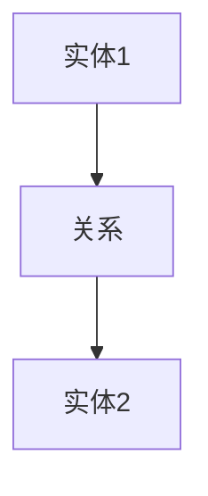
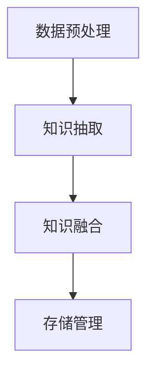
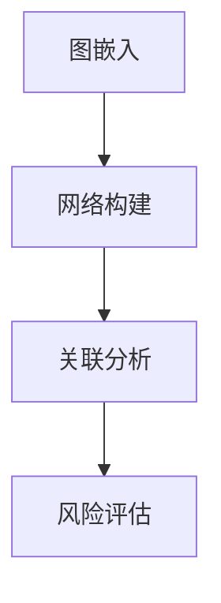
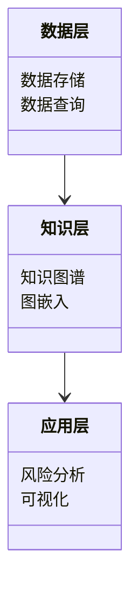

                 


# 构建基于知识图谱的金融风险关联网络

## 关键词：知识图谱，金融风险，关联网络，图嵌入，风险分析

## 摘要：本文详细探讨了如何利用知识图谱技术构建金融风险关联网络，分析了传统金融风险分析的局限性，提出了基于知识图谱的解决方案，通过图嵌入和关联网络分析，帮助识别和量化金融风险，提升风险管理能力。

---

## 第1章 知识图谱与金融风险关联网络概述

### 1.1 知识图谱的基本概念

#### 1.1.1 知识图谱的定义与特点
知识图谱是一种用于表示实体及其关系的图结构，能够整合多种数据源，揭示数据间的隐含关联。其特点包括可扩展性、语义丰富性和结构化存储。

#### 1.1.2 金融风险关联网络的定义
金融风险关联网络用于分析金融市场中各实体（如企业、机构）之间的风险传播和相互作用，帮助识别系统性风险。

#### 1.1.3 知识图谱在金融领域的应用前景
知识图谱能够整合市场数据、新闻、监管信息等，提供更全面的风险评估，提升金融决策的准确性。

### 1.2 问题背景与目标

#### 1.2.1 传统金融风险分析的局限性
传统方法依赖统计模型，难以捕捉复杂的关联关系，且数据孤岛问题突出。

#### 1.2.2 知识图谱在金融风险分析中的优势
知识图谱能够整合多源数据，发现隐藏关联，提供更全面的风险评估。

#### 1.2.3 本研究的目标与意义
目标是构建基于知识图谱的金融风险关联网络，提升风险识别和管理能力，具有重要的理论和实践意义。

### 1.3 核心概念与联系

#### 1.3.1 知识图谱的核心要素
包括实体、关系、属性和语义信息。

#### 1.3.2 金融风险关联网络的构建要素
涉及实体识别、关系抽取、图嵌入和关联分析。

#### 1.3.3 实体关系与属性特征对比表格

| 属性 | 实体 | 关系 |
|------|------|------|
| 类型 | 公司、银行 | 投资、负债 |
| 示例 | Apple、JP Morgan | 持股、贷款 |

#### 1.3.4 实体关系图（ER图）



---

## 第2章 知识图谱构建方法

### 2.1 知识抽取与表示

#### 2.1.1 文本信息抽取方法
包括实体识别、关系抽取和信息抽取。

#### 2.1.2 实体识别与关系抽取
使用自然语言处理技术，识别文本中的实体及其关系。

#### 2.1.3 知识表示的向量空间模型
通过向量表示，将实体及其关系转化为数值形式。

### 2.2 知识图谱构建流程

#### 2.2.1 数据预处理
清洗数据，处理缺失值和重复项。

#### 2.2.2 知识抽取与融合
从结构化和非结构化数据中提取知识，并进行融合。

#### 2.2.3 知识图谱存储与管理
使用图数据库存储，设计高效的查询机制。

### 2.3 知识图谱构建的挑战与解决方案

#### 2.3.1 数据异构性问题
通过数据转换和映射解决异构性。

#### 2.3.2 知识融合中的冲突处理
采用协商和仲裁机制处理冲突。

#### 2.3.3 知识图谱的可扩展性设计
设计模块化结构，便于扩展。

---

## 第3章 基于知识图谱的金融风险关联网络构建

### 3.1 金融风险关联网络的构建框架

#### 3.1.1 问题场景描述
分析金融市场中的风险传播路径，识别关键风险源。

#### 3.1.2 系统功能设计
包括数据采集、知识构建、风险分析和可视化。

#### 3.1.3 系统架构设计
分层架构，包含数据层、知识层和应用层。

### 3.2 知识图谱与风险关联网络的融合

#### 3.2.1 知识图谱的图嵌入方法
使用DeepWalk和GraphSAGE算法生成低维嵌入。

#### 3.2.2 风险关联网络的构建算法
基于图嵌入和聚类分析，构建风险网络。

#### 3.2.3 网络嵌入与关联分析的数学模型

图嵌入公式：
$$ E(v) = f(v, A) $$
其中，$A$是图的邻接矩阵，$f$是嵌入函数。

### 3.3 算法原理与流程图

#### 3.3.1 图嵌入算法的数学模型

图嵌入过程：
1. 随机游走生成序列。
2. 使用Skip-Gram训练词向量。

#### 3.3.2 知识图谱构建的流程图



#### 3.3.3 关联网络分析的算法流程图



---

## 第4章 算法实现与数学模型

### 4.1 图嵌入算法

#### 4.1.1 深度嵌入算法
使用GCN进行图嵌入，公式：
$$ X' = AX $$
其中，$X$是输入特征，$A$是邻接矩阵。

#### 4.1.2 图注意力机制
采用GAT模型，公式：
$$ a_{ij} = \text{softmax}(e^{d_j^T W d_i}) $$
其中，$d_i$和$d_j$是节点的表示。

### 4.2 知识图谱构建算法

#### 4.2.1 知识融合算法
使用对齐方法，如基于标签的对齐和基于嵌入的对齐。

#### 4.2.2 知识抽取算法
利用NER模型识别实体和关系。

---

## 第5章 系统分析与架构设计

### 5.1 问题场景介绍
分析金融市场中的风险传播，帮助机构识别系统性风险。

### 5.2 系统功能设计

#### 5.2.1 数据预处理模块
处理和清洗数据，确保数据质量。

#### 5.2.2 知识构建模块
抽取和融合知识，构建知识图谱。

#### 5.2.3 风险分析模块
基于图嵌入和关联网络分析，评估风险。

### 5.3 系统架构设计



### 5.4 接口与交互设计

#### 5.4.1 系统接口设计
提供REST API，支持数据上传和查询。

#### 5.4.2 系统交互设计
用户通过Web界面进行操作，系统返回风险评估结果。

---

## 第6章 项目实战

### 6.1 环境安装

```bash
pip install networkx py2neo
```

### 6.2 核心实现

#### 6.2.1 数据预处理代码

```python
import pandas as pd

data = pd.read_csv('financial_data.csv')
data.dropna(inplace=True)
```

#### 6.2.2 知识图谱构建代码

```python
from networkx import Graph

graph = Graph()
graph.add_nodes_from(['Company1', 'Company2'])
graph.add_edge('Company1', 'Company2')
```

### 6.3 案例分析

#### 6.3.1 数据来源与处理
使用公开的金融数据，清洗并预处理。

#### 6.3.2 知识图谱构建与分析
构建公司之间的投资关系图，识别风险传播路径。

#### 6.3.3 风险评估与可视化
通过图分析算法，评估各公司的风险等级，并可视化展示。

---

## 第7章 总结与展望

### 7.1 最佳实践 tips
- 数据清洗是关键，确保数据质量。
- 使用高效的图数据库存储知识图谱。
- 定期更新知识图谱以反映最新市场情况。

### 7.2 小结
本文详细介绍了基于知识图谱的金融风险关联网络构建方法，通过算法和系统设计，展示了其在风险分析中的应用。

### 7.3 注意事项
- 数据隐私和安全需严格控制。
- 算法选择应根据具体场景调整。

### 7.4 拓展阅读
推荐学习图嵌入和知识图谱相关文献，深入理解其原理和应用。

---

## 作者：AI天才研究院 & 禅与计算机程序设计艺术

---

希望这篇技术博客能够为读者提供清晰的指导和深入的见解，帮助他们在金融风险分析领域利用知识图谱技术提升能力。

