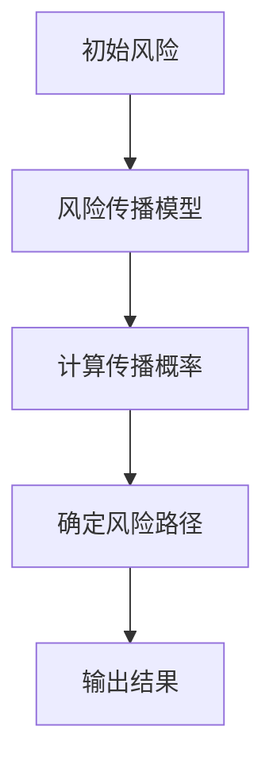
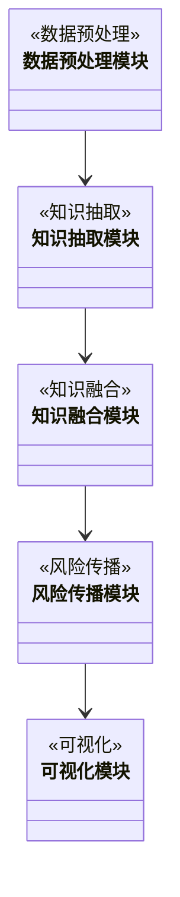
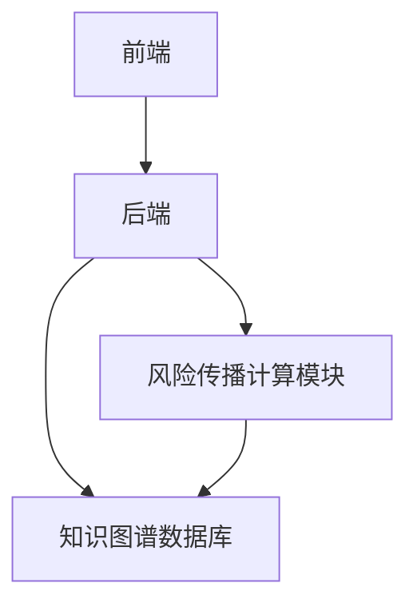
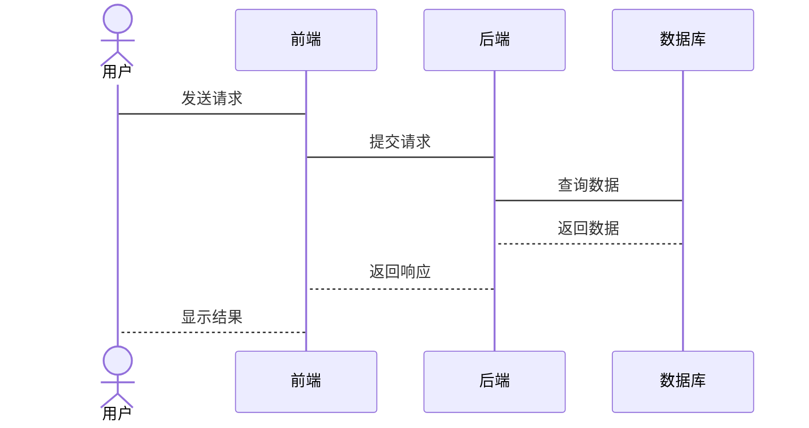

                 


# 构建基于知识图谱的金融风险关联网络可视化系统

> 关键词：知识图谱，金融风险，关联网络，可视化系统，风险传播，系统架构

> 摘要：本文详细探讨了如何利用知识图谱构建金融风险关联网络可视化系统。通过分析金融风险的传播机制和关联网络的构建方法，结合知识图谱的三元组表示法，设计了一套完整的系统架构，涵盖了数据预处理、图谱构建、风险传播算法、可视化展示以及系统接口设计等多个方面。本文还通过实际案例展示了系统的实现过程，并提出了优化建议和未来研究方向。

---

## 第一部分: 知识图谱与金融风险关联网络可视化概述

### 第1章: 知识图谱与金融风险关联网络的背景介绍

#### 1.1 问题背景
金融市场的复杂性和不确定性使得风险分析变得尤为重要。传统的方法往往依赖于单一数据源和统计模型，难以捕捉复杂的关联关系。然而，金融风险通常不是孤立的事件，而是由多个实体（如公司、投资者、银行等）之间的复杂关系所引发。因此，如何利用先进的技术手段，如知识图谱，来构建金融风险关联网络，成为当前研究的热点。

#### 1.2 问题描述
金融风险关联网络的构建需要考虑以下关键问题：
1. **数据来源多样性**：金融数据可能来自新闻、财报、社交媒体等多个渠道，如何有效地整合这些数据并提取有用的关联关系是一个挑战。
2. **关联关系的复杂性**：金融实体之间的关系可能是间接的、多层次的，传统的统计方法难以捕捉这些复杂关系。
3. **实时性要求**：金融市场的动态性要求风险关联网络的构建必须具备较高的实时性，以便及时发现和应对潜在风险。

#### 1.3 问题解决思路
基于知识图谱的金融风险关联网络构建方法具有以下优势：
1. **知识表示的灵活性**：知识图谱通过三元组（实体-关系-实体）的形式，能够灵活地表示复杂的关联关系。
2. **可扩展性**：知识图谱的构建方法可以扩展到大规模数据，适用于金融市场的海量数据处理。
3. **可视化支持**：通过图谱可视化技术，可以直观地展示金融风险的传播路径和关键节点，为决策者提供有力支持。

### 第2章: 知识图谱与金融风险关联网络的核心概念

#### 2.1 知识图谱的定义与特点
知识图谱是一种用于表示实体及其关系的图结构，具有以下特点：
1. **语义丰富**：通过实体和关系的组合，可以表示复杂的语义信息。
2. **可扩展性**：知识图谱可以不断扩展，加入新的实体和关系。
3. **结构化**：知识图谱的结构化特性使其便于计算机处理和分析。

#### 2.2 金融风险关联网络的构建原理
金融风险关联网络的构建需要考虑以下步骤：
1. **数据收集**：从多个数据源收集金融数据，包括新闻、财报、社交媒体等。
2. **知识抽取**：从非结构化数据中提取实体和关系，构建初步的知识图谱。
3. **知识融合**：将多个数据源的知识图谱进行融合，消除冗余和冲突。
4. **风险传播模型**：基于知识图谱的结构，构建风险传播模型，分析风险的传播路径和影响范围。

#### 2.3 实体关系对比表格
以下是一个简单的实体关系对比表格，展示了金融风险关联网络中的主要实体及其关系：

| 实体 | 关系 | 示例 |
|------|------|------|
| 公司 | 投资于 | 公司A投资于公司B |
| 投资者 | 持有 | 投资者X持有公司A的股票 |
| 银行 | 贷款于 | 银行Y贷款于公司Z |

#### 2.4 ER实体关系图架构
以下是金融风险关联网络的ER图架构：

```mermaid
er
actor 公司 {
  <公司ID, 公司名称, 公司行业>
}
actor 投资者 {
  <投资者ID, 投资者名称>
}
actor 银行 {
  <银行ID, 银行名称>
}
actor 股票 {
  <股票ID, 股票名称>
}
actor 新闻 {
  <新闻ID, 新闻标题, 新闻内容>
}
```

## 第二部分: 知识图谱构建与算法原理

### 第3章: 知识图谱构建算法原理

#### 3.1 知识抽取与表示
知识抽取是构建知识图谱的第一步，主要包括以下步骤：
1. **数据预处理**：清洗数据，提取有用的信息。
2. **实体识别**：识别文本中的实体，如公司、投资者等。
3. **关系抽取**：识别实体之间的关系，如“投资于”、“持有”等。

#### 3.2 知识融合与推理
知识融合是将多个数据源的知识图谱进行合并，消除冗余和冲突。常见的知识融合方法包括：
1. **基于规则的融合**：根据预定义的规则进行数据合并。
2. **基于图的融合**：利用图结构进行数据合并，考虑实体之间的关系。

### 第4章: 金融风险传播算法原理

#### 4.1 风险传播模型
风险传播模型是基于图的传播机制，通过计算实体之间的风险传播概率，确定风险的传播路径和影响范围。常见的风险传播模型包括：
1. **基于概率的传播模型**：通过概率论计算风险的传播概率。
2. **基于图的传播模型**：利用图的特征（如度数、介数）计算风险的传播路径。

#### 4.2 算法实现流程
以下是风险传播算法的实现流程：



以下是风险传播算法的Python实现示例：

```python
import numpy as np

def risk_propagation(network, initial_risk, max_iterations=100):
    # 初始化风险值
    risk = np.zeros(len(network.nodes))
    risk[initial_risk] = 1
    
    for _ in range(max_iterations):
        new_risk = np.zeros(len(network.nodes))
        for node in network.nodes:
            for neighbor in network.neighbors(node):
                new_risk[neighbor] += risk[node] * network.get_weight(node, neighbor)
        risk = new_risk / np.sum(new_risk)
    
    return risk
```

## 第三部分: 系统分析与架构设计

### 第5章: 系统分析与架构设计

#### 5.1 系统功能设计
以下是系统功能模块的类图：



#### 5.2 系统架构设计
以下是系统架构图：



#### 5.3 系统接口设计
以下是系统接口设计的序列图：



## 第四部分: 项目实战

### 第6章: 项目实战

#### 6.1 环境安装
以下是项目实战所需的环境安装步骤：
1. 安装Python和必要的库（如numpy、networkx、matplotlib）。
2. 安装Jupyter Notebook用于数据处理和可视化。

#### 6.2 系统核心实现源代码
以下是系统核心实现的Python代码示例：

```python
import networkx as nx
import matplotlib.pyplot as plt

# 创建知识图谱
G = nx.DiGraph()
G.add_node("公司A")
G.add_node("公司B")
G.add_node("投资者X")
G.add_edge("公司A", "公司B", label="投资于")
G.add_edge("投资者X", "公司A", label="持有")

# 可视化知识图谱
nx.draw(G, with_labels=True, edge_labels=True)
plt.show()
```

## 第五部分: 最佳实践与小结

### 第7章: 最佳实践与小结

#### 7.1 最佳实践
1. 数据预处理是关键：确保数据的准确性和完整性。
2. 知识抽取和融合需要结合具体业务场景。
3. 可视化是系统的重要组成部分，需要设计直观的展示方式。

#### 7.2 小结
本文详细介绍了如何构建基于知识图谱的金融风险关联网络可视化系统，涵盖了从数据处理、知识构建到系统设计的各个环节。通过实际案例的展示，验证了系统的可行性和有效性。

#### 7.3 注意事项
1. 数据隐私和安全问题需要高度重视。
2. 系统的实时性和可扩展性需要进一步优化。
3. 风险传播模型的优化和改进是未来研究的重要方向。

#### 7.4 拓展阅读
1. 《知识图谱：从概念到应用》
2. 《图论与网络科学》
3. 《金融风险管理》

---

作者：AI天才研究院 & 禅与计算机程序设计艺术

