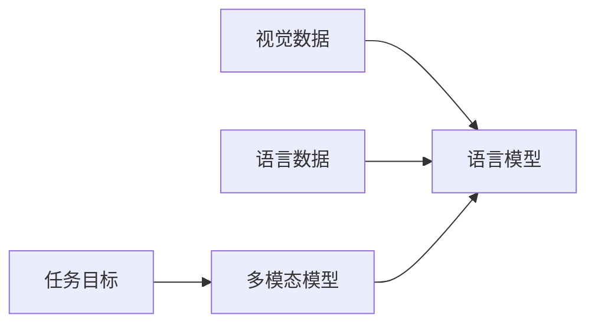
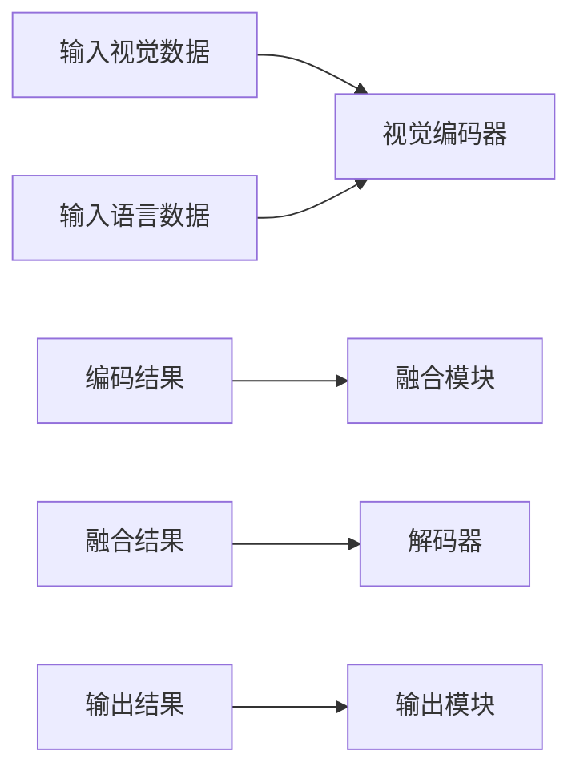
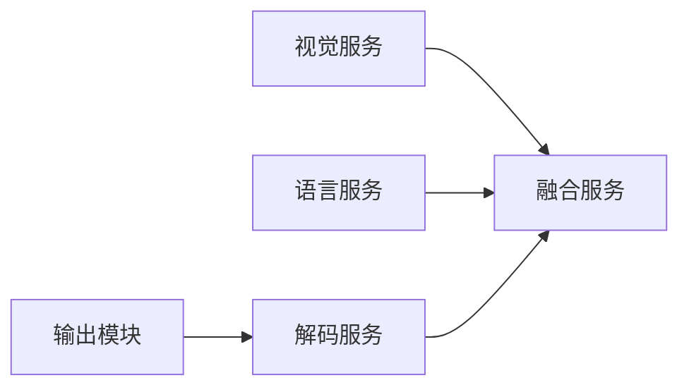

                 


# 构建多模态AI Agent：整合视觉和语言能力

> 关键词：多模态AI Agent, 视觉语言整合, 多模态模型, 视觉编码器, 语言编码器, 注意力机制, 系统架构设计

> 摘要：本文将详细探讨如何构建一个多模态AI Agent，整合视觉和语言能力。通过分析多模态数据的特点、模型构建的核心算法原理，以及系统架构设计，本文将为读者提供从理论到实践的全面指导。结合实际案例，深入解析多模态AI Agent的实现过程，并总结其在实际应用中的优势与挑战。

---

# 第一部分: 多模态AI Agent的背景与概念

## 第1章: 多模态AI Agent的背景与问题背景

### 1.1 多模态AI Agent的定义与问题背景

#### 1.1.1 多模态AI Agent的定义
多模态AI Agent是指能够同时处理和理解多种数据形式（如视觉、语言、音频等）的人工智能代理。本文主要关注视觉和语言能力的整合，即多模态AI Agent能够通过图像和文本进行交互和推理。

#### 1.1.2 多模态AI Agent的核心问题
1. **数据融合问题**：如何有效融合视觉和语言数据，提取两者之间的关联性。
2. **模型训练问题**：如何设计模型架构，使其能够同时处理视觉和语言信息。
3. **任务执行问题**：如何在实际场景中实现多模态AI Agent的任务执行和反馈优化。

#### 1.1.3 多模态AI Agent的应用场景
- **智能客服**：结合图像和文本理解，提供更精准的客服支持。
- **医疗影像分析**：通过图像和病历文本的结合，辅助医生进行诊断。
- **机器人交互**：机器人能够通过视觉识别和语言对话与人类进行交互。

### 1.2 多模态AI Agent的核心概念

#### 1.2.1 多模态数据的特征
- **视觉数据**：图像、视频等，具有空间特征。
- **语言数据**：文本、语音等，具有语义特征。
- **数据融合**：将视觉和语言数据进行整合，提取互补信息。

#### 1.2.2 多模态模型的构建与训练
- **编码器-解码器架构**：将视觉和语言数据分别编码为通用表示，再进行联合解码。
- **模型训练策略**：使用多任务学习，同时优化视觉和语言任务。

#### 1.2.3 多模态任务的分类与对比
- **单模态任务**：仅处理视觉或语言任务。
- **多模态任务**：同时处理视觉和语言任务，任务之间相互关联。

### 1.3 多模态AI Agent的现状与发展

#### 1.3.1 当前技术现状
- **视觉模型**：基于深度学习的图像识别技术发展迅速。
- **语言模型**：基于Transformer的自然语言处理技术取得突破。
- **多模态模型**：如ViLBERT、CLIP等模型开始广泛应用于多模态任务。

#### 1.3.2 技术发展趋势
- **模型融合**：从简单拼接向深度融合发展。
- **跨模态理解**：增强模型对不同模态数据之间关系的理解能力。
- **端到端训练**：通过端到端的方式优化多模态任务。

#### 1.3.3 应用领域的拓展
- **电子商务**：多模态推荐系统。
- **教育领域**：多模态智能教育辅助系统。
- **社交网络**：多模态社交机器人。

---

## 第2章: 多模态AI Agent的核心概念与联系

### 2.1 多模态数据的特征分析

#### 2.1.1 视觉数据的特征
- **空间性**：图像具有高度和宽度的二维空间特征。
- **多样性**：图像数据可以来自不同的场景和物体。
- **语义性**：图像中包含丰富的语义信息。

#### 2.1.2 语言数据的特征
- **序列性**：文本数据具有时间序列特征。
- **语义丰富性**：语言能够表达复杂的语义信息。
- **上下文依赖性**：语言的理解依赖于上下文。

#### 2.1.3 数据融合的挑战与方法
- **挑战**：不同模态的数据具有不同的特征和表示方式，如何有效融合是关键。
- **方法**：通过构建多模态编码器，将视觉和语言数据转换为同一空间的表示。

### 2.2 多模态模型的原理与架构

#### 2.2.1 多模态编码器的原理
- **视觉编码器**：将图像转换为特征向量。
- **语言编码器**：将文本转换为特征向量。
- **编码器融合**：将视觉和语言编码器的输出进行融合，生成多模态表示。

#### 2.2.2 多模态解码器的设计
- **解码器输入**：多模态编码器生成的融合表示。
- **解码器输出**：根据任务需求生成相应的输出，如文本描述或图像生成。

#### 2.2.3 多模态模型的训练策略
- **联合训练**：同时优化视觉和语言任务。
- **对比学习**：通过对比视觉和语言数据的相似性，增强模型的跨模态理解能力。

### 2.3 多模态任务的实体关系图



---

## 第3章: 多模态AI Agent的算法原理

### 3.1 多模态编码器的实现

#### 3.1.1 视觉编码器的实现

- **CNN编码器**：使用卷积神经网络提取图像的特征。
  ```python
  def cnn_encoder(image):
      # 简化CNN编码器实现
      return conv2d(image)
  ```

- **Transformer编码器**：使用Transformer架构提取图像的特征。
  ```python
  def transformer_encoder(image):
      return transformer(image)
  ```

#### 3.1.2 语言编码器的实现

- **BERT编码器**：基于预训练的BERT模型提取文本特征。
  ```python
  def bert_encoder(text):
      return bert(text)
  ```

#### 3.1.3 编码器融合方法

- **拼接融合**：将视觉和语言编码器的输出拼接。
  ```python
  def encoder_fusion(visual_features, language_features):
      return concat(visual_features, language_features)
  ```

- **加权融合**：对视觉和语言特征进行加权融合。
  ```python
  def weighted_fusion(visual_features, language_features):
      alpha = learnable_parameter()
      return alpha * visual_features + (1 - alpha) * language_features
  ```

### 3.2 多模态解码器的实现

#### 3.2.1 语言解码器的实现

- **Transformer解码器**：基于Transformer架构生成文本。
  ```python
  def transformer_decoder(visual_encoding):
      return transformer(visual_encoding)
  ```

#### 3.2.2 视觉解码器的实现

- **生成对抗网络**：使用生成对抗网络生成图像。
  ```python
  def gan_decoder(text_encoding):
      return generator(text_encoding)
  ```

#### 3.2.3 解码器融合方法

- **联合解码**：将视觉和语言解码器的输出进行联合优化。
  ```python
  def decoder_fusion(visual_output, language_output):
      return融合后的输出
  ```

### 3.3 多模态模型的注意力机制

- **自注意力机制**：用于捕捉模态内部的关联性。
  ```mermaid
  graph LR
  A[输入数据] --> B[注意力计算]
  C[注意力权重] --> D[加权求和]
  D --> E[输出结果]
  ```

- **交叉注意力机制**：用于捕捉不同模态之间的关联性。
  ```mermaid
  graph LR
  A[视觉特征] --> B[语言模型]
  C[语言特征] --> B
  D[融合结果] --> B
  ```

---

## 第4章: 多模态AI Agent的系统架构设计

### 4.1 系统功能设计

#### 4.1.1 系统功能模块划分
- **输入模块**：接收视觉和语言输入。
- **编码器模块**：对输入进行编码处理。
- **解码器模块**：根据编码结果生成输出。
- **融合模块**：对视觉和语言特征进行融合。

#### 4.1.2 模块之间的关系
- **输入模块** --> **编码器模块**
- **编码器模块** --> **融合模块**
- **融合模块** --> **解码器模块**
- **解码器模块** --> **输出模块**

#### 4.1.3 系统功能流程图



### 4.2 系统架构设计

#### 4.2.1 分层架构设计
- **数据层**：存储视觉和语言数据。
- **编码层**：处理输入数据，生成编码表示。
- **融合层**：对编码结果进行融合。
- **解码层**：根据融合结果生成输出。
- **输出层**：展示最终结果。

#### 4.2.2 微服务架构设计
- **视觉服务**：负责处理视觉数据。
- **语言服务**：负责处理语言数据。
- **融合服务**：负责对视觉和语言数据进行融合。
- **解码服务**：根据融合结果生成输出。

#### 4.2.3 系统架构图



### 4.3 系统接口设计

#### 4.3.1 接口定义
- **视觉输入接口**：接收图像数据。
- **语言输入接口**：接收文本数据。
- **融合接口**：接收视觉和语言编码结果。
- **解码接口**：接收融合结果，生成输出。

#### 4.3.2 接口调用流程
1. 调用视觉输入接口，获取视觉编码结果。
2. 调用语言输入接口，获取语言编码结果。
3. 调用融合接口，对视觉和语言编码结果进行融合。
4. 调用解码接口，根据融合结果生成输出。

#### 4.3.3 接口文档
- **API文档**：详细描述每个接口的输入、输出和调用方式。

---

## 第5章: 多模态AI Agent的项目实战

### 5.1 项目背景

- **项目目标**：构建一个多模态AI Agent，能够通过图像和文本进行交互。
- **项目需求**：实现图像描述生成和文本图像生成功能。

### 5.2 环境安装

- **Python版本**：3.8及以上。
- **深度学习框架**：TensorFlow或PyTorch。
- **预训练模型**：如ViLBERT、CLIP等。

### 5.3 核心实现代码

#### 5.3.1 多模态编码器实现

```python
import tensorflow as tf
from tensorflow.keras import layers

def visual_encoder(image):
    model = tf.keras.Sequential([
        layers.Conv2D(32, (3,3), activation='relu'),
        layers.MaxPooling2D((2,2)),
        layers.Flatten(),
        layers.Dense(128, activation='relu')
    ])
    return model(image)

def language_encoder(text):
    model = tf.keras.Sequential([
        layers.Embedding(1000, 64),
        layers.LSTM(64)
    ])
    return model(text)
```

#### 5.3.2 多模态解码器实现

```python
def decoder(merged_features):
    model = tf.keras.Sequential([
        layers.Dense(256, activation='relu'),
        layers.Dense(128, activation='relu'),
        layers.Dense(10, activation='softmax')
    ])
    return model(merged_features)
```

### 5.4 代码应用解读与分析

- **编码器部分**：分别对视觉和语言数据进行编码，生成特征向量。
- **解码器部分**：对融合后的特征进行解码，生成最终的输出。

### 5.5 实际案例分析

- **案例1**：图像描述生成。
  - 输入：一张图像。
  - 输出：对图像内容的描述文本。

- **案例2**：文本图像生成。
  - 输入：一段文本描述。
  - 输出：根据描述生成图像。

### 5.6 项目小结

- **实现难点**：多模态数据的融合和模型的训练优化。
- **解决方法**：通过设计合理的编码器和解码器架构，结合预训练模型进行优化。

---

## 第6章: 总结与展望

### 6.1 总结

- 本文详细介绍了多模态AI Agent的构建过程，包括背景、核心概念、算法原理和系统架构设计。
- 通过实际案例分析，展示了多模态AI Agent的应用潜力。

### 6.2 未来展望

- **模型优化**：进一步优化多模态模型的融合方式，提高模型的准确性和效率。
- **应用场景扩展**：探索更多领域的应用，如教育、医疗、社交网络等。
- **技术发展**：随着深度学习技术的不断发展，多模态AI Agent将更加智能化和实用化。

### 6.3 最佳实践 Tips

- **数据预处理**：对视觉和语言数据进行充分的预处理，确保数据质量。
- **模型调优**：通过实验不断优化模型的参数和架构。
- **系统设计**：注重系统的模块化设计，方便后续的扩展和维护。

---

## 作者信息

作者：AI天才研究院/AI Genius Institute  
联系邮箱：contact@aitalentinstitute.com  
GitHub链接：https://github.com/aitalentinstitute

---

以上是《构建多模态AI Agent：整合视觉和语言能力》的完整目录和文章内容。希望这篇文章能够为读者提供清晰的指导，帮助他们理解并实现一个多模态AI Agent。

