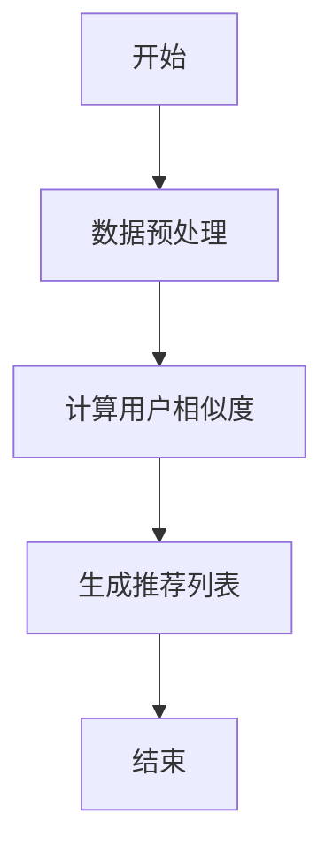
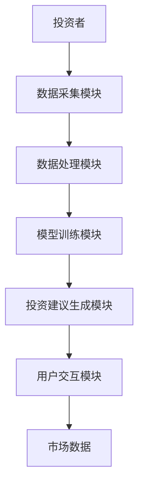
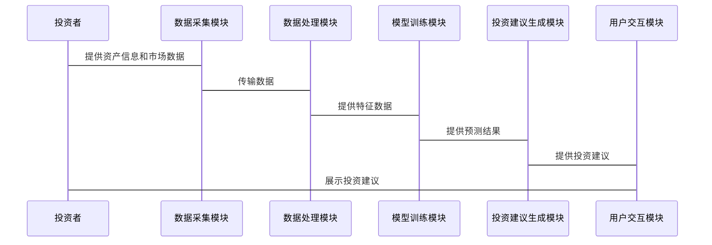

                 


# 构建投资理财智能助手的核心技术解析

---

## 关键词：
- 投资理财
- 智能助手
- 机器学习
- 自然语言处理
- 系统架构
- 风险管理

---

## 摘要：
随着金融科技的快速发展，投资理财智能助手作为一种结合人工智能与金融知识的工具，正在成为投资者的重要辅助工具。本文从背景、核心概念、算法原理、系统架构等多方面详细解析构建投资理财智能助手的关键技术，涵盖数据处理、模型训练、推荐算法、风险管理等核心内容，并通过实际案例分析和代码实现，帮助读者深入理解如何设计和实现一个高效、可靠的智能投资理财助手。

---

## 第一部分：构建投资理财智能助手的背景与核心概念

### 第1章：投资理财智能助手的背景与问题背景

#### 1.1 投资理财智能助手的定义与目标
投资理财智能助手是一种基于人工智能技术的辅助工具，旨在通过分析用户的财务状况、投资目标和市场趋势，为用户提供个性化的投资建议、风险评估和资产配置方案。其目标是帮助投资者做出更明智的投资决策，优化资产收益，降低投资风险。

##### 1.1.1 投资理财智能助手的定义
投资理财智能助手是一种结合自然语言处理、机器学习和大数据分析的智能系统，能够通过用户输入的财务数据和市场信息，生成个性化的投资建议。它通常包括以下几个核心功能：
1. 用户信息收集与分析
2. 市场数据处理与预测
3. 投资策略生成与优化
4. 风险评估与反馈

##### 1.1.2 助手的目标与功能定位
投资理财智能助手的目标是通过技术手段简化投资决策过程，提高投资效率。其功能定位包括：
1. 提供个性化的投资建议
2. 实时监控市场动态
3. 风险预警与管理
4. 教育用户投资知识

##### 1.1.3 问题背景与用户需求分析
投资者在进行投资决策时面临诸多挑战，例如市场波动、信息不对称、知识不足等。传统的投资顾问服务往往成本高昂且覆盖面有限，而智能助手通过技术手段能够以较低成本为更多用户提供服务。用户的核心需求包括：
- 自动化分析工具
- 个性化投资建议
- 实时市场监控
- 风险管理功能

#### 1.2 问题描述与解决方法
##### 1.2.1 投资者面临的常见问题
1. 缺乏专业的投资知识
2. 无法及时获取市场动态
3. 投资决策缺乏数据支持
4. 风险管理能力不足

##### 1.2.2 现有解决方案的局限性
1. 传统投资顾问服务成本高
2. 数据分析工具操作复杂
3. 缺乏个性化的投资建议
4. 风险预警机制不完善

##### 1.2.3 智能助手的核心解决思路
1. 基于机器学习的市场预测
2. 自然语言处理技术的应用
3. 个性化投资策略生成
4. 风险评估与预警

#### 1.3 边界与外延
##### 1.3.1 功能边界
投资理财智能助手的功能边界包括：
1. 数据收集与分析
2. 市场预测与投资建议
3. 风险评估与反馈

##### 1.3.2 与相关系统的区别与联系
投资理财智能助手与其他金融系统的主要区别在于其智能化和个性化特征。它与金融数据平台、投资管理系统等系统有数据交互和功能协同的关系。

##### 1.3.3 核心要素与组成结构
投资理财智能助手的核心要素包括：
1. 数据采集模块
2. 数据处理模块
3. 投资策略生成模块
4. 风险评估模块
5. 用户交互模块

### 第2章：投资理财智能助手的核心概念与联系

#### 2.1 核心概念原理
##### 2.1.1 数据处理与分析
数据处理是智能助手的核心环节，包括数据清洗、特征提取和数据建模。以下是数据处理的主要步骤：
1. 数据清洗：去除噪声数据，填补缺失值。
2. 特征提取：从原始数据中提取有用的特征，例如收益率、波动率等。
3. 数据建模：利用机器学习算法对数据进行建模，生成预测结果。

##### 2.1.2 模型训练与优化
模型训练是智能助手的关键步骤，包括特征工程、模型选择和超参数调优。以下是模型训练的主要步骤：
1. 特征工程：对特征进行标准化、归一化处理。
2. 模型选择：选择合适的机器学习算法，如线性回归、随机森林等。
3. 超参数调优：通过网格搜索等方法优化模型参数。

##### 2.1.3 推理机制与反馈
推理机制是智能助手的核心功能，通过模型预测结果生成投资建议，并根据用户反馈不断优化模型。以下是推理机制的主要步骤：
1. 模型预测：基于当前市场数据生成投资建议。
2. 用户反馈：收集用户的反馈信息，优化模型。

#### 2.2 核心概念属性对比表
以下是核心概念的主要属性对比表：

| **概念**       | **定义**                                                                 | **特点**                                                                 |
|----------------|-------------------------------------------------------------------------|--------------------------------------------------------------------------|
| 数据采集模块   | 负责从用户和市场中获取数据，如用户资产信息、市场指数等。               | 数据来源多样，需要高效的数据采集能力。                                     |
| 数据处理模块   | 对采集到的数据进行清洗、转换和特征提取。                             | 数据处理需要精准，确保模型输入数据的准确性。                               |
| 投资策略生成模块 | 基于数据和模型生成投资策略，如资产配置建议。                         | 策略生成需要结合用户风险偏好和市场预测结果。                             |
| 风险评估模块   | 对投资策略进行风险评估，生成风险预警信息。                           | 风险评估需要考虑多种因素，如市场波动、资产流动性等。                     |
| 用户交互模块   | 提供用户与系统的交互界面，如APP或网页。                               | 交互界面需要友好，确保用户能够方便地使用系统功能。                       |

#### 2.3 ER实体关系图
以下是投资理财智能助手的核心实体关系图：

```mermaid
er
    entity 投资者 {
        id
        名称
        资产总额
        风险偏好
    }
    entity 资产配置 {
        id
        资产类型
        配置比例
    }
    entity 市场数据 {
        id
        时间
        指数值
        波动率
    }
    entity 投资建议 {
        id
        建议内容
        建议时间
    }
    relation 投资者 -> 资产配置
    relation 资产配置 -> 市场数据
    relation 市场数据 -> 投资建议
    relation 投资者 -> 投资建议
```

---

## 第三部分：投资理财智能助手的核心算法原理

### 第3章：推荐算法与实现

#### 3.1 推荐算法原理
##### 3.1.1 基于协同过滤的推荐算法
协同过滤是一种基于用户行为相似性的推荐算法，主要包括基于用户的协同过滤和基于物品的协同过滤。以下是其核心原理：
1. 用户协同过滤：通过寻找与用户行为相似的其他用户，推荐这些用户喜欢的内容。
2. 物品协同过滤：通过分析物品的相似性，推荐与用户已选择物品相似的其他物品。

##### 3.1.2 基于内容的推荐算法
基于内容的推荐算法通过分析物品的特征，推荐与用户兴趣相符的内容。以下是其核心原理：
1. 特征提取：从物品中提取特征，如股票的行业、市盈率等。
2. 相似度计算：基于特征计算物品之间的相似度。
3. 推荐生成：根据相似度生成推荐结果。

##### 3.1.3 混合推荐算法
混合推荐算法结合协同过滤和内容推荐的优点，通过集成两种方法生成推荐结果。以下是其核心原理：
1. 综合两种方法的推荐结果。
2. 根据用户偏好调整推荐权重。

#### 3.2 推荐算法实现
##### 3.2.1 算法流程图
以下是基于协同过滤的推荐算法流程图：



##### 3.2.2 Python源代码实现
以下是基于协同过滤的推荐算法的Python代码示例：

```python
import numpy as np
from sklearn.metrics.pairwise import cosine_similarity

# 示例数据：用户-物品评分矩阵
users = ['user1', 'user2', 'user3']
items = ['item1', 'item2', 'item3']
ratings = {
    'user1': {'item1': 5, 'item2': 4, 'item3': 3},
    'user2': {'item1': 3, 'item2': 5, 'item3': 4},
    'user3': {'item1': 4, 'item2': 3, 'item3': 5}
}

# 转换为矩阵形式
rating_matrix = np.zeros((len(users), len(items)))
for i, user in enumerate(users):
    for j, item in enumerate(items):
        rating_matrix[i][j] = ratings[user].get(item, 0)

# 计算余弦相似度
similarity = cosine_similarity(rating_matrix)

# 推荐算法实现
def get_recommendations(user_idx, similarity_matrix, ratings, num_recommendations=3):
    user_similarities = similarity_matrix[user_idx]
    # 找出相似度最高的前num_recommendations个用户
    top_users = np.argsort(-user_similarities)[-num_recommendations:]
    # 收集这些用户喜欢的物品
    recommendations = set()
    for u in top_users:
        for item_idx in range(len(items)):
            if ratings[users[u]][items[item_idx]] > 0:
                recommendations.add(items[item_idx])
    return list(recommendations)

# 示例推荐
user_idx = 0  # 假设user1是第一个用户
recommendations = get_recommendations(user_idx, similarity, ratings)
print(f"推荐结果：{recommendations}")
```

##### 3.2.3 数学模型与公式
以下是协同过滤算法的核心公式：

$$
\text{相似度} = \frac{\sum_{i=1}^{n}(u_i - \bar{u})(v_i - \bar{v})}{\sqrt{\sum_{i=1}^{n}(u_i - \bar{u})^2} \cdot \sqrt{\sum_{i=1}^{n}(v_i - \bar{v})^2}}
$$

其中：
- \( u_i \) 和 \( v_i \) 分别表示用户 \( u \) 和 \( v \) 在第 \( i \) 个物品上的评分。
- \( \bar{u} \) 和 \( \bar{v} \) 分别表示用户 \( u \) 和 \( v \) 的平均评分。

---

## 第四部分：投资理财智能助手的系统架构设计

### 第4章：系统分析与架构设计

#### 4.1 系统功能设计
##### 4.1.1 功能模块划分
投资理财智能助手的系统功能模块包括：
1. 数据采集模块
2. 数据处理模块
3. 模型训练模块
4. 投资建议生成模块
5. 用户交互模块

##### 4.1.2 功能描述
- 数据采集模块：负责从用户和市场中获取数据。
- 数据处理模块：对数据进行清洗、转换和特征提取。
- 模型训练模块：基于数据训练投资策略生成模型。
- 投资建议生成模块：根据模型预测结果生成投资建议。
- 用户交互模块：提供用户与系统的交互界面。

#### 4.2 系统架构设计
##### 4.2.1 系统架构图
以下是投资理财智能助手的系统架构图：



##### 4.2.2 接口设计
以下是系统的接口设计：

1. 数据采集模块接口：
   - 输入：用户资产信息、市场数据
   - 输出：处理后的数据

2. 数据处理模块接口：
   - 输入：原始数据
   - 输出：特征提取结果

3. 模型训练模块接口：
   - 输入：特征数据
   - 输出：训练好的模型

4. 投资建议生成模块接口：
   - 输入：模型预测结果
   - 输出：投资建议

5. 用户交互模块接口：
   - 输入：用户请求
   - 输出：投资建议展示

#### 4.3 系统交互流程图
以下是系统的交互流程图：



---

## 第五部分：投资理财智能助手的项目实战

### 第5章：项目实战与案例分析

#### 5.1 项目环境安装与配置
##### 5.1.1 环境配置
1. 安装Python
2. 安装必要的Python库，如numpy、pandas、scikit-learn、matplotlib等。
3. 安装Jupyter Notebook用于数据分析和可视化。

##### 5.1.2 数据集获取
从公开数据源获取历史市场数据和用户资产数据，例如从Yahoo Finance获取股票数据，从Kaggle获取用户调查数据。

#### 5.2 核心功能实现
##### 5.2.1 数据处理模块实现
以下是数据处理模块的Python代码示例：

```python
import pandas as pd
import numpy as np

# 示例数据：用户资产信息
assets = pd.DataFrame({
    '用户ID': ['user1', 'user2', 'user3'],
    '资产总额': [100000, 80000, 120000],
    '风险偏好': ['保守', '中等', '激进']
})

# 示例数据：市场数据
market_data = pd.DataFrame({
    '日期': ['2023-01-01', '2023-01-02', '2023-01-03'],
    '指数值': [3000, 3050, 2980],
    '波动率': [0.8, 0.7, 0.9]
})

# 数据处理：计算资产配置比例
assets['配置比例'] = (assets['资产总额'] / assets['资产总额'].sum()).round(2)
```

##### 5.2.2 模型训练模块实现
以下是模型训练模块的Python代码示例：

```python
from sklearn.model_selection import train_test_split
from sklearn.linear_model import LinearRegression

# 示例数据：用户资产信息与市场数据合并
merged_data = assets.merge(market_data, on='用户ID')

# 数据分割：训练集与测试集
X = merged_data.drop(columns=['配置比例'])
y = merged_data['配置比例']
X_train, X_test, y_train, y_test = train_test_split(X, y, test_size=0.2, random_state=42)

# 模型训练：线性回归
model = LinearRegression()
model.fit(X_train, y_train)

# 模型预测
y_pred = model.predict(X_test)
print(f"预测结果：{y_pred}")
```

#### 5.3 案例分析与详细解读
以下是基于上述代码的案例分析：

假设我们有一个用户资产总额为100,000元，风险偏好为“保守”的用户，我们需要根据市场数据生成投资建议。以下是具体步骤：

1. 数据采集：获取用户的资产信息和市场数据。
2. 数据处理：计算资产配置比例。
3. 模型训练：基于历史数据训练投资策略生成模型。
4. 投资建议生成：根据模型预测结果生成投资建议。
5. 用户交互：将投资建议展示给用户。

---

## 第六部分：总结与展望

### 第6章：总结与展望

#### 6.1 总结
投资理财智能助手是一种结合人工智能技术的金融工具，能够帮助投资者做出更明智的投资决策。本文从背景、核心概念、算法原理、系统架构等多方面详细解析了构建投资理财智能助手的关键技术，涵盖了数据处理、模型训练、推荐算法、风险管理等核心内容。

#### 6.2 展望
随着人工智能技术的不断发展，投资理财智能助手将变得更加智能化和个性化。未来的研究方向包括：
1. 更加精准的市场预测模型
2. 更加个性化的投资策略生成
3. 更加高效的系统架构设计

---

## 最佳实践 Tips

1. 在实际项目中，建议使用云平台（如AWS、Azure）进行部署，确保系统的高可用性和可扩展性。
2. 数据安全是投资理财智能助手的核心问题之一，建议采用数据加密和访问控制技术，确保用户数据的安全性。
3. 在模型训练过程中，建议采用交叉验证等方法，确保模型的泛化能力。

---

## 小结

投资理财智能助手的核心技术解析是一个复杂而有趣的过程，需要结合人工智能、大数据分析和金融知识。通过本文的详细讲解，读者可以深入了解如何构建一个高效、可靠的智能投资理财助手，并能够在实际项目中应用这些技术。

---

## 作者信息

作者：AI天才研究院/AI Genius Institute & 禅与计算机程序设计艺术/Zen And The Art of Computer Programming

