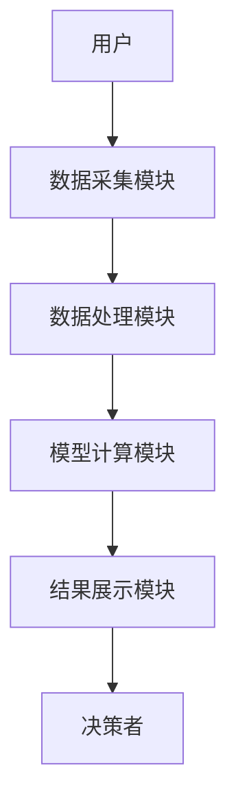

                 


# 构建智能企业决策支持系统：多维度情景模拟与风险评估

> 关键词：智能决策支持系统、多维度情景模拟、风险评估、人工智能、大数据技术

> 摘要：  
在当今快速变化的商业环境中，企业决策需要更加智能化和数据驱动化。本文详细探讨了如何构建智能企业决策支持系统，通过多维度情景模拟与风险评估来优化企业决策过程。文章从理论基础、技术实现、系统架构到项目实战，全面解析了构建智能决策支持系统的各个关键环节，并通过具体案例展示了如何在实际业务中应用这些技术。通过本文，读者将能够理解如何利用人工智能和大数据技术来提升企业决策的准确性和效率。

---

## 第一部分：智能企业决策支持系统概述

### 第1章：智能企业决策支持系统背景与概念

#### 1.1 问题背景
企业决策过程通常面临以下挑战：
- 数据量大、维度复杂，难以快速提取关键信息。
- 决策依赖经验，缺乏数据支持，容易出现偏差。
- 风险评估不全面，难以预测和应对不确定性。

#### 1.2 智能企业决策支持系统的定义与目标
智能企业决策支持系统（ Intelligent Enterprise Decision Support System, IEDSS）是一种结合人工智能、大数据和业务知识的系统，旨在通过多维度的情景模拟和风险评估，为企业提供科学、高效的决策支持。

#### 1.3 多维度情景模拟与风险评估
- **多维度情景模拟**：通过分析不同维度（时间、空间、业务）的数据，生成多种可能的业务场景。
- **风险评估**：基于概率论和数学模型，评估每种情景下的风险，并提供优化建议。

### 1.4 本章小结
本章介绍了智能企业决策支持系统的背景、定义和核心功能，强调了多维度情景模拟与风险评估在决策过程中的重要性。

---

## 第二部分：多维度情景模拟与风险评估的核心概念

### 第2章：多维度情景模拟的理论基础

#### 2.1 数据驱动的决策模型
- **数据预处理**：清洗、转换和特征提取。
- **数据分析与建模**：使用统计分析、机器学习等方法构建预测模型。
- **模型评估与优化**：通过交叉验证和超参数调优提升模型性能。

#### 2.2 风险评估的数学模型
- **概率论在风险评估中的应用**：例如，贝叶斯定理用于计算条件概率。
- **风险矩阵**：通过风险评分模型量化风险程度。

#### 2.3 多维度分析的维度分解
- **时间维度**：分析历史数据和趋势。
- **空间维度**：分析地理位置和分布。
- **业务维度**：分析业务流程和关键绩效指标。

### 第3章：多维度情景模拟与风险评估的关联性

#### 3.1 情景模拟与风险评估的关系
- 情景模拟为风险评估提供数据支持。
- 风险评估优化情景模拟的准确性。

#### 3.2 核心概念与联系的对比分析
- **对比表**：展示了情景模拟和风险评估在目标、方法和应用场景上的差异。
- **ER实体关系图**：展示了系统中实体（如用户、场景、风险）之间的关系。
- **系统架构图（Mermaid）**：展示了系统的主要模块及其交互关系。

---

## 第三部分：智能企业决策支持系统的算法与技术实现

### 第3章：算法实现与技术细节

#### 3.1 数据预处理与特征提取
- **数据清洗**：处理缺失值、重复值和异常值。
- **特征工程**：提取关键特征，例如使用PCA降维。

#### 3.2 风险评估的数学模型
- **公式示例**：例如，风险评分公式：
  $$ \text{风险评分} = \sum_{i=1}^{n} w_i \cdot x_i $$
  其中，\( w_i \) 是特征 \( x_i \) 的权重。

#### 3.3 机器学习模型的实现
- **随机森林**：用于分类和回归任务。
- **XGBoost**：用于高精度的预测模型。
- **代码示例**（Python）：
  ```python
  import pandas as pd
  from sklearn.ensemble import RandomForestClassifier

  # 数据加载与处理
  data = pd.read_csv('data.csv')
  X = data.drop('target', axis=1)
  y = data['target']

  # 模型训练
  model = RandomForestClassifier()
  model.fit(X, y)
  ```

#### 3.4 情景模拟的实现
- **生成情景**：通过随机采样或蒙特卡洛模拟生成多种业务场景。
- **情景评估**：对每种情景进行风险评估和优化建议。

---

## 第四部分：系统架构与设计

### 第4章：系统架构设计

#### 4.1 系统功能模块
- **数据采集模块**：从数据库中获取数据。
- **模型计算模块**：执行情景模拟和风险评估。
- **结果展示模块**：以可视化形式呈现分析结果。

#### 4.2 系统架构图（Mermaid）


#### 4.3 接口设计与交互流程
- **接口设计**：RESTful API，用于前后端交互。
- **交互流程**：用户输入查询条件，系统返回分析结果。

---

## 第五部分：项目实战与应用

### 第5章：项目实战

#### 5.1 环境配置
- **工具安装**：安装Python、Jupyter Notebook、Flask框架。
- **数据集准备**：获取企业数据并进行预处理。

#### 5.2 核心代码实现
- **数据处理代码**：
  ```python
  import pandas as pd
  import numpy as np

  # 数据加载
  df = pd.read_csv('data.csv')

  # 特征工程
  df['new_feature'] = df['feature1'] * df['feature2']
  ```

- **模型训练代码**：
  ```python
  from sklearn.model_selection import train_test_split
  from sklearn.metrics import accuracy_score

  X_train, X_test, y_train, y_test = train_test_split(X, y, test_size=0.2)
  model.fit(X_train, y_train)
  print("Accuracy:", accuracy_score(model.predict(X_test), y_test))
  ```

#### 5.3 案例分析与结果解读
- **案例分析**：以某企业为例，展示如何通过系统进行情景模拟和风险评估。
- **结果解读**：分析模型输出的结果，并提出优化建议。

---

## 第六部分：总结与展望

### 6.1 总结
本文详细介绍了智能企业决策支持系统的构建过程，从理论到实践，全面解析了多维度情景模拟与风险评估的关键技术。

### 6.2 展望
未来，随着人工智能和大数据技术的进一步发展，智能决策支持系统将更加智能化和自动化，为企业决策提供更强大的支持。

---

## 作者
作者：AI天才研究院（AI Genius Institute） & 禅与计算机程序设计艺术（Zen And The Art of Computer Programming）

---

通过本文，读者可以系统地了解智能企业决策支持系统的构建方法，并能够在实际项目中应用这些技术。

