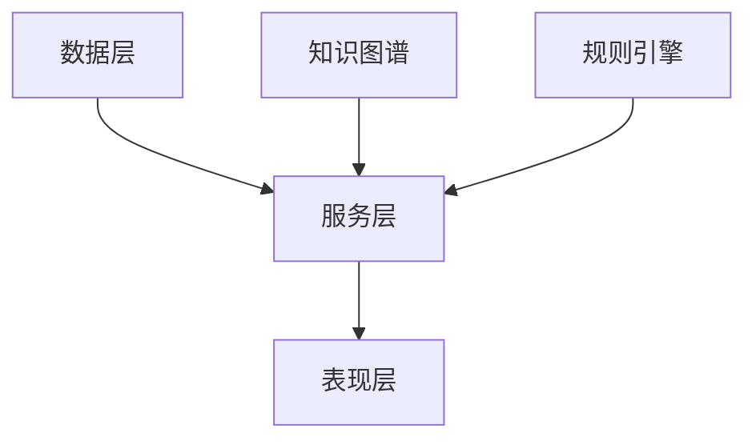
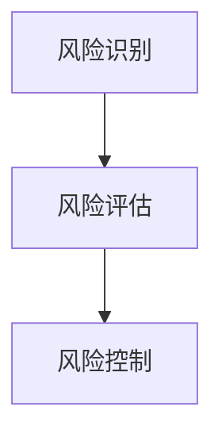
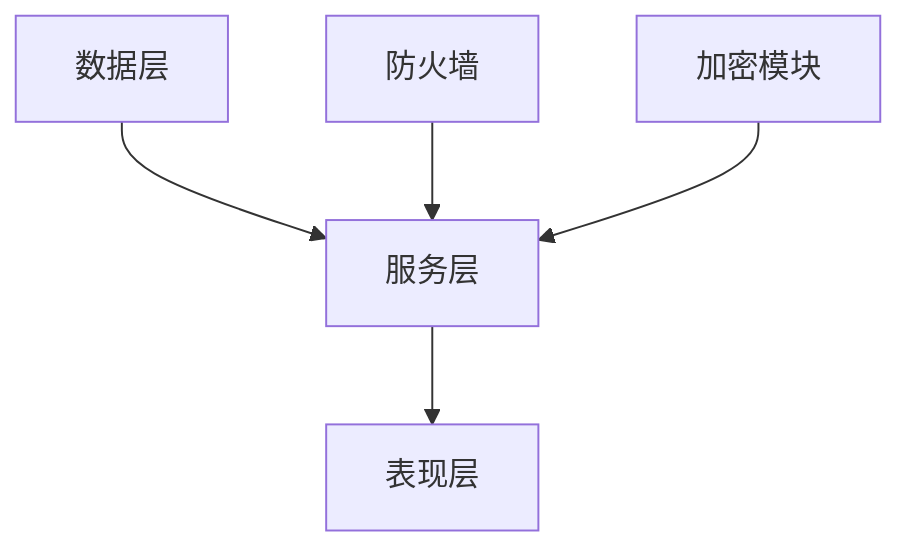

                 


# 构建智能企业合规管理系统：AI辅助风险识别与控制

> 关键词：企业合规管理，人工智能，风险识别，风险控制，系统架构，算法原理

> 摘要：本文详细探讨了如何利用人工智能技术构建智能企业合规管理系统，重点分析了AI在风险识别与控制中的应用价值，系统设计与实现，以及实际项目中的应用案例。通过理论与实践相结合的方式，深入解析了企业合规管理的痛点、AI技术的核心原理、系统架构设计及其实现方案，为企业合规管理的智能化转型提供了全面的技术指导和实践参考。

---

## 第一部分: 背景与概念

### 第1章: 企业合规管理的背景与挑战

#### 1.1 企业合规管理的基本概念

企业合规管理是指企业依据相关法律法规、行业标准及内部规章制度，对自身的经营行为、业务流程、内部治理等进行合法性和合规性的审查、监控和优化的过程。合规管理的核心目标是确保企业在经营活动中不触犯法律、不违反行业规范，同时降低经营风险。

**合规管理的核心要素包括：**
1. **法律法规遵循**：确保企业行为符合国家法律法规。
2. **行业标准合规**：符合行业内的标准和规范。
3. **内部制度执行**：确保企业内部制度的有效执行。
4. **风险管理**：识别和控制潜在的合规风险。

**企业合规管理的边界与外延：**
- **边界**：合规管理主要关注企业的外部法律和内部制度的遵守，不涉及企业的核心业务创新。
- **外延**：合规管理不仅包括对过去行为的审查，还包括对未来的预测和预防，具有前瞻性和动态性。

#### 1.2 传统企业合规管理的模式与问题

**传统合规管理的主要模式：**
1. **人工审查模式**：依赖人工对合同、文件、流程进行逐一审查。
2. **制度化管理**：通过制定内部规章制度，明确员工的行为规范。
3. **事后监管模式**：主要在出现问题后进行调查和处理。

**传统模式中的主要问题：**
1. **效率低下**：人工审查耗时长，成本高，难以覆盖全部业务。
2. **主观性强**：依赖人工判断，容易受到个人经验的影响。
3. **滞后性**：事后处理无法及时解决问题，可能导致风险扩大。
4. **覆盖面有限**：难以应对复杂多变的法律环境和行业标准。

#### 1.3 AI在企业合规管理中的应用价值

**AI技术如何提升合规管理效率：**
1. **自动化审查**：利用NLP技术自动解析合同、文件，识别潜在风险。
2. **实时监控**：通过AI系统实时监测业务流程，及时发现违规行为。
3. **数据驱动决策**：基于大数据分析，提供合规建议和预测。

**AI在风险识别与控制中的作用：**
1. **智能风险识别**：通过机器学习算法识别潜在风险点。
2. **动态风险评估**：根据实时数据动态调整风险等级。
3. **自动化控制措施**：根据风险评估结果自动触发控制措施。

**AI辅助合规管理的创新点：**
1. **智能化**：AI能够自主学习和优化，提升合规管理的效率。
2. **实时性**：AI系统可以实时监控和响应，减少滞后性。
3. **数据驱动**：基于海量数据的分析，提供精准的合规建议。

### 第2章: AI技术基础与企业合规管理

#### 2.1 机器学习与自然语言处理

**机器学习的基本概念：**
- 机器学习是一种通过数据训练模型，使其能够从数据中学习并做出预测的技术。
- 监督学习、无监督学习、半监督学习是机器学习的三大主要类型。

**自然语言处理（NLP）的核心技术：**
- 分词：将文本分割成词语或短语。
- 语义分析：理解文本的语义和意图。
- 实体识别：识别文本中的关键实体（如人名、地名、组织名）。

**机器学习与NLP在合规管理中的应用：**
- **合同审查**：通过NLP技术自动解析合同内容，识别潜在的法律风险。
- **风险识别**：利用机器学习模型预测潜在的合规风险。

#### 2.2 知识图谱与规则引擎

**知识图谱的构建与应用：**
- 知识图谱是一种以图结构形式表示知识的工具，能够将分散的知识点整合起来。
- 在合规管理中，知识图谱可以用于存储法律法规、行业标准等知识，帮助系统快速识别相关风险。

**规则引擎的工作原理：**
- 规则引擎是一种用于执行和管理业务规则的软件组件。
- 在合规管理中，规则引擎可以用于根据预设的规则自动触发相应的控制措施。

**知识图谱与规则引擎在合规管理中的结合：**
- 知识图谱提供知识支持，规则引擎提供执行能力，两者结合可以实现智能化的合规管理。

#### 2.3 数据安全与隐私保护

**数据安全的基本原则：**
1. **最小权限原则**：用户只能访问与其职责相关的数据。
2. **数据加密**：对敏感数据进行加密存储和传输。
3. **访问控制**：通过权限管理控制数据的访问范围。

**隐私保护的法律要求：**
- 数据保护法（如GDPR）要求企业对个人数据进行严格保护。
- 数据泄露事件可能导致严重的法律责任和声誉损失。

**AI技术在数据安全中的应用：**
- **数据脱敏**：在数据分析前对敏感数据进行脱敏处理，保护数据隐私。
- **异常检测**：通过AI技术实时监测数据访问行为，发现异常行为及时报警。

---

## 第二部分: 系统设计与实现

### 第3章: 智能合规管理系统的架构设计

#### 3.1 系统总体架构

**系统架构的分层设计：**
- **数据层**：负责数据的存储和管理。
- **服务层**：负责业务逻辑的实现。
- **表现层**：负责用户界面的展示和交互。

**系统架构图（Mermaid）：**


#### 3.2 功能模块设计

**功能模块设计：**
1. **风险识别模块**：负责识别潜在的合规风险。
2. **风险评估模块**：负责评估风险的严重程度。
3. **风险控制模块**：负责制定和执行风险控制措施。

**功能模块流程图（Mermaid）：**


#### 3.3 数据流与接口设计

**数据流设计：**
- 数据从表现层进入系统，经过服务层处理后存储在数据层。
- 知识图谱和规则引擎为服务层提供支持。

**系统接口设计：**
1. **数据输入接口**：用于接收外部数据。
2. **数据处理接口**：用于处理数据并生成结果。
3. **数据输出接口**：用于将结果返回给用户。

### 第4章: 系统功能实现

#### 4.1 风险识别与评估

**基于NLP的风险识别算法：**
- 使用NLP技术对文本进行分词、语义分析，识别潜在风险点。

**风险评估模型的构建：**
- 使用机器学习算法训练风险评估模型，根据历史数据预测风险等级。

**风险评估结果的可视化：**
- 通过图表形式展示风险评估结果，方便用户理解和决策。

#### 4.2 风险控制与优化

**风险控制策略的制定：**
- 根据风险评估结果制定相应的控制策略。

**基于机器学习的优化算法：**
- 使用强化学习算法动态调整风险控制策略，提升控制效果。

**风险控制的动态调整：**
- 根据实时数据动态调整风险控制措施，确保系统的有效性。

#### 4.3 系统监控与维护

**系统运行状态的监控：**
- 实时监控系统运行状态，发现异常及时报警。

**系统日志的管理：**
- 记录系统运行日志，便于故障排查和系统优化。

**系统的定期维护与更新：**
- 定期更新系统软件和数据，确保系统的稳定性和先进性。

### 第5章: 系统安全与隐私保护

#### 5.1 数据安全的保障措施

**数据加密技术：**
- 使用AES加密算法对敏感数据进行加密存储和传输。

**数据访问权限控制：**
- 通过角色权限管理（RBAC）控制数据访问权限。

**数据备份与恢复：**
- 定期备份数据，确保数据安全性和可恢复性。

#### 5.2 系统安全架构设计

**系统安全架构图（Mermaid）：**


---

## 第三部分: 项目实战与总结

### 第6章: 项目实战

#### 6.1 环境安装

**项目环境配置：**
- 操作系统：Linux
- 开发工具：Python、Jupyter Notebook
- 数据库：MySQL
- 其他工具：NLP工具（如spaCy）、机器学习库（如Scikit-learn）

#### 6.2 核心代码实现

**合同风险识别代码示例：**
```python
import spacy
from sklearn.feature_extraction.text import TfidfVectorizer
from sklearn.svm import SVC

# 加载NLP模型
nlp = spacy.load("en_core_web_sm")

def process_text(text):
    doc = nlp(text)
    # 提取关键词
    keywords = [token.text for token in doc]
    return " ".join(keywords)

# 数据预处理
texts = ["This is a sample contract.", "The terms and conditions are clear.", "There are potential risks here."]
tfidf = TfidfVectorizer()
X = tfidf.fit_transform([process_text(text) for text in texts])

# 训练分类器
model = SVC()
model.fit(X, [0, 1, 1])

# 预测风险
test_text = "There are potential risks in this agreement."
test_X = tfidf.transform([process_text(test_text)])
print(model.predict(test_X))
```

#### 6.3 案例分析与小结

**案例分析：**
- 某企业利用AI合规管理系统，成功识别并规避了一项潜在的法律风险，避免了数百万美元的损失。

**小结：**
- AI技术能够显著提升企业合规管理的效率和准确性。
- 系统的实时监控和自动化控制能力是其最大的优势。
- 数据安全和隐私保护是系统设计中的重要考虑因素。

---

## 第四部分: 总结与展望

### 第7章: 总结与展望

**总结：**
- 本文详细探讨了AI技术在企业合规管理中的应用，从理论到实践，全面解析了系统的构建过程。
- AI技术能够显著提升合规管理的效率和效果，为企业合规管理的智能化转型提供了有力的技术支持。

**展望：**
- 随着AI技术的不断发展，企业合规管理系统将更加智能化和自动化。
- 数据安全和隐私保护将成为系统设计中的重要考虑因素。
- 合规管理的智能化转型将推动企业管理模式的创新和升级。

---

## 作者

**作者：AI天才研究院/AI Genius Institute & 禅与计算机程序设计艺术 /Zen And The Art of Computer Programming**

---

通过以上思考，我可以开始撰写完整的文章，确保每个部分都符合用户的要求，内容详实，结构清晰。

