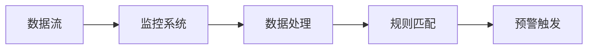
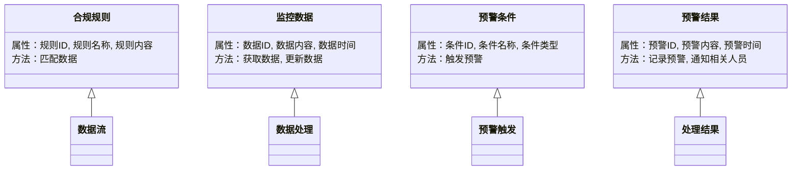
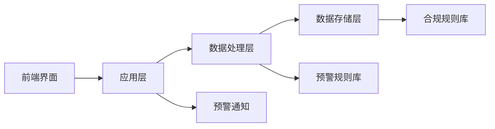
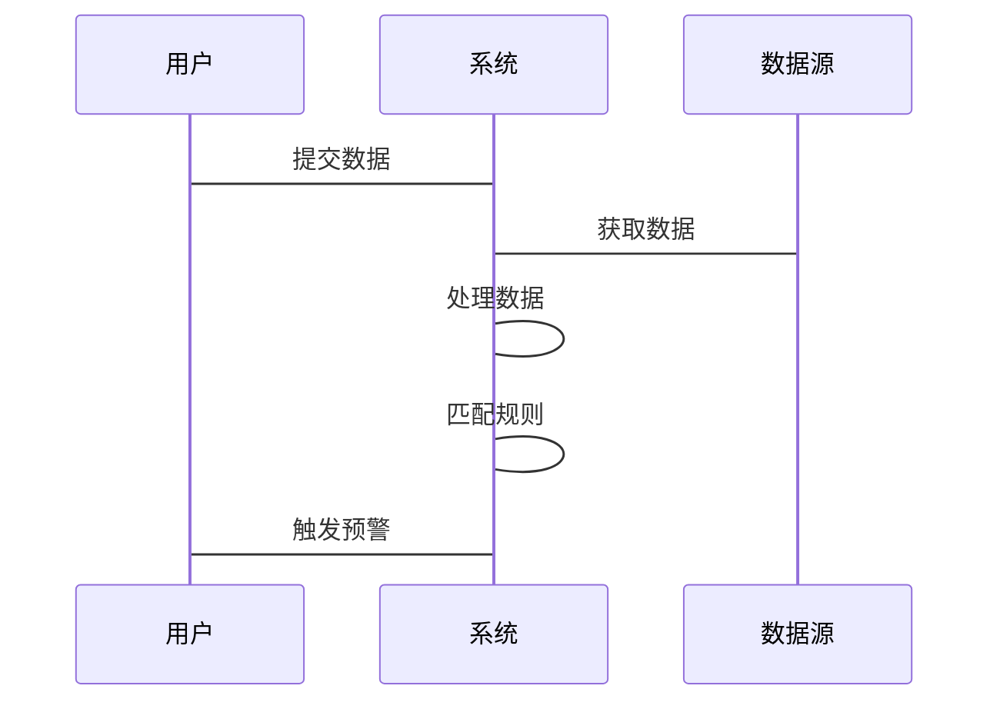

                 


# 构建智能企业合规管理系统：实时监控与预警机制设计

> 关键词：智能企业合规管理系统、实时监控、预警机制、流数据处理、异常检测、事件关联分析

> 摘要：本文详细探讨了智能企业合规管理系统的构建，重点分析了实时监控与预警机制的设计与实现。通过流数据处理、异常检测和事件关联分析等技术，构建了一个高效的预警系统，为企业提供及时的合规反馈，帮助企业在数字化转型中规避风险，确保合规性。

---

## 正文部分

### 第一部分：智能企业合规管理系统的背景与基础

#### 第1章：合规管理与智能企业概述

##### 1.1 合规管理的基本概念

###### 1.1.1 合规管理的定义
合规管理是指企业为了遵守相关法律法规、行业标准和内部规章制度，对自身的业务活动进行规范和监督的过程。它是企业风险管理的重要组成部分，确保企业在合法、合规的前提下开展业务。

###### 1.1.2 智能企业与合规管理的关系
智能企业通过大数据、人工智能等技术手段，将合规管理从传统的被动响应模式转变为主动预防模式。智能企业利用实时数据处理和自动化工具，能够快速识别潜在的合规风险，并采取相应的措施进行规避或整改。

###### 1.1.3 企业合规管理的核心要素
- **合规政策**：企业内部的规章制度、操作流程等。
- **数据源**：企业内外部数据，包括业务数据、日志数据、交易记录等。
- **监控工具**：用于实时监控和分析数据的工具，如日志分析系统、行为分析系统等。
- **预警机制**：基于监控数据触发预警的规则和流程。

##### 1.2 智能企业合规管理的背景

###### 1.2.1 数字化转型对企业合规的影响
随着企业数字化转型的深入，数据量激增，业务复杂度提高，合规管理的重要性也日益凸显。数字化转型带来了新的合规挑战，如数据隐私、网络安全、反欺诈等。

###### 1.2.2 合规管理面临的挑战与机遇
- **挑战**：传统合规管理依赖人工审查，效率低、成本高，难以应对海量数据和复杂场景。
- **机遇**：人工智能和大数据技术的应用，为合规管理提供了新的解决方案，提高了效率和准确性。

###### 1.2.3 智能合规管理的必要性
智能合规管理能够实时监控业务活动，快速识别和预警潜在风险，帮助企业及时应对，避免因合规问题导致的法律纠纷和经济损失。

##### 1.3 实时监控与预警机制的重要性

###### 1.3.1 合规管理中的实时监控需求
企业需要对业务活动进行实时监控，及时发现异常行为和潜在风险，避免事后处理带来的更大损失。

###### 1.3.2 预警机制在合规管理中的作用
预警机制通过设定阈值和规则，对监控数据进行分析，当发现异常或违规行为时，立即发出预警，提醒相关人员采取措施。

###### 1.3.3 实时监控与预警机制的实现目标
- **快速响应**：及时发现并处理合规问题。
- **自动化处理**：通过自动化工具减少人工干预，提高效率。
- **精准预警**：基于数据分析，精准识别潜在风险。

### 第2章：合规管理的核心概念与联系

#### 2.1 合规管理的核心原理

##### 2.1.1 合规管理的流程与步骤
1. **数据采集**：从企业内外部数据源获取相关数据。
2. **数据处理**：对数据进行清洗、转换和 enriching，使其适合分析。
3. **规则匹配**：将处理后的数据与合规规则进行匹配，识别异常或违规行为。
4. **预警触发**：当数据匹配到预警规则时，触发预警机制。
5. **事件处理**：相关人员根据预警信息进行调查和处理。

##### 2.1.2 合规规则的制定与执行
- **合规规则**：包括法律法规、行业标准和企业内部规章制度。
- **规则执行**：通过技术手段将合规规则转化为系统可以执行的规则，如正则表达式、条件判断等。

##### 2.1.3 合规数据的采集与处理
- **数据源**：日志文件、交易记录、行为记录等。
- **数据处理**：数据清洗、数据转换、数据存储等。

#### 2.2 实时监控与预警机制的原理

##### 2.2.1 实时监控的基本原理
实时监控通过流数据处理技术，对数据进行实时分析，发现异常或违规行为。

##### 2.2.2 预警机制的触发条件与规则
- **触发条件**：基于监控数据的某些指标超过阈值，或符合特定条件。
- **预警规则**：根据业务需求制定的规则，如“单笔交易金额超过100万元触发预警”。

##### 2.2.3 数据流与监控系统的交互


#### 2.3 合规管理的核心要素对比

##### 2.3.1 合规规则与监控数据的对比
| 特性        | 合规规则              | 监控数据              |
|-------------|-----------------------|-----------------------|
| 类型        | 文本、条件、规则       | 数值、日志、事件       |
| 来源        | 法律法规、企业制度     | 业务系统、日志系统     |
| 处理方式    | 静态，不变化           | 动态，实时变化         |

##### 2.3.2 不同合规场景的特征分析
- **高风险场景**：如大额交易、敏感数据访问等。
- **低风险场景**：如常规操作、小额交易等。

##### 2.3.3 合规管理系统的实体关系图


### 第3章：实时监控与预警机制的算法原理

#### 3.1 实时监控算法的核心原理

##### 3.1.1 流数据处理算法
流数据处理算法用于实时处理数据流，常见的算法包括：
- **滑动窗口算法**：用于处理时间段内的数据。
- **队列处理算法**：用于按顺序处理数据。

##### 3.1.2 异常检测算法
异常检测算法用于识别异常行为，常见的算法包括：
- **基于统计的方法**：如均值、标准差等。
- **基于机器学习的方法**：如聚类、分类等。

##### 3.1.3 事件关联分析算法
事件关联分析算法用于关联多个事件，识别潜在的风险。常见的算法包括：
- **关联规则学习**：如Apriori算法。
- **图分析算法**：如PageRank算法。

#### 3.2 预警机制的算法实现

##### 3.2.1 预警规则的动态调整
预警规则可以根据业务需求动态调整，如：
- **阈值调整**：根据业务情况调整预警阈值。
- **规则更新**：根据新的法律法规更新预警规则。

##### 3.2.2 基于概率的预警模型
基于概率的预警模型可以使用贝叶斯定理进行计算，公式如下：
$$ P(A|B) = \frac{P(B|A) \cdot P(A)}{P(B)} $$
其中，$A$表示事件，$B$表示证据。

##### 3.2.3 预警算法的实现步骤
1. 数据采集：从数据源获取数据。
2. 数据预处理：清洗数据，去除噪声。
3. 数据分析：使用算法对数据进行分析，识别异常。
4. 预警触发：当数据匹配到预警规则时，触发预警。

#### 3.3 代码实现与分析

##### 3.3.1 流数据处理代码
```python
import pandas as pd
from collections import deque

# 滑动窗口算法
def sliding_window(data, window_size):
    window = deque(maxlen=window_size)
    for item in data:
        window.append(item)
        if len(window) == window_size:
            # 处理窗口数据
            process(window)
```

##### 3.3.2 异常检测代码
```python
import numpy as np

# 基于均值的异常检测
def detect_anomaly(data, threshold):
    mean = np.mean(data)
    std = np.std(data)
    anomaly_threshold = mean + threshold * std
    for value in data:
        if value > anomaly_threshold:
            return True
    return False
```

##### 3.3.3 事件关联分析代码
```python
from sklearn.cluster import KMeans

# 基于聚类的事件关联分析
def associate_events(events, num_clusters):
    model = KMeans(n_clusters=num_clusters)
    model.fit(events)
    clusters = model.predict(events)
    return clusters
```

### 第4章：系统分析与架构设计

#### 4.1 系统功能设计

##### 4.1.1 领域模型类图


#### 4.2 系统架构设计

##### 4.2.1 系统架构图


#### 4.3 系统接口设计

##### 4.3.1 接口描述
- **数据接口**：用于数据的接收和处理。
- **规则接口**：用于合规规则的查询和更新。
- **预警接口**：用于预警的触发和通知。

##### 4.3.2 交互序列图


### 第5章：项目实战

#### 5.1 环境安装

##### 5.1.1 安装Python环境
```bash
python --version
pip install requests
pip install numpy
pip install pandas
pip install mermaid
```

#### 5.2 核心功能实现

##### 5.2.1 数据处理模块
```python
import pandas as pd

def process_data(data_frame):
    # 数据清洗
    data_frame = data_frame.dropna()
    # 数据转换
    data_frame['timestamp'] = pd.to_datetime(data_frame['timestamp'])
    return data_frame
```

##### 5.2.2 预警触发模块
```python
import logging

def trigger_alert(condition, data):
    if condition(data):
        logging.info("预警触发：{}".format(data))
        send_notification(data)
```

##### 5.2.3 通知模块
```python
import smtplib

def send_notification(message):
    # 发送邮件
    server = smtplib.SMTP('smtp.example.com', 587)
    server.starttls()
    server.login('user@example.com', 'password')
    server.sendmail('user@example.com', 'recipient@example.com', message)
    server.quit()
```

#### 5.3 代码应用解读

##### 5.3.1 数据处理模块解读
数据处理模块负责对数据进行清洗和转换，确保数据符合后续处理的要求。

##### 5.3.2 预警触发模块解读
预警触发模块根据预设的条件，对数据进行判断，当条件满足时触发预警。

##### 5.3.3 通知模块解读
通知模块负责将预警信息发送给相关人员，可以通过邮件、短信等方式进行通知。

#### 5.4 实际案例分析

##### 5.4.1 案例背景
某企业需要监控大额交易，设定预警条件为单笔交易金额超过100万元。

##### 5.4.2 数据分析
- **数据采集**：采集交易记录，包括交易金额、交易时间、交易人等信息。
- **数据处理**：清洗数据，去除无效数据，转换数据格式。
- **规则匹配**：判断交易金额是否超过100万元。
- **预警触发**：当交易金额超过100万元时，触发预警。

##### 5.4.3 案例小结
通过实时监控和预警机制，企业能够及时发现大额交易，快速采取措施，避免潜在的合规风险。

### 第6章：最佳实践与总结

#### 6.1 最佳实践

##### 6.1.1 系统设计
- **模块化设计**：将系统划分为多个模块，便于维护和扩展。
- **高可用性设计**：确保系统在部分节点故障时仍能正常运行。

##### 6.1.2 数据安全
- **数据加密**：对敏感数据进行加密处理。
- **访问控制**：限制数据访问权限，确保数据安全。

##### 6.1.3 人员培训
- **员工培训**：定期对员工进行合规培训，提高合规意识。

#### 6.2 小结
本文详细探讨了智能企业合规管理系统的构建，重点分析了实时监控与预警机制的设计与实现。通过流数据处理、异常检测和事件关联分析等技术，构建了一个高效的预警系统，帮助企业及时发现和处理合规问题。

#### 6.3 注意事项

##### 6.3.1 数据隐私
在处理数据时，必须遵守相关法律法规，保护数据隐私。

##### 6.3.2 系统性能
实时监控系统需要高性能的硬件和高效的算法，确保处理速度和响应时间。

##### 6.3.3 系统维护
定期对系统进行维护和更新，确保系统的稳定性和安全性。

#### 6.4 拓展阅读
- **推荐书籍**：《大数据时代的企业合规管理》。
- **推荐博客**：TechNet博客，深入探讨企业合规管理的技术实现。

### 附录

#### 附录A：算法与数学公式

##### A.1 流数据处理算法
滑动窗口算法用于处理时间段内的数据，公式如下：
$$ window\_size = current\_time - start\_time $$

##### A.2 异常检测算法
基于均值的异常检测公式：
$$ anomaly\_threshold = \mu + k\sigma $$

##### A.3 事件关联分析算法
关联规则学习的Apriori算法公式：
$$ support(A \rightarrow B) = \frac{count(A \cap B)}{total\_transactions} $$

#### 附录B：系统设计文档

##### B.1 领域模型类图


#### 附录C：数学公式

##### C.1 贝叶斯定理
$$ P(A|B) = \frac{P(B|A) \cdot P(A)}{P(B)} $$

##### C.2 均值与标准差
$$ \mu = \frac{1}{n} \sum_{i=1}^{n} x_i $$
$$ \sigma = \sqrt{\frac{1}{n} \sum_{i=1}^{n} (x_i - \mu)^2} $$

---

### 作者信息

作者：AI天才研究院/AI Genius Institute & 禅与计算机程序设计艺术/Zen And The Art of Computer Programming

---

以上就是完整的文章大纲和内容，涵盖了智能企业合规管理系统的各个方面，从背景到技术实现，再到项目实战，内容详实，结构清晰，适合技术读者深入学习和理解。

