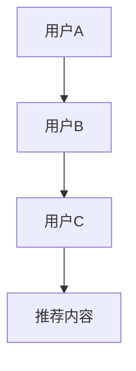
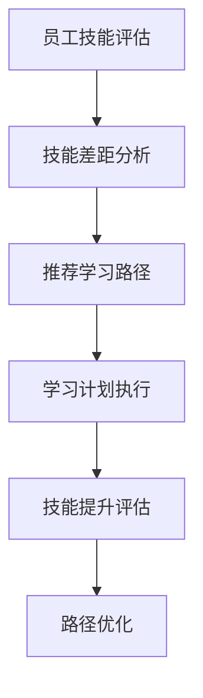

                 


# 构建智能企业学习管理系统：个性化技能发展路径规划

> 关键词：智能学习管理系统，个性化技能发展，推荐算法，技能路径规划，企业学习管理

> 摘要：本文详细探讨了如何构建一个智能企业学习管理系统，重点介绍如何通过个性化技能发展路径规划来优化员工学习体验。文章从背景、技术基础、算法实现、系统设计到项目实战，全面解析了构建智能学习管理系统的各个关键环节，并通过实际案例分析，展示了如何利用人工智能技术实现个性化学习推荐和技能路径规划。

---

# 第1章: 企业学习管理系统概述

## 1.1 企业学习管理系统的概念与背景

### 1.1.1 企业学习管理系统的定义
企业学习管理系统（Enterprise Learning Management System, ELMS）是一种利用信息技术和人工智能技术，为企业员工提供个性化学习体验的管理系统。它通过分析员工的学习需求、技能水平和职业发展目标，制定个性化的学习计划，并推荐相关课程和资源。

### 1.1.2 企业学习管理系统的背景与现状
随着企业对员工技能要求的不断提高，传统的基于固定课程的学习管理系统已难以满足员工个性化学习需求。近年来，人工智能技术的快速发展为企业学习管理系统提供了新的技术手段，使得个性化学习成为可能。

### 1.1.3 个性化技能发展的必要性
在知识经济时代，员工的技能更新速度要求越来越高。个性化技能发展路径规划能够帮助员工根据自身特点和发展目标，制定最适合的学习计划，从而提高学习效率和效果。

---

## 1.2 智能学习管理系统的核心特点

### 1.2.1 智能学习管理系统的定义
智能学习管理系统（Intelligent Learning Management System, ILMS）是在传统企业学习管理系统的基础上，结合人工智能技术，能够主动理解和适应员工学习需求的系统。它能够根据员工的学习行为和反馈，动态调整学习计划和推荐内容。

### 1.2.2 智能学习管理系统的功能特点
- **个性化推荐**：基于员工的学习历史、技能水平和职业目标，推荐最适合的学习资源。
- **技能分析与路径规划**：通过分析员工当前技能水平，制定个性化的技能提升路径。
- **自适应学习**：根据员工的学习进度和反馈，动态调整学习内容和难度。

### 1.2.3 个性化技能发展路径规划的意义
个性化技能发展路径规划能够帮助员工快速找到适合自己的学习方向，避免盲目学习，提高学习效率。同时，它也能够帮助企业更好地管理员工技能，提升整体竞争力。

---

## 1.3 本书的目标与结构

### 1.3.1 本书的目标
本书旨在通过理论与实践相结合的方式，详细讲解如何构建一个智能企业学习管理系统，并重点介绍个性化技能发展路径规划的核心技术和实现方法。

### 1.3.2 本书的结构安排
本书共分为七章，内容安排如下：
- 第1章：介绍企业学习管理系统的背景、概念和核心特点。
- 第2章：讲解智能学习管理系统的技术基础，包括人工智能在学习管理中的应用、推荐算法等。
- 第3章：详细探讨个性化技能分析与模型构建。
- 第4章：讲解智能学习管理系统的算法实现，包括推荐算法和技能路径规划算法。
- 第5章：介绍系统设计，包括需求分析、架构设计和接口设计。
- 第6章：通过项目实战，详细讲解系统实现和案例分析。
- 第7章：总结全书内容，并展望未来发展。

### 1.3.3 本书的适用读者
本书适用于企业学习管理系统的设计者、开发者、管理者，以及对人工智能技术在教育领域应用感兴趣的研究者和实践者。

---

# 第2章: 智能学习管理系统的技术基础

## 2.1 人工智能在学习管理系统中的应用

### 2.1.1 人工智能的基本概念
人工智能（Artificial Intelligence, AI）是指通过计算机模拟人类智能的技术。它包括机器学习、自然语言处理、计算机视觉等多个分支。

### 2.1.2 人工智能在教育领域的应用
- **智能推荐**：基于学习者的行为和偏好，推荐个性化学习资源。
- **学习分析**：通过分析学习者的行为数据，评估学习效果并提供反馈。
- **自适应学习**：根据学习者的学习进度，动态调整学习内容和难度。

### 2.1.3 人工智能在企业学习管理中的作用
人工智能技术能够帮助企业学习管理系统实现个性化推荐、技能分析和路径规划等功能，从而提升员工学习效率和企业竞争力。

---

## 2.2 个性化学习推荐算法

### 2.2.1 推荐算法的定义与分类
推荐算法是一种基于用户行为和偏好，为用户推荐相关内容的技术。常见的推荐算法包括协同过滤、基于内容的推荐和基于深度学习的推荐。

### 2.2.2 基于协同过滤的推荐算法
协同过滤是一种基于用户行为相似性的推荐算法。它通过分析用户的历史行为，找到与当前用户行为相似的用户，推荐他们喜欢的内容。

#### 协同过滤算法流程图（使用 Mermaid）


### 2.2.3 基于深度学习的推荐算法
基于深度学习的推荐算法通过构建神经网络模型，从大规模数据中学习用户偏好，并推荐个性化内容。常用的深度学习模型包括协同过滤神经网络（Neural Collaborative Filtering, NCF）和注意力机制模型（Attention-based Model）。

#### 基于深度学习的推荐算法代码示例（Python）
```python
import numpy as np
from keras.layers import Input, Embedding, Dense, Dot
from keras.models import Model

# 定义输入层
user_input = Input(shape=(1,))
item_input = Input(shape=(1,))

# 定义嵌入层
user_embedding = Embedding(input_dim=1000, output_dim=64)(user_input)
item_embedding = Embedding(input_dim=1000, output_dim=64)(item_input)

# 计算相似度
dot_product = Dot(axes=-1)([user_embedding, item_embedding])
dense_layer = Dense(1, activation='sigmoid')(dot_product)

# 定义模型
model = Model(inputs=[user_input, item_input], outputs=dense_layer)
model.compile(loss='binary_crossentropy', optimizer='adam', metrics=['accuracy'])
```

---

## 2.3 技能分析与路径规划的技术实现

### 2.3.1 技能分析的基本原理
技能分析是通过对员工的学习行为和工作表现进行分析，评估其当前技能水平，并识别技能差距。

### 2.3.2 技能路径规划的算法实现
技能路径规划算法通过分析员工的技能水平和职业目标，推荐适合的学习资源和路径。

#### 技能路径规划算法流程图（使用 Mermaid）


---

通过以上章节的详细介绍，我们可以看到构建智能企业学习管理系统需要结合人工智能技术，实现个性化技能发展路径规划。接下来的章节将详细讲解算法实现、系统设计和项目实战等内容。

