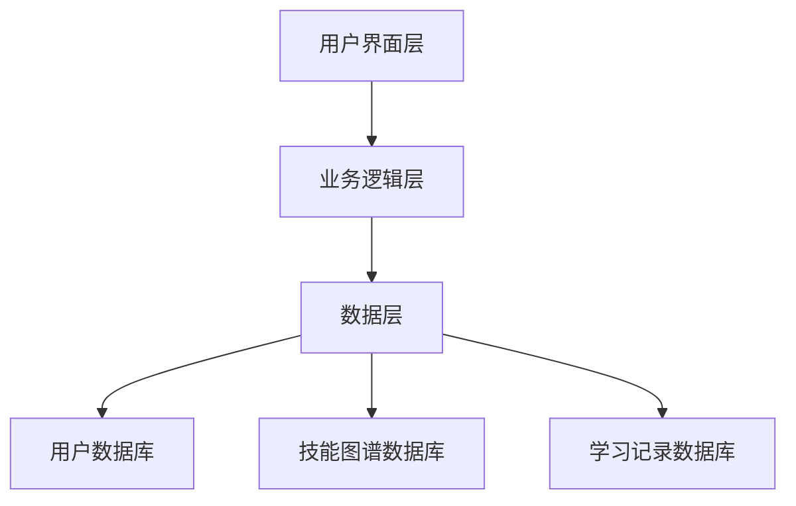

                 


# 构建智能企业学习管理系统：技能图谱与个性化发展规划的融合

## 关键词：
智能企业学习管理系统, 技能图谱, 个性化学习规划, 机器学习, 系统架构设计

## 摘要：
在现代企业环境中，学习管理系统的智能化发展已成为提升员工技能和企业竞争力的关键。本文探讨了如何通过构建技能图谱与个性化发展规划的融合，打造一个智能、高效的企业学习管理系统。文章从背景、核心概念、算法原理、系统设计到项目实战，全面解析了系统的构建过程，为企业提供了一套理论与实践相结合的解决方案。

---

## 第1章: 智能企业学习管理系统背景与核心概念

### 1.1 企业学习管理的背景介绍
#### 1.1.1 传统企业学习管理模式的局限性
传统的企业学习管理模式往往依赖于固定的学习路径和统一的培训方案，难以满足员工个性化发展的需求。这种模式容易导致学习效率低下、员工积极性不高以及技能提升效果不明显。

#### 1.1.2 当前企业学习管理的主要问题
- 学习资源分散，难以形成系统性学习路径。
- 员工技能水平参差不齐，个性化需求难以满足。
- 技能评估与职业发展规划脱节，导致学习目标不明确。

#### 1.1.3 技能图谱与个性化学习的必要性
技能图谱能够清晰地展示员工所需掌握的各项技能及其之间的关系，而个性化学习规划则能够根据员工的特点和需求，为其量身定制学习路径，从而提高学习效率和效果。

### 1.2 问题背景与问题描述
#### 1.2.1 学习资源分散与员工技能差距
企业内部的学习资源通常分散在不同的平台和系统中，员工难以方便地获取和利用这些资源，导致技能提升缓慢。

#### 1.2.2 个性化学习需求与企业目标的冲突
员工的个性化学习需求与企业的整体培训目标之间存在一定的矛盾，如何在满足个体需求的同时实现企业的战略目标，是一个亟待解决的问题。

#### 1.2.3 技能评估与职业发展规划的脱节
传统的技能评估方法往往缺乏科学性和系统性，导致职业发展规划缺乏依据，难以真正指导员工的职业发展。

### 1.3 问题解决与边界定义
#### 1.3.1 技能图谱与个性化学习的解决方案
通过构建技能图谱，明确各项技能之间的关系和优先级；结合个性化学习规划，为员工提供定制化的学习路径。

#### 1.3.2 系统边界与功能范围的界定
系统边界包括员工信息管理、技能图谱构建、个性化学习规划生成、学习效果评估等功能模块，同时与其他系统（如人力资源管理系统）进行数据交互。

#### 1.3.3 核心概念的外延与内涵
技能图谱是一个以技能节点为核心，通过关系网络描述技能之间依赖关系的图谱；个性化学习规划是基于员工特点和目标，为其定制的学习路径和计划。

### 1.4 核心概念与结构
#### 1.4.1 技能图谱的定义与组成
技能图谱由技能节点、关系边和层次结构组成，能够清晰地展示各项技能之间的关系和优先级。

#### 1.4.2 个性化学习规划的核心要素
包括员工特征分析、学习目标设定、学习路径规划、学习资源推荐和学习效果评估。

#### 1.4.3 系统整体架构与功能模块
系统架构包括数据采集模块、技能图谱构建模块、个性化学习规划模块、学习效果评估模块和用户界面模块。

---

## 第2章: 技能图谱与个性化学习的核心概念

### 2.1 技能图谱的构建原理
#### 2.1.1 技能节点与关系网络
技能节点是技能图谱的基本单位，关系边描述技能之间的依赖关系。

#### 2.1.2 技能层次与领域划分
技能图谱可以根据技能的复杂程度和应用场景进行层次划分，同时根据领域进行分类。

#### 2.1.3 技能图谱的动态更新机制
技能图谱需要根据企业需求和员工反馈进行动态更新，以保持其准确性和实用性。

### 2.2 个性化学习规划的理论基础
#### 2.2.1 学习者特征分析
包括员工的知识水平、技能水平、学习能力和兴趣爱好等。

#### 2.2.2 学习目标与路径规划
根据员工的职业目标和企业发展需求，制定个性化的学习目标和路径。

#### 2.2.3 学习效果的评估与反馈
通过评估员工的学习效果，提供反馈并调整学习计划。

### 2.3 技能图谱与个性化学习的关联
#### 2.3.1 技能需求与学习目标的匹配
技能图谱能够帮助明确员工的学习需求，确保学习目标与企业发展需求一致。

#### 2.3.2 学习路径的动态调整
通过技能图谱，可以根据员工的学习进展和反馈，动态调整学习路径。

#### 2.3.3 系统的协同优化机制
技能图谱和个性化学习规划的结合，可以实现系统的协同优化，提高学习效率和效果。

### 2.4 核心概念对比分析
#### 2.4.1 技能图谱与知识图谱的差异
知识图谱侧重于知识的结构化表示，而技能图谱侧重于技能的层次化和关系化表示。

#### 2.4.2 个性化学习与其他学习模式的区别
个性化学习强调学习的定制化和动态调整，而其他学习模式可能更加注重统一性和标准化。

#### 2.4.3 技能图谱与知识图谱的对比表格
| 特性          | 技能图谱       | 知识图谱       |
|---------------|----------------|----------------|
| 核心目标      | 描述技能关系   | 描述知识体系   |
| 数据来源      | 技能数据       | 知识点数据     |
| 应用场景      | 个性化学习规划 | 知识检索与推荐 |

### 2.5 技能图谱的构建过程
#### 2.5.1 技能节点的抽取与标注
通过文本挖掘和自然语言处理技术，从企业文档和岗位需求中抽取技能节点。

#### 2.5.2 技能关系的构建
基于技能节点之间的依赖关系，构建技能图谱的关系边。

#### 2.5.3 技能图谱的可视化
通过图数据库和可视化工具，将技能图谱以图形化的方式展示出来。

---

## 第3章: 个性化学习规划的算法原理

### 3.1 基于协同过滤的推荐算法
#### 3.1.1 协同过滤的基本原理
通过分析用户的行为和偏好，找到相似的用户群体，推荐相似的技能资源。

#### 3.1.2 基于物品的协同过滤
通过分析技能之间的相似性，推荐相关的技能资源。

#### 3.1.3 协同过滤的实现步骤
1. 数据预处理：收集用户行为数据和技能属性数据。
2. 相似度计算：使用余弦相似度或Jaccard系数计算技能之间的相似度。
3. 推荐生成：根据相似度排序，为用户推荐最相关的技能资源。

### 3.2 基于内容的推荐算法
#### 3.2.1 内容推荐的基本原理
通过对技能资源的内容进行分析和特征提取，为用户推荐符合其兴趣的技能资源。

#### 3.2.2 基于向量空间模型的推荐
将每个技能表示为向量空间中的一个点，通过计算向量的相似度进行推荐。

#### 3.2.3 内容推荐的实现步骤
1. 技能特征提取：将技能描述文本转换为向量表示。
2. 相似度计算：计算用户兴趣向量与技能向量的相似度。
3. 推荐生成：根据相似度排序，推荐最相关的技能资源。

### 3.3 混合推荐算法
#### 3.3.1 混合推荐的基本原理
结合协同过滤和内容推荐的优点，通过加权的方式生成最终的推荐结果。

#### 3.3.2 混合推荐的实现步骤
1. 收集用户行为数据和技能属性数据。
2. 分别使用协同过滤和内容推荐算法生成推荐列表。
3. 根据权重对两个推荐列表进行加权融合，生成最终的推荐结果。

### 3.4 算法实现的数学模型
#### 3.4.1 协同过滤的相似度计算公式
$$ \text{相似度}(u_1, u_2) = \frac{\sum_{i} (r_{u1,i} - \bar{r}_{u1}) \cdot (r_{u2,i} - \bar{r}_{u2})}{\sqrt{\sum_{i} (r_{u1,i} - \bar{r}_{u1})^2} \cdot \sqrt{\sum_{i} (r_{u2,i} - \bar{r}_{u2})^2}}} $$

#### 3.4.2 基于向量空间模型的相似度计算公式
$$ \text{相似度}(v_1, v_2) = \frac{v_1 \cdot v_2}{\sqrt{v_1 \cdot v_1} \cdot \sqrt{v_2 \cdot v_2}} $$

---

## 第4章: 系统分析与架构设计

### 4.1 系统功能设计
#### 4.1.1 学习者模型
- 用户信息管理：包括员工的基本信息、技能水平和学习记录。
- 学习目标设定：根据员工的职业规划和企业发展需求，设定学习目标。

#### 4.1.2 技能图谱构建
- 技能节点抽取：通过自然语言处理技术从岗位需求和培训资料中抽取技能节点。
- 技能关系构建：通过分析技能之间的依赖关系，构建技能图谱的关系边。

#### 4.1.3 个性化推荐引擎
- 学习路径规划：根据员工的特点和目标，为其定制个性化学习路径。
- 技能资源推荐：基于协同过滤和内容推荐算法，推荐相关的技能资源。

### 4.2 系统架构设计
#### 4.2.1 分层架构
- 数据层：负责数据的存储和管理，包括用户信息、技能图谱和学习记录。
- 业务逻辑层：负责系统的业务逻辑处理，包括技能图谱构建和个性化推荐。
- 用户界面层：负责与用户的交互，包括学习路径展示和技能资源推荐。

#### 4.2.2 模块划分
- 用户管理模块：负责用户信息的管理。
- 技能图谱模块：负责技能图谱的构建和管理。
- 个性化推荐模块：负责学习路径规划和技能资源推荐。
- 学习效果评估模块：负责学习效果的评估和反馈。

#### 4.2.3 系统架构图


### 4.3 系统接口设计
#### 4.3.1 API接口定义
- `GET /users`：获取所有用户信息。
- `POST /skills`：提交技能数据。
- `GET /recommendations`：获取个性化推荐结果。

#### 4.3.2 接口交互流程
1. 用户登录系统，输入个人信息。
2. 系统根据用户信息生成个性化学习路径。
3. 用户查看推荐的技能资源并进行学习。
4. 系统记录用户的学习行为，并更新技能图谱和学习记录。

### 4.4 系统交互设计
#### 4.4.1 用户登录与注册
- 用户登录：输入用户名和密码，系统验证身份。
- 用户注册：填写个人信息并创建账户。

#### 4.4.2 学习路径展示
- 系统根据用户的个性化需求，展示学习路径和推荐资源。

#### 4.4.3 学习效果反馈
- 用户完成学习任务后，系统记录学习效果并提供反馈。

---

## 第5章: 项目实战

### 5.1 环境安装与配置
#### 5.1.1 系统运行环境
- 操作系统：Linux/Windows/MacOS
- 开发工具：Python/Java/JavaScript
- 数据库：MySQL/PostgreSQL
- 依赖库：numpy, pandas, scikit-learn, networkx

#### 5.1.2 系统安装步骤
1. 安装Python和相关依赖库。
2. 安装数据库并配置连接。
3. 安装前端框架（如React或Vue）。

### 5.2 系统核心代码实现
#### 5.2.1 技能图谱构建
```python
import networkx as nx

def build_skill_graph(skill_data):
    G = nx.Graph()
    for skill in skill_data:
        G.add_node(skill['name'])
        for dependency in skill['dependencies']:
            G.add_edge(skill['name'], dependency)
    return G
```

#### 5.2.2 个性化推荐算法
```python
from sklearn.metrics.pairwise import cosine_similarity

def collaborative_filtering(user_data):
    user_matrix = user_data.reshape(1, -1)
    similarity = cosine_similarity(user_matrix, user_data)
    return similarity.argsort()[0][::-1][:5]
```

#### 5.2.3 学习路径规划
```python
def generate_learning_path(user_profile, skill_graph):
    path = []
    current_skill = user_profile['current_skill']
    while current_skill != user_profile['target_skill']:
        path.append(current_skill)
        current_skill = next_skill(current_skill, skill_graph)
    path.append(current_skill)
    return path
```

### 5.3 系统功能实现
#### 5.3.1 用户信息管理
- 功能：用户注册、登录、信息修改。
- 实现：通过数据库存储用户信息，并提供相应的API接口。

#### 5.3.2 技能图谱构建
- 功能：从岗位需求和培训资料中抽取技能节点，构建技能图谱。
- 实现：使用自然语言处理技术进行文本挖掘，构建技能图谱的关系边。

#### 5.3.3 个性化推荐
- 功能：根据用户特点和目标，推荐学习资源和路径。
- 实现：基于协同过滤和内容推荐算法，生成个性化推荐结果。

### 5.4 实际案例分析
#### 5.4.1 案例背景
某企业希望通过构建智能学习管理系统，提升员工的技能水平和工作效率。

#### 5.4.2 实施过程
1. 收集企业岗位需求和培训资料，构建技能图谱。
2. 根据员工特点和职业目标，生成个性化学习路径。
3. 根据学习效果反馈，动态调整学习计划。

#### 5.4.3 实施效果
- 员工技能水平显著提升。
- 学习效率提高，员工满意度增加。
- 企业整体竞争力增强。

---

## 第6章: 总结与展望

### 6.1 本章小结
本文详细介绍了智能企业学习管理系统的构建过程，包括技能图谱和个性化学习规划的核心概念、算法原理和系统设计。通过项目的实战，展示了系统的实现和应用效果。

### 6.2 未来展望
随着人工智能和大数据技术的不断发展，智能企业学习管理系统将更加智能化和个性化。未来的研究方向包括更精准的技能图谱构建、更高效的推荐算法以及更智能的学习效果评估。

### 6.3 最佳实践 Tips
- 技能图谱的构建需要结合企业的实际情况，确保其准确性和实用性。
- 个性化学习规划需要根据员工的特点和需求进行动态调整，以提高学习效果。
- 系统的实现需要结合企业的实际需求，选择合适的技术和工具。

### 6.4 注意事项
- 在构建技能图谱时，需要注意数据的准确性和完整性。
- 在实现个性化推荐时，需要保护用户的隐私和数据安全。
- 在系统设计和实现过程中，需要充分考虑系统的可扩展性和可维护性。

### 6.5 拓展阅读
- 《推荐系统实践》：深入理解推荐算法的实现和应用。
- 《图论与网络流》：掌握图数据结构和算法的基本理论。
- 《个性化学习系统设计》：学习如何设计和实现个性化的学习管理系统。

---

## 作者：AI天才研究院/AI Genius Institute & 禅与计算机程序设计艺术 /Zen And The Art of Computer Programming

---

这篇文章详细介绍了智能企业学习管理系统的构建过程，涵盖了技能图谱和个性化学习规划的核心概念、算法原理和系统设计。通过项目的实战，展示了系统的实现和应用效果。希望本文能够为企业的学习管理系统建设提供有益的参考和指导。

