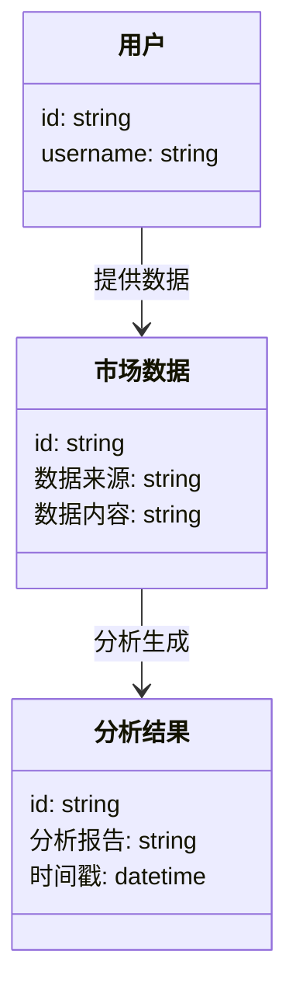

                 


# 构建智能企业市场调研系统：自动化数据收集与分析

> 关键词：智能企业，市场调研，数据收集，数据分析，自动化，系统架构

> 摘要：本文章详细探讨如何构建一个智能企业市场调研系统，通过自动化数据收集与分析，提高市场调研的效率和准确性。文章从系统概述、核心概念、算法原理、数学模型、系统架构到项目实战，全面分析系统构建的关键点，提供详细的实现步骤和代码示例。

---

# 第1章: 智能企业市场调研系统概述

## 1.1 市场调研的背景与意义

### 1.1.1 传统市场调研方法的局限性
传统市场调研方法依赖人工收集和分析数据，耗时长、成本高，且容易受到主观因素影响，结果可能存在偏差。此外，传统方法难以处理海量数据，导致信息不完整或滞后。

### 1.1.2 智能化市场调研的必要性
随着企业对实时数据的需求增加，智能化市场调研系统通过自动化数据收集和分析，能够快速获取准确的市场信息，帮助企业在竞争激烈的市场中占据优势。

### 1.1.3 企业市场调研的核心目标
- 支持决策：通过数据分析提供市场趋势、竞争对手分析等信息，为企业的战略决策提供支持。
- 降低成本：自动化数据收集和分析减少了人工干预，降低了调研成本。
- 提高效率：快速获取数据，缩短市场调研周期。

## 1.2 智能企业市场调研系统的定义

### 1.2.1 核心概念与问题背景
智能企业市场调研系统是一种基于人工智能和大数据技术的自动化系统，能够从多种数据源（如社交媒体、行业报告、销售数据等）收集数据，并通过机器学习算法进行分析，生成市场研究报告。

### 1.2.2 问题描述与解决路径
- 问题：数据来源多样、格式复杂，人工收集和分析效率低。
- 解决：构建自动化数据收集模块和智能化分析模块，实现数据的自动处理和分析。

### 1.2.3 系统的边界与外延
系统边界：仅处理市场调研相关数据，不涉及企业内部数据。
系统外延：可扩展至其他数据分析场景，如客户行为分析。

---

# 第2章: 核心概念与联系

## 2.1 系统核心要素分析

### 2.1.1 数据来源与处理流程
- 数据来源：社交媒体、行业报告、政府统计数据等。
- 处理流程：数据采集、清洗、特征提取、建模分析。

### 2.1.2 数据分析方法与模型
- 常用方法：文本挖掘、 sentiment analysis、聚类分析。
- 模型：基于机器学习的分类和回归模型。

### 2.1.3 结果可视化与决策支持
- 可视化工具：仪表盘、图表。
- 决策支持：生成市场报告，提供数据驱动的决策建议。

## 2.2 核心概念原理

### 2.2.1 数据收集模块原理
- 通过API接口或网络爬虫收集数据。
- 数据清洗：去除噪声数据，确保数据质量。

### 2.2.2 数据分析模块原理
- 使用机器学习算法对数据进行分类、聚类等分析。
- 自动生成分析结果，如市场趋势、竞争对手分析。

### 2.2.3 结果可视化模块原理
- 将分析结果以图表形式展示，便于用户理解和决策。

## 2.3 ER实体关系图

```mermaid
er
  actor: 用户
  system: 智能市场调研系统
  market_data: 市场数据
  analysis_result: 分析结果
  report: 调研报告
  actor --> system: 请求分析
  system --> market_data: 获取数据
  system --> analysis_result: 执行分析
  system --> report: 生成报告
  actor <-- report: 获取报告
```

---

# 第3章: 算法原理讲解

## 3.1 数据预处理算法

### 3.1.1 数据清洗
- 去除重复数据、处理缺失值、标准化数据。

### 3.1.2 特征提取
- 使用文本挖掘提取关键词，如TF-IDF方法。

## 3.2 机器学习算法

### 3.2.1 分类算法
- 使用随机森林、逻辑回归等算法进行市场趋势分类。

### 3.2.2 回归算法
- 使用线性回归预测市场增长率。

---

# 第4章: 数学模型和公式

## 4.1 线性回归模型

### 4.1.1 公式表示
$$y = \beta_0 + \beta_1x + \epsilon$$

### 4.1.2 示例
- $y$：市场增长率
- $x$：广告投入

## 4.2 决策树模型

### 4.2.1 公式表示
- 决策树通过特征分裂进行分类，无需显式公式。

---

# 第5章: 系统分析与架构设计

## 5.1 问题场景介绍

### 5.1.1 应用场景
- 实时市场监控
- 竞争对手分析

## 5.2 系统功能设计

### 5.2.1 领域模型类图



## 5.3 系统架构设计

### 5.3.1 系统架构图


---

# 第6章: 项目实战

## 6.1 环境安装

### 6.1.1 安装Python和相关库
```bash
pip install pandas numpy scikit-learn matplotlib
```

## 6.2 系统核心实现源代码

### 6.2.1 数据采集模块
```python
import requests
from bs4 import BeautifulSoup

def fetch_data(url):
    response = requests.get(url)
    soup = BeautifulSoup(response.text, 'html.parser')
    return soup
```

### 6.2.2 数据分析模块
```python
from sklearn.ensemble import RandomForestClassifier

def train_model(X, y):
    model = RandomForestClassifier()
    model.fit(X, y)
    return model
```

## 6.3 实际案例分析
- 使用爬虫获取行业报告数据。
- 使用机器学习模型预测市场趋势。

---

# 结论

智能企业市场调研系统通过自动化数据收集和分析，显著提高了市场调研的效率和准确性。本文详细分析了系统构建的关键点，并提供了实际的代码示例和案例分析。

---

作者：AI天才研究院/AI Genius Institute & 禅与计算机程序设计艺术 /Zen And The Art of Computer Programming

