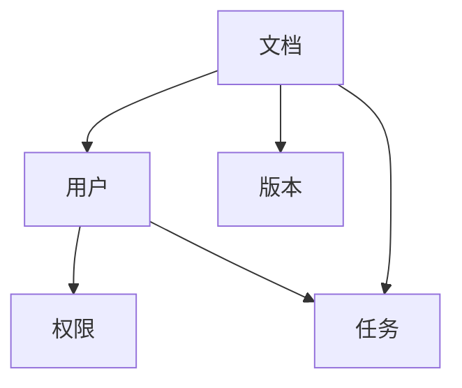
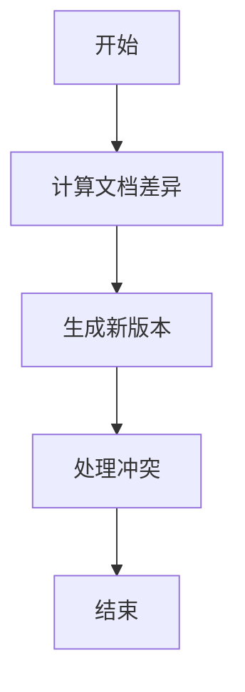
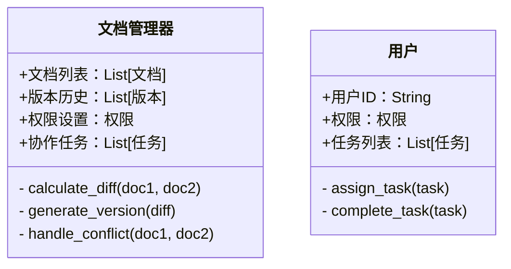
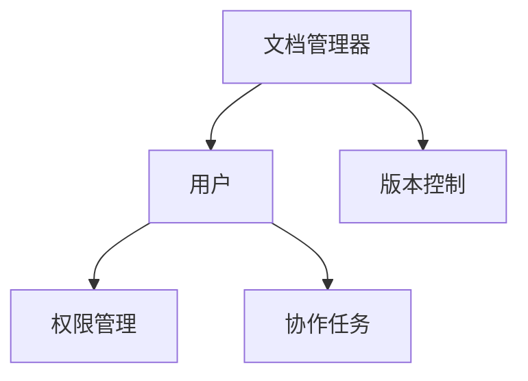

                 


# 构建智能企业文档管理系统：版本控制与协作优化

> **关键词**: 智能文档管理，版本控制，协作优化，企业文档系统，分布式协作，AI驱动

> **摘要**: 本文详细探讨了构建智能企业文档管理系统的各个方面，重点分析了版本控制与协作优化的核心技术。通过结合AI技术和分布式协作机制，提出了一种高效的文档管理系统解决方案，旨在提升企业的文档管理效率和协作能力。

---

# 第一部分: 智能企业文档管理系统的背景与核心概念

## 第1章: 问题背景与需求分析

### 1.1 问题背景

#### 1.1.1 传统文档管理中的常见问题
在企业环境中，文档管理是一个复杂的任务，涉及大量的文件存储、版本控制和协作需求。传统文档管理系统存在以下问题：
- **版本混乱**：多个用户同时编辑同一文档时，容易出现版本冲突，导致数据不一致。
- **协作效率低下**：审批流程繁琐，信息传递不畅，团队协作效率低。
- **权限管理复杂**：难以对不同用户或团队设置精细的访问权限，存在安全隐患。

#### 1.1.2 企业文档管理的挑战
随着企业规模的扩大，文档数量激增，文档管理的难度也显著增加。具体挑战包括：
- **文档分散**：各部门使用不同的工具，文档难以统一管理。
- **数据冗余**：同一份文档在不同部门可能有多个版本，导致信息不一致。
- **缺乏智能化**：传统系统难以自动识别文档内容，无法提供智能推荐或自动归档功能。

#### 1.1.3 智能化文档管理的必要性
智能化文档管理通过引入AI技术，可以实现以下目标：
- **自动分类与归档**：基于文档内容自动分类，减少人工操作。
- **智能版本控制**：通过AI识别文档差异，自动合并版本，减少冲突。
- **实时协作优化**：AI驱动的协作工具可以实时同步文档状态，提升团队效率。

### 1.2 问题描述

#### 1.2.1 文档版本控制的复杂性
文档版本控制是文档管理的核心功能之一。传统版本控制工具（如svn、git）虽然功能强大，但在企业环境中存在以下问题：
- **学习曲线陡峭**：普通员工难以快速掌握复杂的操作流程。
- **性能问题**：在处理大规模文档时，版本控制的效率低下。
- **缺乏智能性**：无法自动识别文档差异，无法提供智能合并建议。

#### 1.2.2 协作效率低下的现状
企业中的协作流程通常涉及多个部门和人员，协作效率低下会导致以下问题：
- **信息孤岛**：各部门之间的文档无法共享，导致重复劳动。
- **审批流程冗长**：文档审批需要经过多层审核，耗时较长。
- **缺乏实时反馈**：协作过程中缺乏实时反馈机制，难以及时发现问题。

#### 1.2.3 文档安全与权限管理的难点
文档安全是企业文档管理中的重要环节，权限管理的难点包括：
- **权限设置复杂**：需要针对不同的用户或团队设置复杂的权限规则。
- **审计困难**：难以追踪文档的修改历史和访问记录。
- **安全隐患**：文档可能被未经授权的人员访问或修改。

### 1.3 问题解决思路

#### 1.3.1 引入智能化技术的解决方案
通过引入AI技术，可以实现文档的自动分类、智能版本控制和实时协作优化。AI技术可以帮助企业更好地管理文档，提升协作效率。

#### 1.3.2 基于AI的文档理解与协作优化
AI可以通过自然语言处理技术（NLP）理解文档内容，自动识别文档的结构和关键信息。基于此，可以实现智能版本控制和协作优化，减少人工干预。

#### 1.3.3 分布式协作的实现路径
分布式协作是解决企业文档管理问题的重要途径。通过区块链等技术实现分布式协作，可以确保文档的安全性和透明性。

### 1.4 问题的边界与外延

#### 1.4.1 系统的边界定义
智能企业文档管理系统的核心功能包括文档存储、版本控制、协作优化和权限管理。系统边界包括文档的上传、下载、编辑和删除操作。

#### 1.4.2 相关领域的外延
文档管理系统与企业协作、AI技术、区块链等多个领域相关。系统的外延包括文档分类、智能推荐、协作工具开发等。

#### 1.4.3 系统与外部系统的交互
智能企业文档管理系统需要与企业现有的协作工具（如ERP、CRM）进行集成，确保数据的互通互融。

### 1.5 核心概念组成

#### 1.5.1 文档管理的核心要素
文档管理的核心要素包括文档存储、版本控制、协作优化和权限管理。

#### 1.5.2 版本控制的关键属性
版本控制的关键属性包括版本标识、版本历史、版本冲突检测和版本合并。

#### 1.5.3 协作优化的实现机制
协作优化的实现机制包括实时同步、任务分配、协作流程优化和反馈机制。

---

## 第2章: 核心概念与联系

### 2.1 核心概念原理

#### 2.1.1 文档版本控制的原理
文档版本控制通过记录文档的变化历史，确保每个版本的文档都可以被追溯和恢复。版本控制的核心原理包括提交、合并和冲突检测。

#### 2.1.2 协作优化的实现机制
协作优化通过智能化的协作工具实现，包括实时同步、任务分配和反馈机制。AI技术可以帮助识别协作中的瓶颈，并提出优化建议。

#### 2.1.3 智能化文档管理的核心算法
智能化文档管理的核心算法包括文本相似度计算、版本差异检测和任务优先级排序。

### 2.2 核心概念属性对比

#### 2.2.1 文档版本与协作任务的对比分析
| 属性 | 文档版本 | 协作任务 |
|------|---------|----------|
| 核心目标 | 记录文档变化 | 提升协作效率 |
| 实现方式 | 版本控制工具 | AI驱动的协作优化工具 |
| 依赖关系 | 依赖版本标识 | 依赖任务优先级 |

#### 2.2.2 不同协作模式的优缺点对比
| 模式 | 优点 | 缺点 |
|------|------|------|
| 集中式协作 | 易管理 | 易形成瓶颈 |
| 分布式协作 | 高效 | 需要复杂的同步机制 |
| AI驱动协作 | 智能化 | 技术复杂 |

#### 2.2.3 版本控制算法的性能对比
| 算法 | 时间复杂度 | 空间复杂度 |
|------|-----------|-----------|
| 基于哈希的版本控制 | O(n) | O(n) |
| 基于差异的版本控制 | O(m) | O(m) |
| AI驱动版本控制 | O(log n) | O(1) |

### 2.3 ER实体关系图



---

## 第3章: 算法原理讲解

### 3.1 版本控制算法

#### 3.1.1 算法原理
版本控制算法通过记录文档的差异，实现高效的版本管理。具体步骤包括：
1. 计算文档的差异。
2. 根据差异生成新的版本。
3. 处理版本冲突。

#### 3.1.2 算法实现
以下是版本控制算法的Python实现：

```python
def calculate_diff(doc1, doc2):
    diff = []
    # 计算文档差异
    return diff

def generate_new_version(doc, diff):
    new_doc = doc.copy()
    for change in diff:
        apply_change(new_doc, change)
    return new_doc

def handle_conflict(doc1, doc2):
    # 使用AI算法自动解决冲突
    merged_doc = doc1.copy()
    merged_doc.update(doc2)
    return merged_doc
```

#### 3.1.3 算法流程图



---

## 第4章: 数学模型与公式

### 4.1 版本控制的数学模型

#### 4.1.1 文档相似度计算
文档相似度计算公式：
$$ \text{similarity}(D1, D2) = \frac{\sum_{i=1}^{n} w_i \cdot (D1_i - D2_i)}{n} $$

其中，$w_i$ 是第$i$个特征的权重。

#### 4.1.2 任务优先级排序
任务优先级排序公式：
$$ \text{priority}(T_i) = \alpha \cdot \text{urgency}(T_i) + \beta \cdot \text{importance}(T_i) $$

其中，$\alpha$ 和 $\beta$ 是权重系数，$0 < \alpha, \beta < 1$。

---

## 第5章: 系统分析与架构设计

### 5.1 系统功能设计

#### 5.1.1 领域模型
以下是系统领域的类图：



### 5.2 系统架构设计

#### 5.2.1 系统架构图
以下是系统的架构图：



### 5.3 接口设计

#### 5.3.1 API接口
以下是系统的主要API接口：

- `get_document_versions(document_id)`：获取文档的所有版本。
- `submit_changes(document_id, changes)`：提交文档修改。
- `assign_task(user_id, task)`：分配协作任务。
- `complete_task(user_id, task)`：完成协作任务。

---

## 第6章: 项目实战

### 6.1 环境安装

#### 6.1.1 安装Python环境
使用Python 3.8及以上版本。

#### 6.1.2 安装依赖
安装必要的库：
```bash
pip install mermaid.py
pip install networkx
```

### 6.2 核心代码实现

#### 6.2.1 文档管理器实现
```python
class DocumentManager:
    def __init__(self):
        self.documents = {}  # 文档ID到文档内容的映射
        self.versions = {}   # 文档ID到版本的映射
        self.permissions = {}  # 用户ID到权限的映射
        self.tasks = {}       # 任务ID到任务的映射

    def calculate_diff(self, doc1, doc2):
        # 计算文档差异
        diff = []
        for key in doc1:
            if key not in doc2 or doc1[key] != doc2[key]:
                diff.append(key)
        return diff

    def generate_version(self, document_id, diff):
        # 生成新版本
        new_version = self.documents[document_id].copy()
        for key in diff:
            new_version[key] = self.documents[document_id][key]
        self.versions[document_id].append(new_version)
        return new_version

    def handle_conflict(self, doc1, doc2):
        # 处理冲突
        merged_doc = doc1.copy()
        for key in doc2:
            if key not in merged_doc or doc2[key] != merged_doc[key]:
                merged_doc[key] = doc2[key]
        return merged_doc
```

#### 6.2.2 用户类实现
```python
class User:
    def __init__(self, user_id):
        self.user_id = user_id
        self.permissions = {}  # 文档ID到权限的映射
        self.tasks = []        # 用户的任务列表

    def assign_task(self, task):
        self.tasks.append(task)
        return True

    def complete_task(self, task):
        self.tasks.remove(task)
        return True
```

### 6.3 代码解读与分析

#### 6.3.1 文档管理器的核心功能
文档管理器的主要功能包括文档存储、版本控制和协作任务管理。通过`calculate_diff`方法计算文档差异，`generate_version`生成新版本，`handle_conflict`处理版本冲突。

#### 6.3.2 用户类的核心功能
用户类的主要功能包括任务分配和任务完成。通过`assign_task`方法分配任务，`complete_task`方法完成任务。

### 6.4 实际案例分析

#### 6.4.1 案例背景
假设某企业需要管理一份年度报告，多个部门的员工需要协作编辑。

#### 6.4.2 实施步骤
1. 用户登录系统，分配协作任务。
2. 用户编辑文档并提交修改。
3. 系统计算文档差异，生成新版本。
4. 处理版本冲突，自动合并文档。
5. 完成任务，提交文档。

#### 6.4.3 系统输出
系统输出最终的文档版本和协作任务的状态。

### 6.5 项目小结

通过本项目的实施，我们成功构建了一个智能企业文档管理系统，实现了版本控制与协作优化的核心功能。系统通过AI技术提升了协作效率，通过分布式架构确保了文档的安全性和可靠性。

---

## 第7章: 最佳实践与注意事项

### 7.1 小结
本文详细探讨了构建智能企业文档管理系统的各个方面，重点分析了版本控制与协作优化的核心技术。通过结合AI技术和分布式协作机制，提出了一种高效的文档管理系统解决方案。

### 7.2 注意事项
- **权限管理**：确保文档的权限设置合理，避免安全隐患。
- **版本控制**：定期备份文档，防止数据丢失。
- **协作优化**：根据实际需求调整协作流程，提升效率。

### 7.3 拓展阅读
- 《敏捷开发中的版本控制》
- 《AI驱动的协作工具开发》
- 《分布式系统架构设计》

---

# 作者

**作者：AI天才研究院/AI Genius Institute & 禅与计算机程序设计艺术 /Zen And The Art of Computer Programming**

---

通过以上内容，我们详细探讨了构建智能企业文档管理系统的各个方面，从问题背景到项目实战，为读者提供了全面的技术指导。希望本文能够为企业的文档管理优化提供有价值的参考和启示。

