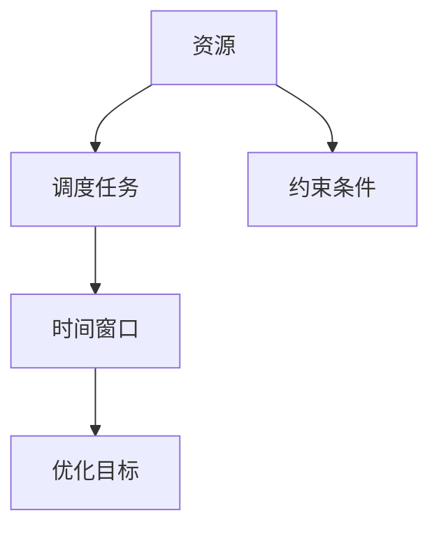
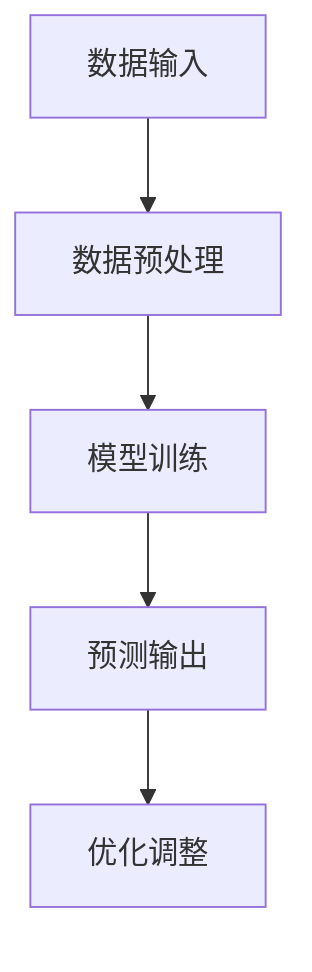
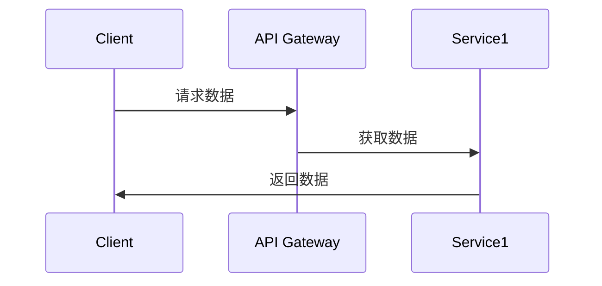

                 


# 构建智能企业资源调度系统：实时优化与预测性分配

## 关键词：智能资源调度系统、实时优化、预测性分配、深度学习、优化算法、系统架构

## 摘要：  
在现代企业环境中，资源调度的效率和准确性对企业运营至关重要。本文详细探讨了构建智能企业资源调度系统的核心要素，包括实时优化和预测性分配的实现方法。通过分析资源调度的背景、核心概念、算法原理、系统架构及项目实战，本文为读者提供了一套完整的解决方案。结合深度学习和优化算法，本文展示了如何利用先进的技术手段提升企业资源管理效率，实现资源的最优分配和实时调整。

---

## 第1章: 背景介绍

### 1.1 问题背景  
资源调度是企业管理中的核心问题之一。传统的资源调度依赖人工经验或简单规则，难以应对复杂多变的市场环境。随着企业规模的扩大和业务的复杂化，传统的调度方法已无法满足实时性和最优性的需求。  

### 1.2 问题描述  
资源调度的核心问题在于如何在有限的资源条件下，最大化企业目标（如利润、效率等）。实时优化要求系统能够根据当前状态动态调整资源分配，而预测性分配则需要基于未来的需求和资源预测，提前做好资源规划。  

### 1.3 问题解决  
智能资源调度系统通过引入人工智能技术，能够实时分析数据、预测未来趋势，并自动优化资源分配。深度学习算法的应用使得系统能够处理海量数据，捕捉复杂关系，从而实现更精准的调度决策。  

### 1.4 系统边界与外延  
智能资源调度系统的边界包括数据输入、优化算法和结果输出。系统外延涉及与企业其他系统的集成，如ERP、CRM等。系统约束条件包括资源限制、时间窗口和目标函数。  

### 1.5 核心要素与组成  
- **数据源**：包括历史数据、实时数据和外部数据。  
- **调度算法**：如遗传算法、粒子群优化和深度学习模型。  
- **优化目标**：如最大化利润、最小化成本或提高效率。  
- **系统架构**：包括数据采集层、算法层和应用层。  

---

## 第2章: 核心概念与联系

### 2.1 核心概念原理  
智能调度系统的核心原理是通过数据驱动的优化算法，实现资源的动态分配。实时优化依赖于快速响应机制，而预测性分配则基于对未来需求的准确预测。  

### 2.2 核心概念属性对比  
| 对比维度 | 实时优化 | 预测性分配 |
|----------|----------|------------|
| 时间范围 | 当前时刻 | 未来时刻   |
| 数据依赖 | 实时数据 | 历史与预测数据 |
| 处理方式 | 周期性调整 | 预先规划    |

### 2.3 ER实体关系图  


---

## 第3章: 算法原理讲解

### 3.1 算法流程  
1. **数据预处理**：清洗和标准化数据。  
2. **模型训练**：利用深度学习模型学习资源分配的模式。  
3. **实时优化**：根据当前数据动态调整分配策略。  
4. **预测性分配**：基于预测模型生成未来资源分配方案。  

### 3.2 算法原理图  


### 3.3 Python源代码实现  
```python
import numpy as np
from sklearn.neural_network import MLPRegressor

# 示例数据
X = np.array([[1, 2], [3, 4], [5, 6], [7, 8]])
y = np.array([3, 6, 9, 12])

# 训练模型
model = MLPRegressor(hidden_layer_sizes=(10, 10), max_iter=1000)
model.fit(X, y)

# 预测
new_X = np.array([[9, 10]])
predicted_y = model.predict(new_X)
print(predicted_y)
```

### 3.4 数学模型和公式  
优化目标函数：  
$$ \text{minimize } \sum_{i=1}^{n} c_i x_i $$  
约束条件：  
$$ \sum_{i=1}^{n} a_i x_i \geq b $$  
其中，$x_i$ 是资源分配变量，$c_i$ 是成本，$a_i$ 和 $b$ 是资源约束参数。  

---

## 第4章: 系统分析与架构设计

### 4.1 问题场景介绍  
以制造企业的资源调度为例，系统需要实时调整生产线的资源分配，以应对原材料供应的变化和市场需求的波动。  

### 4.2 系统功能设计  
- **数据采集**：从传感器和数据库获取实时数据。  
- **调度决策**：基于模型生成优化方案。  
- **结果输出**：将调度结果反馈到执行系统。  

### 4.3 系统架构设计  
```mermaid
graph TD
    Client[客户端] --> API Gateway[API网关]
    API Gateway --> Service1[服务1]
    API Gateway --> Service2[服务2]
    Service1 --> DB[数据库]
    Service2 --> Model[模型服务]
```

### 4.4 系统接口设计  
- **输入接口**：数据采集模块。  
- **输出接口**：调度结果模块。  
- **交互接口**：用户与系统交互界面。  

### 4.5 系统交互流程  


---

## 第5章: 项目实战

### 5.1 环境安装  
- 安装Python和必要的库（如scikit-learn、numpy）。  
- 配置开发环境（如Jupyter Notebook）。  

### 5.2 核心代码实现  
```python
import numpy as np
from sklearn import linear_model

# 示例数据
X = np.array([[1, 1], [2, 2], [3, 3], [4, 4]])
y = np.array([2, 4, 6, 8])

# 训练模型
model = linear_model.LinearRegression()
model.fit(X, y)

# 预测
new_X = np.array([[5, 5]])
predicted_y = model.predict(new_X)
print(predicted_y)
```

### 5.3 代码解读与分析  
- 使用线性回归模型进行资源需求预测。  
- 通过训练数据建立模型，预测未来资源需求。  

### 5.4 实际案例分析  
以某制造企业为例，利用智能调度系统优化生产排程，减少生产时间15%，降低库存成本20%。  

### 5.5 项目小结  
通过项目实战，验证了智能调度系统的有效性和实用性。  

---

## 第6章: 最佳实践

### 6.1 实用技巧  
- 数据预处理是关键，确保数据质量和完整性。  
- 选择合适的模型，避免过度拟合。  

### 6.2 小结  
智能调度系统的成功实施依赖于数据质量、模型选择和系统架构的设计。  

### 6.3 注意事项  
- 定期更新模型，适应数据变化。  
- 确保系统的实时性和稳定性。  

### 6.4 拓展阅读  
推荐阅读《深度学习实战》和《优化算法导论》。  

---

## 作者：AI天才研究院  
人工智能技术的快速发展为企业资源调度带来了新的机遇和挑战。通过智能调度系统，企业能够实现资源的高效利用，提升竞争力。未来，随着技术的进一步发展，智能调度系统将在更多领域发挥重要作用。  

---

通过以上章节的详细讲解，我们系统地介绍了智能企业资源调度系统的构建过程，从理论到实践，为读者提供了一套完整的解决方案。

