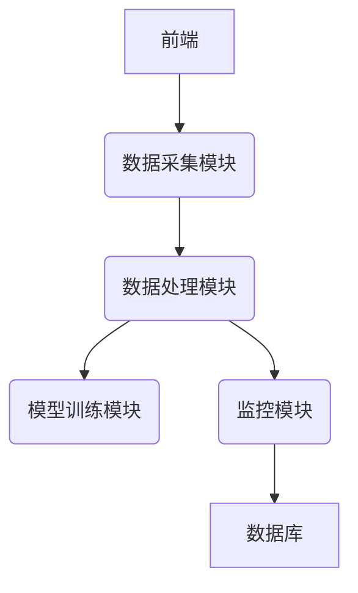
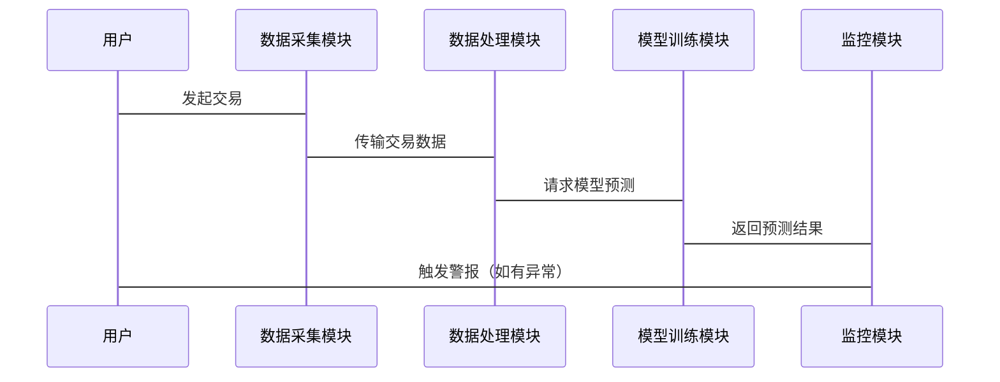

                 


# 构建智能企业风控系统：实时交易监控与欺诈检测

## 关键词：企业风控系统, 实时交易监控, 欺诈检测, 人工智能, 深度学习, 系统架构设计

## 摘要：  
随着企业在线交易的快速增长，实时交易监控和欺诈检测成为企业风险管理的核心挑战。本文从企业风控系统的背景出发，深入探讨实时交易监控与欺诈检测的核心概念、算法原理、系统架构设计及项目实战。通过理论与实践结合的方式，帮助读者理解如何利用人工智能和深度学习技术构建高效智能的企业风控系统。

---

# 第1章: 企业风控系统背景与挑战

## 1.1 企业风控系统概述

### 1.1.1 企业风控系统的定义  
企业风控系统是指通过技术手段对企业内部和外部的交易行为进行实时监控，并识别和预防潜在风险（如欺诈、异常交易等）的系统。它是企业安全、合规和风险管理的重要组成部分。

### 1.1.2 企业风控系统的核心目标  
- 保护企业资产安全，防止财务损失。  
- 提高交易透明度，确保合规性。  
- 实现实时监控，快速响应异常行为。  

### 1.1.3 企业风控系统的边界与外延  
- **边界**：企业风控系统的监控范围通常包括企业的线上交易、支付系统、用户行为等。  
- **外延**：延伸至供应链、合作伙伴和客户之间的交易行为。

---

## 1.2 企业风控系统的关键问题

### 1.2.1 交易监控的难点  
- 数据量大：实时交易数据呈指数级增长。  
- 数据多样性：交易数据包括结构化和非结构化数据。  
- 异常检测的复杂性：异常交易行为可能伪装成正常行为。  

### 1.2.2 欺诈检测的挑战  
- 欺诈手段多样化：欺诈者不断进化，采用复杂的欺诈策略。  
- 数据隐私保护：如何在保护用户隐私的前提下进行风险评估。  
- 真实性和准确性：如何确保欺诈检测模型的高准确率和低误报率。  

### 1.2.3 实时性与效率的平衡  
- 系统需要在毫秒级别完成交易监控和欺诈检测。  
- 高效的数据处理和存储技术是关键。  

---

## 1.3 企业风控系统的应用场景

### 1.3.1 零售行业  
- 监控在线支付、订单取消和退货行为。  
- 防止虚假订单和恶意退货。  

### 1.3.2 金融行业  
- 监控ATM交易、信用卡交易和外汇交易。  
- 防止洗钱、信用卡欺诈等行为。  

### 1.3.3 电子商务平台  
- 监控用户登录、下单和支付行为。  
- 防止恶意刷单和虚假用户攻击。  

---

## 1.4 本章小结  
本章介绍了企业风控系统的定义、目标和核心问题，分析了其在零售、金融和电子商务等领域的应用场景。接下来，我们将深入探讨实时交易监控和欺诈检测的核心概念。

---

# 第2章: 实时交易监控与欺诈检测的核心概念

## 2.1 实时交易监控的原理

### 2.1.1 交易数据的实时采集  
- 数据采集的实时性是交易监控的基础。  
- 通过日志系统、数据库和API接口实时获取交易数据。  

### 2.1.2 交易行为分析  
- 分析用户的交易频率、金额、时间等特征。  
- 识别异常交易行为，如短时间内多次小额交易。  

### 2.1.3 异常交易识别  
- 基于规则的异常检测：设置阈值，如单笔交易金额超过一定值触发警报。  
- 基于机器学习的异常检测：使用聚类、分类算法识别异常行为。  

---

## 2.2 欺诈检测的定义与分类

### 2.2.1 欺诈检测的定义  
欺诈检测是指通过技术手段识别和预防欺诈行为的过程。  

### 2.2.2 欺诈检测的分类  
- **基于规则的欺诈检测**：根据预定义的规则检测欺诈行为。  
- **基于机器学习的欺诈检测**：使用分类算法（如随机森林、逻辑回归）进行欺诈识别。  
- **基于深度学习的欺诈检测**：利用神经网络模型（如CNN、RNN）学习复杂的欺诈模式。  

### 2.2.3 欺诈检测的关键特征  
| 特征 | 描述 |  
|------|------|  
| 时间特征 | 交易时间间隔、时间分布 |  
| 金额特征 | 交易金额、金额波动 |  
| 用户特征 | 用户身份、行为模式 |  

---

## 2.3 实时交易监控与欺诈检测的关联

### 2.3.1 数据流的实时性  
- 实时交易监控需要快速处理数据流，确保欺诈检测的实时性。  

### 2.3.2 系统的实时响应机制  
- 检测到异常交易后，系统需立即采取措施，如暂停交易、通知相关人员。  

### 2.3.3 欺诈检测模型的动态更新  
- 根据最新数据动态优化欺诈检测模型，提高准确率。  

---

## 2.4 本章小结  
本章详细介绍了实时交易监控和欺诈检测的核心概念，包括其原理、分类和关联。接下来，我们将深入探讨其实现的算法原理。

---

# 第3章: 实时交易监控与欺诈检测的核心算法

## 3.1 时间序列分析

### 3.1.1 时间序列分析的基本概念  
时间序列分析是一种通过分析数据随时间变化的模式来预测未来趋势的方法。  

### 3.1.2 常见的时间序列模型  
- **ARIMA模型**：自回归积分滑动平均模型，用于预测未来的值。  
  $$ ARIMA(p, d, q) $$  
- **LSTM模型**：长短期记忆网络，适用于复杂的时间序列数据。  

### 3.1.3 时间序列在交易监控中的应用  
- 监控交易量的变化，识别异常波动。  

---

## 3.2 异常检测算法

### 3.2.1 基于统计的异常检测  
- 使用Z-score、标准差等统计方法识别异常值。  
  $$ Z = \frac{X - \mu}{\sigma} $$  

### 3.2.2 基于机器学习的异常检测  
- **Isolation Forest**：基于树结构的无监督异常检测算法。  

### 3.2.3 基于深度学习的异常检测  
- 使用变体自动编码器（VAE）重构数据，识别异常点。  

---

## 3.3 图神经网络在欺诈检测中的应用

### 3.3.1 图神经网络的基本原理  
- 将交易数据建模为图结构，节点表示交易，边表示交易之间的关联。  

### 3.3.2 图神经网络在欺诈检测中的优势  
- 可以捕捉交易网络中的复杂关系，发现隐藏的欺诈模式。  

---

## 3.4 本章小结  
本章介绍了时间序列分析、异常检测和图神经网络等算法在实时交易监控和欺诈检测中的应用。接下来，我们将探讨系统设计与实现的具体方案。

---

# 第4章: 企业风控系统的系统分析与架构设计

## 4.1 系统功能

### 4.1.1 系统功能模块  
- 数据采集模块：实时采集交易数据。  
- 数据处理模块：清洗、转换和存储数据。  
- 模型训练模块：训练和优化欺诈检测模型。  
- 监控模块：实时监控交易行为，触发警报。  

---

## 4.2 系统架构设计

### 4.2.1 系统架构图  


### 4.2.2 关键模块设计  
- **前端**：展示实时监控界面，接收用户输入。  
- **数据采集模块**：通过API接口采集交易数据。  
- **数据处理模块**：清洗数据，转换为模型可处理格式。  
- **模型训练模块**：训练欺诈检测模型，并动态优化。  
- **监控模块**：实时监控交易行为，触发警报。  

---

## 4.3 系统接口设计

### 4.3.1 数据接口  
- 数据采集模块通过HTTP API接收交易数据。  
- 数据处理模块将数据存储到数据库中。  

### 4.3.2 模型接口  
- 监控模块调用欺诈检测模型进行预测。  

---

## 4.4 系统交互设计

### 4.4.1 系统交互流程  


---

## 4.5 本章小结  
本章详细设计了企业风控系统的功能模块、架构和接口，为后续的系统实现奠定了基础。接下来，我们将通过项目实战，展示如何实现一个完整的风控系统。

---

# 第5章: 项目实战

## 5.1 环境安装

### 5.1.1 安装Python环境  
- 安装Python 3.8及以上版本。  
- 安装必要的库：`pandas`, `numpy`, `scikit-learn`, `tensorflow`。  

### 5.1.2 安装数据库  
- 使用MySQL或MongoDB存储交易数据。  

---

## 5.2 核心代码实现

### 5.2.1 数据采集模块  
```python
import requests

def fetch_transactions(api_url):
    try:
        response = requests.get(api_url)
        return response.json()
    except requests.exceptions.RequestException:
        return None
```

### 5.2.2 数据处理模块  
```python
import pandas as pd

def process_data(data):
    df = pd.DataFrame(data)
    df['timestamp'] = pd.to_datetime(df['timestamp'])
    return df
```

### 5.2.3 模型训练模块  
```python
from sklearn.ensemble import IsolationForest

def train_model(X_train):
    model = IsolationForest(n_estimators=100, random_state=42)
    model.fit(X_train)
    return model
```

### 5.2.4 监控模块  
```python
def monitor_transactions(model, new_data):
    prediction = model.predict(new_data)
    # 1表示正常，-1表示异常
    return prediction
```

---

## 5.3 案例分析

### 5.3.1 案例背景  
假设我们有一个电子商务平台，需要监控用户的登录行为，防止欺诈登录。  

### 5.3.2 数据分析  
- 采集用户登录时间、IP地址、设备信息等数据。  
- 使用Isolation Forest算法检测异常登录行为。  

### 5.3.3 实际结果  
- 系统成功识别了异常登录行为，触发了警报。  

---

## 5.4 本章小结  
本章通过实际案例展示了如何实现企业风控系统的各个模块。接下来，我们将总结系统的优缺点，并展望未来的发展方向。

---

# 第6章: 总结与展望

## 6.1 总结

### 6.1.1 核心内容回顾  
- 企业风控系统的背景与挑战。  
- 实时交易监控与欺诈检测的核心算法。  
- 系统设计与实现的具体方案。  

### 6.1.2 系统优缺点  
- 优点：实时性高，准确性高。  
- 缺点：需要大量的计算资源，模型更新频率高。  

---

## 6.2 未来展望

### 6.2.1 技术发展  
- 更高效的数据处理技术。  
- 更先进的欺诈检测算法（如图神经网络）。  

### 6.2.2 应用场景拓展  
- 拓展至更多行业，如物流、教育等。  

---

## 6.3 最佳实践 Tips

### 6.3.1 数据安全  
- 加强数据加密，确保用户隐私。  

### 6.3.2 系统优化  
- 定期优化模型，提高检测效率。  

### 6.3.3 团队协作  
- 加强跨团队合作，确保系统稳定运行。  

---

## 作者：AI天才研究院/AI Genius Institute & 禅与计算机程序设计艺术 /Zen And The Art of Computer Programming

---

**感谢您的阅读！**

