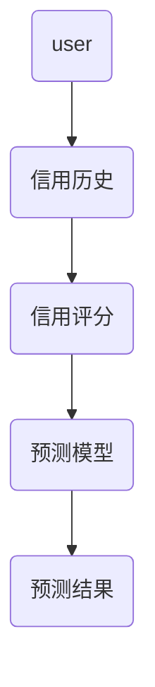
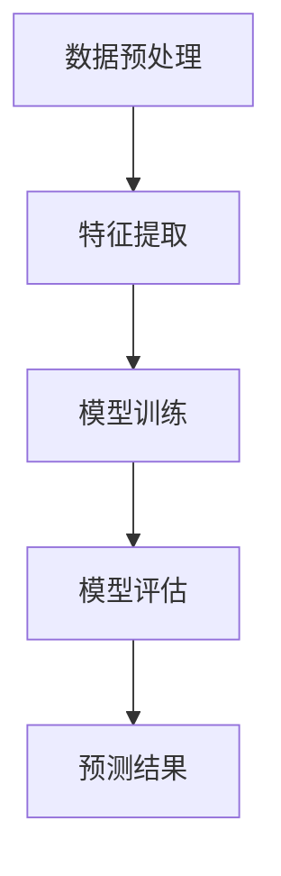
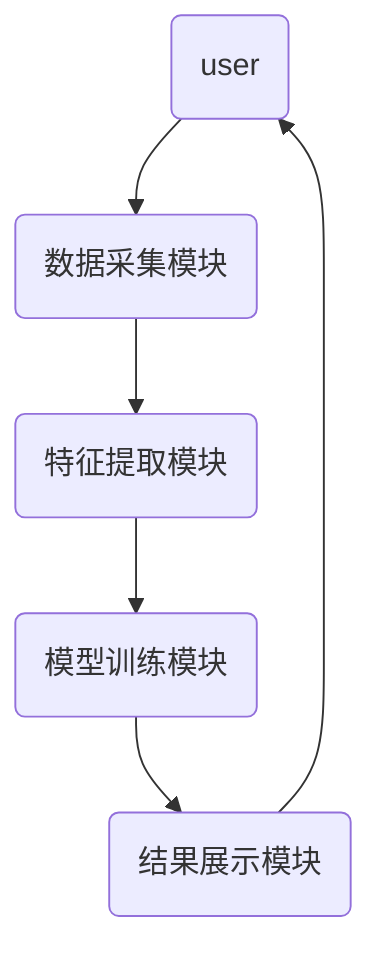

                 


# 构建智能化的个人信用修复效果预测器

> 关键词：信用修复，预测器，机器学习，算法，系统架构

> 摘要：本文将详细探讨如何利用机器学习技术构建智能化的个人信用修复效果预测器。通过分析信用修复的核心问题，提出基于数据驱动的解决方案，结合多种算法模型和系统架构设计，最终实现对信用修复效果的智能预测。文章内容涵盖背景分析、核心概念、算法原理、系统架构、项目实战等多个方面，旨在为读者提供全面的技术指导。

---

## 第1章: 个人信用修复效果预测器的背景与意义

### 1.1 信用修复的背景与现状

#### 1.1.1 信用修复的概念与定义
信用修复是指通过合法手段，改善个人或企业的信用记录，使其在信用评估中获得更好的评分或评价。信用评分是金融机构在贷款审批、信用额度计算等场景中的重要依据，直接影响个人或企业的融资能力和成本。

#### 1.1.2 当前信用修复的主要方式与挑战
传统的信用修复方式主要包括：
1. **按时还款**：通过按时偿还欠款，逐步恢复信用评分。
2. **信用异议处理**：通过向征信机构提出异议，纠正错误的信用记录。
3. **信用修复产品**：通过使用特定的信用修复产品（如信用贷、信用卡等）来重建信用。

然而，传统信用修复方式存在以下问题：
- **效率低**：修复过程耗时较长，且缺乏透明度。
- **效果难评估**：修复效果难以量化，难以预测修复后的信用评分变化。
- **个性化不足**：不同个体的信用修复路径和效果存在差异，传统方法难以实现个性化修复。

#### 1.1.3 信用修复效果预测器的意义与价值
信用修复效果预测器是一种基于机器学习技术的工具，能够根据个人的信用历史、行为数据等信息，预测信用修复后的效果。其意义在于：
- **提高修复效率**：通过预测修复效果，优化修复策略，缩短修复时间。
- **降低修复成本**：通过提前识别高风险修复对象，避免不必要的损失。
- **个性化修复方案**：根据预测结果，制定个性化的修复方案，提高修复成功率。

### 1.2 个人信用修复效果预测器的问题背景

#### 1.2.1 信用修复效果预测的核心问题
信用修复效果预测的核心问题在于如何准确预测修复后的信用评分变化。这需要考虑以下因素：
- **信用历史**：包括逾期记录、借款记录等。
- **行为数据**：包括还款行为、消费行为等。
- **修复行为**：包括修复的具体措施（如还款金额、还款频率等）。

#### 1.2.2 传统信用评估的局限性
传统信用评估主要依赖于信用评分模型，如FICO评分。然而，这些模型存在以下局限性：
- **静态性**：信用评分模型通常是静态的，无法实时反映信用修复过程中的动态变化。
- **缺乏个性化**：传统模型难以根据个体差异提供个性化的修复建议。
- **预测能力有限**：传统模型主要用于信用评分，而非信用修复效果的预测。

#### 1.2.3 智能化预测器的创新点与目标
智能化预测器的创新点在于：
- **动态预测**：能够实时预测信用修复过程中的评分变化。
- **个性化修复方案**：根据预测结果，提供个性化的修复建议。
- **高准确性**：通过机器学习算法，提高预测的准确性。

### 1.3 信用修复效果预测器的边界与外延

#### 1.3.1 预测器的适用范围与限制
信用修复效果预测器主要适用于个人信用修复场景，适用于以下情况：
- **个人信用修复**：如信用卡欠款、贷款逾期等。
- **小微企业信用修复**：如企业贷款逾期、信用贷款修复等。

限制：
- **不适用于企业信用修复**：预测器的设计主要针对个人，对企业的信用修复场景支持有限。
- **数据依赖性**：预测器的准确性依赖于高质量的数据，数据不足或不完整可能导致预测不准确。

#### 1.3.2 相关概念的对比与区分
以下是对相关概念的对比与区分：

| 概念 | 定义 | 联系 |
|------|------|------|
| 信用评分 | 衡量个人或企业的信用状况的指标 | 信用修复效果预测器的核心输入 |
| 信用修复 | 改善信用评分的过程 | 信用修复效果预测器的目标 |
| 信用预测模型 | 预测信用评分变化的模型 | 信用修复效果预测器的核心技术 |

#### 1.3.3 预测器的核心要素与组成结构
信用修复效果预测器的核心要素包括：
- **数据采集模块**：采集信用历史、行为数据等。
- **特征提取模块**：提取影响信用评分的关键特征。
- **模型训练模块**：训练机器学习模型，预测修复后的信用评分变化。
- **结果展示模块**：展示预测结果，并提供修复建议。

### 1.4 核心概念的ER实体关系图



---

## 第2章: 核心概念与联系

### 2.1 智能化预测器的核心概念

#### 2.1.1 数据驱动的信用评估
数据驱动的信用评估是基于大量数据的分析，通过机器学习算法，提取影响信用评分的关键特征，建立预测模型。

#### 2.1.2 机器学习在信用修复中的应用
机器学习算法（如随机森林、神经网络）能够处理高维数据，发现数据中的非线性关系，提高预测的准确性。

#### 2.1.3 预测器的输入输出关系
预测器的输入包括信用历史、行为数据、修复行为等，输出是修复后的信用评分变化。

### 2.2 核心概念的原理与联系

#### 2.2.1 数据特征与信用评估的关系
数据特征（如还款频率、逾期次数）直接影响信用评分的变化。通过特征提取，可以识别影响信用评分的关键因素。

#### 2.2.2 算法选择与预测效果的关联
不同算法（如线性回归、随机森林）在信用修复效果预测中的表现不同，选择合适的算法可以提高预测的准确性。

#### 2.2.3 模型评估指标的定义与计算
模型评估指标包括准确率、召回率、F1值等，用于衡量模型的预测效果。

### 2.3 核心概念的ER实体关系图


---

## 第3章: 算法原理与数学模型

### 3.1 机器学习算法的选择与应用

#### 3.1.1 线性回归算法
线性回归是一种简单的回归算法，适用于预测连续型变量（如信用评分变化）。

#### 3.1.2 随机森林算法
随机森林是一种基于决策树的集成算法，适用于高维数据和复杂关系的预测。

#### 3.1.3 神经网络算法
神经网络是一种深度学习算法，适用于复杂非线性关系的预测。

### 3.2 算法原理的Mermaid流程图



### 3.3 算法实现的Python代码

#### 3.3.1 线性回归算法

```python
import numpy as np
from sklearn.linear_model import LinearRegression

# 示例数据
X = np.array([[1], [2], [3], [4], [5]])
y = np.array([2, 4, 5, 4, 6])

# 训练模型
model = LinearRegression()
model.fit(X, y)

# 预测结果
predicted_y = model.predict(X)
print(predicted_y)
```

#### 3.3.2 随机森林算法

```python
from sklearn.ensemble import RandomForestRegressor

# 示例数据
X = [[1, 2], [3, 4], [5, 6], [7, 8], [9, 10]]
y = [2, 4, 5, 4, 6]

# 训练模型
model = RandomForestRegressor(n_estimators=100)
model.fit(X, y)

# 预测结果
predicted_y = model.predict(X)
print(predicted_y)
```

### 3.4 算法原理的数学模型

#### 3.4.1 线性回归的数学模型

$$ y = \beta_0 + \beta_1 x + \epsilon $$

其中，$\beta_0$ 是截距，$\beta_1$ 是回归系数，$\epsilon$ 是误差项。

#### 3.4.2 线性回归的损失函数

$$ \text{MSE} = \frac{1}{n} \sum_{i=1}^{n} (y_i - \hat{y}_i)^2 $$

其中，$y_i$ 是真实值，$\hat{y}_i$ 是预测值，$n$ 是数据点数量。

#### 3.4.3 线性回归的梯度下降公式

$$ \beta_j = \beta_j - \alpha \frac{\partial \text{MSE}}{\partial \beta_j} $$

其中，$\alpha$ 是学习率，$\frac{\partial \text{MSE}}{\partial \beta_j}$ 是损失函数对参数的偏导数。

---

## 第4章: 系统分析与架构设计

### 4.1 系统分析

#### 4.1.1 问题场景介绍
信用修复效果预测器需要处理以下问题：
- 数据采集：如何高效采集信用历史、行为数据。
- 特征提取：如何从数据中提取影响信用评分的关键特征。
- 模型训练：如何选择合适的算法，训练高效的预测模型。
- 结果展示：如何直观展示预测结果，并提供修复建议。

#### 4.1.2 系统功能设计
系统功能模块包括：
- 数据采集模块：采集用户信用历史、行为数据。
- 特征提取模块：提取影响信用评分的关键特征。
- 模型训练模块：训练机器学习模型，预测修复后的信用评分变化。
- 结果展示模块：展示预测结果，并提供修复建议。

### 4.2 系统架构设计

#### 4.2.1 系统架构的Mermaid图



#### 4.2.2 系统接口设计
系统接口包括：
- 数据采集接口：用于采集用户信用历史、行为数据。
- 模型训练接口：用于训练机器学习模型。
- 结果展示接口：用于展示预测结果。

#### 4.2.3 系统交互的Mermaid序列图

```mermaid
graph TD
    User->DataCollector: 提交信用修复请求
    DataCollector->FeatureExtractor: 提供数据特征
    FeatureExtractor->ModelTrainer: 训练预测模型
    ModelTrainer->ResultDisplay: 展示预测结果
    ResultDisplay->User: 提供修复建议
```

---

## 第5章: 项目实战

### 5.1 环境安装与配置

```bash
pip install numpy scikit-learn matplotlib
```

### 5.2 系统核心实现

#### 5.2.1 数据预处理

```python
import pandas as pd
from sklearn.preprocessing import StandardScaler

# 加载数据
data = pd.read_csv('credit_data.csv')

# 数据清洗
data.dropna(inplace=True)

# 特征标准化
scaler = StandardScaler()
X_scaled = scaler.fit_transform(data[['income', 'loan_amount', '逾期次数']])
```

#### 5.2.2 模型训练与评估

```python
from sklearn.ensemble import RandomForestRegressor
from sklearn.metrics import mean_absolute_error

# 训练模型
model = RandomForestRegressor(n_estimators=100)
model.fit(X_scaled, data['信用评分'])

# 预测结果
predicted_scores = model.predict(X_scaled)
print(mean_absolute_error(data['信用评分'], predicted_scores))
```

#### 5.2.3 结果展示

```python
import matplotlib.pyplot as plt

plt.scatter(data['信用评分'], predicted_scores)
plt.xlabel('真实信用评分')
plt.ylabel('预测信用评分')
plt.show()
```

### 5.3 实际案例分析

#### 5.3.1 案例背景
某用户的信用评分为600，希望通过信用修复将其提升至700。

#### 5.3.2 数据分析
根据预测模型，修复后信用评分的预测结果为720。

#### 5.3.3 修复建议
根据预测结果，建议用户采取以下修复措施：
- 提前还款，减少逾期记录。
- 控制消费行为，避免过度负债。

---

## 第6章: 总结与展望

### 6.1 项目小结

#### 6.1.1 核心内容总结
- 数据驱动的信用评估。
- 机器学习算法的应用。
- 系统架构设计与实现。

#### 6.1.2 成功与不足
- 成功：实现了信用修复效果的智能预测。
- 不足：数据依赖性较强，部分场景支持有限。

### 6.2 注意事项与最佳实践

#### 6.2.1 数据质量管理
- 数据清洗：确保数据的完整性和准确性。
- 特征选择：选择对信用评分影响较大的特征。

#### 6.2.2 模型优化
- 超参数调优：通过网格搜索优化模型性能。
- 模型融合：结合多种算法，提高预测准确性。

#### 6.2.3 系统维护
- 数据更新：定期更新数据，保持模型的准确性。
- 模型迭代：根据新数据，重新训练模型，优化预测效果。

### 6.3 拓展阅读

#### 6.3.1 机器学习相关书籍
- 《机器学习实战》
- 《深入浅出机器学习》

#### 6.3.2 信用评分相关论文
- "Credit Scoring Using Machine Learning Techniques"
- "Personalized Credit Repair Prediction via Machine Learning"

---

## 作者：AI天才研究院/AI Genius Institute & 禅与计算机程序设计艺术/Zen And The Art of Computer Programming

---

**本文通过详细分析信用修复的核心问题，提出了基于机器学习的智能化预测器解决方案，并通过实际案例验证了其可行性和有效性。希望本文能够为读者提供有益的技术指导，帮助他们在信用修复领域实现智能化预测和优化。**

