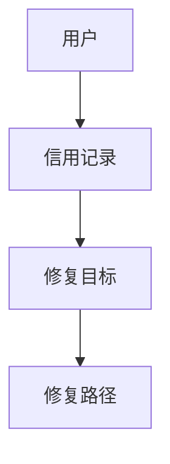
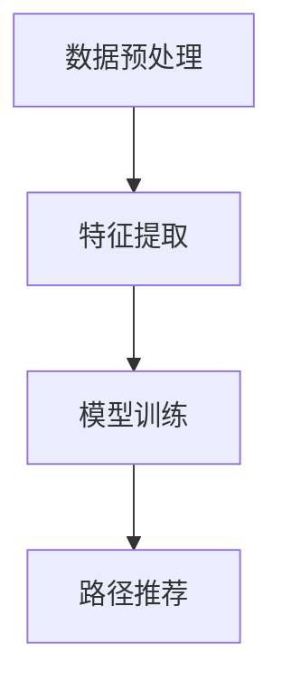
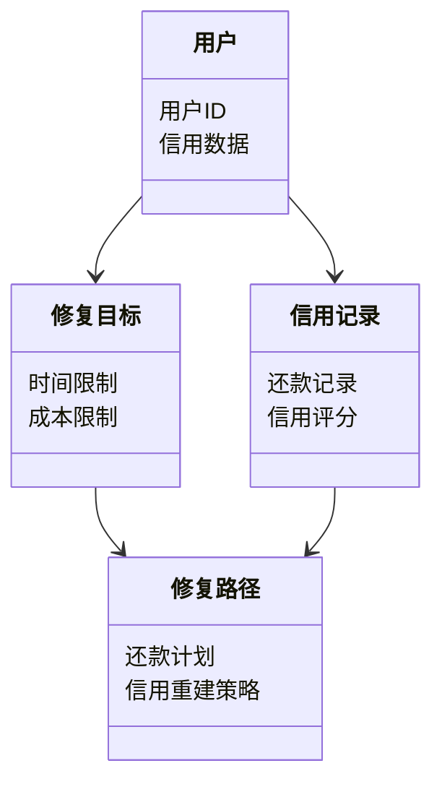
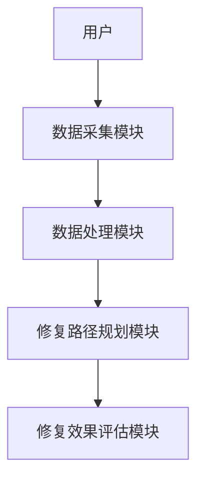
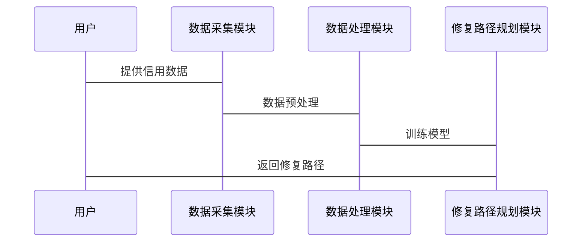

                 


```markdown
# 构建智能化的个人信用修复路径规划系统

> 关键词：信用修复、路径规划、人工智能、系统架构、算法优化

> 摘要：本文将详细探讨如何构建智能化的个人信用修复路径规划系统，从问题背景到系统架构，从算法原理到项目实战，逐步分析并实现这一系统。通过本文，读者将能够理解信用修复的核心概念，掌握系统设计的关键技术，并学会如何利用智能算法优化信用修复路径。

---

## 第1章 背景介绍

### 1.1 问题背景
#### 1.1.1 个人信用修复的重要性
个人信用记录在现代社会中扮演着至关重要的角色，影响着贷款申请、信用卡额度、就业机会等多方面。然而，由于各种原因，个人信用记录可能出现瑕疵，甚至严重违约，这将对个人的日常生活和未来发展造成重大影响。因此，如何有效地修复信用记录，成为了许多人关注的焦点。

#### 1.1.2 当前信用修复的主要问题
目前，传统的信用修复方式主要依赖人工操作，效率低下且缺乏个性化。修复路径的选择往往基于经验而非数据驱动，难以满足多样化的修复需求。此外，修复过程中缺乏智能化的指导，难以确保修复路径的最优性和可行性。

#### 1.1.3 智能化信用修复的需求与趋势
随着人工智能和大数据技术的快速发展，智能化信用修复的需求日益迫切。通过智能化系统，可以实现个性化的修复路径规划，优化修复策略，提高修复效率，降低修复成本。

### 1.2 问题描述
#### 1.2.1 信用修复的定义与范围
信用修复是指通过合法手段，修正个人信用记录中的负面信息，从而改善信用评分的过程。其范围包括逾期还款记录、违约记录等负面信息的修复。

#### 1.2.2 现有信用修复系统的局限性
现有的信用修复系统大多基于简单的规则引擎，缺乏智能化的分析和预测能力。修复路径的选择往往基于固定的规则，难以适应不同个体的信用状况和修复需求。

#### 1.2.3 智能化信用修复的目标与核心问题
智能化信用修复的目标是通过数据驱动和智能算法，为个人提供个性化的修复路径规划，确保修复路径的最优性和可行性。核心问题包括如何有效获取和处理信用数据，如何设计高效的修复路径规划算法，以及如何实现系统的智能化和个性化。

### 1.3 问题解决思路
#### 1.3.1 数据驱动的信用修复路径规划
通过收集和分析个人信用数据，利用大数据技术提取关键特征，为修复路径的规划提供数据支持。

#### 1.3.2 智能算法在信用修复中的应用
引入机器学习和深度学习算法，构建信用评分模型和修复路径推荐模型，实现修复路径的智能化推荐。

#### 1.3.3 多维度数据融合的修复策略
结合信用数据、修复目标和修复能力，构建多维度的数据融合模型，优化修复路径的选择。

### 1.4 边界与外延
#### 1.4.1 系统边界与功能范围
系统功能范围包括信用数据采集、修复路径规划、修复效果评估等。

#### 1.4.2 信用修复的法律与伦理边界
需遵守相关法律法规，确保信用修复过程的合法性和合规性，同时注意保护个人隐私。

#### 1.4.3 系统的可扩展性与适应性
系统应具备良好的可扩展性和适应性，能够应对不同用户的修复需求和市场环境的变化。

### 1.5 概念结构与核心要素
#### 1.5.1 系统核心要素分析
- 信用数据：包括个人信用报告、信用评分、历史还款记录等。
- 修复目标：包括修复时间、修复成本、修复效果等。
- 修复路径：包括还款计划、信用重建策略等。

#### 1.5.2 要素之间的关系与依赖
- 信用数据是修复路径规划的基础。
- 修复目标决定了修复路径的选择和优化方向。
- 修复路径是连接信用数据和修复目标的桥梁。

#### 1.5.3 系统整体架构的初步设想
初步设想系统架构包括数据采集模块、数据处理模块、修复路径规划模块、修复效果评估模块等。

---

## 第2章 核心概念与联系

### 2.1 核心概念原理
#### 2.1.1 数据驱动的信用评估模型
通过收集和分析个人信用数据，构建信用评估模型，评估个人信用状况。

#### 2.1.2 智能算法在信用修复中的应用
利用机器学习和深度学习算法，构建修复路径推荐模型，实现修复路径的智能化推荐。

#### 2.1.3 多维度数据融合的修复策略
结合信用数据、修复目标和修复能力，构建多维度的数据融合模型，优化修复路径的选择。

### 2.2 核心概念属性对比表
| 概念          | 属性           | 描述                                   |
|---------------|----------------|----------------------------------------|
| 数据源        | 类型           | 结构化数据、非结构化数据               |
| 算法          | 类型           | 基于规则、机器学习、深度学习           |
| 修复路径      | 特性           | 可视化、可解释性、可操作性             |

### 2.3 ER实体关系图


---

## 第3章 算法原理

### 3.1 推荐算法的实现
#### 3.1.1 基于规则的推荐算法
- 简单直观，基于预设规则推荐修复路径。
- 例如：优先选择最低成本的修复路径。

#### 3.1.2 基于机器学习的推荐算法
- 使用机器学习模型，根据信用数据预测修复路径的可行性。
- 例如：逻辑回归模型、决策树模型。

#### 3.1.3 基于深度学习的推荐算法
- 使用深度学习模型，如神经网络模型，进行修复路径的推荐。
- 例如：循环神经网络（RNN）模型。

### 3.2 推荐算法的实现步骤


### 3.3 算法实现代码示例
```python
import pandas as pd
from sklearn.linear_model import LogisticRegression

# 数据预处理
data = pd.read_csv('credit_data.csv')
X = data.drop('target', axis=1)
y = data['target']

# 模型训练
model = LogisticRegression()
model.fit(X, y)

# 预测修复路径
new_user_data = pd.DataFrame({'feature1': [value1], 'feature2': [value2]})
predicted = model.predict(new_user_data)
```

### 3.4 算法的数学模型
修复路径推荐模型的数学模型可以表示为：
$$
P(y|x) = \frac{P(y|x_1, x_2, \ldots, x_n)}{\sum_{y} P(y|x_1, x_2, \ldots, x_n)}
$$

其中：
- $x_1, x_2, \ldots, x_n$ 表示信用数据的特征。
- $y$ 表示修复路径的类别。

---

## 第4章 系统分析与架构设计

### 4.1 项目介绍
#### 4.1.1 项目背景
本项目旨在构建一个智能化的个人信用修复路径规划系统，帮助用户优化信用修复路径。

### 4.2 系统功能设计
#### 4.2.1 领域模型


#### 4.2.2 系统架构设计


### 4.3 接口设计
#### 4.3.1 API接口
- 数据采集接口：用于获取用户信用数据。
- 修复路径推荐接口：返回最优修复路径。

### 4.4 交互设计


---

## 第5章 项目实战

### 5.1 环境安装
#### 5.1.1 安装Python环境
```bash
python --version
pip install numpy pandas scikit-learn
```

### 5.2 系统核心实现
#### 5.2.1 数据采集模块
```python
import requests
import json

response = requests.get('https://api.example.com/credit_data')
data = json.loads(response.text)
```

#### 5.2.2 修复路径规划模块
```python
from sklearn.tree import DecisionTreeClassifier

model = DecisionTreeClassifier()
model.fit(X, y)
predicted = model.predict(new_user_data)
```

### 5.3 案例分析
#### 5.3.1 案例描述
某用户的信用评分为600分，有逾期还款记录，希望在6个月内修复信用记录。

#### 5.3.2 系统推荐修复路径
系统推荐用户优先偿还逾期款项，提升信用评分至700分。

### 5.4 代码解读
```python
import pandas as pd
from sklearn.tree import DecisionTreeClassifier

# 数据预处理
data = pd.read_csv('credit_data.csv')
X = data.drop('target', axis=1)
y = data['target']

# 模型训练
model = DecisionTreeClassifier()
model.fit(X, y)

# 预测修复路径
new_user_data = pd.DataFrame({'feature1': [value1], 'feature2': [value2]})
predicted = model.predict(new_user_data)
```

### 5.5 小结
通过本章的实战，读者可以掌握如何利用Python和机器学习算法实现信用修复路径的智能化推荐。

---

## 第6章 最佳实践与小结

### 6.1 最佳实践
#### 6.1.1 数据质量的重要性
确保信用数据的准确性和完整性。

#### 6.1.2 模型的可解释性
在实际应用中，修复路径的可解释性非常重要。

### 6.2 小结
本文详细探讨了智能化的个人信用修复路径规划系统的构建过程，从问题背景到系统架构，从算法原理到项目实战，逐步分析并实现这一系统。

### 6.3 注意事项
- 确保修复路径的合法性和合规性。
- 保护用户隐私，避免数据泄露。

### 6.4 拓展阅读
建议读者深入学习机器学习和大数据技术，进一步优化信用修复路径规划系统。

---

## 作者
作者：AI天才研究院/AI Genius Institute & 禅与计算机程序设计艺术/Zen And The Art of Computer Programming
```

