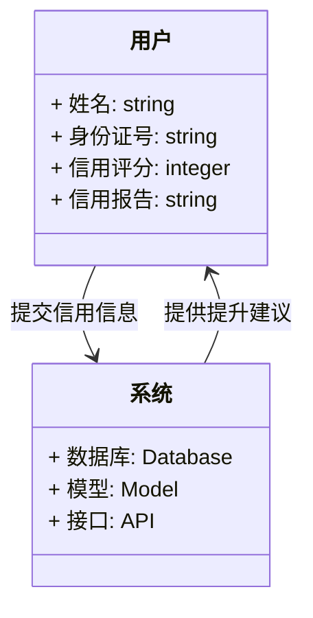
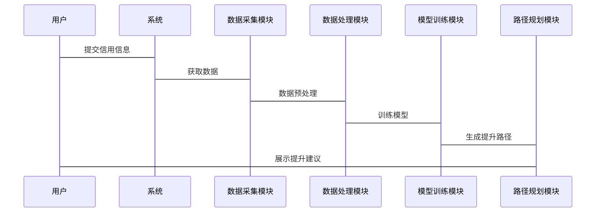

                 


# 构建智能化的个人信用分数提升路径规划器

> 关键词：个人信用评分、智能化路径规划、机器学习、评分模型、系统架构设计

> 摘要：本文详细探讨了如何利用机器学习和大数据技术构建智能化的个人信用评分提升路径规划器。通过分析信用评分的核心要素，设计高效的算法模型，并结合实际案例，展示了如何通过智能化方法优化个人信用评分。文章内容涵盖背景介绍、算法原理、系统架构设计以及项目实战，为读者提供全面的技术指导。

---

# 第1章：个人信用评分的智能化分析

## 1.1 个人信用评分的背景与意义

### 1.1.1 个人信用评分的定义与作用
个人信用评分是金融机构评估个人信用风险的重要指标，通常用于信用卡审批、贷款额度确定等场景。高信用评分意味着较低的违约风险，从而获得更优惠的金融服务。

### 1.1.2 信用评分在金融领域的应用
- **信用评分低的影响**：可能导致贷款被拒、信用卡额度低等问题。
- **信用评分高的优势**：享受更低利率、更高的信用额度等。

### 1.1.3 智能化信用评分提升的必要性
随着大数据和人工智能技术的发展，传统的信用评分模型逐渐暴露出效率低、精准度不足的问题。智能化路径规划器能够根据个人的信用行为，实时提供优化建议，帮助用户提升信用评分。

---

## 1.2 个人信用评分提升路径规划的核心问题

### 1.2.1 信用评分低的原因分析
- **信用历史短**：缺乏足够的信用记录。
- **还款能力不足**：收入不稳定或负债过高。
- **信用行为不佳**：逾期还款、频繁申请贷款等。

### 1.2.2 提升信用评分的关键因素
- **按时还款**：保持良好的还款记录。
- **控制负债率**：避免过度负债。
- **建立良好的信用历史**：通过按时还款等方式积累良好的信用记录。

### 1.2.3 智能化路径规划的目标与边界
- **目标**：通过智能化算法，为用户提供个性化的信用评分提升方案。
- **边界**：不涉及实际信用评分的计算，而是提供提升路径的规划。

---

# 第2章：个人信用评分的智能化分析

## 2.1 个人信用评分的数据特征

### 2.1.1 信用评分数据的分类与属性
- **基本属性**：年龄、职业、收入等。
- **信用行为**：还款记录、逾期次数等。
- **负债情况**：信用卡余额、贷款余额等。

### 2.1.2 数据预处理与特征工程
- **数据清洗**：处理缺失值、异常值。
- **特征选择**：通过相关性分析选择重要特征。
- **特征转换**：对非数值型特征进行编码处理。

### 2.1.3 数据质量评估与清洗
- **数据质量评估**：检查数据的完整性、准确性。
- **异常值处理**：识别并处理异常值，如极端高负债。

---

## 2.2 信用评分模型的构建与优化

### 2.2.1 信用评分模型的分类
- **传统模型**：如线性回归模型。
- **机器学习模型**：如逻辑回归、随机森林等。

### 2.2.2 基于机器学习的信用评分模型
- **逻辑回归模型**：用于分类问题，输出概率值。
- **随机森林模型**：通过集成学习提高模型的准确性和鲁棒性。

### 2.2.3 模型评估与调优
- **评估指标**：准确率、召回率、F1分数等。
- **模型调优**：通过网格搜索优化模型参数。

---

# 第3章：基于机器学习的信用评分模型

## 3.1 逻辑回归模型

### 3.1.1 模型原理与数学公式
逻辑回归模型通过sigmoid函数将线性回归的结果映射到概率空间。其数学公式为：
$$ P(y=1|x) = \frac{e^{\beta_0 + \beta_1 x_1 + ... + \beta_n x_n}}{1 + e^{\beta_0 + \beta_1 x_1 + ... + \beta_n x_n}} $$

### 3.1.2 模型训练与优化
- **训练过程**：通过最大似然估计求解模型参数。
- **优化方法**：使用梯度下降算法优化参数。

### 3.1.3 模型评估与解释
- **评估指标**：通过ROC曲线评估模型的区分能力。
- **解释性分析**：通过系数的符号和大小解释各个特征对信用评分的影响。

---

## 3.2 随机森林模型

### 3.2.1 模型原理
随机森林是一种基于决策树的集成学习方法，通过构建多棵决策树并取其预测结果的平均值来提高模型的准确性和鲁棒性。

### 3.2.2 模型构建流程
1. **特征选择**：随机选择部分特征进行树的构建。
2. **样本选择**：使用袋装法（Bootstrap）随机选择样本。
3. **决策树构建**：使用CART算法构建决策树。
4. **投票预测**：对多棵决策树的预测结果进行投票，得到最终结果。

### 3.2.3 模型评估与比较
- **评估指标**：准确率、F1分数等。
- **比较分析**：逻辑回归和随机森林在不同数据集上的表现对比。

---

# 第4章：系统架构设计

## 4.1 问题场景介绍

### 4.1.1 问题描述
- **用户需求**：用户提供个人信用信息，系统根据历史数据和当前行为，提供信用评分提升建议。
- **系统目标**：构建一个智能化的路径规划器，帮助用户优化信用评分。

### 4.1.2 系统功能需求
- **数据采集**：收集用户的信用历史、消费记录等。
- **模型训练**：基于机器学习算法训练信用评分模型。
- **路径规划**：根据模型结果，生成个性化的提升路径。

---

## 4.2 系统功能设计

### 4.2.1 领域模型


### 4.2.2 系统架构设计


---

## 4.3 接口设计与交互

### 4.3.1 系统接口设计
- **数据采集接口**：用户提供信用信息。
- **模型调用接口**：系统调用机器学习模型进行评分预测。
- **结果展示接口**：系统将提升路径展示给用户。

### 4.3.2 系统交互流程


---

# 第5章：项目实战

## 5.1 环境搭建

### 5.1.1 安装必要的库
- **Python环境**：Python 3.8+
- **依赖库**：pandas、numpy、scikit-learn、matplotlib。

```bash
pip install pandas numpy scikit-learn matplotlib
```

---

## 5.2 核心代码实现

### 5.2.1 数据预处理代码
```python
import pandas as pd
import numpy as np

# 加载数据
data = pd.read_csv('credit_data.csv')

# 处理缺失值
data = data.dropna()

# 标准化处理
from sklearn.preprocessing import StandardScaler
scaler = StandardScaler()
data_scaled = scaler.fit_transform(data)
```

### 5.2.2 模型训练代码
```python
from sklearn.linear_model import LogisticRegression
from sklearn.ensemble import RandomForestClassifier
from sklearn.metrics import accuracy_score

# 训练逻辑回归模型
lr_model = LogisticRegression()
lr_model.fit(X_train, y_train)
lr_score = accuracy_score(y_test, lr_model.predict(X_test))

# 训练随机森林模型
rf_model = RandomForestClassifier()
rf_model.fit(X_train, y_train)
rf_score = accuracy_score(y_test, rf_model.predict(X_test))
```

### 5.2.3 路径规划代码
```python
def generate_recommendations(user_info):
    # 根据用户信息生成提升建议
    pass
```

---

## 5.3 实际案例分析

### 5.3.1 案例背景
用户A，25岁，收入稳定，但信用评分较低，原因是曾有逾期还款记录。

### 5.3.2 模型分析
- **逻辑回归模型预测**：用户A的信用评分为650分。
- **随机森林模型预测**：用户A的信用评分为680分。

### 5.3.3 提升路径建议
1. **按时还款**：避免逾期还款，建立良好的信用记录。
2. **降低负债**：减少信用卡余额，降低负债率。

---

## 5.4 项目小结
通过实际案例分析，验证了模型的有效性和实用性。智能化路径规划器能够为用户提供个性化的提升建议，帮助用户快速提高信用评分。

---

# 第6章：优化与改进

## 6.1 模型调优

### 6.1.1 参数优化
- **逻辑回归**：调整C参数（正则化强度）。
- **随机森林**：调整n_estimators、max_depth等参数。

### 6.1.2 特征工程优化
- **特征选择**：使用LASSO回归进行特征选择。
- **特征构建**：引入新的特征，如信用评分变化率。

## 6.2 实时反馈机制

### 6.2.1 实时数据采集
- **数据流处理**：使用Kafka等技术实时采集用户行为数据。

### 6.2.2 动态调整模型
- **在线学习**：根据实时数据动态更新模型。

---

## 6.3 可解释性分析

### 6.3.1 模型可解释性的重要性
- **用户信任**：用户需要理解模型的决策依据。
- **合规性要求**：金融机构需要模型的可解释性。

### 6.3.2 提升模型可解释性的方法
- **特征重要性分析**：通过SHAP值解释各个特征对预测结果的影响。
- **模型可视化**：使用树解释器（TreeInterpreter）可视化决策树的决策过程。

---

# 第7章：总结与展望

## 7.1 全文总结

### 7.1.1 核心内容回顾
- **背景介绍**：个人信用评分的重要性。
- **核心概念**：智能化路径规划器的构建方法。
- **算法原理**：逻辑回归和随机森林模型的应用。
- **系统架构设计**：模块化设计和接口实现。
- **项目实战**：环境搭建、模型训练、案例分析。
- **优化与改进**：模型调优和实时反馈机制。

### 7.1.2 实践意义
通过智能化路径规划器，用户能够更好地管理个人信用，金融机构能够更精准地评估信用风险。

---

## 7.2 未来展望

### 7.2.1 技术发展趋势
- **AI与大数据结合**：进一步提升模型的准确性和效率。
- **实时分析能力**：利用流处理技术实现实时信用评分调整。

### 7.2.2 应用场景扩展
- **信用评分预测**：基于历史数据预测未来的信用评分。
- **信用风险预警**：实时监控用户的信用行为，预警潜在风险。

---

作者：AI天才研究院/AI Genius Institute & 禅与计算机程序设计艺术/Zen And The Art of Computer Programming

