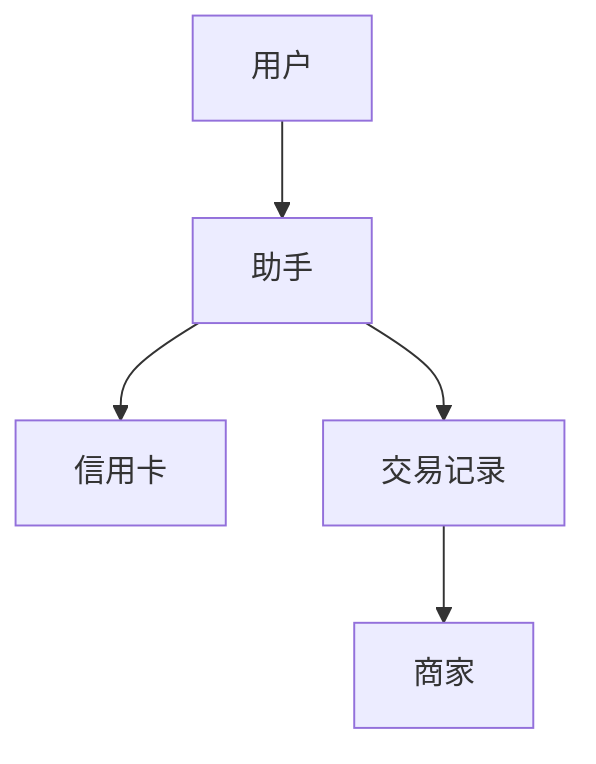
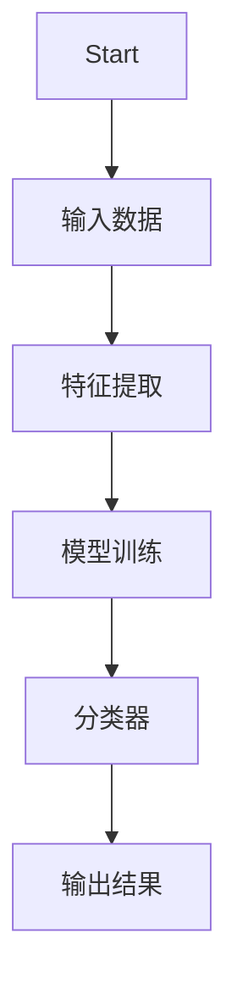
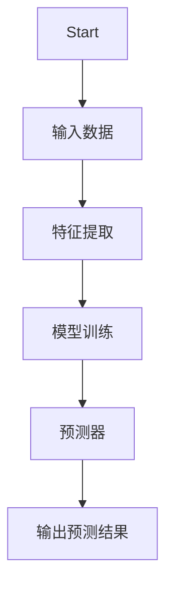
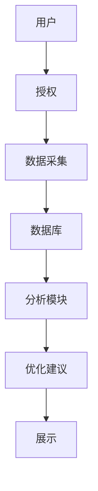
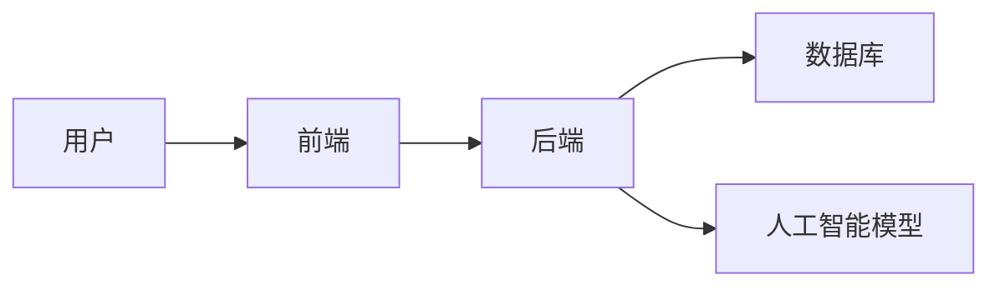

                 


# 构建智能化的个人信用卡使用优化助手

> 关键词：信用卡优化，人工智能，机器学习，自然语言处理，数据挖掘

> 摘要：本文详细探讨了如何构建一个智能化的个人信用卡使用优化助手。通过分析信用卡使用中的常见问题，介绍了智能化优化的必要性，并提出了基于人工智能和机器学习的解决方案。文章涵盖了助手的核心概念、算法原理、系统架构以及项目实战，帮助读者理解如何利用技术手段优化信用卡使用，提升财务管理效率。

---

# 第一部分: 智能化个人信用卡使用优化助手的背景与概念

# 第1章: 信用卡使用优化的背景与问题分析

## 1.1 信用卡使用中的常见问题
### 1.1.1 信用卡的定义与基本功能
- **信用卡定义**：信用卡是一种信用支付工具，允许用户在无需立即支付的情况下进行消费。
- **基本功能**：信用额度、支付功能、消费记录、积分累积等。

### 1.1.2 信用卡使用中的主要问题
- **问题1**：过度消费，导致高额利息和违约金。
- **问题2**：忘记还款日期，导致信用评分下降。
- **问题3**：无法有效管理多张信用卡，导致混乱和额外费用。

### 1.1.3 优化信用卡使用的重要性
- **重要性1**：避免高额利息和违约金。
- **重要性2**：提升信用评分，有助于未来贷款申请。
- **重要性3**：优化消费计划，合理分配资金。

## 1.2 智能化优化的必要性
### 1.2.1 传统信用卡管理的局限性
- **局限性1**：手动记录消费和还款，容易遗忘和错误。
- **局限性2**：缺乏数据分析，无法有效优化消费计划。

### 1.2.2 智能化技术在信用卡管理中的应用潜力
- **潜力1**：利用人工智能进行消费预测和优化。
- **潜力2**：通过机器学习识别异常交易，防范欺诈。

### 1.2.3 用户对智能化信用卡助手的需求
- **需求1**：实时监控消费和还款情况。
- **需求2**：自动化提醒和优化建议。

## 1.3 本章小结
### 1.3.1 问题背景总结
- 信用卡使用中存在多种问题，如过度消费和还款延迟。
### 1.3.2 智能化优化的核心价值
- 提供实时监控和自动化管理，帮助用户优化信用卡使用。
### 1.3.3 下文展开的方向
- 接下来将介绍智能化助手的核心概念和技术基础。

---

# 第2章: 智能化个人信用卡使用优化助手的核心概念

## 2.1 智能化助手的基本定义
### 2.1.1 助手的核心功能
- **功能1**：实时监控信用卡消费和还款情况。
- **功能2**：提供消费优化建议，如最佳消费时间、还款计划等。
- **功能3**：识别异常交易，预防欺诈。

### 2.1.2 助手的智能化特征
- **特征1**：基于机器学习的消费预测。
- **特征2**：自然语言处理技术用于分析交易描述。

### 2.1.3 助手与传统管理工具的区别
- **区别1**：传统工具依赖手动输入，智能化助手实现自动化。
- **区别2**：传统工具缺乏数据分析，智能化助手提供优化建议。

## 2.2 核心概念的属性对比
### 2.2.1 功能对比表
| **功能**       | **传统工具**           | **智能化助手**          |
|----------------|-----------------------|------------------------|
| 数据录入       | 手动输入               | 自动同步数据           |
| 数据分析       | 简单统计               | 复杂分析与预测         |
| 优化建议       | 无                     | 提供个性化建议         |

### 2.2.2 性能对比表
| **性能指标**    | **传统工具**           | **智能化助手**          |
|----------------|-----------------------|------------------------|
| 数据处理速度   | 较慢                   | 快                     |
| 分析深度       | 浅                     | 深                     |

### 2.2.3 用户体验对比表
| **体验维度**    | **传统工具**           | **智能化助手**          |
|----------------|-----------------------|------------------------|
| 使用便捷性     | 低                     | 高                     |
| 互动性         | 低                     | 高                     |

## 2.3 助手的系统架构
### 2.3.1 助手的实体关系图


## 2.4 本章小结
### 2.4.1 核心概念的总结
- 智能化助手通过自动化数据处理和深度分析，帮助用户优化信用卡使用。
### 2.4.2 系统架构的初步理解
- 助手需要与信用卡、交易记录等实体进行交互。
### 2.4.3 下文展开的方向
- 接下来将详细介绍助手的技术基础和算法原理。

---

# 第3章: 智能化助手的技术基础

## 3.1 人工智能与机器学习
### 3.1.1 人工智能的基本概念
- 人工智能（AI）是模拟人类智能的计算机系统。

### 3.1.2 机器学习的核心原理
- **定义**：机器学习是通过数据训练模型，使其能够进行预测或分类。

### 3.1.3 深度学习的基本原理
- **定义**：深度学习是机器学习的一种，通过多层神经网络进行特征提取。

## 3.2 自然语言处理技术
### 3.2.1 NLP的基本概念
- 自然语言处理（NLP）是让计算机理解和处理人类语言的技术。

### 3.2.2 分句与分词技术
- **分句**：将一段文字分成独立的句子。
- **分词**：将句子分割成词语。

### 3.2.3 情感分析与意图识别
- **情感分析**：判断文本的情感倾向（正面、负面、中性）。
- **意图识别**：识别用户意图，如“还款提醒”。

## 3.3 数据挖掘与分析
### 3.3.1 数据挖掘的基本概念
- 数据挖掘是从大量数据中提取有用信息的过程。

### 3.3.2 数据分析的核心方法
- **描述性分析**：总结数据的基本特征。
- **预测性分析**：基于历史数据预测未来趋势。

### 3.3.3 数据可视化的基本原理
- **定义**：通过图表等方式直观展示数据。

## 3.4 本章小结
### 3.4.1 技术基础的总结
- 智能化助手依赖于人工智能、机器学习和自然语言处理等技术。
### 3.4.2 各技术之间的关系
- 这些技术相互协作，共同实现助手的核心功能。

---

# 第4章: 助手的核心算法与数学模型

## 4.1 信用卡交易数据的特征提取
### 4.1.1 数据特征的定义
- **特征1**：交易金额
- **特征2**：交易时间
- **特征3**：商家类型

### 4.1.2 特征提取的方法
- **方法1**：基于时间的特征（如每周消费金额）。
- **方法2**：基于金额的特征（如平均消费金额）。

## 4.2 交易分类算法
### 4.2.1 分类算法的数学模型
$$ f(x) = \sum_{i=1}^{n} w_i x_i + b $$

### 4.2.2 分类算法的流程图


## 4.3 消费预测模型
### 4.3.1 预测模型的数学公式
$$ y = \beta_0 + \beta_1x_1 + \beta_2x_2 + \epsilon $$

### 4.3.2 预测模型的流程图


## 4.4 本章小结
### 4.4.1 算法与模型的总结
- 信用卡助手使用机器学习算法进行交易分类和消费预测。
### 4.4.2 下文展开的方向
- 接下来将详细介绍系统的架构设计和项目实战。

---

# 第5章: 系统分析与架构设计方案

## 5.1 问题场景介绍
### 5.1.1 使用场景
- 用户希望通过助手实时监控信用卡消费和还款情况。
- 用户希望助手提供消费优化建议。

### 5.1.2 业务流程
- 用户授权助手访问信用卡数据。
- 助手实时同步消费记录和还款信息。
- 助手分析数据并生成优化建议。

## 5.2 系统功能设计
### 5.2.1 功能模块
- 数据采集模块：负责获取信用卡数据。
- 数据分析模块：进行消费预测和交易分类。
- 用户交互模块：提供优化建议和提醒功能。

### 5.2.2 功能流程图


## 5.3 系统架构设计
### 5.3.1 分层架构
- **数据层**：存储信用卡数据。
- **业务逻辑层**：处理数据分析和优化建议。
- **表现层**：与用户交互，展示结果。

### 5.3.2 架构图


## 5.4 系统接口设计
### 5.4.1 接口描述
- **接口1**：数据采集接口，用于获取信用卡交易数据。
- **接口2**：优化建议接口，返回消费优化建议。

## 5.5 系统交互设计
### 5.5.1 交互流程图


## 5.6 本章小结
### 5.6.1 系统架构的总结
- 系统采用分层架构，确保各模块功能明确。
### 5.6.2 下文展开的方向
- 接下来将详细介绍项目实战和代码实现。

---

# 第6章: 项目实战——智能化助手的实现

## 6.1 环境安装与配置
### 6.1.1 开发工具
- Python 3.8+
- Jupyter Notebook
- 数据库：MySQL或MongoDB

### 6.1.2 依赖库安装
```bash
pip install pandas numpy scikit-learn
```

## 6.2 系统核心实现
### 6.2.1 数据采集模块
```python
import requests
from bs4 import BeautifulSoup

def get_transaction_data():
    response = requests.get('https://api.credit-card.com/transactions')
    data = response.json()
    return data
```

### 6.2.2 数据分析模块
```python
from sklearn.tree import DecisionTreeClassifier

def train_classifier(X_train, y_train):
    clf = DecisionTreeClassifier()
    clf.fit(X_train, y_train)
    return clf
```

### 6.2.3 用户交互模块
```python
def show_recommendations(recommendations):
    for rec in recommendations:
        print(f"推荐：{rec}")
```

## 6.3 代码应用解读与分析
### 6.3.1 数据采集模块解读
- 使用`requests`库获取API数据。
- 使用`BeautifulSoup`解析HTML数据。

### 6.3.2 数据分析模块解读
- 使用决策树分类器进行交易分类。
- 模型训练后可用于预测新交易的类别。

## 6.4 实际案例分析
### 6.4.1 案例背景
- 用户有多张信用卡，每月消费较高。

### 6.4.2 数据分析与优化建议
- 分析用户的消费记录，发现大部分消费在非必要项目上。
- 建议用户调整消费计划，优先还款高利率的信用卡。

## 6.5 本章小结
### 6.5.1 项目实战的总结
- 实现了一个基本的智能化信用卡助手，能够进行数据采集、分析和建议生成。
### 6.5.2 下文展开的方向
- 接下来将介绍最佳实践和注意事项。

---

# 第7章: 最佳实践与注意事项

## 7.1 小结
### 7.1.1 核心概念回顾
- 智能化助手利用人工智能和机器学习优化信用卡使用。

## 7.2 注意事项
### 7.2.1 数据隐私保护
- 确保用户数据的安全和隐私。

### 7.2.2 系统稳定性
- 确保系统能够稳定运行，避免数据丢失或服务中断。

## 7.3 拓展阅读
### 7.3.1 推荐书籍
- 《机器学习实战》
- 《自然语言处理实战》

## 7.4 本章小结
### 7.4.1 总结
- 本文详细介绍了智能化信用卡助手的构建过程，从背景分析到系统实现。
### 7.4.2 展望
- 未来可以进一步优化算法，提升助手的智能化水平。

---

# 作者：AI天才研究院/AI Genius Institute & 禅与计算机程序设计艺术 /Zen And The Art of Computer Programming

---

本文通过详细分析智能化个人信用卡使用优化助手的背景、核心概念、技术基础、算法模型、系统架构、项目实战及最佳实践，为读者提供了一个全面的技术视角，帮助他们理解如何利用技术手段优化信用卡使用，提升财务管理效率。

