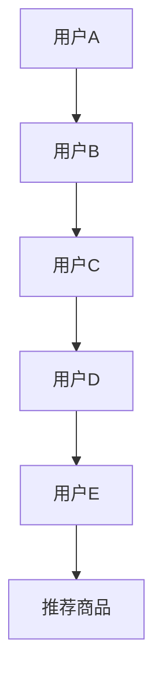
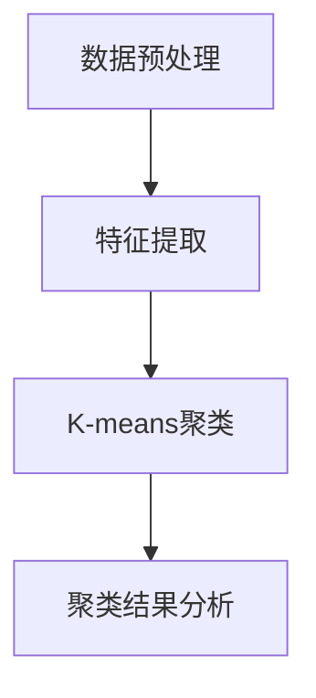
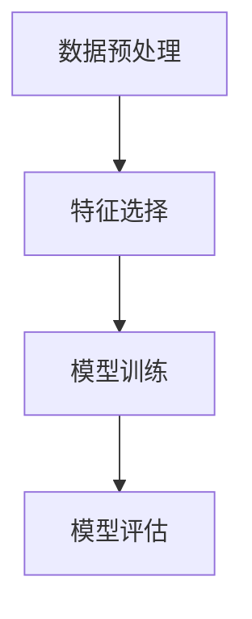
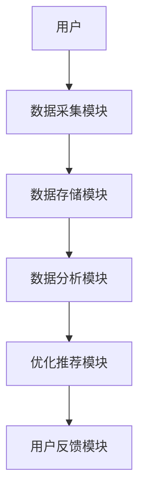

                 


```markdown
# 构建智能化的个人信用卡使用行为优化助手

> 关键词：智能化，信用卡，行为优化，人工智能，大数据分析

> 摘要：本文详细探讨了构建智能化个人信用卡使用行为优化助手的方法，涵盖了从背景分析到系统实现的全过程。通过结合用户画像、消费行为分析、风险评估和推荐系统等核心概念，本文利用协同过滤、聚类分析和机器学习算法，设计了一套完整的优化助手系统架构，并通过实际案例展示了系统的实现和优化效果。最后，本文还提供了项目实战指导和最佳实践建议，帮助读者更好地理解和应用这些技术。

---

## 第一部分：智能化个人信用卡使用行为优化助手的背景与意义

### 第1章：信用卡使用行为优化的背景与问题

#### 1.1 信用卡的现状与挑战

##### 1.1.1 信用卡的普及与问题

随着信用卡的普及，用户在使用信用卡时面临诸多问题，例如超支、高额利息、信用评分下降等。这些问题不仅影响用户的财务健康，还可能导致更严重的金融风险。

##### 1.1.2 用户信用卡使用行为的复杂性

用户的信用卡使用行为受到多种因素的影响，如消费习惯、信用评分、经济状况等。这些复杂性使得手动优化信用卡使用行为变得困难。

##### 1.1.3 优化信用卡使用行为的必要性

优化信用卡使用行为可以帮助用户更好地管理财务，避免债务风险，提升信用评分，并最大化信用卡优惠的使用。

#### 1.2 智能化优化助手的技术背景

##### 1.2.1 人工智能在金融领域的应用

人工智能技术（如机器学习、自然语言处理）在金融领域的应用越来越广泛，特别是在风险评估、投资决策和客户行为分析等方面。

##### 1.2.2 大数据分析技术对信用卡行为分析的支持

大数据分析技术能够从海量数据中提取有价值的信息，帮助金融机构更好地理解用户行为，并提供个性化的服务。

##### 1.2.3 优化助手的核心目标与价值

优化助手的核心目标是通过智能化分析和推荐，帮助用户优化信用卡使用行为。其价值体现在提升用户体验、降低金融风险和增加用户满意度等方面。

#### 1.3 本章小结

本章从信用卡的现状与问题入手，分析了智能化优化助手的必要性和技术背景，为后续的优化策略和系统设计奠定了基础。

---

## 第二部分：智能化优化助手的核心概念与联系

### 第2章：核心概念与联系

#### 2.1 用户画像与行为分析

##### 2.1.1 用户画像的定义与构建

用户画像是基于用户数据构建的用户特征模型，包括用户的基本信息、消费习惯、信用评分等。

##### 2.1.2 消费行为分析的核心要素

消费行为分析的核心要素包括消费频率、消费金额、消费时间、消费类型等。

##### 2.1.3 用户画像与消费行为的关系

用户画像是消费行为分析的基础，消费行为分析则帮助完善用户画像，两者相互作用，共同推动优化助手的决策过程。

#### 2.2 消费行为分析与风险评估

##### 2.2.1 消费行为分析的数学模型

消费行为分析可以采用聚类分析、回归分析等数学模型，帮助识别用户的消费模式和风险。

##### 2.2.2 风险评估的核心指标

风险评估的核心指标包括信用评分、逾期率、违约概率等。

##### 2.2.3 行为分析与风险评估的关联

消费行为分析可以帮助预测用户的信用风险，从而为风险评估提供数据支持。

#### 2.3 优化推荐系统与决策支持

##### 2.3.1 推荐系统的原理与分类

推荐系统通过分析用户行为和偏好，向用户推荐适合的产品或服务。常见的推荐系统包括基于协同过滤的推荐和基于内容的推荐。

##### 2.3.2 优化决策支持的算法选择

优化决策支持可以采用机器学习算法，如随机森林、支持向量机（SVM）等，帮助用户做出最优决策。

##### 2.3.3 系统优化的实现路径

优化路径包括数据采集、特征提取、模型训练、结果分析和反馈优化等步骤。

#### 2.4 核心概念对比分析

##### 2.4.1 用户画像与消费行为的对比

用户画像是用户特征的综合体现，而消费行为分析侧重于用户的实际消费模式。两者相辅相成，共同帮助优化信用卡使用。

##### 2.4.2 风险评估与推荐系统的对比

风险评估侧重于预测和防范，而推荐系统侧重于个性化服务。两者结合可以提供全面的优化支持。

##### 2.4.3 优化助手的整体架构对比

从系统架构的角度，优化助手需要综合考虑数据采集、分析、决策和反馈等多个模块。

#### 2.5 本章小结

本章详细探讨了用户画像、消费行为分析、风险评估和推荐系统的概念与联系，为后续的算法设计和系统实现提供了理论基础。

---

## 第三部分：智能化优化助手的算法原理

### 第3章：算法原理与实现

#### 3.1 协同过滤算法

##### 3.1.1 协同过滤的基本原理

协同过滤是一种基于用户相似性推荐算法，通过找到与目标用户相似的用户群体，推荐他们喜欢的商品或服务。

##### 3.1.2 基于用户的协同过滤

基于用户的协同过滤通过计算用户之间的相似度，找到相似用户的偏好，进行推荐。

##### 3.1.3 基于物品的协同过滤

基于物品的协同过滤通过分析物品之间的相似性，推荐与目标物品相似的其他物品。

##### 3.1.4 协同过滤算法流程图



##### 3.1.5 协同过滤算法的Python实现

```python
def collaborative_filtering(user_id, user_matrix):
    # 计算用户之间的相似度
    similarity = {}
    for user in user_matrix:
        if user != user_id:
            similarity[user] = 1 - abs(user_matrix[user] - user_matrix[user_id])
    # 根据相似度排序，选择相似度最高的用户
    similar_users = sorted(similarity.items(), key=lambda x: x[1], reverse=True)
    # 返回推荐商品
    recommendations = []
    for user, _ in similar_users:
        recommendations.extend(user_matrix[user])
    return list(set(recommendations))
```

#### 3.2 聚类分析算法

##### 3.2.1 聚类分析的定义与分类

聚类分析是一种无监督学习算法，用于将数据分成多个簇，使得簇内数据相似，簇间数据差异较大。

##### 3.2.2 K-means算法的实现

```python
from sklearn.cluster import KMeans

def kmeans_clustering(data, n_clusters):
    # 初始化KMeans模型
    model = KMeans(n_clusters=n_clusters)
    # 模型训练
    model.fit(data)
    # 预测簇标签
    labels = model.predict(data)
    return labels
```

##### 3.2.3 层次聚类算法的应用

层次聚类是一种逐步合并或分割数据点的聚类方法，适用于数据点之间有层次关系的情况。

##### 3.2.4 聚类分析流程图



#### 3.3 机器学习算法

##### 3.3.1 线性回归模型

线性回归模型用于预测连续型变量，适用于消费金额预测等场景。

##### 3.3.2 支持向量机（SVM）算法

SVM算法适用于分类和回归问题，可用于信用卡欺诈检测等任务。

##### 3.3.3 随机森林算法的应用

随机森林是一种基于树的集成算法，适用于分类和回归问题，可用于信用评分预测等任务。

##### 3.3.4 机器学习算法流程图



#### 3.4 本章小结

本章详细讲解了协同过滤、聚类分析和机器学习算法的原理与实现，为后续的系统设计奠定了算法基础。

---

## 第四部分：智能化优化助手的系统架构与设计

### 第4章：系统架构与设计

#### 4.1 系统功能设计

##### 4.1.1 用户画像构建模块

用户画像构建模块负责收集和分析用户的信用卡使用数据，构建用户的特征模型。

##### 4.1.2 消费行为分析模块

消费行为分析模块通过分析用户的消费数据，识别用户的消费模式和风险。

##### 4.1.3 风险评估与预警模块

风险评估与预警模块根据用户的消费行为和信用评分，评估用户的信用风险，并发出预警。

##### 4.1.4 优化推荐模块

优化推荐模块基于用户的消费行为和风险评估结果，推荐最优的信用卡使用策略。

#### 4.2 系统架构设计

##### 4.2.1 系统架构设计



##### 4.2.2 系统功能模块之间的关系

系统功能模块之间通过数据接口进行交互，确保数据流的畅通和系统的高效运行。

#### 4.3 系统接口设计

##### 4.3.1 数据接口设计

数据接口设计包括数据采集接口、数据存储接口和数据分析接口。

##### 4.3.2 用户接口设计

用户接口设计包括用户登录、数据查看和优化推荐的展示。

#### 4.4 系统交互流程

##### 4.4.1 用户登录流程

用户登录流程包括用户认证、权限检查和登录反馈。

##### 4.4.2 数据采集流程

数据采集流程包括数据获取、数据清洗和数据存储。

##### 4.4.3 数据分析流程

数据分析流程包括特征提取、模型训练和结果输出。

##### 4.4.4 优化推荐流程

优化推荐流程包括需求分析、策略生成和结果展示。

#### 4.5 本章小结

本章详细设计了系统的功能模块、架构和交互流程，为后续的系统实现提供了清晰的指导。

---

## 第五部分：项目实战

### 第5章：项目实战

#### 5.1 环境安装

##### 5.1.1 安装Python和相关库

需要安装Python和以下库：
- NumPy
- Pandas
- Scikit-learn
- Matplotlib
- Seaborn

##### 5.1.2 安装开发环境

推荐使用Jupyter Notebook或PyCharm作为开发环境。

#### 5.2 核心代码实现

##### 5.2.1 协同过滤算法实现

```python
def collaborative_filtering(user_id, user_matrix):
    similarity = {}
    for user in user_matrix:
        if user != user_id:
            similarity[user] = 1 - abs(user_matrix[user] - user_matrix[user_id])
    similar_users = sorted(similarity.items(), key=lambda x: x[1], reverse=True)
    recommendations = []
    for user, _ in similar_users:
        recommendations.extend(user_matrix[user])
    return list(set(recommendations))
```

##### 5.2.2 K-means聚类算法实现

```python
from sklearn.cluster import KMeans

def kmeans_clustering(data, n_clusters):
    model = KMeans(n_clusters=n_clusters)
    model.fit(data)
    labels = model.predict(data)
    return labels
```

##### 5.2.3 随机森林算法实现

```python
from sklearn.ensemble import RandomForestClassifier

def random_forest_classifier(X_train, y_train, X_test):
    model = RandomForestClassifier()
    model.fit(X_train, y_train)
    y_pred = model.predict(X_test)
    return y_pred
```

#### 5.3 案例分析与优化效果

##### 5.3.1 数据集准备

准备一个包含信用卡使用数据的CSV文件，包括用户ID、消费金额、消费时间、信用评分等字段。

##### 5.3.2 数据分析与优化

通过协同过滤和随机森林算法，分析用户的消费行为，预测信用风险，并推荐优化策略。

##### 5.3.3 优化效果展示

展示优化前后的消费数据对比，评估优化效果。

#### 5.4 本章小结

本章通过实际案例展示了优化助手的实现过程，验证了算法的有效性和系统的可行性。

---

## 第六部分：最佳实践

### 第6章：最佳实践

#### 6.1 小结

总结本文的主要内容和优化助手的核心价值。

#### 6.2 注意事项

- 数据隐私保护
- 模型的可解释性
- 系统的实时性与稳定性

#### 6.3 扩展阅读

推荐相关书籍和文章，进一步深入学习信用卡优化和人工智能技术。

---

## 作者：AI天才研究院 & 禅与计算机程序设计艺术

---

以上是构建智能化的个人信用卡使用行为优化助手的技术博客文章的完整目录和内容概述。希望这篇文章能够为读者提供清晰的思路和实用的技术指导。
```

