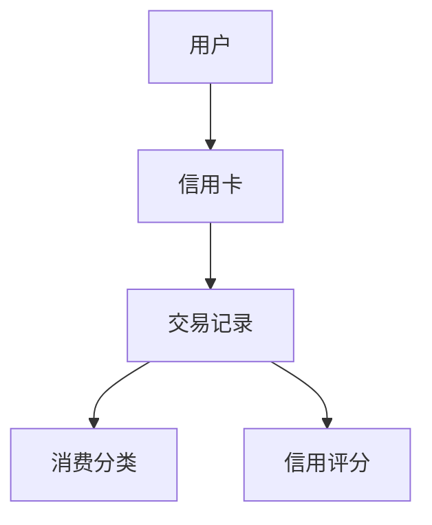
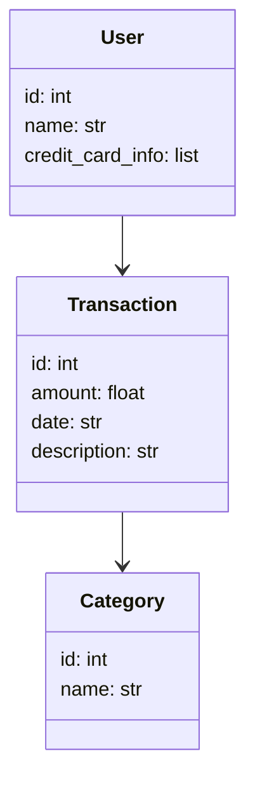

                 


# 《构建智能化的个人信用卡管理助手》

---

## 关键词：
人工智能，机器学习，信用卡管理，自然语言处理，推荐算法，风险管理

---

## 摘要：
随着人工智能技术的快速发展，智能化的个人信用卡管理助手正在成为现代财务管理的重要工具。本文详细探讨了如何利用机器学习、自然语言处理和推荐算法等技术，构建一个高效、智能的信用卡管理助手。文章从背景与核心概念出发，逐步分析了算法原理、系统架构设计、项目实现及优化等关键环节，最后总结了当前技术的应用现状及未来发展趋势。

---

## 第一部分: 智能化个人信用卡管理助手的背景与核心概念

### 第1章: 智能化个人信用卡管理助手的背景与问题描述

#### 1.1 信用卡管理的现状与挑战
##### 1.1.1 信用卡管理的主要问题
现代生活中，信用卡的普及带来了便利，但也带来了管理复杂性。用户通常需要处理大量的交易记录、账单对账、消费分类、信用评分等问题。传统管理方式依赖手工记录或简单工具，效率低下，容易出错。

##### 1.1.2 传统信用卡管理方式的局限性
- 数据分散，难以整合。
- 缺乏自动化分析工具，难以发现潜在问题。
- 无法提供个性化建议，难以优化消费行为。

##### 1.1.3 智能化管理的需求与趋势
随着人工智能技术的进步，用户对智能化管理的需求日益增长。智能化管理能够帮助用户自动化记录、智能分类、实时预警、优化消费策略，成为未来信用卡管理的发展趋势。

#### 1.2 智能化管理的核心目标
##### 1.2.1 提高信用卡使用效率
通过自动化记录和分类，用户可以快速了解消费情况，避免重复消费和超支。

##### 1.2.2 优化财务管理能力
智能化管理助手能够帮助用户制定预算计划，分析消费结构，发现潜在的财务风险。

##### 1.2.3 提升风险管理能力
通过实时监控和异常交易预警，用户可以及时发现并处理潜在的金融风险。

#### 1.3 问题背景与边界定义
##### 1.3.1 问题背景的详细描述
智能化信用卡管理助手的目标是帮助用户实现高效、智能的财务管理。用户需求包括：交易记录管理、消费分析、信用评分、预算制定、异常交易预警等。

##### 1.3.2 边界与外延的界定
- 边界：仅限于信用卡相关的数据处理和管理功能，不涉及其他金融产品。
- 外延：未来可能扩展到其他类型的财务管理，如储蓄、投资等。

##### 1.3.3 核心要素与组成结构
- 用户信息：用户的基本信息和信用卡信息。
- 交易记录：包括时间、金额、商家、交易类型等。
- 消费分类：基于交易记录进行分类。
- 信用评分：基于交易数据和信用历史计算的评分。
- 异常检测：基于机器学习的异常交易预警。

#### 1.4 本章小结
本章从背景出发，详细分析了智能化信用卡管理助手的需求、目标和核心要素，为后续的技术实现奠定了基础。

---

## 第2章: 智能化信用卡管理的核心概念与联系

### 2.1 核心概念的定义与原理
#### 2.1.1 人工智能在信用卡管理中的应用
人工智能技术可以帮助用户自动化处理交易数据，分析消费模式，提供个性化建议。

#### 2.1.2 机器学习在信用卡管理中的作用
机器学习算法可以用于信用评分、交易分类、异常检测等任务。

#### 2.1.3 自然语言处理在信用卡管理中的应用
自然语言处理技术可以帮助识别交易描述中的关键词，实现智能分类。

### 2.2 核心概念的属性特征对比
下表对比了传统信用卡管理与智能化管理在效率、精准度、用户体验等方面的差异：

| 特性                | 传统管理         | 智能化管理       |
|---------------------|-----------------|-----------------|
| 数据处理效率        | 低              | 高              |
| 分类精准度          | 低              | 高              |
| 用户体验            | 差              | 好              |
| 异常检测能力        | 无              | 有              |

### 2.3 ER实体关系图


### 2.4 本章小结
本章通过定义核心概念、对比属性特征、绘制实体关系图，明确了智能化信用卡管理助手的技术基础和实现路径。

---

## 第3章: 信用卡管理助手的算法原理与数学模型

### 3.1 算法原理
#### 3.1.1 机器学习算法的选择与应用
常用的机器学习算法包括监督学习（如线性回归、随机森林）和无监督学习（如聚类分析、主题模型）。

#### 3.1.2 自然语言处理算法的实现原理
自然语言处理算法（如TF-IDF、Word2Vec）用于提取交易描述的关键词，实现智能分类。

#### 3.1.3 推荐算法的实现原理
推荐算法（如协同过滤、基于内容的推荐）用于个性化消费建议。

### 3.2 数学模型与公式
#### 3.2.1 机器学习模型的数学表达
线性回归模型：
$$ y = \theta x + b $$

#### 3.2.2 推荐算法的数学模型
余弦相似度计算：
$$ sim(i,j) = \frac{\sum_{k=1}^{n} r_{ik} r_{jk}}{\sqrt{\sum_{k=1}^{n} r_{ik}^2} \sqrt{\sum_{k=1}^{n} r_{jk}^2}}} $$

### 3.3 算法实现与代码示例
#### 3.3.1 数据预处理代码
```python
import pandas as pd
data = pd.read_csv('credit_data.csv')
data.dropna(inplace=True)
data['category'] = data['description'].apply(extract_category)
```

#### 3.3.2 机器学习模型训练代码
```python
from sklearn.linear_model import LinearRegression
model = LinearRegression()
model.fit(X_train, y_train)
```

#### 3.3.3 推荐算法实现代码
```python
def recommendation(user_id):
    similar_users = find_similar_users(user_id)
    recommended_items = get_common_items(similar_users)
    return recommended_items
```

### 3.4 本章小结
本章详细讲解了算法原理和数学模型，并通过代码示例展示了如何实现智能化信用卡管理助手的核心功能。

---

## 第4章: 推荐算法的实现与优化

### 4.1 推荐算法的实现原理
#### 4.1.1 协同过滤算法
协同过滤算法基于用户行为相似性推荐商品或服务。

#### 4.1.2 基于内容的推荐算法
基于内容的推荐算法通过分析商品属性推荐相关产品。

### 4.2 算法优化与实现
#### 4.2.1 基于深度学习的推荐算法
深度学习模型（如神经网络）可以捕捉复杂的用户行为模式。

#### 4.2.2 处理稀疏数据的方法
使用矩阵填充技术处理稀疏数据，提升推荐算法的效果。

### 4.3 本章小结
本章重点探讨了推荐算法的实现与优化，为用户提供个性化的消费建议。

---

## 第5章: 智能化信用卡管理助手的系统架构设计

### 5.1 系统功能设计
#### 5.1.1 用户模块
用户信息管理、交易记录查询、消费分析报告。

#### 5.1.2 管理模块
交易分类、信用评分计算、异常检测。

### 5.2 领域模型类图


### 5.3 系统架构设计
```mermaid
graph TD
    User --> API Gateway
    API Gateway --> Service Layer
    Service Layer --> Database
```

### 5.4 接口设计与交互流程
用户通过API Gateway调用系统功能，服务层处理请求，数据库存储数据。

### 5.5 本章小结
本章通过系统架构设计和类图展示，明确了智能化信用卡管理助手的技术实现路径。

---

## 第6章: 系统实现与优化

### 6.1 系统实现
#### 6.1.1 环境搭建
安装Python、机器学习库（如Scikit-learn、TensorFlow）和数据库（如MySQL）。

#### 6.1.2 核心代码实现
交易分类代码示例：
```python
from sklearn.svm import SVC
model = SVC()
model.fit(X_train, y_train)
```

#### 6.1.3 测试与优化
通过交叉验证优化模型参数，提升分类准确率。

### 6.2 部署与维护
将系统部署到云平台，定期更新模型和数据。

### 6.3 本章小结
本章详细讲解了系统实现的步骤和优化方法，确保智能化信用卡管理助手的高效运行。

---

## 第7章: 项目实战与应用案例

### 7.1 项目背景与目标
构建一个基于Python的信用卡管理助手，实现交易记录管理、消费分析、异常检测等功能。

### 7.2 核心代码实现
交易记录管理代码示例：
```python
import pandas as pd
data = pd.read_csv('transactions.csv')
data['category'] = data['description'].apply(extract_category)
```

### 7.3 案例分析与解读
通过实际案例分析，展示如何利用智能化管理助手优化消费行为。

### 7.4 本章小结
本章通过项目实战，展示了智能化信用卡管理助手的实际应用价值。

---

## 第8章: 高级技巧与优化策略

### 8.1 算法优化策略
使用超参数调优和模型集成提升算法性能。

### 8.2 数据安全与风险管理
通过加密技术和访问控制保障用户数据安全。

### 8.3 本章小结
本章探讨了智能化信用卡管理助手的优化策略和安全措施。

---

## 第9章: 总结与展望

### 9.1 项目总结
智能化信用卡管理助手通过人工智能技术，显著提升了财务管理的效率和精准度。

### 9.2 未来展望
未来，智能化管理助手将更加智能化、个性化，结合区块链技术实现更安全的金融管理。

### 9.3 本章小结
本章总结了项目成果，展望了未来发展方向。

---

## 作者：AI天才研究院/AI Genius Institute & 禅与计算机程序设计艺术 /Zen And The Art of Computer Programming

---

本文通过详细的技术分析和代码实现，展示了如何构建一个智能化的个人信用卡管理助手。从背景分析到系统实现，再到优化策略，为读者提供了一套完整的解决方案。

