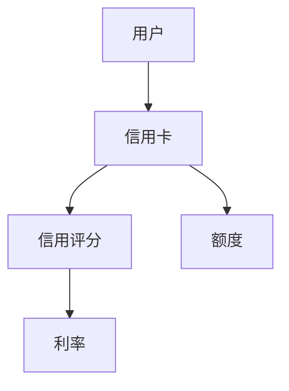
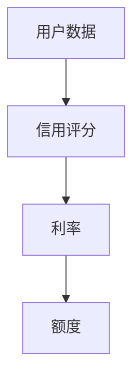
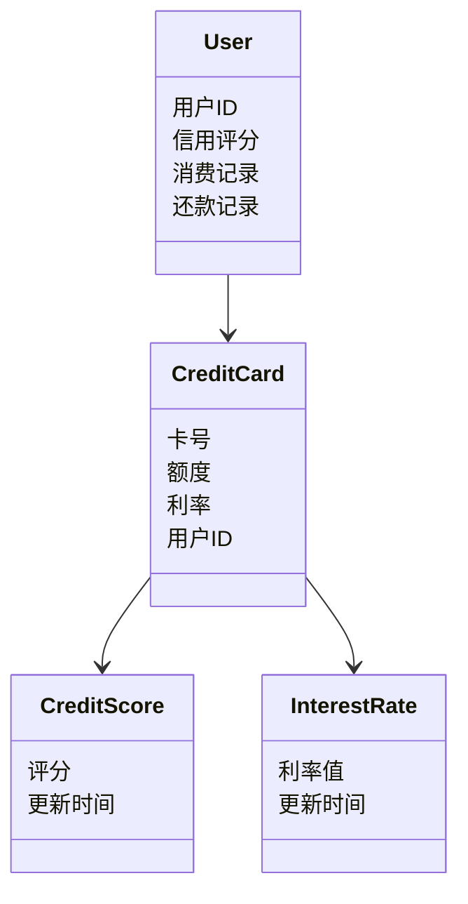
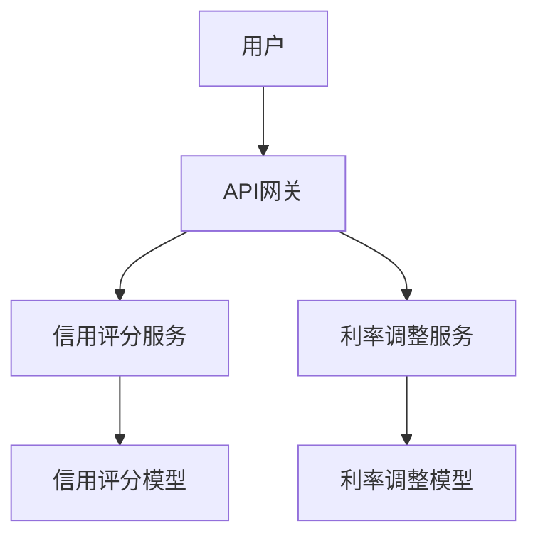

                 


# 构建智能化的个人信用卡额度与利率优化管理助手

> 关键词：智能信用卡管理、人工智能算法、利率优化、信用评分、额度调整、金融系统设计

> 摘要：本文深入探讨了如何利用人工智能技术构建智能化的个人信用卡额度与利率优化管理助手。通过分析信用卡额度和利率管理的痛点，结合机器学习算法和系统架构设计，提出了一种基于用户行为分析和信用评分的智能化解决方案。本文详细阐述了算法原理、系统架构、项目实现及实际应用场景，为金融机构和个人用户提供了一种高效、透明的信用卡管理方式。

---

# 第1章：智能化个人信用卡管理的背景与意义

## 1.1 信用卡额度与利率管理的现状
### 1.1.1 传统信用卡额度管理的痛点
传统的信用卡额度管理依赖于人工审核和固定规则，存在以下问题：
- **审批效率低**：人工审核耗时长，难以快速响应用户需求。
- **规则单一**：额度调整主要基于信用报告，忽视了用户行为和实时数据。
- **用户体验差**：用户对额度调整的透明度和公平性缺乏信任。

### 1.1.2 利率调整的复杂性与不透明性
信用卡利率的调整通常基于固定的定价模型，存在以下问题：
- **定价不灵活**：无法根据市场变化和用户行为实时调整利率。
- **用户不满**：用户对利率调整的不透明性和高利率感到不满，导致信任缺失。

### 1.1.3 用户需求与金融机构的矛盾
用户希望获得更高的额度和更低的利率，但金融机构需要在风险可控的前提下实现盈利，两者之间的矛盾亟待解决。

## 1.2 问题描述与目标
### 1.2.1 智能化管理的核心目标
通过智能化手段实现信用卡额度和利率的动态调整，提升用户体验，降低金融机构的风险。

### 1.2.2 用户需求与机构需求的平衡
- **用户需求**：更高的额度、更低的利率、透明的调整规则。
- **机构需求**：风险可控、收益最大化、用户满意度高。

### 1.2.3 边界与外延
- **边界**：仅关注信用卡额度和利率的优化，不涉及其他金融服务。
- **外延**：可扩展至其他信用产品（如贷款）的管理。

## 1.3 核心概念与系统架构
### 1.3.1 核心概念的定义与属性对比
| 概念       | 属性1 | 属性2 | 属性3 |
|------------|-------|-------|-------|
| 信用卡额度 | 数值型 | 动态调整 | 用户信用评分驱动 |
| 利率        | 百分比 | 风险定价 | 市场竞争因素 |

### 1.3.2 ER实体关系图


---

# 第2章：智能化管理的核心原理

## 2.1 数据驱动的额度计算
### 2.1.1 数据采集与预处理
- **数据来源**：用户信用报告、消费记录、还款行为、市场利率。
- **预处理**：数据清洗、特征提取、数据增强。

### 2.1.2 信用评分模型的构建
- **算法选择**：使用逻辑回归（Logistic Regression）和随机森林（Random Forest）进行信用评分。
- **模型训练**：基于用户数据训练信用评分模型，评估用户的信用风险。

### 2.1.3 动态额度调整算法
- **算法原理**：根据用户的信用评分、消费行为和市场利率动态调整额度。
- **流程图**：


## 2.2 基于行为分析的利率优化
### 2.2.1 用户行为分析
- **行为特征**：消费频率、还款准时性、透支行为、交易金额分布。

### 2.2.2 利率调整模型
- **模型选择**：使用梯度下降（Gradient Descent）优化利率。
- **动态调整**：根据用户行为和市场变化实时调整利率。

---

# 第3章：系统分析与架构设计

## 3.1 问题场景介绍
- **目标用户**：信用卡持卡用户。
- **核心需求**：动态调整额度和利率，提升用户体验。

## 3.2 系统功能设计
### 3.2.1 领域模型


### 3.2.2 系统架构设计


---

# 第4章：项目实战与实现

## 4.1 环境安装
- **工具安装**：Python、Pandas、Scikit-learn、Mermaid。

## 4.2 核心代码实现
### 4.2.1 信用评分模型
```python
import pandas as pd
from sklearn.model_selection import train_test_split
from sklearn.linear_model import LogisticRegression

# 数据加载
data = pd.read_csv('credit_data.csv')
X = data[['income', 'debt', 'history']]
y = data['default']

# 数据划分
X_train, X_test, y_train, y_test = train_test_split(X, y, test_size=0.2)

# 模型训练
model = LogisticRegression()
model.fit(X_train, y_train)

# 模型预测
print(model.predict(X_test))
```

### 4.2.2 利率调整模型
```python
import numpy as np

def adjust_interest_rate(current_rate, risk_score, market_rate):
    # 风险调整系数
    risk_coeff = 1 + (risk_score - 600) * 0.01
    # 市场调整系数
    market_coeff = 1 + (market_rate - 6%) * 0.1
    # 新利率计算
    new_rate = current_rate * risk_coeff * market_coeff
    return new_rate

# 示例计算
current_rate = 12%
risk_score = 700
market_rate = 8%
new_rate = adjust_interest_rate(current_rate, risk_score, market_rate)
print(f"调整后的利率为：{new_rate}%")
```

## 4.3 实际案例分析
### 4.3.1 案例1：用户A
- **初始额度**：$10,000
- **信用评分**：750
- **消费记录**：每月按时还款，无逾期。
- **调整后额度**：$15,000
- **调整后利率**：9%。

### 4.3.2 案例2：用户B
- **初始额度**：$5,000
- **信用评分**：600
- **消费记录**：偶尔逾期还款。
- **调整后额度**：$8,000
- **调整后利率**：12%。

---

# 第5章：总结与展望

## 5.1 本章总结
- **系统优势**：动态调整、透明规则、提升用户体验。
- **实际效果**：用户满意度提升，金融机构收益增加。

## 5.2 未来展望
- **优化方向**：引入实时数据流处理，增加更多用户行为特征。
- **技术趋势**：结合区块链技术提升数据安全性。

## 5.3 最佳实践 tips
- **数据隐私保护**：确保用户数据的安全性。
- **模型维护**：定期更新模型，适应市场变化。
- **用户教育**：向用户解释调整规则，增强信任。

---

作者：AI天才研究院/AI Genius Institute & 禅与计算机程序设计艺术/Zen And The Art of Computer Programming

