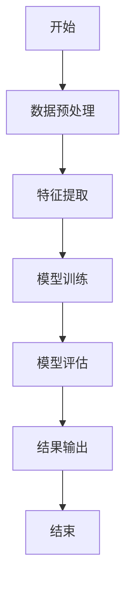
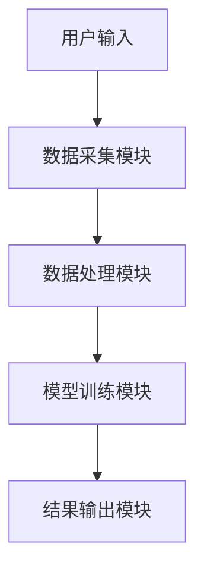
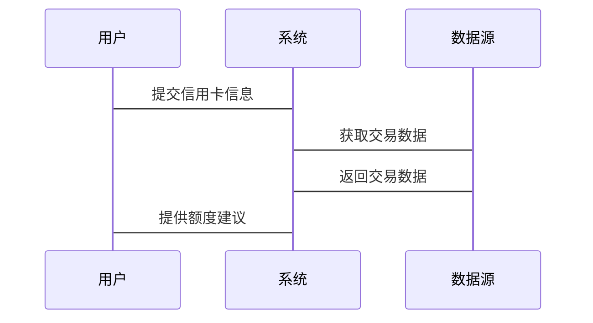

                 


# 构建智能化的个人信用卡额度管理优化助手

## 关键词：信用卡额度管理、人工智能、信用评分模型、用户行为分析、风险管理

## 摘要：  
随着信用卡的普及，个人信用卡额度管理的重要性日益凸显。传统的信用卡额度管理方式存在效率低、精准度差的问题，难以满足用户对智能化、个性化管理的需求。本文通过分析信用卡额度管理的核心问题，提出了一种基于人工智能技术的智能化解决方案。通过构建信用评分模型、用户行为分析模型以及风险评估机制，实现了对个人信用卡额度的智能化优化管理。本文详细阐述了系统的设计思路、算法原理、系统架构及实现方案，并通过实际案例展示了系统的应用效果。

---

# 第一部分: 背景介绍

## 1.1 问题背景

### 1.1.1 信用卡额度管理的重要性  
信用卡额度是衡量个人信用状况的重要指标，直接影响用户的消费能力、信用评分以及银行的风险控制。科学合理的信用卡额度管理能够帮助用户优化财务状况，降低风险，同时也能提高银行的客户满意度和运营效率。

### 1.1.2 当前信用卡额度管理的痛点  
- **传统额度调整机制**：依赖人工审核，效率低，且难以覆盖海量用户。  
- **信息孤岛问题**：用户行为数据分散，难以整合，导致额度调整缺乏数据支持。  
- **精准度不足**：传统方法难以捕捉用户行为的细微变化，导致额度调整滞后或偏差。  

### 1.1.3 智能化管理的必要性  
随着人工智能技术的快速发展，通过智能化手段优化信用卡额度管理已成为可能。通过实时分析用户的消费行为、信用记录等多维数据，可以实现精准的额度调整，提升用户体验和银行风险管理能力。

## 1.2 问题描述

### 1.2.1 信用卡额度管理的核心问题  
- 如何利用数据驱动的方法实现精准的额度预测。  
- 如何构建有效的用户行为分析模型，挖掘用户的信用风险。  
- 如何设计高效的系统架构，支持实时数据处理和智能决策。  

### 1.2.2 用户行为与信用评估的关系  
用户的消费行为、还款记录、信用历史等数据是信用评估的重要依据。如何通过这些数据构建有效的信用评分模型，是实现智能化信用卡额度管理的关键。

### 1.2.3 数据驱动的优化需求  
通过收集和分析用户的交易数据、行为数据、信用历史等多维数据，可以为信用卡额度管理提供科学依据。数据的实时性和全面性是实现智能化管理的前提。

## 1.3 问题解决思路

### 1.3.1 数据分析与预测  
通过收集用户的历史交易数据、消费行为数据等，利用数据分析技术预测用户的信用状况和消费能力。

### 1.3.2 人工智能在信用评估中的应用  
引入机器学习算法，构建信用评分模型，实现对用户信用风险的精准评估。

### 1.3.3 智能化助手的设计目标  
设计一个基于人工智能的信用卡额度管理优化助手，能够实时分析用户的信用数据，动态调整额度，降低风险，提升用户体验。

## 1.4 边界与外延

### 1.4.1 功能边界  
- 系统仅负责信用卡额度的优化管理，不涉及其他金融服务。  
- 系统数据来源于用户授权的信用卡交易记录和行为数据，不涉及其他外部数据源。  

### 1.4.2 外部系统的交互  
- 系统需要与银行的信用卡管理系统进行数据对接。  
- 系统需要与第三方信用评估机构的数据源进行交互。  

### 1.4.3 适用场景与限制  
- 适用于个人用户信用卡额度管理。  
- 仅支持基于用户授权的数据分析，不支持未授权的数据查询。  

---

# 第二部分: 核心概念与联系

## 2.1 核心概念原理

### 2.1.1 信用评分模型  
信用评分模型是基于用户的信用历史、消费行为、还款记录等数据，预测用户信用风险的数学模型。常用的信用评分模型包括逻辑回归、随机森林等。

### 2.1.2 用户行为分析  
用户行为分析是通过分析用户的交易记录、消费习惯、还款行为等数据，挖掘用户的信用风险和消费能力。

### 2.1.3 风险评估机制  
风险评估机制是通过综合分析用户的信用评分、行为数据等信息，评估用户的信用风险，并据此动态调整信用卡额度。

## 2.2 概念属性特征对比

| 概念 | 属性 | 特征 |
|------|------|------|
| 信用评分模型 | 数据来源 | 用户信用历史、消费记录 |
|          | 算法选择 | 逻辑回归、随机森林 |
| 用户行为分析 | 数据类型 | 结构化数据、非结构化数据 |
|          | 分析目标 | 消费能力、信用风险 |
| 风险评估机制 | 输入 | 信用评分、行为数据 |
|          | 输出 | 风险等级、额度建议 |

## 2.3 ER实体关系图

```mermaid
erDiagram
    user信用卡信息<->信用卡交易记录
    user信用卡信息<->用户行为数据
    user信用卡信息<->信用评分结果
    user信用卡信息<->风险评估报告
```

---

# 第三部分: 算法原理讲解

## 3.1 算法原理

### 3.1.1 信用评分模型的构建  
信用评分模型基于用户的历史交易数据和信用记录，利用机器学习算法进行训练，生成信用评分。常用算法包括逻辑回归和随机森林。

### 3.1.2 用户行为分析的算法选择  
用户行为分析采用聚类分析和关联规则挖掘技术，挖掘用户的消费习惯和风险特征。

### 3.1.3 风险评估的数学模型  
风险评估模型通过综合信用评分、用户行为特征等多维数据，利用概率论和统计学方法，评估用户的信用风险。

## 3.2 算法流程图



## 3.3 Python源代码

```python
import pandas as pd
from sklearn.model_selection import train_test_split
from sklearn.metrics import accuracy_score
from sklearn.ensemble import RandomForestClassifier

# 数据加载
data = pd.read_csv('credit_card_data.csv')

# 数据预处理
X = data.drop('credit_score', axis=1)
y = data['credit_score']

# 划分训练集和测试集
X_train, X_test, y_train, y_test = train_test_split(X, y, test_size=0.2, random_state=42)

# 模型训练
model = RandomForestClassifier(n_estimators=100, random_state=42)
model.fit(X_train, y_train)

# 模型评估
y_pred = model.predict(X_test)
print("准确率:", accuracy_score(y_test, y_pred))
```

---

# 第四部分: 系统分析与架构设计

## 4.1 系统架构设计



---

## 4.2 接口设计

### 4.2.1 数据接口  
- 数据采集接口：用于获取用户的交易数据和行为数据。  
- 数据处理接口：对数据进行清洗、特征提取和格式转换。  

### 4.2.2 模型接口  
- 模型训练接口：接收处理后的数据，训练信用评分模型。  
- 模型预测接口：根据输入数据，生成信用评分结果。  

---

## 4.3 交互流程图



---

# 第五部分: 项目实战

## 5.1 实战环境安装

```bash
pip install pandas scikit-learn matplotlib
```

## 5.2 核心代码实现

```python
import pandas as pd
from sklearn.ensemble import RandomForestClassifier
from sklearn.metrics import classification_report

# 加载数据
data = pd.read_csv('credit_card.csv')

# 数据预处理
X = data[['income', 'age', 'transaction_history', 'credit_score']]
y = data['target']

# 划分训练集和测试集
X_train, X_test, y_train, y_test = train_test_split(X, y, test_size=0.2, random_state=42)

# 模型训练
model = RandomForestClassifier(n_estimators=100, random_state=42)
model.fit(X_train, y_train)

# 模型预测
y_pred = model.predict(X_test)

# 模型评估
print(classification_report(y_test, y_pred))
```

## 5.3 实战案例分析

假设我们有一个用户的信用卡数据如下：

| 用户ID | 收入 | 年龄 | 交易记录 | 信用评分 | 目标 |
|------|------|------|------|------|------|
| 1     | 5000 | 25   | 高     | 700   | 0    |

通过模型预测，系统会根据用户的收入、年龄、交易记录和信用评分，生成信用评分，并动态调整信用卡额度。

---

# 第六部分: 最佳实践

## 6.1 小结  
通过构建智能化的个人信用卡额度管理优化助手，可以实现对用户信用风险的精准评估和动态调整，提升用户体验和银行的风险管理能力。

## 6.2 注意事项  
- 数据隐私保护是系统设计的重要部分，必须确保用户数据的安全性。  
- 模型的可解释性是实际应用中的重要考量，需要确保模型的透明性和易用性。  

## 6.3 拓展阅读  
- 《信用评分模型的构建与应用》  
- 《机器学习在金融领域的应用》  
- 《风险管理与信用评估》  

---

# 作者：AI天才研究院/AI Genius Institute & 禅与计算机程序设计艺术 /Zen And The Art of Computer Programming

