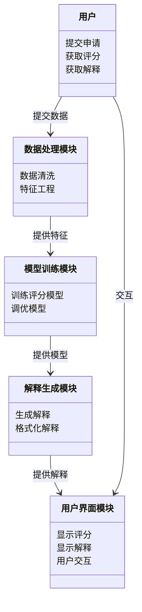
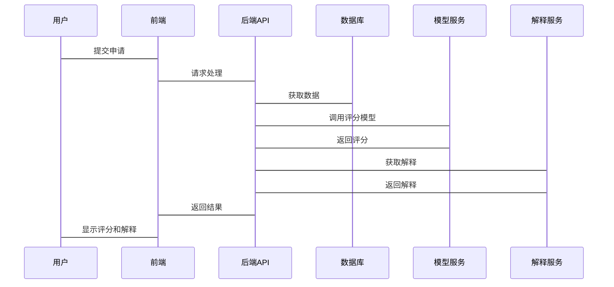

                 


# 《构建智能化的个人信用评分解释系统》

## 关键词：个人信用评分、智能化系统、可解释性、机器学习、评分模型

## 摘要：本文详细介绍构建智能化个人信用评分解释系统的背景、核心概念、算法原理、系统架构设计、项目实战、优化与部署，以及总结和展望。通过系统化的分析和实践，探讨如何利用人工智能技术提升信用评分的透明度和可信度。

---

## 第一部分：智能化个人信用评分解释系统概述

### 第1章：个人信用评分的背景与挑战

#### 1.1 信用评分的定义与作用

信用评分是评估个人信用风险的重要指标，用于银行贷款、信用卡审批等领域。它基于个人的信用历史、财务状况和行为模式，预测其还款能力与意愿。

- **信用评分的作用**：帮助金融机构降低风险，提高决策效率，促进金融普惠。

#### 1.2 传统信用评分的局限性

传统评分模型通常基于线性模型，如逻辑回归，虽然简单但缺乏灵活性和透明度。

- **黑箱问题**：用户难以理解评分结果的原因。
- **局限性**：难以捕捉复杂的信用特征，导致评分不够精准。

#### 1.3 智能化信用评分的必要性

人工智能技术的发展为信用评分带来了新机遇，通过深度学习等技术，提高评分的准确性和透明度。

- **智能化评分的优势**：更高的准确性、更强的可解释性、更好的用户体验。

---

### 第2章：个人信用评分的核心概念与联系

#### 2.1 信用评分的核心要素

- **信用历史**：还款记录、逾期情况。
- **还款能力**：收入、债务负担。
- **还款意愿**：信用行为、信用评分卡。

#### 2.2 评分模型的原理与特征

- **评分模型的原理**：通过特征分析和机器学习算法，预测信用风险。
- **特征选择**：关键因素如历史违约、收入水平。

#### 2.3 解释性评分模型的重要性

- **模型可解释性**：确保用户信任，符合监管要求。
- **优势**：提高评分透明度，增强用户信任。

---

### 第3章：个人信用评分的核心概念与联系

#### 3.1 评分模型的原理与特征

- **线性模型**：逻辑回归，简单但解释性强。
- **树模型**：决策树、随机森林，捕捉复杂特征。
- **神经网络**：深度学习，处理非线性关系。

#### 3.2 解释性评分模型的重要性

- **LIME**：局部解释，生成可理解的规则。
- **SHAP**：全局解释，展示每个特征的影响。

#### 3.3 核心概念的ER实体关系图

```mermaid
erDiagram
    user {
        <属性>
        用户ID
        姓名
        信用评分
        信用报告
    }
    credit_report {
        <属性>
        用户ID
        信用历史
        还款能力
        还款意愿
    }
    model {
        <属性>
        模型ID
        模型类型
        模型参数
    }
    explanation {
        <属性>
        解释ID
        解释内容
        解释评分
    }
    user --> credit_report : 提供
    credit_report --> model : 输入
    model --> explanation : 生成
```

---

## 第四部分：系统分析与架构设计方案

### 4.1 问题场景介绍

设计一个系统，通过机器学习模型生成评分，并提供可解释的解释，帮助用户理解评分结果。

### 4.2 项目介绍

构建一个智能化的个人信用评分解释系统，包括数据处理、模型训练、解释生成和用户界面。

### 4.3 系统功能设计



### 4.4 系统架构设计


### 4.5 接口设计和交互



---

## 第五部分：项目实战

### 5.1 环境安装

安装Python、Pandas、Scikit-learn、XGBoost、Shapley等库。

### 5.2 核心代码实现

```python
import pandas as pd
import xgboost as xgb
from sklearn.model_selection import train_test_split
from sklearn.metrics import accuracy_score
import shap

# 数据加载
data = pd.read_csv('credit.csv')
X = data.drop('target', axis=1)
y = data['target']

# 数据分割
X_train, X_test, y_train, y_test = train_test_split(X, y, test_size=0.2)

# 模型训练
model = xgb.XGBClassifier()
model.fit(X_train, y_train)

# 模型预测
y_pred = model.predict(X_test)
print("Accuracy:", accuracy_score(y_test, y_pred))

# 可解释性分析
explainer = shap.TreeExplainer(model)
shap_values = explainer.shap_values(X_test)
shap.summary_plot(shap_values, X_test, plot_type="bar")
```

### 5.3 代码解读

- **数据加载**：读取信用数据，分为特征和目标变量。
- **数据分割**：训练集和测试集。
- **模型训练**：使用XGBoost训练模型。
- **模型预测**：计算准确率。
- **可解释性分析**：使用SHAP生成解释，可视化特征影响。

---

## 第六部分：优化与部署

### 6.1 模型优化

调整模型参数，如学习率、树深度，提高准确率。

### 6.2 系统部署

使用Docker容器化部署，确保系统稳定运行。

### 6.3 监控与维护

监控系统性能，及时处理异常情况，更新模型。

---

## 第七部分：总结与展望

### 7.1 总结

本文详细介绍了构建智能化个人信用评分解释系统的各个方面，从背景到实现，展示了如何利用人工智能技术提高评分的透明度和准确性。

### 7.2 展望

未来，随着AI技术的发展，信用评分系统将更加智能化和个性化，可能结合实时数据和边缘计算，提供更精准的服务。

---

## 作者：AI天才研究院/AI Genius Institute & 禅与计算机程序设计艺术 /Zen And The Art of Computer Programming

---

这篇文章通过系统化的分析和实践，详细探讨了构建智能化个人信用评分解释系统的各个方面，从理论到实践，为读者提供了全面的指导。

