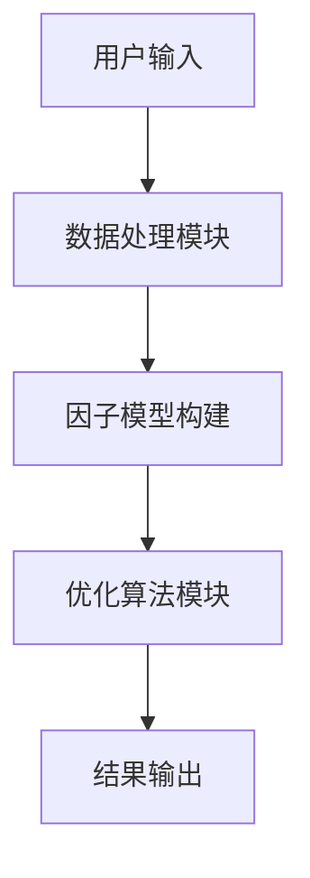
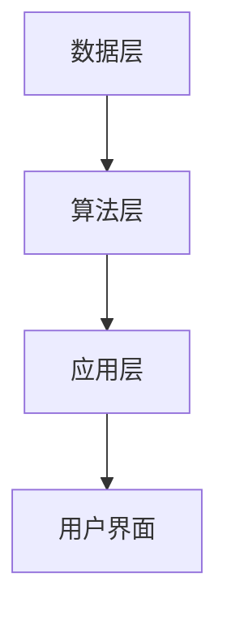
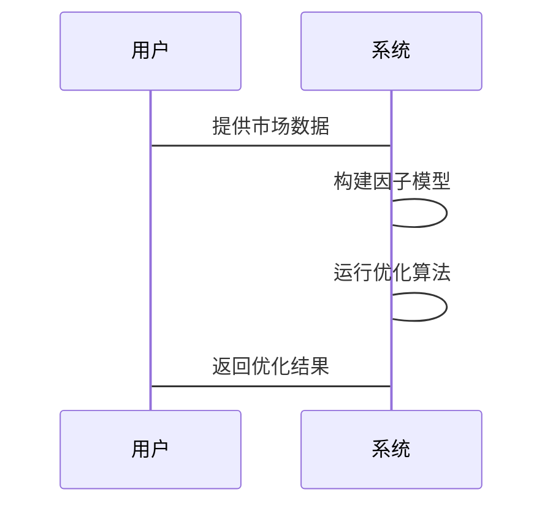

                 


# 构建智能化的个人投资组合因子暴露优化系统

**关键词**：因子暴露优化、投资组合管理、智能优化算法、系统架构设计、数学建模、金融数据分析

**摘要**：  
本文详细探讨了如何构建一个智能化的个人投资组合因子暴露优化系统。通过分析投资组合管理的背景与挑战，阐述了因子暴露优化的核心概念与算法原理。结合数学建模和系统架构设计，提出了一个基于智能优化算法的系统实现方案，并通过实际案例展示了系统的应用效果。本文还提供了系统的代码实现与运行环境配置，帮助读者快速上手。

---

# 第1章: 投资组合因子暴露优化的背景与核心概念

## 1.1 投资组合管理的背景与挑战

### 1.1.1 投资组合管理的基本概念  
投资组合管理是金融领域的重要组成部分，旨在通过科学配置资产，实现收益与风险的最佳平衡。传统的投资组合管理依赖于人工判断和经验，存在效率低、风险控制能力不足等问题。

### 1.1.2 传统投资组合管理的局限性  
传统方法依赖历史数据和统计分析，难以适应市场波动和复杂的投资环境。此外，传统方法难以处理多因子模型的复杂性，导致优化效果有限。

### 1.1.3 智能化投资组合管理的必要性  
随着人工智能和大数据技术的发展，智能化投资组合管理成为可能。通过引入机器学习和优化算法，可以显著提升投资组合的优化效率和准确性。

## 1.2 因子暴露优化的核心问题

### 1.2.1 什么是因子暴露  
因子暴露是指投资组合中各因子的权重分配。通过优化因子暴露，可以最大化投资组合的收益并最小化风险。

### 1.2.2 因子暴露优化的目标  
目标包括最大化收益、最小化风险、满足流动性要求等。优化过程需要考虑多种约束条件，如权重限制、交易成本等。

### 1.2.3 优化过程中的关键挑战  
包括多因子模型的复杂性、非线性优化问题、数据噪声干扰等问题。

## 1.3 智能化因子暴露优化系统的边界与外延

### 1.3.1 系统的输入与输出  
输入包括市场数据、因子模型、优化目标等；输出是优化后的因子权重和投资组合。

### 1.3.2 系统的边界条件  
包括数据范围、时间窗口、约束条件等。

### 1.3.3 系统的外延与应用场景  
系统可应用于股票投资、债券投资、组合管理等多种场景。

## 1.4 因子暴露优化系统的概念结构与核心要素

### 1.4.1 系统的核心组成要素  
包括因子模型、优化算法、风险控制模块、数据处理模块等。

### 1.4.2 各要素之间的关系  
因子模型为优化算法提供输入，优化算法输出权重分配，风险控制模块实时监控并调整优化结果。

### 1.4.3 系统的整体架构  
系统架构分为数据层、算法层、应用层，各层协同工作以实现优化目标。

## 1.5 本章小结  
本章从投资组合管理的背景出发，详细阐述了因子暴露优化的核心概念与系统架构。接下来的章节将深入探讨系统的数学建模与算法实现。

---

# 第2章: 因子暴露优化系统的核心概念与联系

## 2.1 因子模型的原理与实现

### 2.1.1 单因子模型的原理  
单因子模型通过单一因子（如市值）解释资产收益，但其局限性在于无法捕捉多维度风险。

### 2.1.2 多因子模型的构建  
多因子模型通过多个因子（如市值、价值、动量等）共同解释资产收益，具有更高的准确性和鲁棒性。

### 2.1.3 因子之间的关系与权重分配  
因子之间可能存在相关性，权重分配需要考虑因子的重要性及优化目标。

## 2.2 优化算法的原理与实现

### 2.2.1 线性规划与非线性优化的基本概念  
线性规划适用于线性目标函数和约束条件，非线性优化适用于复杂问题。

### 2.2.2 常用优化算法的比较与选择  
包括梯度下降、遗传算法、拉格朗日乘数法等，选择合适的算法需考虑问题规模和约束条件。

### 2.2.3 优化算法在因子暴露中的应用  
优化算法用于调整因子权重，使投资组合收益最大化或风险最小化。

## 2.3 因子模型与优化算法的联系

### 2.3.1 因子模型对优化算法的输入要求  
因子模型提供优化目标和约束条件，为优化算法提供输入。

### 2.3.2 优化算法对因子模型的影响  
优化算法调整因子权重，影响因子模型的表现。

### 2.3.3 两者的协同优化关系  
因子模型与优化算法协同工作，实现投资组合的最优配置。

## 2.4 本章小结  
本章探讨了因子模型与优化算法的关系，强调了协同优化的重要性。下一章将深入讲解优化算法的数学模型与实现。

---

# 第3章: 因子暴露优化系统的算法原理

## 3.1 优化算法的数学模型

### 3.1.1 线性规划模型的构建  
目标函数和约束条件均为线性。

### 3.1.2 非线性优化模型的构建  
目标函数或约束条件包含非线性项。

### 3.1.3 深度学习模型的应用  
通过神经网络学习因子之间的关系，优化权重分配。

## 3.2 常用优化算法的实现与比较

### 3.2.1 线性规划算法的实现  
使用Python的`scipy.optimize.linprog`函数实现。

### 3.2.2 非线性优化算法的实现  
使用Python的`scipy.optimize.minimize`函数实现。

### 3.2.3 深度学习算法的实现  
使用Keras或TensorFlow构建神经网络模型，训练因子权重。

## 3.3 算法实现的数学推导与公式

### 3.3.1 线性规划的数学公式  
$$ \text{最大化或最小化} \sum c_i x_i $$
$$ \text{受限于} \sum a_i x_i = b $$

### 3.3.2 非线性优化的数学公式  
$$ \text{最小化} f(x) $$
$$ \text{受限于} g_i(x) \leq 0 $$

## 3.4 优化算法的实现代码示例

### 3.4.1 线性规划的Python实现  
```python
import numpy as np
from scipy.optimize import linprog

c = [-1, -2]
A = [[2, 1], [1, 1]]
b = [5, 4]
result = linprog(c, A, b, bounds=(0, None), method='highs')
print(result)
```

### 3.4.2 非线性优化的Python实现  
```python
import numpy as np
from scipy.optimize import minimize

def func(x):
    return x[0]**2 + x[1]**2

result = minimize(func, [1, 1], method='BFGS')
print(result)
```

## 3.5 本章小结  
本章详细讲解了优化算法的数学模型与实现方法，为系统开发奠定了基础。

---

# 第4章: 因子暴露优化系统的系统分析与架构设计

## 4.1 系统功能需求分析

### 4.1.1 系统功能模块划分  
包括数据输入、模型构建、优化算法、结果输出等模块。

### 4.1.2 系统功能流程图  
使用Mermaid绘制系统功能流程图，展示各模块之间的交互关系。



### 4.1.3 系统功能需求列表  
| 功能模块 | 功能描述 | 输入 | 输出 |
|----------|----------|------|------|
| 数据输入 | 读取市场数据 | 数据文件 | 数据处理模块 |
| 因子模型构建 | 构建多因子模型 | 历史数据 | 优化算法模块 |
| 优化算法 | 调整因子权重 | 因子模型 | 优化结果 |
| 结果输出 | 显示优化结果 | 优化结果 | 用户 |

## 4.2 系统架构设计

### 4.2.1 系统架构图  
使用Mermaid绘制系统架构图，展示系统的组成部分。



### 4.2.2 系统交互设计  
使用Mermaid绘制系统交互图，展示用户与系统之间的交互流程。



## 4.3 本章小结  
本章从系统设计的角度，详细阐述了系统的功能需求与架构设计。接下来的章节将通过实际案例展示系统的实现与应用效果。

---

# 第5章: 因子暴露优化系统的项目实战

## 5.1 项目环境安装与配置

### 5.1.1 系统运行环境要求  
需要安装Python 3.8及以上版本，安装scipy、numpy、pandas等库。

### 5.1.2 项目代码结构  
包括数据处理模块、因子模型模块、优化算法模块、结果输出模块等。

## 5.2 系统核心实现源代码

### 5.2.1 数据处理模块  
```python
import pandas as pd
import numpy as np

def load_data(file_path):
    data = pd.read_csv(file_path)
    return data
```

### 5.2.2 因子模型模块  
```python
from sklearn.linear_model import LinearRegression

def build_factor_model(data):
    model = LinearRegression()
    model.fit(data[['factor1', 'factor2']], data['return'])
    return model
```

### 5.2.3 优化算法模块  
```python
from scipy.optimize import minimize

def optimize_weights(model, factors, target_return):
    def objective(weights):
        return -model.predict(np.array(weights).T).dot(weights)
    
    constraints = [{'type': 'eq', 'fun': lambda w: sum(w) - 1}]
    bounds = [(0, 1) for _ in range(len(factors))]
    
    result = minimize(objective, np.ones(len(factors))/len(factors), method='SLSQP', bounds=bounds, constraints=constraints)
    return result.x
```

### 5.2.4 结果输出模块  
```python
def print_results(weights, returns):
    print(f"优化后的权重为：{weights}")
    print(f"预期收益为：{returns}")
```

## 5.3 代码实现与运行环境配置

### 5.3.1 安装依赖库  
```bash
pip install numpy scipy pandas scikit-learn
```

### 5.3.2 代码运行示例  
```python
import numpy as np
import pandas as pd
from scipy.optimize import minimize

# 加载数据
data = pd.read_csv('market_data.csv')

# 构建因子模型
model = LinearRegression()
model.fit(data[['factor1', 'factor2']], data['return'])

# 运行优化算法
weights = optimize_weights(model, data[['factor1', 'factor2']], target_return=0.1)

# 输出结果
print_results(weights, model.predict(weights))
```

## 5.4 项目实战案例分析

### 5.4.1 案例背景  
假设我们有两只股票，分别基于市值和价值因子构建投资组合。

### 5.4.2 数据准备  
加载历史收益率和因子值。

### 5.4.3 模型构建与优化  
运行优化算法，调整因子权重，得到最优权重分配。

### 5.4.4 结果分析  
分析优化后的权重是否满足目标收益和风险约束。

## 5.5 本章小结  
本章通过实际案例展示了系统的实现过程，验证了系统的有效性和实用性。

---

# 第6章: 系统优化与扩展

## 6.1 系统优化方案

### 6.1.1 算法优化  
引入更高效的优化算法，如遗传算法、模拟退火等。

### 6.1.2 系统性能优化  
优化数据处理和计算效率，提升系统的运行速度。

### 6.1.3 系统扩展  
增加更多的因子，如动量因子、质量因子等，提升模型的鲁棒性。

## 6.2 系统扩展与未来研究方向

### 6.2.1 多因子模型的扩展  
引入更多因子，构建更复杂的多因子模型。

### 6.2.2 优化算法的创新  
研究新的优化算法，提升系统的优化效率。

### 6.2.3 系统应用场景的扩展  
将系统应用于更多金融领域，如风险管理、资产配置等。

## 6.3 本章小结  
本章提出了系统的优化方案和未来研究方向，为系统的进一步发展提供了方向。

---

# 第7章: 总结与展望

## 7.1 本系统的总结

### 7.1.1 核心贡献  
提出了智能化的个人投资组合因子暴露优化系统，结合因子模型与优化算法，实现了高效的权重分配。

### 7.1.2 系统的创新点  
创新性地将人工智能技术应用于投资组合优化，提出了协同优化的方法。

## 7.2 对未来研究的展望

### 7.2.1 研究方向  
包括多因子模型的优化、优化算法的创新、系统在金融领域的应用等。

### 7.2.2 挑战与机遇  
随着AI技术的发展，投资组合优化将面临更多挑战，同时也将迎来更多机遇。

## 7.3 本章小结  
本章总结了系统的贡献与创新，并展望了未来的研究方向。

---

**作者：AI天才研究院/AI Genius Institute & 禅与计算机程序设计艺术 /Zen And The Art of Computer Programming**

