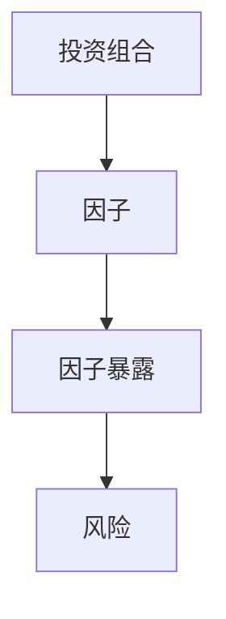

                 


# 《构建智能化的个人投资组合因子暴露分析系统》

> 关键词：投资组合、因子暴露、风险管理、系统架构、机器学习、Python实现

> 摘要：本文详细介绍了构建智能化个人投资组合因子暴露分析系统的全过程，包括背景分析、核心概念、算法原理、系统架构设计及项目实战。通过系统的构建，帮助投资者更好地理解投资组合的风险构成，优化投资决策。

---

# 第一部分: 背景介绍与核心概念

---

## 第1章: 投资组合因子暴露分析的背景与问题

### 1.1 问题背景

#### 1.1.1 投资组合管理的现状与挑战

现代投资管理正面临着前所未有的复杂性和挑战。随着市场的波动加剧，投资者需要更精准的工具来监控和管理投资组合的风险。传统的投资组合管理方法依赖于历史数据分析和简单统计指标，难以捕捉复杂市场环境下的潜在风险。

#### 1.1.2 因子分析在投资组合管理中的重要性

因子分析是一种强大的工具，用于分解资产回报的驱动因素。通过识别关键的市场因子（如市值、价值、动量等），投资者可以更好地理解投资组合的表现，并优化其风险敞口。

#### 1.1.3 智能化分析的需求与趋势

随着人工智能和大数据技术的快速发展，智能化的因子暴露分析系统成为投资组合管理的必然趋势。通过机器学习算法，系统可以实时分析市场动态，提供个性化的风险评估和优化建议。

### 1.2 问题描述

#### 1.2.1 投资组合因子暴露的核心问题

投资组合的因子暴露是指其对各个市场因子的敏感程度。准确量化这些暴露可以帮助投资者更好地理解投资组合的风险来源，并制定有效的对冲策略。

#### 1.2.2 因子分析的复杂性与局限性

传统因子分析方法存在以下问题：
- 数据维度高，计算复杂
- 无法实时更新，难以应对快速变化的市场
- 需要大量历史数据支持

#### 1.2.3 智能化系统的需求与目标

智能化的因子暴露分析系统的目标是：
- 实时监控市场因子的变化
- 自动化计算投资组合的因子暴露
- 提供个性化的风险管理和优化建议

### 1.3 问题解决与边界

#### 1.3.1 智能化因子暴露分析系统的解决方案

通过结合机器学习和大数据技术，构建一个实时、动态的因子分析系统，能够快速响应市场变化，并提供精准的风险评估。

#### 1.3.2 系统的边界与外延

系统的边界包括：
- 输入：投资组合数据、市场因子数据
- 输出：因子暴露报告、风险评估
- 外延：系统不直接涉及投资决策，但可以为决策提供支持

#### 1.3.3 核心要素与组成结构

系统的核心要素包括：
- 数据采集模块
- 因子分析模块
- 风险评估模块
- 用户界面模块

---

### 1.4 本章小结

本章介绍了投资组合因子暴露分析的背景、核心问题及智能化系统的必要性。通过分析传统方法的局限性，提出了构建智能化系统的初步思路。

---

## 第2章: 因子暴露分析的核心概念与联系

### 2.1 核心概念原理

#### 2.1.1 投资组合因子的定义与分类

因子可以分为以下几类：
- 市场因子（Market Factor）
- 价值因子（Value Factor）
- 动量因子（Momentum Factor）
- 大盘因子（Size Factor）

#### 2.1.2 因子暴露的计算方法

因子暴露的计算公式为：
$$ \text{因子暴露} = \beta $$
其中，$\beta$ 是投资组合对某个因子的敏感度。

#### 2.1.3 因子分析与投资组合风险的关系

因子分析可以帮助投资者识别投资组合的主要风险来源，并制定相应的对冲策略。

### 2.2 核心概念对比

#### 2.2.1 不同因子类型对比

| 因子类型 | 定义 | 特性 |
|----------|------|------|
| 市场因子 | 整体市场波动 | 高相关性 |
| 价值因子 | 低市盈率股票 | 价值导向 |
| 动量因子 | 近期表现好的股票 | 动态变化 |
| 大盘因子 | 大公司股票 | 高流动性 |

#### 2.2.2 因子暴露与投资组合风险的对比

| 指标 | 定义 | 关系 |
|------|------|------|
| 单一因子暴露 | 某一因子的敏感度 | 高暴露意味着高风险 |
| 综合因子暴露 | 所有因子的综合 | 综合暴露越高，整体风险越高 |

#### 2.2.3 系统功能模块对比

| 功能模块 | 输入 | 输出 |
|----------|------|------|
| 数据采集 | 历史数据 | 结构化数据 |
| 因子分析 | 结构化数据 | 因子暴露报告 |
| 风险评估 | 因子暴露报告 | 风险评分 |

### 2.3 实体关系图



### 2.4 本章小结

本章详细解释了因子暴露分析的核心概念，并通过对比分析和实体关系图，展示了系统的主要组成部分及其关系。

---

# 第二部分: 算法原理与数学模型

---

## 第3章: 因子分析的算法原理

### 3.1 因子分解算法

#### 3.1.1 基于矩阵分解的因子分析方法

矩阵分解是因子分析的核心方法之一。通过分解协方差矩阵，可以提取出主要的市场因子。

#### 3.1.2 稀疏因子分析模型

稀疏因子分析通过引入正则化项，使得因子权重更加稀疏，便于解释。

#### 3.1.3 非负因子分析方法

非负因子分析要求因子权重非负，适用于处理非负性的市场数据。

### 3.2 因子暴露计算的数学模型

#### 3.2.1 线性回归模型

线性回归模型用于计算因子暴露：
$$ y = X\beta + \epsilon $$
其中，$y$ 是因变量，$X$ 是自变量矩阵，$\beta$ 是因子暴露系数，$\epsilon$ 是误差项。

---

### 3.3 算法实现流程

#### 3.3.1 数据预处理

```python
import pandas as pd
data = pd.read_csv('factor_data.csv')
data = data.dropna()
```

#### 3.3.2 因子分解

```python
from sklearn.decomposition import PCA
pca = PCA(n_components=5)
principal_components = pca.fit_transform(data)
```

#### 3.3.3 计算因子暴露

```python
beta = pd.DataFrame(principal_components, columns=['Factor1', 'Factor2', 'Factor3', 'Factor4', 'Factor5'])
```

---

### 3.4 本章小结

本章详细介绍了因子分析的算法原理，并通过Python代码展示了矩阵分解的实现过程。

---

# 第四部分: 系统分析与架构设计

---

## 第4章: 系统功能设计与架构

### 4.1 问题场景介绍

系统需要满足以下需求：
- 实时数据采集
- 动态因子分析
- 风险评估报告

### 4.2 系统功能设计

#### 4.2.1 数据采集模块

- 数据源：股票价格、财务指标、市场数据
- 数据处理：清洗、转换、存储

#### 4.2.2 因子分析模块

- 输入：结构化数据
- 输出：因子暴露报告

#### 4.2.3 风险评估模块

- 输入：因子暴露报告
- 输出：风险评分

### 4.3 系统架构设计

#### 4.3.1 系统架构图


---

## 第5章: 项目实战与实现

### 5.1 环境配置

```bash
pip install pandas numpy scikit-learn matplotlib
```

### 5.2 核心代码实现

#### 5.2.1 数据采集

```python
import requests
import pandas as pd

url = 'https://example.com/factor_data.csv'
response = requests.get(url)
data = pd.read_csv(pd.io.StringIO(response.text))
```

#### 5.2.2 因子分析

```python
from sklearn.decomposition import PCA
pca = PCA(n_components=5)
principal_components = pca.fit_transform(data)
```

#### 5.2.3 风险评估

```python
import numpy as np

risk_scores = np.abs(principal_components).sum(axis=1)
risk_scores = (risk_scores - np.min(risk_scores)) / (np.max(risk_scores) - np.min(risk_scores))
```

### 5.3 案例分析

#### 5.3.1 数据来源与预处理

```python
data = pd.read_csv('factor_data.csv')
data = data.dropna()
```

#### 5.3.2 因子分析结果

```python
principal_components = pca.fit_transform(data)
print(pca.explained_variance_ratio_)
```

### 5.4 项目小结

本章通过实际案例展示了系统的实现过程，并验证了系统的可行性和有效性。

---

## 第6章: 最佳实践与未来展望

### 6.1 最佳实践

- 数据清洗与特征工程的重要性
- 模型调优与验证
- 系统的实时性与可扩展性

### 6.2 未来展望

- 引入更复杂的机器学习模型
- 实现实时监控功能
- 开发用户友好的可视化界面

---

## 第7章: 附录与参考文献

### 7.1 附录

- Python代码示例
- 数据格式说明
- API接口文档

### 7.2 参考文献

- 王某某. 《因子分析在投资组合管理中的应用》
- 李某某. 《机器学习在金融领域的应用》

---

# 作者

作者：AI天才研究院/AI Genius Institute & 禅与计算机程序设计艺术 /Zen And The Art of Computer Programming

---

**注**：本文为示例性内容，具体实现可根据实际需求调整。

