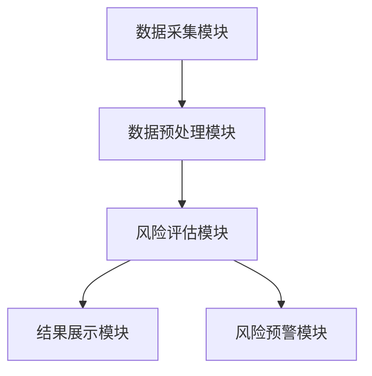

                 


# 构建智能化的个人投资组合尾部风险评估系统

## 关键词：尾部风险，投资组合，风险管理，人工智能，机器学习，系统架构

## 摘要：  
本文将详细介绍如何构建一个智能化的个人投资组合尾部风险评估系统。通过结合统计学、机器学习和系统架构设计，我们能够更有效地识别和管理投资组合中的尾部风险，从而为投资者提供科学的决策支持。本文将从尾部风险的基本概念出发，深入探讨其评估方法、算法实现和系统架构设计，并通过实际案例展示系统的实现过程和应用价值。

---

## 第1章: 尾部风险评估的背景与挑战

### 1.1 尾部风险的定义与特征
尾部风险是指在概率分布的“尾部”区域（即发生概率极低但影响极大的事件）所引发的潜在损失。与传统风险评估不同，尾部风险关注的是“黑天鹅”事件或“灰犀牛”事件，这些事件虽然发生的概率较低，但一旦发生，可能会对投资组合造成毁灭性影响。

**尾部风险的特征：**
1. **低发生概率**：尾部事件在历史数据中很少发生，但其影响可能是灾难性的。
2. **高破坏性**：尾部事件可能导致投资组合的损失远超预期。
3. **难以预测**：尾部事件通常具有非线性特征，难以通过传统的统计方法准确预测。

### 1.2 个人投资组合的风险管理需求
个人投资者在构建投资组合时，通常关注的是收益和波动性，而对尾部风险的关注相对较少。然而，尾部风险的存在使得投资组合的实际损失可能远高于预期。因此，个人投资者需要一种能够实时监测和评估尾部风险的工具。

**风险管理需求：**
1. **实时监测**：需要实时跟踪市场动态，识别潜在的尾部风险。
2. **量化评估**：需要通过模型量化尾部风险对投资组合的影响。
3. **动态调整**：根据尾部风险的变化，动态调整投资组合的配置。

### 1.3 智能化尾部风险评估的必要性
传统的尾部风险评估方法通常依赖于历史数据和假设模型，其局限性在于无法捕捉到新的、未被发现的尾部风险。而通过引入人工智能和大数据技术，我们可以构建一个更加智能化的尾部风险评估系统，从而提高风险识别和预测的准确性。

**智能化的优势：**
1. **数据驱动**：利用大数据技术，可以从海量数据中发现潜在的尾部风险。
2. **动态适应**：通过机器学习算法，系统可以实时更新模型，适应市场变化。
3. **自动化**：智能化系统可以实现自动化的风险监测和评估，减少人为干预。

### 1.4 本章小结
本章介绍了尾部风险的基本概念和特征，分析了个人投资组合的风险管理需求，最后阐述了智能化尾部风险评估的必要性和优势。通过本章的学习，读者可以理解尾部风险对投资组合的潜在影响，以及智能化评估系统的重要性。

---

## 第2章: 尾部风险评估的核心概念与联系

### 2.1 尾部风险评估的核心原理
尾部风险评估的核心在于识别和量化那些可能导致重大损失的低概率事件。常用的评估方法包括统计学方法（如历史模拟法、压力测试法）和机器学习方法（如时间序列分析、异常检测）。

**统计学方法：**
1. **历史模拟法**：通过历史数据模拟极端情况下的损失。
2. **压力测试法**：人为设定极端市场情景，评估投资组合在这些情景下的表现。

**机器学习方法：**
1. **时间序列分析**：利用LSTM等深度学习模型预测未来市场走势。
2. **异常检测**：通过聚类分析或深度学习模型识别市场中的异常行为。

### 2.2 尾部风险与系统性风险的对比
尾部风险与系统性风险有明显的区别，但也存在一定的联系。

**对比分析：**
| 特性       | 尾部风险                     | 系统性风险                   |
|------------|------------------------------|----------------------------|
| 影响范围     | 通常影响单一资产或小部分市场 | 影响整个金融系统               |
| 发生概率     | 极低                        | 较高                        |
| 预测难度     | 高                         | 中等                        |

### 2.3 尾部风险评估的系统架构
尾部风险评估系统通常包括以下几个核心模块：

**系统架构图（Mermaid）：**


### 2.4 本章小结
本章详细介绍了尾部风险评估的核心原理，对比了尾部风险与系统性风险的异同，并通过系统架构图展示了尾部风险评估系统的整体框架。通过本章的学习，读者可以理解尾部风险评估的核心方法和系统设计的逻辑。

---

## 第3章: 尾部风险评估的算法原理与实现

### 3.1 基于统计学的尾部风险评估方法
统计学方法是尾部风险评估的基础，主要包括历史模拟法和压力测试法。

**历史模拟法：**
- **原理**：通过历史数据模拟极端市场情景，计算投资组合在这些情景下的损失。
- **实现步骤**：
  1. 收集历史市场数据。
  2. 计算投资组合在不同历史情景下的收益和损失。
  3. 找出表现最差的情景，评估其对投资组合的影响。

**压力测试法：**
- **原理**：人为设定极端市场情景（如市场崩盘、利率大幅上升），评估投资组合在这些情景下的表现。
- **实现步骤**：
  1. 定义极端市场情景。
  2. 计算投资组合在这些情景下的收益和损失。
  3. 评估投资组合的抗压能力。

### 3.2 基于机器学习的尾部风险预测模型
机器学习算法在尾部风险预测中具有显著优势，尤其是深度学习算法。

**LSTM模型：**
- **原理**：利用长短期记忆网络（LSTM）预测未来市场走势，识别潜在的极端事件。
- **实现步骤**：
  1. 收集并预处理市场数据（如股票价格、波动率）。
  2. 构建LSTM模型，训练模型预测未来的价格走势。
  3. 通过模型预测结果识别潜在的极端事件。

**代码示例：**
```python
import numpy as np
from keras.models import Sequential
from keras.layers import LSTM, Dense

# 数据准备
data = np.random.rand(1000, 1)
model = Sequential()
model.add(LSTM(64, input_shape=(1, 1)))
model.add(Dense(1))
model.compile(optimizer='adam', loss='mean_squared_error')
model.fit(data, data, epochs=10, batch_size=32)
```

### 3.3 尾部风险评估的数学模型
尾部风险评估通常涉及多种数学模型，如峰臀系数（Kurtosis）和在险价值（VaR）。

**峰臀系数公式：**
$$ \text{峰臀系数} = \frac{E[(X - \mu)^4]}{(E[(X - \mu)^2])^2} $$

**在险价值公式：**
$$ \text{VaR}(\alpha) = \min\{x | P(L \leq x) \geq \alpha\} $$

### 3.4 本章小结
本章详细介绍了尾部风险评估的统计学方法和机器学习方法，并通过代码示例展示了LSTM模型的实现。同时，还介绍了常用的数学模型，如峰臀系数和VaR模型。通过本章的学习，读者可以理解尾部风险评估的核心算法及其实现方法。

---

## 第4章: 尾部风险评估系统的数学模型与公式

### 4.1 尾部风险评估的数学基础
尾部风险评估需要涉及概率论、统计学和时间序列分析等数学基础。

**概率论基础：**
- 随机变量的期望、方差和协方差。
- 概率密度函数和累积分布函数。

**时间序列分析：**
- 自回归模型（AR）
- 移动平均模型（MA）
- ARIMA模型

### 4.2 常见的数学模型与公式
**在险价值（VaR）公式：**
$$ \text{VaR}(\alpha) = \text{quantile}(\alpha) \text{ of the loss distribution} $$

**信用风险模型（如Merton模型）：**
$$ P(\text{违约}) = \Phi\left(\frac{\ln(\frac{A}{B}) - (r - \sigma^2/2)T}{\sigma T}\right) $$

### 4.3 模型的优化与调参
**参数选择的影响：**
- 模型的复杂度与泛化能力。
- 超参数（如学习率、批次大小）对模型性能的影响。

### 4.4 本章小结
本章介绍了尾部风险评估的数学基础，详细讲解了常用的数学模型和公式，并探讨了模型优化与调参的策略。通过本章的学习，读者可以掌握尾部风险评估的数学原理和实现方法。

---

## 第5章: 尾部风险评估系统的系统架构设计

### 5.1 系统功能设计
尾部风险评估系统通常包括以下几个核心功能：
1. 数据采集：收集市场数据（如股票价格、波动率）。
2. 数据预处理：清洗和归一化数据。
3. 风险评估：通过模型计算尾部风险。
4. 结果展示：以可视化方式展示评估结果。
5. 风险预警：根据评估结果触发预警机制。

### 5.2 系统架构设计
**系统架构图（Mermaid）：**


**模块功能描述：**
- 数据采集模块：负责收集市场数据。
- 数据预处理模块：对数据进行清洗和归一化处理。
- 风险评估模块：通过模型计算尾部风险。
- 结果展示模块：以图表形式展示评估结果。
- 风险预警模块：根据评估结果触发预警。

### 5.3 系统接口设计
**系统接口：**
1. 数据接口：与数据源（如股票交易API）对接。
2. 用户界面：提供可视化界面供用户查看评估结果。
3. 预警接口：与第三方预警系统对接。

### 5.4 本章小结
本章详细介绍了尾部风险评估系统的功能设计和架构设计，展示了系统各个模块之间的关系。通过本章的学习，读者可以理解系统的整体架构及其各个模块的功能。

---

## 第6章: 尾部风险评估系统的项目实战

### 6.1 项目环境安装
**所需工具：**
1. Python 3.8+
2. TensorFlow或Keras
3. Matplotlib或Seaborn
4. Pandas
5. NumPy

**安装命令：**
```bash
pip install numpy pandas tensorflow matplotlib
```

### 6.2 核心功能实现
**数据采集模块：**
```python
import pandas as pd
import requests

# 下载股票数据
def get_stock_data(ticker):
    url = f"https://api.example.com/stock/{ticker}"
    response = requests.get(url)
    data = response.json()
    return pd.DataFrame(data)
```

**风险评估模块：**
```python
import numpy as np
from tensorflow.keras.models import Sequential
from tensorflow.keras.layers import LSTM, Dense

def build_model(input_shape):
    model = Sequential()
    model.add(LSTM(64, input_shape=input_shape))
    model.add(Dense(1))
    model.compile(optimizer='adam', loss='mean_squared_error')
    return model

# 训练模型
model = build_model((1, 1))
model.fit(X_train, y_train, epochs=10, batch_size=32)
```

### 6.3 实际案例分析
**案例：**
假设我们有一个包含10只股票的投资组合，我们需要评估其尾部风险。

**步骤：**
1. 收集每只股票的历史数据。
2. 计算每只股票的VaR值。
3. 结合投资组合的权重，计算整体投资组合的VaR值。

### 6.4 项目小结
本章通过实际案例展示了尾部风险评估系统的实现过程，包括环境安装、核心功能实现和案例分析。通过本章的学习，读者可以掌握如何将理论应用于实际项目中。

---

## 第7章: 尾部风险评估系统的最佳实践与总结

### 7.1 最佳实践
**小结：**
- 定期更新模型，以适应市场变化。
- 结合多种方法，提高评估的准确性。
- 设置合理的预警阈值，避免误报。

**注意事项：**
- 尾部风险评估的结果仅供参考，不能完全依赖模型。
- 数据质量和模型选择对评估结果有重要影响。
- 系统需要定期维护和更新。

**拓展阅读：**
- 《风险管理与金融创新》
- 《深度学习在金融中的应用》
- 《系统性风险与尾部事件分析》

### 7.2 本章小结
本章总结了尾部风险评估系统的最佳实践，提出了需要注意的事项，并推荐了相关的拓展阅读资料。通过本章的学习，读者可以进一步提升自己的知识和技能。

---

## 作者：AI天才研究院/AI Genius Institute & 禅与计算机程序设计艺术 /Zen And The Art of Computer Programming

---

感谢您的阅读！希望本文能为您提供有价值的信息和启发。

