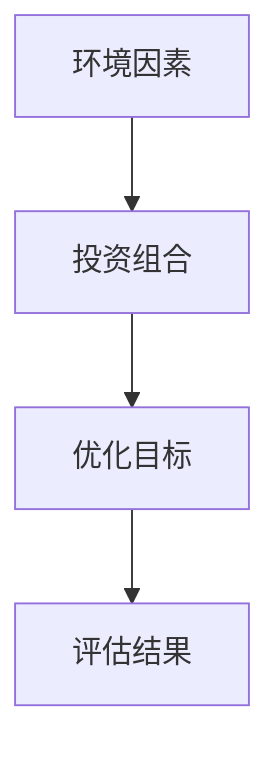
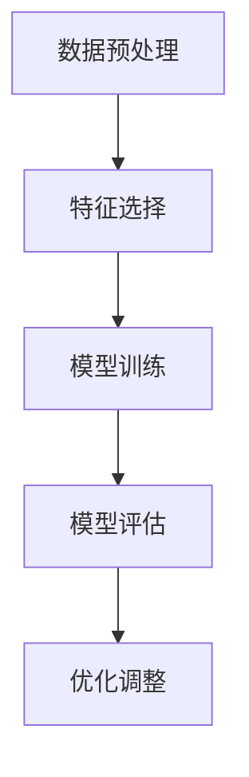
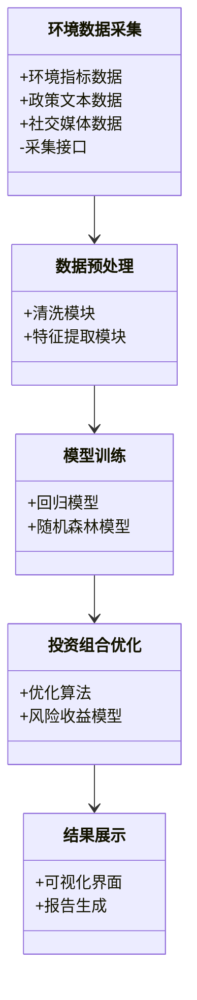
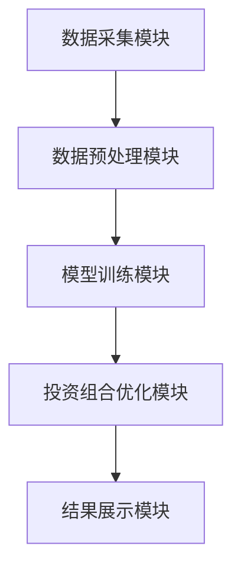
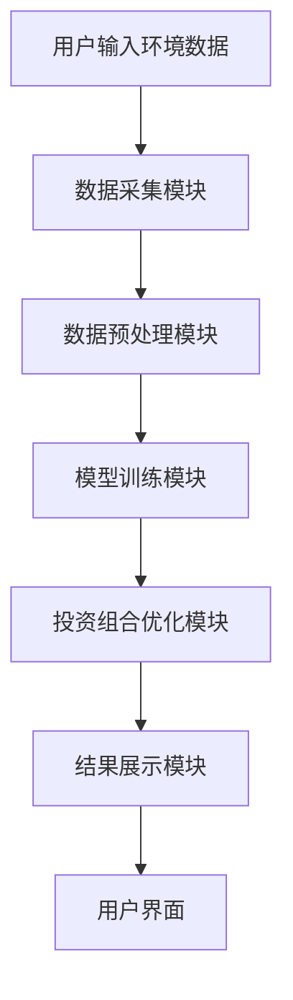

                 


# 构建智能化的个人投资组合环境因素评估工具

## 关键词：智能化工具，环境因素，投资组合，机器学习，系统架构，算法原理

## 摘要：  
本文详细探讨了如何构建一个智能化的个人投资组合环境因素评估工具，通过分析环境因素对投资组合的影响，结合机器学习算法和系统架构设计，提供了一套完整的解决方案。文章从背景介绍、核心概念、算法原理、系统架构设计、项目实战到最佳实践，逐步展开，帮助读者系统地理解和实现这一工具。

---

# 第一部分：个人投资组合环境因素评估工具的背景与需求

## 第1章：问题背景

### 1.1 投资组合管理的重要性  
个人投资组合是投资者实现财务目标的重要手段。随着市场环境的复杂化，投资者需要考虑的因素越来越多，包括经济指标、政策变化、市场情绪等环境因素。这些因素直接影响投资组合的收益和风险。

### 1.2 环境因素对投资组合的影响  
环境因素是投资决策中不可忽视的一部分。例如，政策变化可能影响某些行业的表现，经济指标（如GDP增长率、通货膨胀率）会影响市场的整体走势，社交媒体上的舆论也能对市场情绪产生影响。

### 1.3 智能化工具在投资决策中的作用  
传统的投资组合管理依赖于人工分析，效率低且容易受主观因素影响。引入智能化工具可以利用大数据和机器学习算法，帮助投资者更客观、更高效地评估环境因素对投资组合的影响。

## 第2章：问题描述

### 2.1 环境因素的多维度性  
环境因素包括经济、政治、社会、技术等多个维度。每个维度的变量可能有数十个甚至上百个，如何高效地整合这些变量是一个挑战。

### 2.2 投资组合与环境因素的关联性  
投资组合的价值受环境因素的直接影响。例如，能源行业的投资组合可能受到能源政策的影响，科技行业的投资组合可能受到技术创新的影响。

### 2.3 当前评估工具的局限性  
现有的评估工具多为静态分析，难以实时捕捉环境变化对投资组合的影响。此外，传统工具通常缺乏对非结构化数据（如社交媒体数据）的处理能力。

## 第3章：问题解决方法

### 3.1 引入智能化工具的必要性  
智能化工具可以通过自动化数据处理和机器学习算法，实时分析环境因素对投资组合的影响，帮助投资者做出更科学的决策。

### 3.2 数据驱动的环境因素评估  
通过收集和分析大量的环境数据（如经济指标、社交媒体情绪、政策文本等），利用数据挖掘和机器学习技术，提取关键环境因素，并评估其对投资组合的影响。

### 3.3 机器学习在投资组合优化中的应用  
利用机器学习算法（如回归分析、随机森林、支持向量机等），构建环境因素评估模型和投资组合优化模型，实现智能化的投资决策。

---

# 第二部分：核心概念与联系

## 第4章：核心概念

### 4.1 环境因素评估  
环境因素评估是指通过分析环境数据，识别和量化环境因素对投资组合的影响。这包括数据的收集、清洗、特征提取和建模等步骤。

### 4.2 投资组合优化  
投资组合优化是指通过调整投资组合的构成，使其在特定风险和收益目标下达到最优。环境因素评估是投资组合优化的重要输入。

### 4.3 数据预处理  
数据预处理是指对原始数据进行清洗、标准化和特征选择的过程，以确保数据适合后续的建模和分析。

## 第5章：核心概念对比表

| 概念                | 数据来源                     | 处理方式                     | 目标               |
|---------------------|-----------------------------|------------------------------|--------------------|
| 环境因素评估        | 经济指标、政策文本、社交媒体 | 数据清洗、特征提取           | 量化环境风险       |
| 投资组合优化        | 历史收益、资产配置数据      | 数学建模、优化算法           | 优化投资组合       |
| 数据预处理          | 原始数据                   | 清洗、标准化、特征选择       | 为模型提供输入     |

## 第6章：ER实体关系图



---

# 第三部分：环境因素评估算法原理

## 第7章：算法原理

### 7.1 多元回归模型  
多元回归模型是一种常用的统计学习方法，用于预测一个连续变量（如投资组合收益）与多个自变量（如环境指标）之间的关系。

#### 数学模型
$$ y = \beta_0 + \beta_1x_1 + \beta_2x_2 + \dots + \beta_nx_n + \epsilon $$  
其中，$y$ 是目标变量，$x_i$ 是自变量，$\beta_i$ 是回归系数，$\epsilon$ 是误差项。

### 7.2 随机森林模型  
随机森林是一种基于决策树的集成学习算法，具有较强的抗过拟合能力和特征重要性分析能力。

### 7.3 支持向量机模型  
支持向量机（SVM）是一种监督学习算法，适用于分类和回归问题。其核心思想是通过构建超平面将数据分成两类。

## 第8章：算法流程图



## 第9章：Python实现代码

```python
import pandas as pd
from sklearn.ensemble import RandomForestRegressor
from sklearn.model_selection import train_test_split
from sklearn.metrics import mean_squared_error

# 数据预处理
data = pd.read_csv('environment_factors.csv')
X = data.drop('target', axis=1)
y = data['target']

# 特征选择
selected_features = ['economic_factors', 'policy_factors', 'social_factors']
X_selected = X[selected_features]

# 数据分割
X_train, X_test, y_train, y_test = train_test_split(X_selected, y, test_size=0.2, random_state=42)

# 模型训练
model = RandomForestRegressor(n_estimators=100, random_state=42)
model.fit(X_train, y_train)

# 模型评估
y_pred = model.predict(X_test)
mse = mean_squared_error(y_test, y_pred)
print(f"均方误差: {mse}")
```

---

# 第四部分：系统架构设计

## 第10章：问题场景介绍

### 10.1 系统目标  
构建一个智能化的环境因素评估工具，帮助投资者实时分析环境因素对投资组合的影响，并优化投资组合配置。

## 第11章：系统功能设计

### 11.1 领域模型  


### 11.2 系统架构设计  


## 第12章：系统接口设计

### 12.1 接口定义  
- 数据采集模块：提供API接口，接收环境数据。
- 数据预处理模块：提供数据清洗和特征提取的接口。
- 模型训练模块：提供训练好的模型接口。
- 投资组合优化模块：提供优化结果的接口。
- 结果展示模块：提供可视化和报告生成的接口。

## 第13章：系统交互流程图



---

# 第五部分：项目实战

## 第14章：环境安装

### 14.1 安装Python和相关库  
```bash
pip install pandas scikit-learn mermaid4jupyter jupyter notebook
```

## 第15章：系统核心实现

### 15.1 核心代码  
```python
import pandas as pd
from sklearn.ensemble import RandomForestRegressor
from sklearn.model_selection import train_test_split
from sklearn.metrics import mean_squared_error

# 数据预处理
data = pd.read_csv('environment_factors.csv')
X = data.drop('target', axis=1)
y = data['target']

# 特征选择
selected_features = ['economic_factors', 'policy_factors', 'social_factors']
X_selected = X[selected_features]

# 数据分割
X_train, X_test, y_train, y_test = train_test_split(X_selected, y, test_size=0.2, random_state=42)

# 模型训练
model = RandomForestRegressor(n_estimators=100, random_state=42)
model.fit(X_train, y_train)

# 模型评估
y_pred = model.predict(X_test)
mse = mean_squared_error(y_test, y_pred)
print(f"均方误差: {mse}")
```

## 第16章：案例分析

### 16.1 实际案例  
假设我们有一个包含经济指标、政策因素和社会因素的环境数据集。我们需要评估这些因素对投资组合收益的影响。

### 16.2 分析与解读  
通过随机森林模型，我们可以得到每个环境因素的重要性。例如，经济指标可能对投资组合收益的影响最大。

## 第17章：项目小结

### 17.1 经验总结  
- 数据预处理是关键，特别是特征选择和数据清洗。
- 随机森林模型在特征重要性分析和模型解释性方面表现良好。
- 系统架构设计需要考虑模块化和接口标准化。

---

# 第六部分：最佳实践

## 第18章：小结与注意事项

### 18.1 小结  
通过构建智能化的个人投资组合环境因素评估工具，我们可以更科学地评估环境因素对投资组合的影响，并优化投资组合配置。

### 18.2 注意事项  
- 数据质量和完整性直接影响模型的准确性。
- 模型需要定期更新，以适应市场环境的变化。
- 系统设计需要考虑可扩展性和可维护性。

## 第19章：注意事项

### 19.1 数据隐私与安全  
在处理环境数据时，需要注意数据的隐私和安全问题，特别是在处理社交媒体数据时。

## 第20章：拓展阅读

### 20.1 推荐书籍  
- 《Python机器学习实战》
- 《投资学原理》
- 《系统架构设计的艺术》

---

# 作者：AI天才研究院/AI Genius Institute & 禅与计算机程序设计艺术/Zen And The Art of Computer Programming

