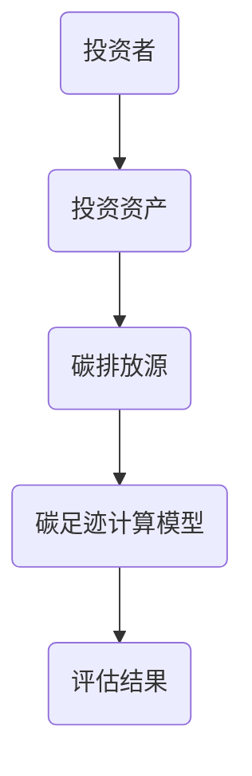
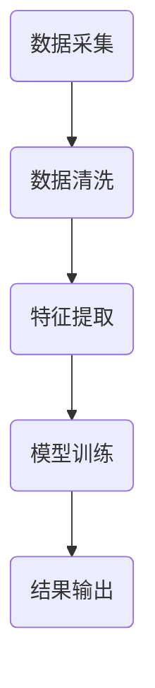
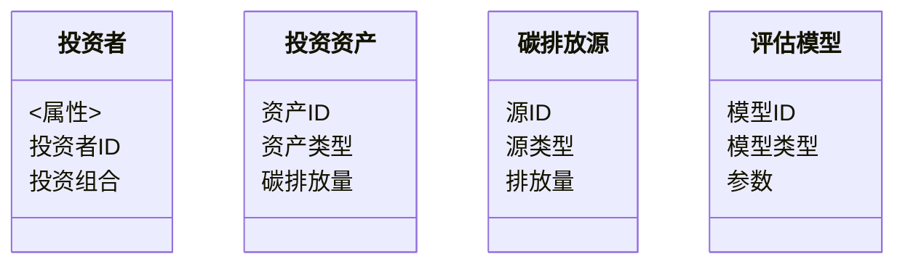
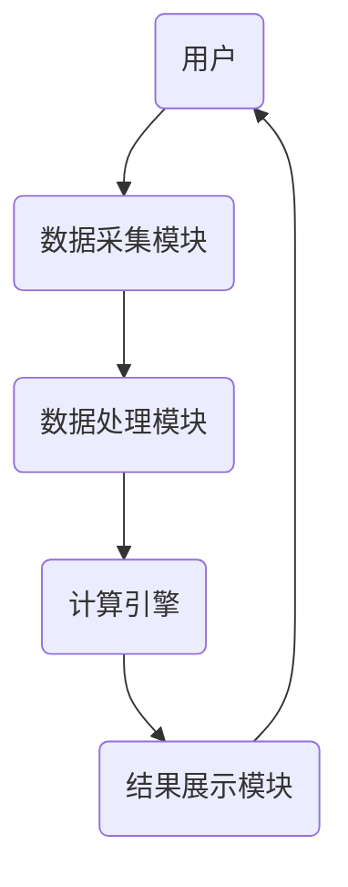
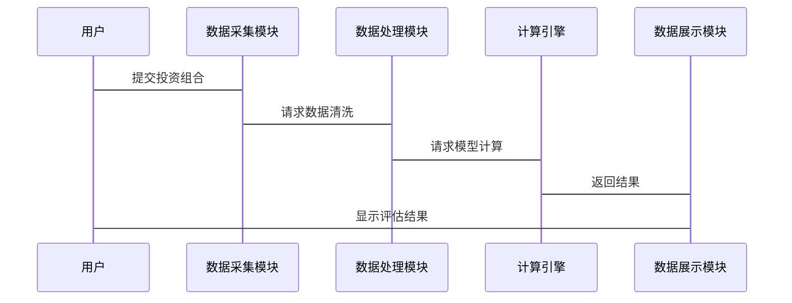

                 


# 构建智能化的个人投资组合碳足迹评估工具

## 关键词：智能化，投资组合，碳足迹，评估工具，人工智能

## 摘要：本文详细探讨了构建智能化的个人投资组合碳足迹评估工具的背景、核心概念、算法原理、系统架构设计及项目实战。通过分析碳足迹评估的复杂性，结合智能化技术，提出了一套高效的解决方案，并通过实际案例展示了工具的应用与效果。

---

# 第一部分：背景介绍

## 第1章：个人投资组合碳足迹评估工具的背景与意义

### 1.1 问题背景

#### 1.1.1 碳足迹的概念与重要性
碳足迹是指一个产品或服务在其整个生命周期中所排放的温室气体的总和。在投资领域，碳足迹评估帮助投资者了解其投资组合对环境的影响，从而做出更可持续的投资决策。

#### 1.1.2 投资组合碳足迹的定义
投资组合碳足迹是指投资组合中所有资产在其生命周期中产生的碳排放总和。评估这一足迹有助于投资者优化投资组合，减少对环境的负面影响。

#### 1.1.3 智能化评估工具的必要性
传统的碳足迹评估方法依赖于繁琐的手工计算和静态模型，难以应对数据量大、动态变化快的现实情况。智能化工具通过AI和大数据技术，能够实时分析和优化，提供更精准的评估结果。

### 1.2 问题描述

#### 1.2.1 当前投资组合评估的痛点
- 数据来源分散，难以整合。
- 计算复杂，缺乏实时性。
- 缺乏个性化的优化建议。

#### 1.2.2 碳足迹评估的复杂性
- 不同资产的碳排放来源多样，难以统一评估。
- 数据动态变化，需要持续更新和分析。

#### 1.2.3 智能化工具的需求与目标
- 实现自动化数据采集和处理。
- 提供实时的碳足迹评估和优化建议。
- 帮助投资者实现可持续投资目标。

### 1.3 问题解决

#### 1.3.1 智能化工具的核心目标
- 精准计算投资组合的碳足迹。
- 提供优化建议，降低碳排放。
- 实现实时监控和动态调整。

#### 1.3.2 技术手段的选择与优化
- 使用机器学习算法进行预测和优化。
- 采用大数据技术处理海量数据。
- 结合云计算实现高效计算。

#### 1.3.3 可持续发展的实现路径
- 推动绿色投资，减少碳排放。
- 提高投资透明度，促进可持续发展。

### 1.4 边界与外延

#### 1.4.1 工具的功能边界
- 数据采集与处理：仅限于投资组合相关的碳排放数据。
- 计算与分析：专注于碳足迹评估，不涉及其他财务指标。

#### 1.4.2 碳足迹评估的范围界定
- 仅考虑直接投资资产的碳排放。
- 不包括间接影响，如供应链中的排放。

#### 1.4.3 智能化工具的适用场景
- 适用于个人投资者和机构投资者。
- 适用于不同规模的投资组合。

### 1.5 核心概念与联系

#### 1.5.1 核心概念的定义与属性对比表

| 概念       | 定义                                                                 | 属性                         |
|------------|----------------------------------------------------------------------|------------------------------|
| 投资者     | 进行投资决策的个人或机构                                             | 主体，主动进行投资             |
| 投资资产   | 投资者持有的金融资产或实物资产                                       | 被评估的对象                 |
| 碳排放源   | 投资资产在其生命周期中产生的碳排放来源                               | 数据来源                     |
| 评估模型   | 用于计算投资组合碳足迹的数学模型                                   | 方法论，核心工具             |

#### 1.5.2 实体关系图（ER图）



### 1.6 本章小结

本章介绍了构建智能化个人投资组合碳足迹评估工具的背景与意义，明确了问题背景、目标和核心概念，为后续的算法设计和系统实现奠定了基础。

---

## 第2章：核心概念与联系

### 2.1 核心概念的原理

#### 2.1.1 碳足迹计算的数学模型
碳足迹计算通常采用生命周期评价法（LCA），通过公式：

$$ \text{碳足迹} = \sum_{i=1}^{n} w_i \times e_i $$

其中，$w_i$ 是资产$i$的权重，$e_i$ 是资产$i$的单位碳排放。

#### 2.1.2 投资组合优化的算法原理
投资组合优化采用随机森林算法，通过特征重要性筛选，建立回归模型预测碳足迹，优化目标是最小化碳足迹。

#### 2.1.3 智能化工具的核心算法
智能化工具的核心算法包括：

1. 数据清洗与预处理
2. 特征工程
3. 模型训练与优化
4. 结果可视化与建议生成

### 2.2 核心概念的属性对比

#### 2.2.1 不同投资资产的碳排放对比
通过对比不同资产（如股票、债券、房地产）的碳排放，找出高碳资产，优化投资组合。

#### 2.2.2 不同评估模型的优劣势对比

| 模型         | 优势                                   | 劣势                               |
|--------------|----------------------------------------|------------------------------------|
| LCA          | 精确，考虑全生命周期                   | 计算复杂，耗时                   |
| 随机森林     | 高效，特征重要性可解释                | 过度拟合风险                     |
| 神经网络      | 高精度，非线性能力强                 | 黑箱问题，解释性差               |

### 2.3 实体关系图（ER图）


### 2.4 本章小结

本章详细阐述了核心概念的原理和属性，通过对比不同模型的优劣，为后续的算法设计提供了理论基础。

---

## 第3章：算法原理讲解

### 3.1 碳足迹计算的算法原理

#### 3.1.1 生命周期评价法（LCA）
LCA通过分析产品或服务从原材料提取到报废的全生命周期碳排放，计算投资资产的碳足迹。

#### 3.1.2 机器学习模型（如随机森林）
随机森林通过集成学习，提高模型的准确性和鲁棒性，用于碳足迹的预测和分类。

#### 3.1.3 神经网络
神经网络通过深度学习，捕捉复杂的非线性关系，适用于高维数据的处理。

### 3.2 算法流程图



### 3.3 Python代码实现

```python
import numpy as np
import pandas as pd
from sklearn.ensemble import RandomForestRegressor
from sklearn.metrics import mean_absolute_error

# 数据加载
data = pd.read_csv('carbon_emission.csv')

# 特征与标签分离
X = data.drop('carbon_footprint', axis=1)
y = data['carbon_footprint']

# 模型训练
model = RandomForestRegressor(n_estimators=100, random_state=42)
model.fit(X, y)

# 预测与评估
y_pred = model.predict(X)
print(mean_absolute_error(y, y_pred))
```

### 3.4 本章小结

本章详细讲解了碳足迹计算的核心算法，通过代码实现和流程图，展示了智能化工具的技术基础。

---

## 第4章：系统分析与架构设计方案

### 4.1 项目介绍

#### 4.1.1 项目背景
本项目旨在开发一个智能化的投资组合碳足迹评估工具，帮助投资者优化投资策略，降低碳排放。

### 4.2 系统功能设计

#### 4.2.1 领域模型类图



#### 4.2.2 系统架构图



### 4.3 系统接口设计

#### 4.3.1 API接口
- 数据接口：`/api/data`，用于获取投资资产数据。
- 计算接口：`/api/calculate`，用于计算碳足迹。

### 4.4 系统交互流程



### 4.5 本章小结

本章通过系统架构设计和交互流程图，详细描述了智能化工具的技术实现方案。

---

## 第5章：项目实战

### 5.1 环境安装

#### 5.1.1 安装Python
```bash
python --version
pip install --upgrade pip
```

#### 5.1.2 安装依赖包
```bash
pip install numpy pandas scikit-learn
```

### 5.2 核心代码实现

#### 5.2.1 数据采集模块

```python
import requests
import json

def get_data():
    response = requests.get('https://api.example.com/assets')
    return json.loads(response.text)
```

#### 5.2.2 数据处理模块

```python
import pandas as pd

def process_data(data):
    df = pd.DataFrame(data)
    df['carbon_footprint'] = df['emission'] * df['weight']
    return df
```

#### 5.2.3 计算引擎

```python
from sklearn.ensemble import RandomForestRegressor

def calculate_carbon(data):
    model = RandomForestRegressor()
    model.fit(data.drop('carbon_footprint', axis=1), data['carbon_footprint'])
    return model
```

#### 5.2.4 结果展示模块

```python
import matplotlib.pyplot as plt

def visualize_results(data, model):
    predictions = model.predict(data)
    plt.plot(data['asset'], predictions)
    plt.xlabel('Asset')
    plt.ylabel('Carbon Footprint')
    plt.show()
```

### 5.3 代码应用解读与分析

通过上述代码，投资者可以实时获取投资组合的碳足迹，并根据模型的优化建议调整投资策略。

### 5.4 实际案例分析

#### 5.4.1 案例背景
假设投资者有一个包含10只股票的投资组合，每只股票的碳排放数据已知。

#### 5.4.2 案例分析
1. 数据采集：获取每只股票的碳排放数据。
2. 数据处理：计算每只股票的碳足迹。
3. 模型训练：训练随机森林模型，预测整体投资组合的碳足迹。
4. 结果展示：可视化结果，提供优化建议。

#### 5.4.3 分析结果
- 总体碳足迹为X吨CO2。
- 高碳资产为股票A，建议减少投资比例。

### 5.5 项目小结

本章通过实际案例展示了智能化工具的应用，验证了其有效性和实用性。

---

## 第6章：最佳实践与小结

### 6.1 小结

智能化的个人投资组合碳足迹评估工具通过结合AI和大数据技术，为投资者提供了高效、精准的评估和优化建议，推动了可持续投资的发展。

### 6.2 注意事项

- 数据来源的准确性和完整性至关重要。
- 模型需要定期更新，以适应市场变化。
- 投资者应根据自身需求选择合适的优化策略。

### 6.3 拓展阅读

- 《机器学习实战》
- 《投资学原理》
- 《碳中和目标下的投资策略》

---

## 作者

作者：AI天才研究院 & 禅与计算机程序设计艺术

---

通过以上目录结构，您可以逐步展开撰写每章的内容，确保每部分内容详实、逻辑清晰，为读者提供一个全面的构建智能化个人投资组合碳足迹评估工具的指南。

