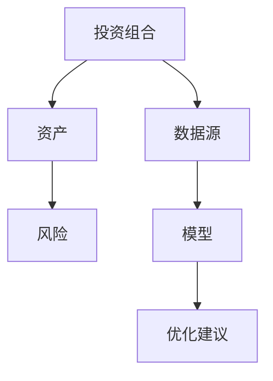
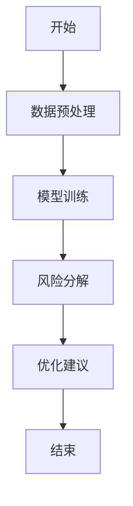
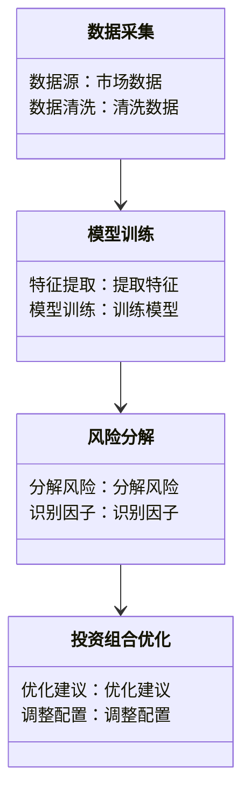
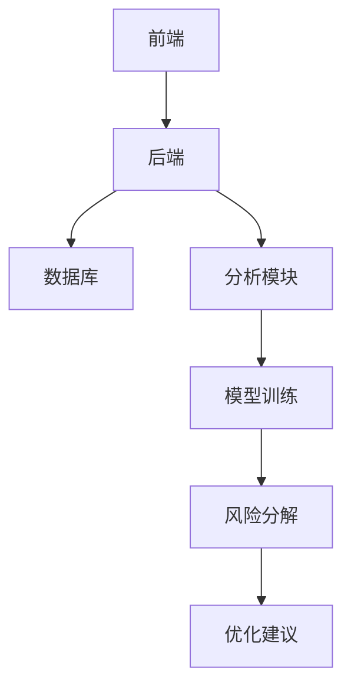
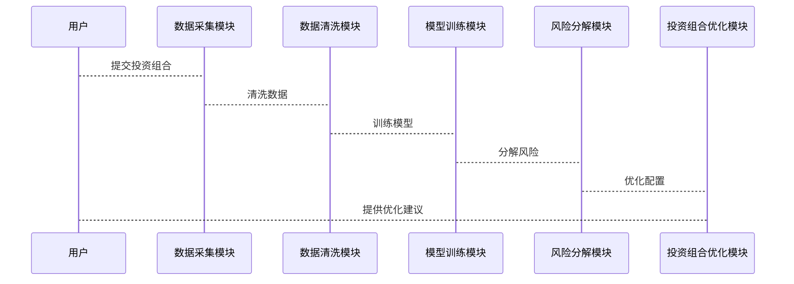

                 


# 《构建智能化的个人投资组合风险分解系统》

---

## 关键词：
- 投资组合风险分解
- 智能化系统
- 系统架构设计
- 机器学习算法
- 数据驱动

---

## 摘要：
本文旨在探讨如何构建一个智能化的个人投资组合风险分解系统。通过结合数据驱动和模型驱动的方法，我们提出了一种创新的解决方案，以解决传统风险分解方法的局限性。文章详细介绍了系统的核心概念、算法原理、系统架构设计以及项目实战，为读者提供了一个全面的框架，帮助他们在实际投资中实现风险的智能化分解与管理。

---

# 第一部分: 背景介绍

## 第1章: 投资组合风险分解的背景与问题

### 1.1 问题背景

#### 1.1.1 投资组合管理的重要性
在现代金融领域，投资组合管理是实现财富保值与增值的关键手段。通过科学地配置资产，投资者可以在不同市场环境下优化收益与风险的平衡。然而，传统的方法往往依赖人工经验，难以应对复杂多变的市场环境。

#### 1.1.2 风险分解在投资组合管理中的作用
风险分解是投资组合管理的核心环节，它帮助投资者识别和量化投资组合中的风险来源。通过分解风险，投资者可以更好地理解各资产或资产类别对整体风险的贡献，从而做出更明智的投资决策。

#### 1.1.3 当前投资组合风险分解的挑战
- 数据量与复杂性：金融市场数据日益复杂，传统方法难以处理大规模数据。
- 方法局限性：传统风险分解方法（如VaR、CVaR）在处理非线性风险时表现不佳。
- 动态性：市场环境不断变化，静态模型难以实时捕捉风险变化。

### 1.2 问题描述

#### 1.2.1 投资组合风险分解的核心目标
- 量化各资产对整体风险的贡献。
- 识别潜在风险点并优化投资组合。
- 提供实时风险监控与预警。

#### 1.2.2 现有风险分解方法的局限性
- 线性假设的局限：传统方法假设风险是线性的，难以捕捉非线性风险。
- 数据依赖性：需要大量历史数据，且对数据质量要求较高。
- 计算复杂性：复杂的投资组合可能导致计算成本过高。

#### 1.2.3 构建智能化系统的必要性
智能化系统通过机器学习和大数据技术，能够实时捕捉市场动态，提供更精准的风险分解和优化建议。

### 1.3 问题解决思路

#### 1.3.1 智能化分解的核心理念
- 数据驱动：利用机器学习模型分析历史数据，提取风险特征。
- 模型驱动：结合金融理论，构建风险分解模型。
- 综合优化：通过优化算法调整投资组合，降低整体风险。

#### 1.3.2 数据驱动与模型驱动的结合
- 数据驱动：基于历史数据训练模型，识别潜在风险模式。
- 模型驱动：利用金融理论构建风险分解框架，指导模型设计。
- 综合应用：通过数据与模型的结合，提升风险分解的准确性和实用性。

#### 1.3.3 系统化解决方案的设计
- 数据采集与预处理：收集市场数据并进行清洗。
- 模型训练：训练机器学习模型，识别风险特征。
- 风险分解：基于模型输出分解结果。
- 投资组合优化：根据分解结果优化投资组合。

### 1.4 边界与外延

#### 1.4.1 系统的边界定义
- 输入：市场数据、用户目标。
- 输出：风险分解结果、优化建议。
- 限制：系统不直接处理投资执行，仅提供分解与优化建议。

#### 1.4.2 相关概念的外延扩展
- 风险分解：从单一资产扩展到多资产类别。
- 智能化：引入实时数据和动态调整机制。
- 可扩展性：支持不同规模和复杂度的投资组合。

#### 1.4.3 与其他投资组合管理工具的区分
- 传统工具：依赖人工经验，计算复杂。
- 智能化系统：数据驱动，实时监控，动态优化。

### 1.5 概念结构与核心要素

#### 1.5.1 核心概念的层次结构
- 顶层：风险分解系统。
- 中层：数据采集、模型训练、风险分解、投资组合优化。
- 底层：市场数据、用户目标。

#### 1.5.2 核心要素的详细描述
- 数据采集：收集市场数据，清洗和预处理。
- 模型训练：训练机器学习模型，识别风险特征。
- 风险分解：分解投资组合风险，识别风险来源。
- 投资组合优化：优化资产配置，降低整体风险。

---

## 第2章: 核心概念与联系

### 2.1 系统核心概念原理

#### 2.1.1 风险分解的基本原理
风险分解是将投资组合的总体风险分解为各个资产或资产类别对风险的贡献。通过量化各部分的风险贡献，投资者可以更好地理解风险来源，优化投资组合。

#### 2.1.2 智能化分解的关键技术
- 数据驱动：利用机器学习模型分析数据。
- 模型驱动：结合金融理论构建分解框架。
- 综合优化：通过优化算法调整投资组合。

#### 2.1.3 系统模块之间的关系
- 数据模块：提供输入数据。
- 分解模块：分解风险。
- 优化模块：优化投资组合。

### 2.2 核心概念属性对比

#### 2.2.1 风险分解方法的对比分析
| 方法       | 优点                           | 缺点                           |
|------------|--------------------------------|--------------------------------|
| VaR        | 简单易懂，广泛使用             | 无法捕捉尾部风险               |
| CVaR       | 能捕捉尾部风险                 | 计算复杂性较高                 |
| PCA        | 有效降维，提取主要风险因素     | 需要大量数据，解释性有限       |
| GARCH      | 能捕捉波动性风险               | 需要假设分布，计算复杂         |

#### 2.2.2 数据驱动与模型驱动的对比
| 特性       | 数据驱动                       | 模型驱动                       |
|------------|--------------------------------|--------------------------------|
| 数据依赖   | 高                             | 较低                           |
| 灵活性     | 高                             | 较低                           |
| 解释性     | 较低                           | 较高                           |

#### 2.2.3 不同分解模型的优劣势对比
| 模型       | 优点                           | 缺点                           |
|------------|--------------------------------|--------------------------------|
| 线性回归    | 简单易懂                       | 无法捕捉非线性关系             |
| 随机森林    | 高准确性，非线性能力强         | 解释性较差                     |
| 神经网络    | 高准确性，非线性能力强         | 计算复杂，需要大量数据         |

### 2.3 实体关系架构设计

#### 2.3.1 ER实体关系图展示


---

# 第二部分: 算法原理讲解

## 第3章: 算法原理与实现

### 3.1 算法原理

#### 3.1.1 蒙特卡洛模拟
蒙特卡洛模拟是一种通过随机采样来估计系统行为的方法。在风险分解中，可以用于模拟不同市场情景下的投资组合表现，从而估计风险。

#### 3.1.2 因子分解模型
因子分解模型将风险分解为几个因子，每个因子代表一类风险来源。通过分析因子对风险的贡献，可以识别投资组合中的主要风险来源。

### 3.2 算法实现

#### 3.2.1 算法步骤
1. 数据预处理：清洗和标准化数据。
2. 模型训练：训练机器学习模型，识别风险因子。
3. 风险分解：分解投资组合风险，识别各因子的贡献。
4. 投资组合优化：调整资产配置，降低整体风险。

#### 3.2.2 算法流程图


#### 3.2.3 代码实现
```python
import numpy as np
from sklearn.ensemble import RandomForestRegressor

# 数据预处理
data = ...  # 加载数据
data = data.dropna().reset_index(drop=True)

# 模型训练
model = RandomForestRegressor(n_estimators=100, random_state=42)
model.fit(data.drop(columns=['return']), data['return'])

# 风险分解
importances = model.feature_importances_
features = data.columns.drop('return')
features_importance = pd.DataFrame({'feature': features, 'importance': importances})

# 投资组合优化
优化建议 = ...  # 根据模型输出优化投资组合
```

### 3.3 数学模型

#### 3.3.1 蒙特卡洛模拟
$$
\text{VaR} = \text{quantile}(p) \text{ of portfolio returns}
$$

#### 3.3.2 因子分解模型
$$
R = \beta_1 F_1 + \beta_2 F_2 + \dots + \beta_n F_n + \epsilon
$$
其中，$R$ 是投资组合收益，$F_i$ 是因子，$\beta_i$ 是因子的载荷，$\epsilon$ 是残差。

---

## 第4章: 系统分析与架构设计

### 4.1 项目背景

#### 4.1.1 项目介绍
本项目旨在构建一个智能化的个人投资组合风险分解系统，帮助投资者实时监控和管理投资组合风险。

#### 4.1.2 系统功能设计
- 数据采集：收集市场数据。
- 模型训练：训练机器学习模型。
- 风险分解：分解投资组合风险。
- 投资组合优化：优化资产配置。

#### 4.1.3 领域模型


#### 4.1.4 系统架构设计


#### 4.1.5 接口设计
- 数据接口：与数据源对接，获取市场数据。
- 模型接口：与机器学习模型对接，进行风险分解。
- 优化接口：与投资组合优化模块对接，输出优化建议。

#### 4.1.6 交互流程


### 4.2 项目实战

#### 4.2.1 环境安装
```bash
pip install numpy pandas scikit-learn
```

#### 4.2.2 核心代码实现
```python
import numpy as np
import pandas as pd
from sklearn.ensemble import RandomForestRegressor

# 数据预处理
data = pd.read_csv('market_data.csv')
data = data.dropna().reset_index(drop=True)

# 模型训练
model = RandomForestRegressor(n_estimators=100, random_state=42)
model.fit(data.drop(columns=['return']), data['return'])

# 风险分解
importances = model.feature_importances_
features = data.columns.drop('return')
features_importance = pd.DataFrame({'feature': features, 'importance': importances})

# 投资组合优化
优化建议 = ...  # 根据模型输出优化投资组合
```

#### 4.2.3 实际案例分析
以某投资组合为例，假设该组合包含股票、债券和 commodities。通过模型分解，识别出股票是主要风险来源，建议降低股票配置比例，增加债券配置。

---

## 第5章: 最佳实践与总结

### 5.1 小结
本文详细介绍了构建智能化的个人投资组合风险分解系统的背景、核心概念、算法原理、系统架构以及项目实战。通过数据驱动和模型驱动的结合，系统能够实时监控和优化投资组合风险。

### 5.2 注意事项
- 数据质量：确保数据清洗和预处理。
- 模型选择：根据实际情况选择合适的模型。
- 实时监控：及时更新数据和模型。

### 5.3 拓展阅读
- 《机器学习在金融中的应用》
- 《投资组合管理与风险控制》
- 《深度学习在金融时间序列分析中的应用》

---

## 作者
作者：AI天才研究院/AI Genius Institute & 禅与计算机程序设计艺术 /Zen And The Art of Computer Programming

---

